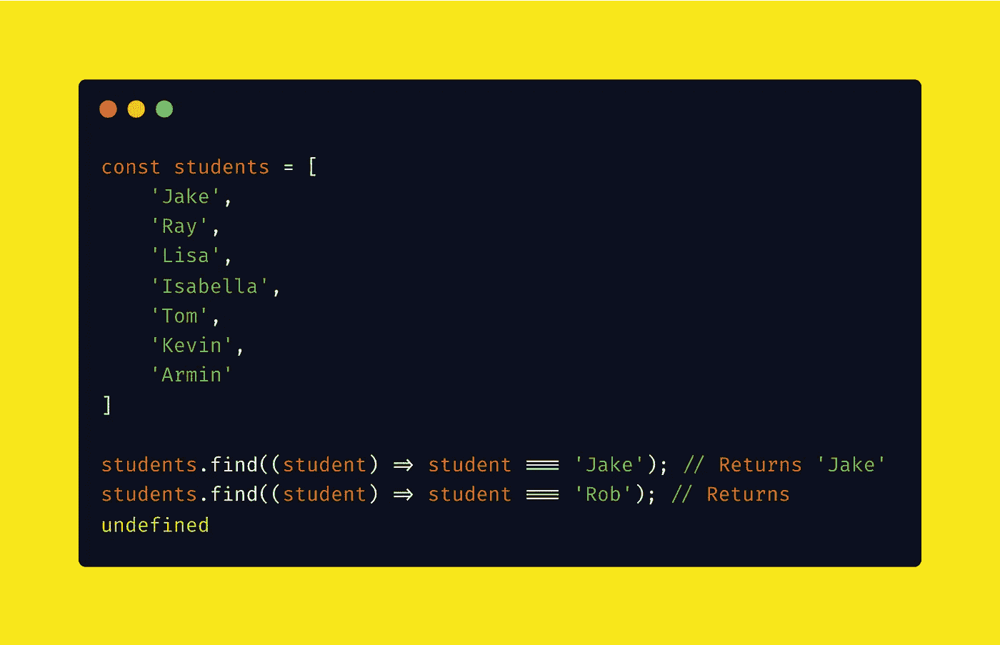

# 掌握 JavaScript Find()方法

> 原文：<https://javascript.plainenglish.io/mastering-the-javascript-find-method-e4ab1fa064cc?source=collection_archive---------8----------------------->

## 使用 JavaScript find()方法可以很容易地搜索数组中的特定值。



使用 JavaScript `find()`方法可以很容易地搜索数组中的特定值。如果你想在一个数组中找到一个对象的`string`、`number`、`boolean`或属性并不重要。在这篇文章中，我将向你展示如何非常容易地找到值。

*原载于*[*byray ray . dev*](https://byrayray.dev/posts/2022-12-14-mastering-javascript-find-array-method)*。*

# find()方法

JavaScript 中的`find()`数组方法超级好用。方法返回数组中符合条件的第一项。([查看 MDN 网络文档上的文档](https://developer.mozilla.org/en-US/docs/Web/JavaScript/Reference/Global_Objects/Array/find))

在 find 方法中，传递一个带有参数的 Arrow 函数，该参数等于数组中的每一项。在内部，`find()`方法将遍历数组中的所有条目，试图找到您的搜索值。

在 arrow 函数中，我们检查`student`是否等于‘Jake’或‘Rob’。当找到值时，它将立即返回字符串。当没有找到值时，它将返回`undefined`。

## 在数组中查找字符串

```
const students = [
    'Jake',
    'Ray',
    'Lisa',
    'Isabella',
    'Tom',
    'Kevin',
    'Armin'
]
students.find((student) => student === 'Jake'); // Returns 'Jake'
students.find((student) => student === 'Rob'); // Returns undefined
```

*检查* [*runkit 示例*](https://runkit.com/devbyrayray/how-to-find-string-in-javascript-array-with-find-method) *。*

现在我们在`students`数组中搜索‘Jake’。当找到这个方法时，它将返回“Jake”。当我们搜索' Rob '时，它会返回`undefined`，因为' Rob '不在数组中。

## 在数组中查找一个数字

```
const numbers = [
    5000,
    538,
    78123,
    2,
    45,
    34097
]
numbers.find((number) => number === 538); // Returns '538'
numbers.find((number) => number === 1); // Returns undefined
```

*检查* [*runkit 示例*](https://runkit.com/devbyrayray/how-to-find-number-in-javascript-array-with-find-method) *。*

现在我们在`numbers`数组中搜索`538`。这个方法找到后会返回`538`。当我们搜索`1`时，它将返回`undefined`，因为`1`不在数组中。

## 在数组中查找对象属性值。

当你想在一个对象数组中找到一个属性值时，就像用奇异值一样简单。在下面的例子中，我们试图找到类型为“开发”的第一个项目。在第二个例子中，我们试图找到一个“2024–01–27”在`startDate`和`endDate`之间的项目。

> 几年前，我创建了一个包 is-between-js 供我个人使用。您可以计算特定值是否介于最小值和最大值之间。你可以免费使用[，因为它在 NPM](https://www.npmjs.com/package/is-between-js) 和 [GitHub](https://github.com/devbyray/is-between-js) 上是免费的😉

```
import { isBetween } from "is-between-js";
const dateNumber = (date) => new Date(date).getTime();

const projects = [
    {
        startDate: '2022-11-26',
        endDate: '2023-11-26',
        title: 'Build an API',
        type: 'Development',
    },
  {
        startDate: '2022-11-26',
        endDate: '2023-11-26',
        title: 'Build Frontend',
        type: 'Development'
    },
  {
        startDate: '2023-03-05',
        endDate: '2024-03-26',
        title: 'Create marketing content',
        type: 'Marketing'
    },
  {
        startDate: '2022-11-26',
        endDate: '2024-03-26',
        title: 'Project management',
        type: 'Management'
    },
]
console.log(projects.find((project) => project.type.toLowerCase() === 'development'))
console.log(projects.find((project) => isBetween(dateNumber('2024-01-27')).min(dateNumber(project.startDate)).max(dateNumber(project.endDate)).calc()))
```

*检查* [*runkit 示例*](https://runkit.com/devbyrayray/find-a-object-property-value-in-a-javascript-array) *。*

您可以通过使用箭头函数`project.type === 'value'`返回属性值来检查属性值是否等于某个值。在这种情况下，我们将上面示例中的字符串修改为小写字符，即使大小写不相等也能匹配。

在上面的例子中，我们比较了 isBetween 函数中的几个属性值，该函数向 find 方法返回一个布尔值。就这么简单！

如您所见，您可以在 JavaScript 数组中找到每种数据类型的值。学 JavaScript 不难；只是练习，练习，再练习👍

[**通过电子邮件获取我的文章点击这里**](https://byrayray.medium.com/subscribe) **|** [**购买 5 美元中等会员**](https://byrayray.medium.com/membership)

# 谢谢！


看完这个故事后，我希望你学到了新的东西或者受到了启发去创造新的东西！🤗

如果我给你留下了问题或要说的话作为回应，向下滚动并给我输入信息。想保密的话请在 Twitter @ DevByRayRay*给我发个* [*DM。我的 DM 永远是开放的😁*](https://twitter.com/@devbyrayray)

*更多内容请看*[***plain English . io***](https://plainenglish.io/)*。报名参加我们的* [***免费周报***](http://newsletter.plainenglish.io/) *。关注我们关于*[***Twitter***](https://twitter.com/inPlainEngHQ)[***LinkedIn***](https://www.linkedin.com/company/inplainenglish/)*[***YouTube***](https://www.youtube.com/channel/UCtipWUghju290NWcn8jhyAw)*[***不和***](https://discord.gg/GtDtUAvyhW) ***。*****

*****对缩放您的软件启动感兴趣*** *？检查* [***电路***](https://circuit.ooo?utm=publication-post-cta) *。***