# 如何使用 HTML、CSS 和 JavaScript 创建材料设计文本字段

> 原文：<https://javascript.plainenglish.io/material-design-text-field-9f23adcdc00?source=collection_archive---------1----------------------->

## 关于如何仅使用 HTML、CSS 和 JavaScript 从头开始重新创建材料设计文本字段的设计和动画的指南。

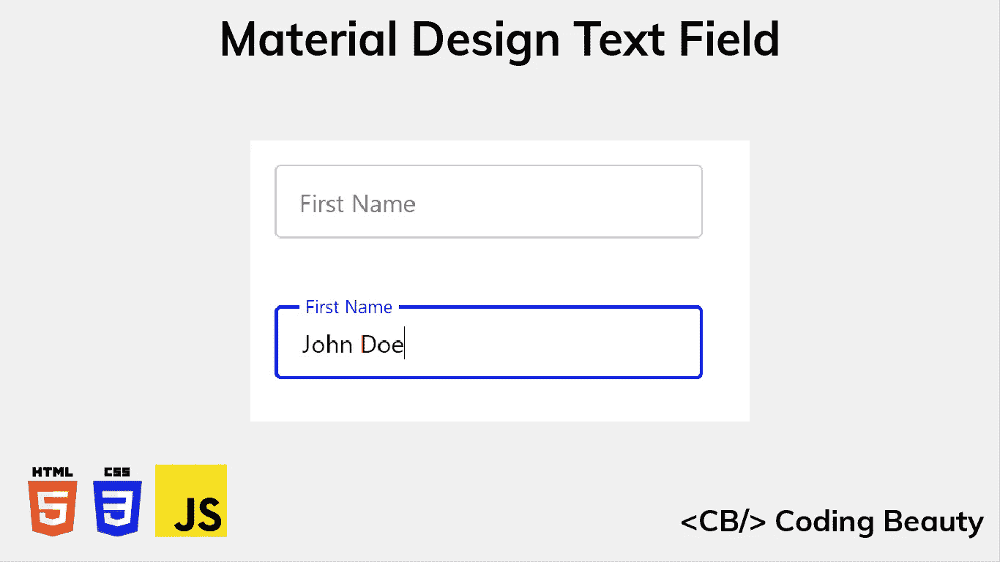

Material Design 是 Google 开发的一个流行的 UI 设计系统。使用材料设计的应用程序通常包括响应动画、有吸引力的颜色组合和深度效果，如照明和阴影。

在本文中，我们将学习如何仅使用 HTML、CSS 和 JavaScript 重新创建材质设计文本字段的设计和动画。我们将克隆带轮廓的文本字段变体，但是可以采取类似的步骤来创建填充的变体。

这是我们完成后会有的:

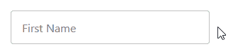

# 创建基本输入和标签

我们将从用 HTML 创建文本字段的基本结构开始。

`HTML`

```
<div class="input-container">
  <input
    type="text"
    id="fname"
    name="fname"
    value=""
    aria-labelledby="label-fname"
  />
  <label class="label" for="fname" id="label-fname">
    <div class="text">First Name</div>
  </label>
</div>
```

我们创建一个`input`元素来允许在文本字段中输入内容，并且我们使用一个`label`元素作为文本字段的标签。这个`label` ( `First Name`)的文本被包裹在一个 div ( `.text`)中，因为我们稍后要做文本动画。

我们使用另一个`div` ( `.input-container`)来包装`input`和`label`元素，以便稍后我们能够将`label`放置在`input`的顶部，并进行绝对定位。

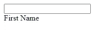

# 样式输入和标签

让我们为`input`元素及其容器添加一些样式。

`CSS`

```
.input-container {
  position: relative;
}input {
  height: 48px;
  width: 280px;
  border: 1px solid #c0c0c0;
  border-radius: 4px;
  box-sizing: border-box;
  padding: 16px;
}
```

我们为容器设置了`position: relative`，这样当我们为`label`设置`position: absolute`时，`label`将会相对于它定位，而不是整个页面。

我们现在将为`label`添加样式。

`CSS`

```
.label {
  position: absolute;
  top: 0;
  bottom: 0;
  left: 16px;
  display: flex;
  align-items: center;
}
```

除了我们刚刚谈到的`position: absolute`之外，我们还设置了`top: 0`和`bottom: 0`来使`label`与输入容器的高度相匹配。

`input`有一个`16px`填充，所以我们设置`left: 16px`使标签匹配这个填充，并从用户将要输入的任何文本的相同位置开始。最后，我们使用`display: flex`和`align-items: center`在输入容器中水平居中`label`的内容。

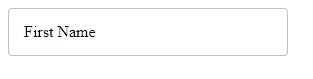

# 移除指针事件

它现在看起来像一个文本字段，但是如果您将鼠标悬停在`label`上，您会看到鼠标指针指示这是可以点击的东西。这意味着它可以阻止在`input`上的点击，这将造成糟糕的用户体验。

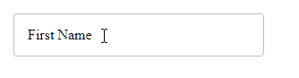

幸运的是，我们可以通过为`label`元素设置`pointer-events: none`来轻松解决这个问题。

`CSS`

```
.label {
  ...
  pointer-events: none;
}
```

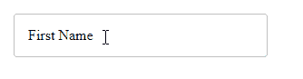

# 样式输入字体

让我们更改输入文本的字体系列和字体大小。我们将为标签做同样的事情。

`CSS`

```
input, .label .text {
  font-family: 'Segoe UI';
  font-size: 16px;
}
```

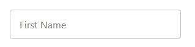

# 焦点上的样式输入

让我们使用`:focus` CSS 选择器在`input`获得焦点时改变它的一些样式。

`CSS`

```
input:focus {
  outline: none;
  border: 2px solid blue;
}
```

这样，当输入获得焦点时，输入边框会改变颜色并变粗。

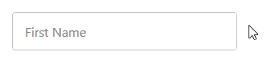

# 输入焦点上的样式标签

让我们也在输入标签被聚焦时设置它的样式。获得焦点后，标签应该收缩，向上移动以符合顶部输入边框，并改变颜色以匹配输入边框。

`CSS`

```
input:focus + .label .text {
  font-size: 12px;
  transform: translate(0, -50%);
  background-color: white;
  padding-left: 4px;
  padding-right: 4px;
  color: blue;
}
```

我们设置`padding-left: 4px`和`padding-right: 4px`来增加标签和顶部输入边框之间的视觉间距。

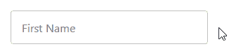

为了平滑过渡，我们将向标签添加一个`transition`属性。

`CSS`

```
.label .text {
  transition: all 0.15s ease-out;
}
```

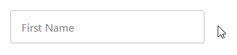

# 当非空输入失去焦点时将标签保持在顶部

我们还有一件事要做。当您在`input`元素中输入文本并移除`input`时，标签会回到其原始位置。

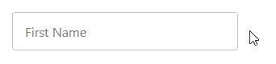

它不应该以这种方式行动。但是现在我们要用一些 CSS 和 JavaScript 来修复它。

记住，我们已经为`input`元素定义了一个`value`属性。我们将其设置为空字符串。

`HTML`

```
<input
  type="text"
  id="fname"
  name="fname"
  value=""
  aria-labelledby="label-fname"
/>
```

使用`:not`伪类，我们使输入在聚焦时具有与非聚焦和非空时相同的样式。唯一的区别是输入边框和标签的颜色。

`CSS`

```
input:focus + .label .text, :not(input[value=""]) + .label .text {
  font-size: 12px;
  transform: translate(0, -150%);
  background-color: white;
  padding-left: 4px;
  padding-right: 4px;
}input:focus + .label .text {
  color: blue;
}
```

我们还没完呢。尽管`input`的`value` DOM 属性根据输入的内容而变化，但是`value` HTML 属性保持不变。我们需要一种方法让它与`value`属性保持同步。

我们可以通过为`input`事件添加一个监听器来做到这一点，只要输入字段中的文本发生变化，监听器就会触发。在监听器中，我们将使用`setAttribute()`方法用`value`属性的当前值更新`value`属性。

`JavaScript`

```
const input = document.getElementById('fname');input.addEventListener('input', () => {
  input.setAttribute('value', input.value);
});
```


就是这样。我们已经成功创建了一个概述材料设计文本字段。

如果你使用的是 Vue 或 React 这样的框架，将我们所做的一切抽象成一个可重用的组件应该是相当容易的。

下面是完整的源代码:

*最初发表于*[*codingbeautydev.com*](https://cbdev.link/68589d)

# JavaScript 做的每一件疯狂的事情

一本关于 JavaScript 微妙的警告和鲜为人知的部分的迷人指南。


[**报名**](https://cbdev.link/d3c4eb) 立即免费领取一份。