# 如何使用材料界面中的按钮组件

> 原文：<https://javascript.plainenglish.io/material-ui-button-bd133126d525?source=collection_archive---------4----------------------->

## 了解如何使用 Material UI 中的按钮组件轻松创建和自定义按钮。

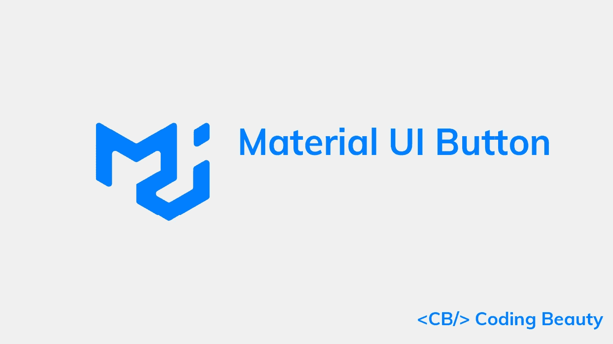

按钮是一种常用的组件，它为 UI 增加了交互性。在这篇文章中，我们将学习如何在材质界面中轻松创建和定制按钮。

# 材质 UI 按钮组件

我们可以使用材质 UI 中的`Button`组件来创建按钮。它有一个用于显示文本、包含或轮廓按钮的`variant`属性。

```
import { Box, Button, Stack } from '@mui/material';export default function App() {
  return (
    <Box>
      <Stack
        spacing={2}
        direction="row"
      >
        <Button variant="text">Text</Button>
        <Button variant="contained">Contained</Button>
        <Button variant="outlined">Outlined</Button>
      </Stack>
    </Box>
  );
}
```

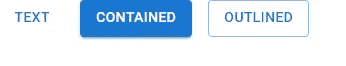

# 文本按钮

文本按钮适用于应用程序中不太重要的动作，比如关闭对话框。将`variant`道具设置为`text`会显示一个文本按钮。

```
<Button>Primary</Button>
<Button disabled>Disabled</Button>
<Button href="#text-buttons">Link</Button>
```

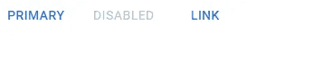

# 包含的按钮

[内含按钮](https://material.io/components/buttons#contained-button)表示我们应用程序中的主要和必要操作。将`variant`道具设置为`contained`会显示一个包含的按钮。

```
<Button variant="contained">Contained</Button>
<Button variant="contained" disabled>
  Disabled
</Button>
<Button variant="contained" href="#contained-buttons">
  Link
</Button>
```

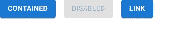

# 轮廓按钮

带轮廓的按钮表示中级意义的操作。它们是内含按钮的较低强调的替代物，是文本按钮的较高强调的替代物。将`variant`道具设置为`outlined`显示轮廓按钮。

```
<Button variant="outlined">Primary</Button>
<Button variant="outlined" disabled>
  Disabled
</Button>
<Button variant="outlined" href="#outlined-buttons">
  Link
</Button>
```

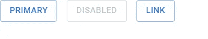

# 禁用按钮提升

我们可以通过将`disableElevation`属性设置为`true`来防止按钮被点击。

```
<Button
  variant="contained"
  disableElevation
>
  Elevation disabled
</Button>
```

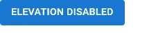

# JavaScript 做的每一件疯狂的事情

一本关于 JavaScript 微妙的警告和鲜为人知的部分的迷人指南。


[**报名**](https://cbdev.link/d3c4eb) 立即免费领取一份。

# 处理材料界面中的按钮点击

我们可以给`onClick`属性分配一个监听器函数，当按钮被点击时执行一个动作。

在下面的示例中，我们附加了一个将计数递增 1 的侦听器，以显示按钮被点击的总次数。

```
import { Box, Button, Typography } from '@mui/material';
import { useState } from 'react';export default function App() {
  const [count, setCount] = useState(0);
  return (
    <Box sx={{ margin: 2 }}>
      <Button
        onClick={() => {
          setCount(count + 1);
        }}
        variant="contained"
      >
        Click me
      </Button>
      <Typography sx={{ marginTop: 1 }}>Count: {count}</Typography>
    </Box>
  );
}
```

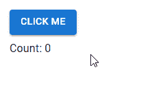

# 材质 UI 按钮颜色

我们可以使用`color`道具来应用主题调色板中的颜色。

```
<Button color="secondary">Secondary</Button>
<Button variant="contained" color="success">
  Success
</Button>
<Button variant="outlined" color="error">
  Error
</Button>
```

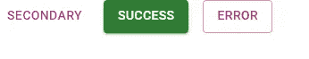

# 自定义颜色

`color`属性只允许来自主题面板的值。要应用主题中没有的颜色，我们可以使用自定义 CSS 和`sx`道具。

```
import { Stack, Button } from '@mui/material';
import { green } from '@mui/material/colors';export default function App() {
  return (
    <Stack
      spacing={2}
      direction="row"
    >
      <Button
        sx={{
          backgroundColor: green[500],
          '&:hover': { backgroundColor: green[700] },
        }}
        variant="contained"
      >
        Primary
      </Button>
      <Button
        sx={{
          color: green[500],
          borderColor: green[500],
          '&:hover': { color: green[500], borderColor: green[500] },
        }}
        variant="outlined"
      >
        Secondary
      </Button>
    </Stack>
  );
}
```

# 按钮尺寸

`Button`组件的`size`道具允许我们创建不同大小的按钮。

```
import { Box, Button } from '@mui/material';export default function App() {
  return (
    <Box>
      <Box sx={{ '& button': { m: 1 } }}>
        <div>
          <Button size="small">Small</Button>
          <Button size="medium">Medium</Button>
          <Button size="large">Large</Button>
        </div>
        <div>
          <Button
            variant="outlined"
            size="small"
          >
            Small
          </Button>
          <Button
            variant="outlined"
            size="medium"
          >
            Medium
          </Button>
          <Button
            variant="outlined"
            size="large"
          >
            Large
          </Button>
        </div>
        <div>
          <Button
            variant="contained"
            size="small"
          >
            Small
          </Button>
          <Button
            variant="contained"
            size="medium"
          >
            Medium
          </Button>
          <Button
            variant="contained"
            size="large"
          >
            Large
          </Button>
        </div>
      </Box>
    </Box>
  );
}
```

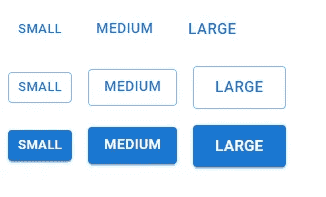

# 图标和标签按钮

在按钮中包含图标可以让用户更清楚按钮执行的操作。将图标组件分配给`startIcon`或`endIcon`道具会将图标分别对齐标签的左侧或右侧。

```
import { Button, Stack } from '@mui/material';
import {
  Settings as SettingsIcon,
  PlayArrow as PlayArrowIcon,
} from '@mui/icons-material';export default function App() {
  return (
    <Stack
      spacing={2}
      direction="row"
    >
      <Button
        variant="contained"
        startIcon={<PlayArrowIcon />}
      >
        Play
      </Button>
      <Button
        variant="outlined"
        endIcon={<SettingsIcon />}
      >
        Settings
      </Button>
    </Stack>
  );
}
```

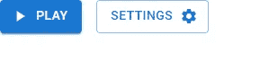

# 材质用户界面中的图标按钮

图标按钮有助于节省屏幕空间，便于用户识别。我们可以使用材质界面中的`IconButton`组件来创建它们。

```
import { IconButton, Stack } from '@mui/material';
import { Settings, Delete, Info, ContentCopy } from '@mui/icons-material';export default function App() {
  return (
    <Stack
      spacing={2}
      direction="row"
    >
      <IconButton>
        <Settings />
      </IconButton>
      <IconButton color="primary">
        <Delete />
      </IconButton>
      <IconButton color="secondary">
        <Info />
      </IconButton>
      <IconButton
        disabled
        color="primary"
      >
        <ContentCopy />
      </IconButton>
    </Stack>
  );
}
```

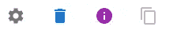

# 图标按钮大小

和`Button`一样，`IconButton`也带有一个`size`道具，可以定制它的大小。

```
<IconButton size="small">
  <Settings fontSize="small" />
</IconButton>
<IconButton size="medium">
  <Settings fontSize="medium" />
</IconButton>
<IconButton size="large">
  <Settings fontSize="large" />
</IconButton>
```

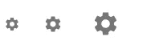

# 图标按钮颜色

`color`道具让我们将主题调色板中的颜色应用到`IconButton`上。

```
import { IconButton, Stack } from '@mui/material';
import { Settings as SettingsIcon } from '@mui/icons-material';export default function App() {
  return (
    <Stack
      spacing={1}
      direction="row"
    >
      <IconButton color="primary">
        <SettingsIcon />
      </IconButton>
      <IconButton color="secondary">
        <SettingsIcon />
      </IconButton>
      <IconButton color="success">
        <SettingsIcon />
      </IconButton>
      <IconButton color="error">
        <SettingsIcon />
      </IconButton>
      <IconButton color="warning">
        <SettingsIcon />
      </IconButton>
    </Stack>
  );
}
```


# 在材质界面中加载按钮

加载按钮可以指示正在进行的操作并暂时禁用交互。我们可以用`LoadingButton`组件创建一个。

```
import { Stack } from '@mui/material';
import { LoadingButton } from '@mui/lab';
import { Save as SaveIcon } from '@mui/icons-material';export default function App() {
  return (
    <Stack
      spacing={2}
      direction="row"
    >
      <LoadingButton
        loading
        variant="contained"
      >
        Play
      </LoadingButton>
      <LoadingButton
        loading
        loadingIndicator="Loading..."
        variant="outlined"
      >
        Send message
      </LoadingButton>
      <LoadingButton
        loading
        loadingPosition="start"
        startIcon={<SaveIcon />}
        variant="outlined"
      >
        Save
      </LoadingButton>
    </Stack>
  );
}
```

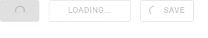

*更新于:*[*codingbeautydev.com*](https://cbdev.link/6e4d46)

您可以在哪里找到我们:

🌐[网站](https://cbdev.link/b621b9) |🌟推特🌟[脸书](http://facebook.com/CodingBeautyDev)