# 如何在材料界面中使用选项卡

> 原文：<https://javascript.plainenglish.io/material-ui-tabs-baafcee96016?source=collection_archive---------4----------------------->

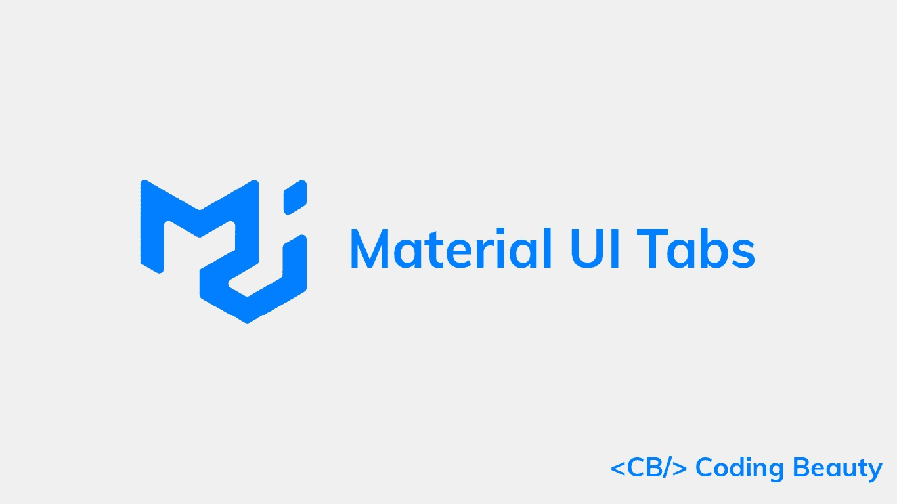

标签允许用户在相关内容组之间浏览和切换，并为应用程序添加额外的导航层。

在本文中，我们将学习如何使用`Tabs`和`Tab`组件在材质 UI 中轻松创建选项卡。

# 材料用户界面标签组件

我们可以使用 Material UI 中的`Tabs`组件来创建一组选项卡。它有一个`value`属性，使用从零开始的索引设置当前选中的选项卡。

`Tab`组件创建每个选项卡。它的`label`道具设置标签标题。

```
import { Box, Tab, Tabs } from '@mui/material';
import { useState } from 'react';function App() {
  const [tabIndex, setTabIndex] = useState(0);const handleTabChange = (event, newTabIndex) => {
    setTabIndex(newTabIndex);
  };return (
    <Box>
      <Tabs value={tabIndex} onChange={handleTabChange}>
        <Tab label="Tab 1" />
        <Tab label="Tab 2" />
        <Tab label="Tab 3" />
      </Tabs>
    </Box>
  );
}export default App;
```


我们向`onChange`属性添加了一个监听器，当用户试图选择另一个选项卡时，它执行一个动作。我们可以在监听器中访问新选项卡的索引。在上面的例子中，我们使用 React state 简单地在监听器中设置一个新的`Tabs`值。

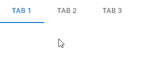

我们可以使用`Tabs`值为每个选项卡显示不同的内容。例如:

```
import { Box, Tab, Tabs, Typography } from '@mui/material';
import { useState } from 'react';function App() {
  const [tabIndex, setTabIndex] = useState(0);const handleTabChange = (event, newTabIndex) => {
    setTabIndex(newTabIndex);
  };return (
    <Box>
      <Box>
        <Tabs value={tabIndex} onChange={handleTabChange}>
          <Tab label="Tab 1" />
          <Tab label="Tab 2" />
          <Tab label="Tab 3" />
        </Tabs>
      </Box>
      <Box sx={{ padding: 2 }}>
        {tabIndex === 0 && (
          <Box>
            <Typography>The first tab</Typography>
          </Box>
        )}
        {tabIndex === 1 && (
          <Box>
            <Typography>The second tab</Typography>
          </Box>
        )}
        {tabIndex === 2 && (
          <Box>
            <Typography>The third tab</Typography>
          </Box>
        )}
      </Box>
    </Box>
  );
}export default App;
```

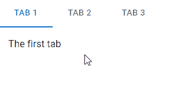

# 材料用户界面选项卡颜色

`Tabs`组件带有特定的属性，用于设置选项卡不同部分的颜色。`textColor`道具设置每个标签标题的颜色，`indicatorColor`道具设置指示器颜色。

```
<Tabs
  value={tabIndex}
  onChange={handleTabChange}
  textColor="secondary"
  indicatorColor="secondary"
>
  <Tab label="Tab 1" />
  <Tab label="Tab 2" />
  <Tab label="Tab 3" />
</Tabs>
```

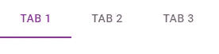

# 自定义选项卡颜色

`textColor`仅允许值为`primary`、`secondary`或`inherit`。这意味着我们只能使用`Tabs`父组件的颜色，或者主要和次要主题颜色之一。同样，`indicatorColor`只允许`primary`和`secondary`的值。要设置自定义颜色，我们可以从材质 UI 中覆盖某些类的样式:

*   `MuiTabs-indicator`:设置标签指示器的样式。
*   `MuiTab-root`:样式每个标签。
*   `MuiSelected`:样式化当前选择的标签。

```
import { Box, Tab, Tabs } from '@mui/material';
import { blue, red } from '@mui/material/colors';
import { useState } from 'react';function App() {
  const [tabIndex, setTabIndex] = useState(0);const handleTabChange = (event, newTabIndex) => {
    setTabIndex(newTabIndex);
  };return (
    <Box>
      <Box>
        <Tabs
          value={tabIndex}
          onChange={handleTabChange}
          sx={{
            '& .MuiTabs-indicator': { backgroundColor: red[500] },
            '& .MuiTab-root': { color: blue[700] },
            '& .Mui-selected': { color: red[500] },
          }}
        >
          <Tab label="Tab 1" />
          <Tab label="Tab 2" />
          <Tab label="Tab 3" />
        </Tabs>
      </Box>
    </Box>
  );
}export default App;
```

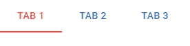

# JavaScript 做的每一件疯狂的事情

一本关于 JavaScript 微妙的警告和鲜为人知的部分的迷人指南。


[**报名**](https://cbdev.link/d3c4eb) 立即免费领取一份。

# 包装标签

如果标签太长，我们可以将`wrapped`支柱设置为`true`用于`Tab`使标签换行。

```
<Tabs
  value={tabIndex}
  onChange={handleTabChange}
>
  <Tab
    label="Lorem ipsum, dolor sit amet consectetur adipisicing elit"
    wrapped
  />
  <Tab label="Tab 2" />
  <Tab label="Tab 3" />
</Tabs>
```


# 禁用的选项卡

将`Tab`上的`disabled`道具设置为`true`可防止其被选中。

```
<Tabs
  value={tabIndex}
  onChange={handleTabChange}
>
  <Tab label="Active" />
  <Tab
    label="Disabled"
    disabled
  />
  <Tab label="Active" />
</Tabs>
```

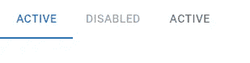

# 材料用户界面中的全宽选项卡

我们可以将`Tabs`的`fullWidth`道具设置为`true`，让`tabs`占据整个视口宽度。这对于较小的视图很有用。

```
<Tabs
  value={tabIndex}
  onChange={handleTabChange}
  variant="fullWidth"
>
  <Tab label="Tab 1" />
  <Tab label="Tab 2" />
  <Tab label="Tab 3" />
</Tabs>
```

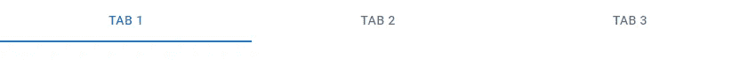

# 居中标签

对于更大的视图，我们可以使用`centered`支柱将标签定位在中心。

```
<Tabs
  value={tabIndex}
  onChange={handleTabChange}
  centered
>
  <Tab label="Tab 1" />
  <Tab label="Tab 2" />
  <Tab label="Tab 3" />
</Tabs>
```

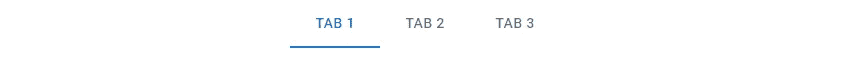

# 材料界面中的可滚动选项卡

`scrollable` prop 允许用户在标签溢出时滚动标签。

```
<Tabs
  value={tabIndex}
  onChange={handleTabChange}
  variant="scrollable"
  scrollButtons="auto"
  sx={{ width: 500 }}
>
  <Tab label="Tab 1" />
  <Tab label="Tab 2" />
  <Tab label="Tab 3" />
  <Tab label="Tab 4" />
  <Tab label="Tab 5" />
  <Tab label="Tab 6" />
  <Tab label="Tab 7" />
  <Tab label="Tab 8" />
  <Tab label="Tab 9" />
  <Tab label="Tab 10" />
</Tabs>
```

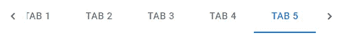

滚动按钮允许用户向右或向左滚动。

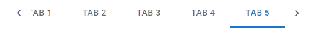

`scrollButtons`道具控制滚动按钮的显示。它可以取三个可能的值:

1.  `auto` -仅在并非所有项目都可见时显示滚动按钮。将它们隐藏在某个视口宽度以下。
2.  `true` -始终显示滚动按钮。
3.  `false` -从不显示滚动按钮。

在下面的例子中，我们将`scrollButtons`设置为`false`来隐藏滚动按钮。

```
<Tabs
  value={tabIndex}
  onChange={handleTabChange}
  variant="scrollable"
  scrollButtons={false}
  sx={{ width: 500 }}
>
  <Tab label="Tab 1" />
  <Tab label="Tab 2" />
  <Tab label="Tab 3" />
  <Tab label="Tab 4" />
  <Tab label="Tab 5" />
  <Tab label="Tab 6" />
  <Tab label="Tab 7" />
  <Tab label="Tab 8" />
  <Tab label="Tab 9" />
  <Tab label="Tab 10" />
</Tabs>
```

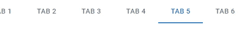

# 材料用户界面中的垂直选项卡

为了显示垂直选项卡，我们可以将`Tabs`方向属性设置为`vertical`。默认为`horizontal`。

```
import { Box, Tab, Tabs, Typography } from '@mui/material';
import { useState } from 'react';function App() {
  const [tabIndex, setTabIndex] = useState(0);const handleTabChange = (event, newTabIndex) => {
    setTabIndex(newTabIndex);
  };return (
    <Box>
      <Box sx={{ display: 'flex' }}>
        <Tabs
          value={tabIndex}
          onChange={handleTabChange}orientation="vertical"
        >
          <Tab label="Tab 1" />
          <Tab label="Tab 2" />
          <Tab label="Tab 3" />
        </Tabs>
        <Box sx={{ margin: 2 }}>
          {tabIndex === 0 && (
            <Box>
              <Typography>The first tab</Typography>
            </Box>
          )}
          {tabIndex === 1 && (
            <Box>
              <Typography>The second tab</Typography>
            </Box>
          )}
          {tabIndex === 2 && (
            <Box>
              <Typography>The third tab</Typography>
            </Box>
          )}
        </Box>
      </Box>
    </Box>
  );
}export default App;
```

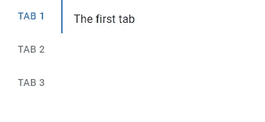

# 图标标签

我们可以使用`icon` prop 来显示标签的图标标签，而不是文本。

```
<Tabs
  value={tabIndex}
  onChange={handleTabChange}
>
  <Tab icon={<SearchIcon />} />
  <Tab icon={<StarIcon />} />
  <Tab icon={<SettingsIcon />} />
</Tabs>
```

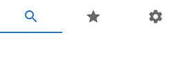

我们也可以使用它和`label`属性来显示标签的图标和文本。

```
<Tabs
  value={tabIndex}
  onChange={handleTabChange}
>
  <Tab
    icon={<SearchIcon />}
    label="Search"
  />
  <Tab
    icon={<StarIcon />}
    label="Favorites"
  />
  <Tab
    icon={<SettingsIcon />}
    label="Settings"
  />
</Tabs>
```

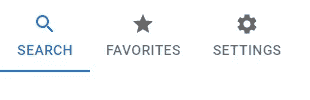

# 标签图标位置

`iconPosition`道具设置图标在选项卡内容中的位置。可以是`top`、`bottom`、`start`或`end`。

```
<Tabs
  value={tabIndex}
  onChange={handleTabChange}
>
  <Tab
    icon={<AlarmIcon />}
    label="top"
  />
  <Tab
    icon={<SearchIcon />}
    iconPosition="start"
    label="start"
  />
  <Tab
    icon={<StarIcon />}
    iconPosition="end"
    label="end"
  />
  <Tab
    icon={<FavoriteIcon />}
    iconPosition="bottom"
    label="bottom"
  />
</Tabs>
```

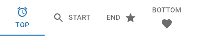

# 结论

选项卡将相关内容分组组织到单独的视图中，每次只能看到一个视图。我们可以使用 Material UI 中的`Tabs`和`Tab`组件在我们的应用程序中轻松创建和定制它们。

*更新于:*[*codingbeautydev.com*](https://cbdev.link/ae0b8e)

您可以在哪里找到我们:

🌐[网站](https://cbdev.link/b621b9) |🌟[推特](https://twitter.com/CodingBeautyDev) |🌟[脸书](http://facebook.com/CodingBeautyDev)