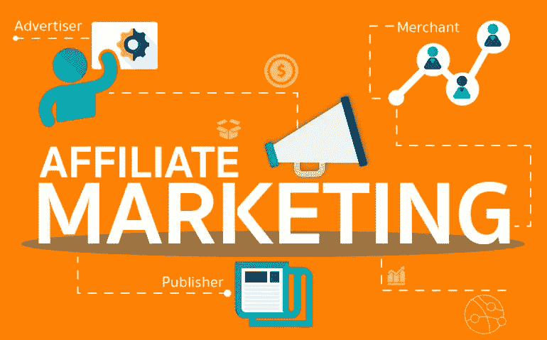

# 最大化您的联盟营销成功:专家提示和建议

> 原文：<https://javascript.plainenglish.io/maximizing-your-affiliate-marketing-success-expert-tips-and-advice-f28b993e6fbb?source=collection_archive---------12----------------------->

Photo by [mohamed_hassan](https://pixabay.com/users/mohamed_hassan-5229782/) on [Pixabay](https://pixabay.com/?utm_source=medium&utm_medium=referral)

你想在联盟营销中获得最大的成功吗？如果是这样，你来对地方了！

**联盟营销**通过推广你所相信的产品或服务，可以成为一种有利可图且有效的赚钱方式。

然而，重要的是要有一个坚实的战略，并愿意不断调整和优化您的方法，以取得成功。

在这篇文章中，我们将提供**专家提示和建议，告诉你如何最大化你的联盟营销成功**。从选择正确的联盟计划和有效地推广产品，到跟踪和分析您的努力，我们已经覆盖了您。

遵循这些提示，你将会在你的道路上取得最大的成功。

# 一、联盟营销简介

Photo by [Carlos Muza](https://unsplash.com/@kmuza?utm_source=medium&utm_medium=referral) on [Unsplash](https://unsplash.com?utm_source=medium&utm_medium=referral)

**代销商营销**是一种基于绩效的营销策略，企业奖励推广其产品或服务的代销商。

代销商通过自己的营销努力为每个客户赚取佣金。

这种类型的营销对**企业**和**分支机构**都有好处，因为它允许企业接触更广泛的受众并推动销售，而分支机构可以通过推广他们相信的产品和服务来赚钱。

通过有效地利用联盟营销，企业和联盟都可以受益于他们的伙伴关系的成功。

## 联盟营销如何运作

联盟营销的过程涉及企业建立一个联盟计划，并招募会员，以促进他们的产品或服务。

当代销商成功推广产品，客户通过代销商的**唯一推荐链接**进行购买时，代销商赚取佣金。

## 联盟营销的好处

作为企业整体营销策略的一部分，使用联盟营销有几个好处。

对于企业来说，联盟营销是一种成本效益高的方式，可以接触到更广泛的受众并推动销售。对于代销商来说，它提供了一个通过推广他们所相信的产品或服务来赚钱的机会。

此外，联盟营销是企业与其他公司和影响者建立伙伴关系和**合作的好方法**。

这可以提高品牌知名度和可信度，以及潜在的新客户。

总的来说，联盟营销对企业和联盟来说是双赢的，因为它让双方都能从合作的成功中获益。

通过有效地利用联盟营销，**企业可以扩大他们的影响范围并推动销售**，而联盟企业可以通过推广他们相信的产品和服务来赚钱，而不必自己创造产品。

# 二。选择正确的加盟计划

From [Marketing Guru](https://www.marketingguru.io/blog/how-to-start-affiliate-marketing-for-beginners-2020-guide) Website

当谈到选择正确的联盟计划，重要的是要做你的研究，并考虑几个关键因素。

## 研究潜在的联盟计划

首先，有必要研究潜在的联盟计划，以确保他们是有信誉的，并符合你的价值观和受众。

寻找提供高质量产品或服务并有成功记录的项目。阅读评论并向其他分支机构寻求建议也是一个好主意。

## 考虑正在推广的产品或服务

接下来，考虑要推广的产品或服务。**这是你所相信的**的东西吗？如果向你的观众推广，你会感觉很舒服吗？

重要的是选择你热爱的产品或服务，并且你相信这些产品或服务会为你的受众提供价值。

## 评估佣金结构和支付条款

最后，评估会员计划的佣金结构和支付条款。

寻找那些提供**有竞争力的佣金率**并有明确付款时间表的项目。

考虑付款类型也是一个好主意，比如每次销售是一次性佣金还是经常性佣金。

通过考虑这些因素和做彻底的研究，你可以选择正确的联盟计划，符合你的价值观，观众和目标。

这将帮助您有效地推广产品和服务，并为您的努力赚取公平的佣金。

# 面向初学者的 10 个最佳联盟合作伙伴平台:

Photo by [mohamed_hassan](https://pixabay.com/users/mohamed_hassan-5229782/) on [Pixabay](https://pixabay.com/?utm_source=medium&utm_medium=referral)

## **1。亚马逊公司**

亚马逊联盟是最受欢迎的联盟计划之一，对于初学者来说是一个很好的选择。它提供各种类别的广泛产品，申请过程简单明了。

## 2.佣金结:

Commission Junction 是另一个流行的附属程序，适合初学者。它提供来自不同公司的各种产品和服务，并且具有用户友好的界面。

## 3.分享销售:

ShareASale 是一个知名的联盟平台，提供各种类别的各种产品和服务。它有一个简单的申请过程，并提供工具和资源，以帮助子公司取得成功。

## 4.乐天市场营销:

Rakuten Marketing 是一个全球性的联盟网络，提供广泛的产品和服务。它有一个用户友好的界面，并提供了一系列工具和资源来支持子公司。

## 5.点击银行:

ClickBank 是一个受欢迎的联盟平台，提供广泛的数字产品，包括电子书、软件和课程。它有一个简单的申请过程，并提供工具和资源，以帮助子公司取得成功。

## 6.CJ 联系人:

CJ Affiliate by Conversant 是一个知名的联盟网络，提供广泛的产品和服务。它有一个用户友好的界面，并提供了一系列工具和资源来支持分支机构。

## 7.合作伙伴:

Partnerize 是一个领先的联盟平台，提供各种类别的各种产品和服务。它有一个简单的申请过程，并提供工具和资源，以帮助子公司取得成功。

## 8.冲击半径:

影响半径是一个全球性的联盟平台，提供广泛的产品和服务。它有一个用户友好的界面，并提供了一系列工具和资源来支持分支机构。

## 9.挠曲机:

FlexOffers 是一个领先的联盟平台，提供各种类别的各种产品和服务。它有一个简单的申请过程，并提供工具和资源，以帮助子公司取得成功。

## 10.合作伙伴团队:

PartnerStack 是一个受欢迎的联盟平台，提供广泛的产品和服务。它有一个用户友好的界面，并提供了一系列工具和资源来支持分支机构。

这是十个最适合新手的合作伙伴平台。做好调查并选择符合你的价值观、受众和目标的平台是很重要的。

# 三。推广附属产品或服务

Photo by [Piotr Cichosz](https://unsplash.com/it/@ptrc?utm_source=medium&utm_medium=referral) on [Unsplash](https://unsplash.com?utm_source=medium&utm_medium=referral)

作为代销商，有效地推广你所加盟的产品或服务以推动销售和赚取佣金是非常重要的。

有几种方法可以做到这一点，包括利用**社交媒体**和**电子邮件营销**，为你的受众创建相关内容，使用有针对性的关键词和 **SEO 技术**，以及利用**影响者营销**和**合作关系**。

## 利用社交媒体和电子邮件营销:

社交媒体和电子邮件营销是接触和吸引受众的有效方式。

使用社交媒体平台，如**脸书、Instagram、**和**推特**来分享关于你所属产品或服务的更新和促销信息。

您还可以使用电子邮件营销向您的订户发送时事通讯和促销电子邮件。

## 为您的受众创建相关内容:

推广代销商产品或服务的最有效方式之一是为你的受众创建相关内容。

这可以包括博客帖子、视频和其他形式的内容，这些内容可以为您的受众提供价值，并展示您所属的产品或服务。

## 使用有针对性的关键词和搜索引擎优化技术:

使用有针对性的关键字并为搜索引擎优化您的内容可以帮助提高您的内容的可见性，并增加您网站的流量。

作为代销商，这可以为你带来更多的销售和佣金。

## 利用影响者营销和合作关系:

影响者营销和伙伴关系是推广代销商产品或服务的好方法。

通过与有影响力的人或其他公司合作，你可以接触到更广泛的受众，推动更多的销售。确保仔细研究并选择符合你的价值观和受众的合作伙伴。

通过利用这些策略，您可以有效地推广代销商产品或服务，并推动您所属公司的销售。

持续跟踪和分析你的努力以确定哪些策略是最有效的，并根据需要调整你的方法，这很重要。

# 四。跟踪和分析您的联盟营销工作

Photo by [Luke Chesser](https://unsplash.com/@lukechesser?utm_source=medium&utm_medium=referral) on [Unsplash](https://unsplash.com?utm_source=medium&utm_medium=referral)

跟踪和分析你的联盟营销工作是成功的关键。

通过使用**分析工具**并定期回顾你的表现，你可以确定哪些促销最有效，并根据需要调整你的策略。

## 使用分析工具跟踪您的表现:

有各种各样的分析工具可以帮助您跟踪您的联盟营销工作和表现。

这些工具可以为网站流量、推荐来源和转化率等提供有价值的见解。一些流行的分析工具包括 **Google Analytics、Affiliate Window、**和 **LinkConnector。**

## 确定哪些促销最有效:

通过定期查看您的分析数据，您可以确定哪些促销活动带来了最多的流量和转化率。

这可以帮助你把精力集中在最有效的策略上，并根据需要调整你的方法。

## 根据数据和结果调整您的策略:

定期跟踪和分析你的表现可以让你对你的联盟营销策略做出数据驱动的决策。

通过识别什么是有效的，什么是无效的，你可以调整你的方法，专注于最有效的策略。

跟踪和分析你的联盟营销工作对你的活动的成功至关重要。

通过利用分析工具和定期审查您的表现，您可以确定哪些促销最有效，并根据需要调整您的策略，以推动更多的销售和佣金。

# 动词 （verb 的缩写）成功的联盟营销技巧

Photo by [dlxmedia.hu](https://unsplash.com/@dlxmedia?utm_source=medium&utm_medium=referral) on [Unsplash](https://unsplash.com?utm_source=medium&utm_medium=referral)

有几个关键的提示可以帮助你成为一个成功的代销商。

这些包括与你的受众建立信任，为你的受众提供价值，对你的附属关系保持透明，以及紧跟行业趋势和变化。

## 1.与受众建立信任:

与你的受众建立信任对你的联盟营销工作的成功是至关重要的。

这包括诚实和透明地对待你的附属关系，并且只推广你相信的产品或服务。

## 2.为您的受众提供价值:

为了成为成功的代销商，重要的是专注于为你的受众提供价值。

这包括提供有用的信息内容，以及推广符合受众兴趣和需求的产品或服务。

## 3.对你的附属关系保持透明:

重要的是**要对你的附属关系**保持透明，并在推广产品或服务时公开你的任何附属关系。

这有助于与你的受众建立信任，并确保他们理解你推广某些产品或服务的动机。

## 4.紧跟行业趋势和变化:

联盟营销行业在不断发展，所以**跟上行业趋势和变化很重要**。

这可以包括保持对新产品或服务的了解，以及新的营销战略和战术。通过保持现状，你可以确保你的联盟营销工作是相关的和有效的。

通过遵循这些提示，你可以为自己成为成功的代销商做好准备，并建立一个强大的、成功的代销商营销活动。

# 不及物动词结论:

总之，重要的是要保持警惕，通过不断评估和调整你的策略，保持对行业趋势和变化的了解，并与你的观众保持良好的关系。

**持续评估和调整你的策略:**为了成为成功的代销商，定期评估你的策略并根据需要做出调整是非常重要的。

这包括跟踪和分析你的表现，确定哪些促销最有效，并根据需要调整你的方法。

**紧跟行业趋势和变化:**联盟营销行业在不断发展，因此紧跟行业趋势和变化非常重要。

这可以帮助你在营销工作中保持相关性和有效性。

**与你的受众保持良好的关系:**与你的受众建立并保持良好的关系是你的联盟营销活动成功的关键。

这包括诚实和透明地对待你的附属关系，为你的受众提供价值，并与你的受众建立信任。

要想在联盟营销中取得成功，就要保持警惕，调整策略，跟上行业趋势，并与你的受众保持良好的关系。

## 更多内容请访问 [PlainEnglish.io](https://plainenglish.io/) 。

*报名参加我们的* [***免费周报***](http://newsletter.plainenglish.io/) *。* [***推特***](https://twitter.com/inPlainEngHQ)[***领英***](https://www.linkedin.com/company/inplainenglish/)*[***YouTube***](https://www.youtube.com/channel/UCtipWUghju290NWcn8jhyAw)*以及**[T42](https://discord.gg/GtDtUAvyhW)T46**

## **想扩大你的软件启动规模吗？查看[电路](https://circuit.ooo/?utm=publication-post-cta)。**