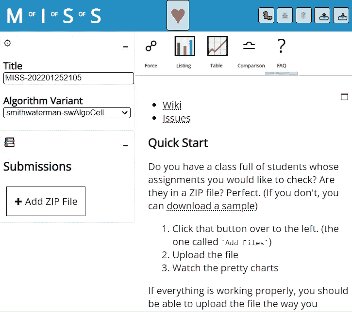
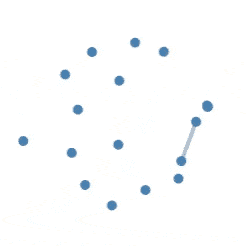
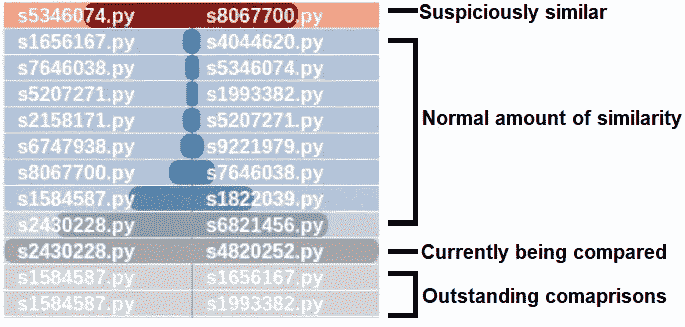
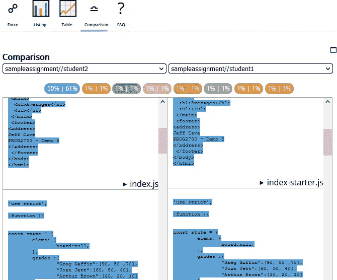
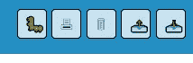
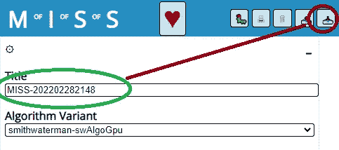

# 学生软件完整性的度量

> 原文：<https://javascript.plainenglish.io/measure-of-integrity-of-student-software-e1993a625df6?source=collection_archive---------23----------------------->

## 一个比较项目相似性的轻量级工具


Photo by [Nubelson Fernandes](https://unsplash.com/@nublson?utm_source=medium&utm_medium=referral) on [Unsplash](https://unsplash.com?utm_source=medium&utm_medium=referral)

这篇文章描述了使用基于浏览器的工具来比较和可视化学生作业。工具 [M.I.S.S](https://jefferey-cave.gitlab.io/miss/) 是对经典工具 [MOSS](https://theory.stanford.edu/~aiken/moss/) (软件相似性度量)的致敬，但通过完全本地操作支持组织隐私和法律约束。

在[之前的一篇文章](/using-webgl-to-solve-a-practical-problem-751c186889aa)中，讨论了使用 GPU 来执行比较。

做了二十年的 IT 专业人员，为各种行业做了软件开发，为世界上一些最大的组织建立了解决问题的系统……我决定从事教学工作。

我花了很多时间与新雇佣的开发人员一起工作，给他们提供在各种公司环境中工作的基础知识，并对他们缺乏解决问题的兴趣感到失望。让一个刚毕业的学生思考他们的行为如何影响他人，以及他们的个人决定如何产生超出其直接期限的影响，需要做很多工作。

很多时候，新员工会快速浏览一个解决方案，提交它，然后(自豪地)宣布它已经完成；粗略的检查会显示出很大的缺陷。这在所有新员工中很常见。我教学的目标是避免这个问题。毕业生们走出学校，对这个领域毫无准备，而我要改变这种情况。

我打算提高组织可用的软件开发人员的质量，而不是开发人员的数量。

我想接触学生，并希望指导他们学习如何解决问题，而不仅仅是键入代码。

在我第一学期快结束的时候，我注意到了两个重要的问题:

1.  有些学生天生就对编程不感兴趣
2.  在对学生的质量签字之前，我必须首先确定哪一项是他们的工作

学生们一起工作，合作是好的，但是在压力下，一些人忍不住要作弊。根据背后的动机不同，这在不同方面冒犯了我:

*   我不喜欢恶霸。当一个很酷的孩子试图贿赂或胁迫一个社交能力差的学生做作业时，我会很生气。
*   我讨厌骗子。在某些情况下，学生对工作毫无兴趣，并付钱给专业人士做他们的作业。
*   我喜欢人们学习。在压力下，一个好人可能会走捷径，但是，如果有人在隐藏问题，我无法帮助他们。

***暂且不说***

这不是道德判断，而是事实判断。我成为一个糟糕的 MMA 战士是因为 [*我太娇气了*](https://www.imdb.com/title/tt0104558/quotes/?ref_=tt_trv_qu) *，这也没什么…除非我尝试去战斗。*

我注意到管理中的一个问题是不希望学生不及格的强烈愿望。如果一个学生不能完成一项活动，他们就会找借口，因为没有人想伤害任何人的感情。这导致学生被放在他们没有准备好的岗位上，而我最初对毕业生的观察将客户置于风险之中。

*记住我的动机:诚信很重要，因为根据个人的工作能力来判断他们是一个安全问题，也是一个认证信任问题。*

使这个问题更加复杂的是，其他教师和管理人员不想发现这个问题。这是一个很难处理的问题，充满了情感、主观推理、学术法庭和形式。如果我们忽略它，生活会简单得多。我不止一次听到“工业会把它们理顺”。对我来说，这使得该机构宣传的认证毫无价值(参见“[我震惊地发现一名候选人在网上面试中作弊](https://levelup.gitconnected.com/i-was-shocked-to-catch-a-candidate-cheating-in-an-online-interview-2441fef0ab4)”)。

因此，总结一下这个问题:我正在教授 JavaScript 编程、可视化和数据分析，刚刚离开一个以分布式计算为谋生手段的职位，面临一个问题。除此之外，管理部门禁止将学生的作业传输到设施之外，并不祥地提醒我它不能离开这个国家。

所以我写了自己的解决方案。

在浏览器中完成。

不涉及服务器。

安装软件不需要许可。不再担心法律或隐私限制。没有可疑的许可证。不收费。只是一个简单的工具来找出谁需要我的帮助。

# 解决方案

米（meter 的缩写））I.S.S .是一个完全在浏览器中运行的软件。可以在[https://gitlab.com/jefferey-cave/miss](https://gitlab.com/jefferey-cave/miss)找到

在你开始使用软件之前，有一组你想要比较的文件是值得的。如果你使用像 [BrightSpace](https://www.d2l.com/) 这样的提交工具，你很幸运，M.I.S.S .接受并解释你从提交文件夹下载的 zip 文件。可以像你下载一样直接上传。或者，您可以下载用于测试的示例。



The first page you see when you get to the interface

当显示第一个连接时，该工具在“FAQ”页面上启动。目的是马上回答你可能有的所有问题。此时，您可以做的最重要的事情是上传一组学生作业进行比较(存储为 zip 文件)。在后台，该工具将解压 zip 文件并提取每个文件。每个根文件夹被认为代表一个学生。



The points represent student submissions. Orange represents the progress of comparing them to one another; while the grey line shows a completed comparison.

上传后，您应该能够导航到“force”选项卡以查看进度。图形实时更新，给人一种进度感，所以去喝杯咖啡，等待计算完成。

## 它的作用

既然已经加载了样本并开始处理，那么是时候问一下它实际上在做什么了。

测量两个程序之间相似程度的过程不仅仅是简单的文本比较。相反，M.I.S.S .会经历几个阶段来尽可能的精确。

1.  **编译/标准化**

流程的第一部分是根据语言通过[合适的解释器](https://gitlab.com/jefferey-cave/miss/-/wikis/Parsing/Python)运行代码。当大多数人最初想到代码比较时，他们会考虑文本比较:一个字母接一个字母。但是，通过使用特定于语言的解释器，我们可以将文本转换成一系列标记:

*   代替`f`、`o`、`r`，单词`for`被识别为单个事物(并被分配一个数字)
*   代替`f`、`o`、`r`、`w`、`a`、`r`、`d`，单词被识别为变量(并被分配一个数字)

这避免了前三个字母被认为是指同一件事:相反,`token1`与`token2`相比，被视为两件事之间的单一比较，而不是 3 个相似之处和 4 个不同之处。

这使我们能够识别可能具有较大视觉影响的小变化(如变量名的变化)。

**2。全文比较**

文本在全文级别进行比较。这对于确保顺序无关紧要非常重要:

```
function FunA(){...}
function FunB(){...}
```

被视为与相同的代码

```
function FunB(){...}
function FunA(){...}
```

请参阅我之前的文章中关于如何实现 Smith-Waterman 算法的内容。

这使我们能够识别可能具有巨大视觉影响的微小变化(如重新排序功能)。

# 解释结果

这个程序做一个盲目的比较，它对比较的东西没有任何偏见，它只是比较。不幸的是，所有创造性的工作都有共同的元素。好的解决方案会被独立发现。这意味着这个程序**不可能**抓到骗子。

这个程序**能**做的是过滤掉那些可能*没有*直接抄袭他人作品的人。人们似乎在运用自己的技能试图解决问题。

给定一批 120 个要评分的作业，需要进行 7140 次比较。将此乘以分配给不同年级学生的多个批次，问题就变得站不住脚，导致教员(错误地)依赖直觉。

相反，可能有必要检查 5 到 7 个提交的项目，可以使用 MISS 来过滤列表，通过删除明显不同的项目，只保留那些项目。

## 如何解读

可视化的目的是减少教员的工作量。一旦一批作业完成处理，解释结果就相对简单了。

力定向图比其他任何东西都更令人好奇(我们在我的课上构建了它们)。出现的群集表示该类中的社会群体。这可能表明学生们正在一起学习，并共同犯错误。

真正的第一步是教职员工查看`Listing`选项卡



An example of a run. Most submissions have around a 5–10% similarity. However, highlighted in red, are two assignments that have about 50% similarity to one another. This is a major divergence from the norm, making them worth investigating. Be careful, the calculation is not complete, we don’t know what “normal” actually is.

该列表包括每个提交与每个提交的比较，相似度以百分比表示。为了减少工作量，项目按最相似到最不相似排序。最下面的大概可以忽略。结果也用颜色编码来表示`not compared`(灰色)`normal`(蓝色)`suspicious`(红色)。如果你看到灰色，这是不完整的，去拿更多的咖啡。

“可疑”被定义为与群体异常相似。这是通过按照相似性的顺序对项目进行排序，计算每个步骤之间的差异，并取最大的变化来计算的。从最大变化向前的任何值被认为是值得检查的

举个例子，

```
14%         }
   }- 3     }
11%         }  Suspicious Range of values
   }- 1     }
10%         }
   }- 4   <-- Greatest Change
 6% 
   }- 1
 5% 
   }- 0 
 5%
```

选择这种方法是为了识别群体中正常的“分享”。假设这些步骤将代表学生依靠他们的同龄人的支持，直到它达到一个比学习“更多”的点。即使过了那个点量恢复正常，分享量还是畸高。这种技术被认为提供了比简单平均更好的效用，因为它可以识别少数学生独立工作的一组人。

点击这些比较中的任何一个都会把你带到`Comparison`标签。



The comparison tab allows you to view the actual assignments side by side with colour coded sections of similarity. Don’t miss the “maximize” button in the top right corner.

在这里，您可以并排查看实际的软件。类似的代码块用颜色编码，以便检查。点击右上角的最大化按钮可能会有用。单击百分比指示器将跳转到代码块，双击将两段代码对齐。

希望你的检查不会发现任何有趣的东西。



Action buttons that are useful: report a bug, print the results, delete the current data, upload a result file, or download a result file.

因为这完全在浏览器中运行，所以保存比较的副本也很重要。这可以通过点击`download`按钮来完成，该按钮会下载当前比较的副本，以供日后保存。这是一个有用的备份，但也是在您需要停止运行并需要稍后恢复运行的情况下(可能添加了一个延迟提交)。下载的文件存储了所有数据，以便日后必要时继续比较。



Give your file a meaningful name before downloading it. Then delete and start another class’ assignments.

说到这里，这个软件的要点是独立于工具。无论您的发现如何，您都应该将结果长期存档。打印出来的副本可以作为你的发现的永久记录，并以简单的 HTML(或 PDF)形式存在，即使几十年后，当你忘记了 M.I.S.S .时，你还需要访问这些结果。

永远记住保持你一致决策的一致证据。

# 常见的异议

大多数关于结果的反对意见相当于[对过程的稻草人攻击](https://thinkbuthow.com/straw-man/)，并且集中于不挑战学生的正直。

## *如果电脑出错，诬告学生怎么办？*

如果使用得当，这种工具可以简单地识别出需要进一步研究的作品。它没有给出关于相似性的性质或动机的任何信息。这由调查者根据上下文来确定。

事实上，让我反过来反对:

## *如果* ***导师偏见*** *导致错误，诬告学生怎么办？*

在它的第一次使用中，这个工具实际上表明了某个被怀疑作弊的人实际上是无辜的。

当时，我已经筋疲力尽了。学期结束了，学生们有了第二次(第三次，第四次和第五次)提交作业的机会。管理人员、顾问和同事胁迫我允许一些重点学生多次迟交。自然地，当一个特别提交的作业看起来可疑地类似于一个我印象特别深刻的非常独特的解决方案(由一个特别强的学生提交)时，努力跟上评分并被拉进关于这些学生的多个会议不会让我心情愉快。

脾气不好，为了避开下一轮反对，我决定从一个公正的计算资源中收集证据，并发现…

**这两个学生之间的相似程度在班上是正常的**

该学生有几个相似的变量名(可能是因为辅导)，但除此之外，风格非常不同。我个人的情感和经历导致了偏见，因为...因为我是人类。

**计算解决方案是不偏不倚的，公平而不带感情地对待学生，即使我不这样做。**

它还(多亏了它的暴力破解能力)识别出了两个学生，他们抄袭了彼此的作品，只是改变了名字。它们被遗漏了，纯粹是因为它们被淹没在大量需要评分的论文中。

# 使用程序

我强烈推荐阅读一篇关于 MOSS 在课堂上的使用的论文:“[使用“MOSS”检测编程作业作弊的体验](https://www3.nd.edu/~kwb/nsf-ufe/1110.pdf)”。这详细介绍了南佛罗里达大学教师的日常工作和经验

对使用这种工具的反对主要集中在用户的报复指责上。然而，对于选择使用这种工具的教师来说，目标是避免问题，而不是引起问题。在开发了这个工具之后，我开始开发并记录一个例程以供使用:

*   对每批分配的进行一致的运行
*   向学生公开你正在管理它
*   每个学期，我只费心去追查最令人震惊的案子

我通常会从第一个作业开始第一个学期，并在学生面前通过这个工具运行所有学生提交的内容。视觉吸引了他们的目光，他们可以看到星团开始形成。自然地，我小心翼翼地匿名了学生 id，但是因为是入门，相似度还是非常高的。学生没有被挑选出来，但它确实是对学生的一个警告，告诉他们你在监视他们，并为讨论抄袭和合作之间的区别提供了一个机会。这也是一个很好的介绍性讨论，讨论他们正在学习的技能如何应用于解决个人工作问题。

虽然该工具减少了证据收集的工作量，但并没有消除这种工作量。即使是讨论学术问题也有很大的官僚负担。我个人认为，在追求这个问题和与家人共度时光之间必须找到一个平衡点。我的结论是每学期只追踪一个案例:挑选最差的，追踪到底。我也倾向于在学期中这样做

1.  当事情是新的和繁忙的时候非正式地警告学生
2.  给自己留些时间处理必要的文书工作
3.  给学生改正行为的机会

我觉得在提交和处理问题时保持一致很重要的部分原因是因为我第一次经历了正式的程序。当我开始追踪一个案例时，其他的教员带着他们之前与同一组学生的轶事案例出现了。有趣的是，这些学生有多次单独处理的事件，然而这种模式并没有跨时空地被识别出来。

一致性的另一个原因是简单的偏见管理:你是不是因为偏袒而让学生下滑？任何时候你基于谨慎主动地拒绝承担后果，你都是在主动地对那些你选择追求的人采取惩罚措施。因此，你是否不带偏见地实施惩罚措施？如果你始终根据证据行事，你就没有机会表达无意识的偏见，因此也不需要质疑自己的正直。

# 结论

虽然我不再教编程，但我确实认为学术诚信很重要。学院和大学正在认证学生在某个专业领域的知识，而不诚实的认证过程会带来可怕的后果。


[Found this useful or interesting? Consider leaving a tip … it helps.](https://www.buymeacoffee.com/jeffereycave)

## 未来的发展

我很想继续在 M.I.S .上工作，但是没有更多的数据(更多的任务),很难理解观众的需求。

如果你觉得这个工具有用，我希望收到你的来信。

*   [建议一个特色](https://gitlab.com/jefferey-cave/miss/-/issues)(或者投赞成票)
*   [提交补丁](https://gitlab.com/jefferey-cave/miss/-/merge_requests)
*   请在评论中告诉我你的经历(好的或坏的)

了解*如何使用*(或者甚至“*”)系统将有助于推动开发向前发展。*

*现在，我非常有兴趣将集群指示器添加到力导向图中。我认为在分组的可疑项目周围画一个泡泡会很有用。差异分析已经确定了这些是哪些项目，但是如果您有多个集群，那么将它们分离出来会很有意思。*

# *其他用途*

*像这样的工具有几个未来的功能。虽然我对探索其中一些感兴趣，但我对很多事情都感兴趣，并且不得不做出一些艰难的选择。*

## *代码重构*

*一个有趣的功能是代码的重构。虽然这个工具可以比较不同的应用程序，但是同样的技术也可以用来比较软件应用程序*和它本身*。这种自我比较可以帮助软件重构，识别复制/粘贴导致重复的代码部分，或者甚至是两个开发人员独立实现相同想法的部分。这些相似且重复的部分很可能代表着重构的机会。*

## *分布式开源分析*

*另一个有趣的想法是将其扩展到更大规模的项目。与其拿学生软件当提交，不如扫描 GitHub 或者 GitLab 看内容重复。除了福克斯，谁在抄袭别人的代码？这将需要一个服务器和数据库来检查代码，并将比较结果存储在一个长期的存储库中。这个项目是在我参与的一个分布式项目之后不久开发的，并且是在考虑分布式计算的情况下构建的，它应该能够很容易地扩展到分布式环境。*

*如果有人有一些投资资金想要投资这些想法，我会很高兴去追逐它们。*

 *[## 多发性硬化症。

### 完全包含在浏览器中的软件相似性的度量。

jefferey-cave.gitlab.io](https://jefferey-cave.gitlab.io/miss/)*