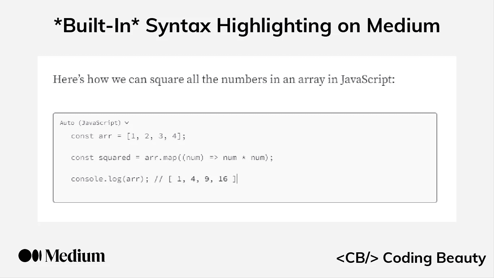
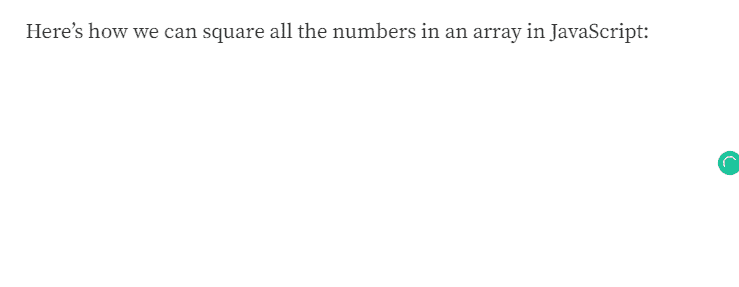
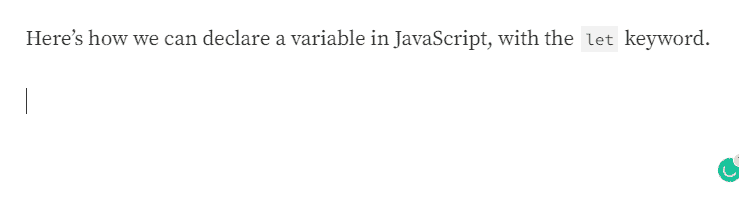
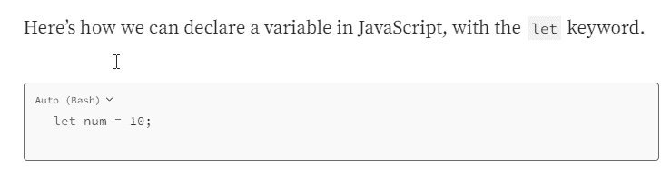
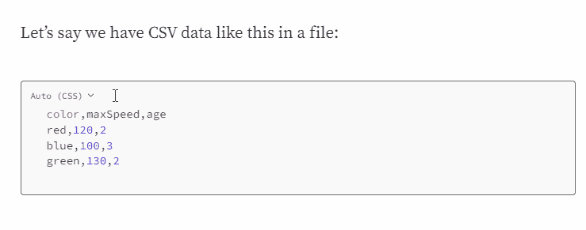

# 新:*内置*语法在介质上突出显示

> 原文：<https://javascript.plainenglish.io/medium-built-in-syntax-highlighting-c906e04bbafa?source=collection_archive---------2----------------------->

如果您经常在 Medium 上阅读或撰写编码文章，您会知道，尽管编程是该平台上最常见的话题之一，但它已经多年没有任何语法高亮支持了。软件作者不得不求助于第三方工具来生成漂亮的代码高亮显示，以增强可读性。

幸运的是，这一切很快就会改变，因为最近 Medium 团队终于为主要编程语言的代码块添加了内置的语法高亮支持。

正如您在演示中看到的，代码块现在可以自动检测代码的语言并突出显示它。

# 手动语法突出显示

不过，自动检测并不总是正确地工作，尤其是对于小代码片段，这可能是由于多种语言之间的语法相似性。注意演示中检测到的语言在输入过程中是如何变化的，从 R 到 C++再到 JavaScript。

对于微小的代码片段，自动检测可能会失败:

在这种情况下，您可以从下拉列表中选择正确的语言:

# 移除语法突出显示

如果代码是未列出的语言或不需要突出显示，您可以选择`None`并取消突出显示。

请注意，语法突出显示不适用于在该功能出现之前发布的文章，可能是因为如果自动检测失败，它会在文章中产生不正确的结果。

所以现在我们不再需要 [GitHub Gists](https://gist.github.com/) 或者 [Carbon](https://carbon.now.sh/) 来做这个。在媒体上突出显示语法现在比以往任何时候都容易。

*原载于*

# *JavaScript 做的每一件疯狂的事情*

*一本关于 JavaScript 微妙的警告和鲜为人知的部分的迷人指南。*

**

*[**报名**](https://cbdev.link/d3c4eb) 立即免费领取一份。*