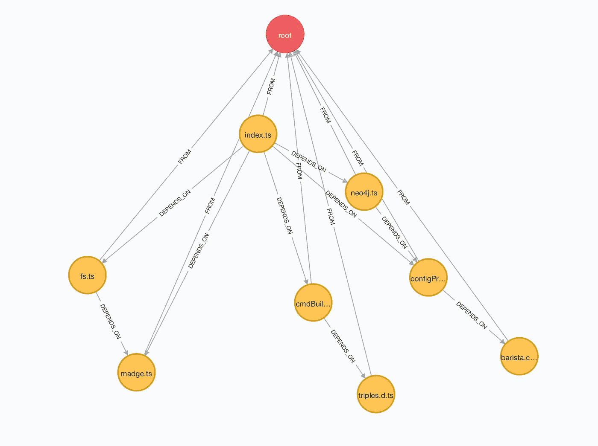
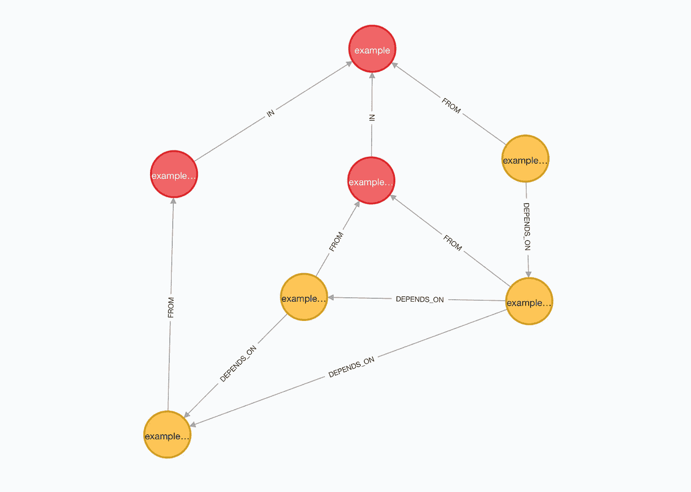
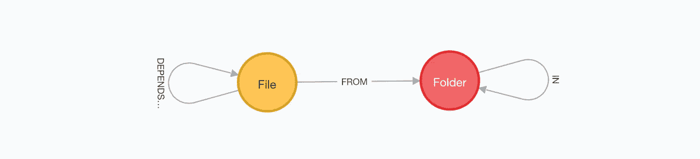
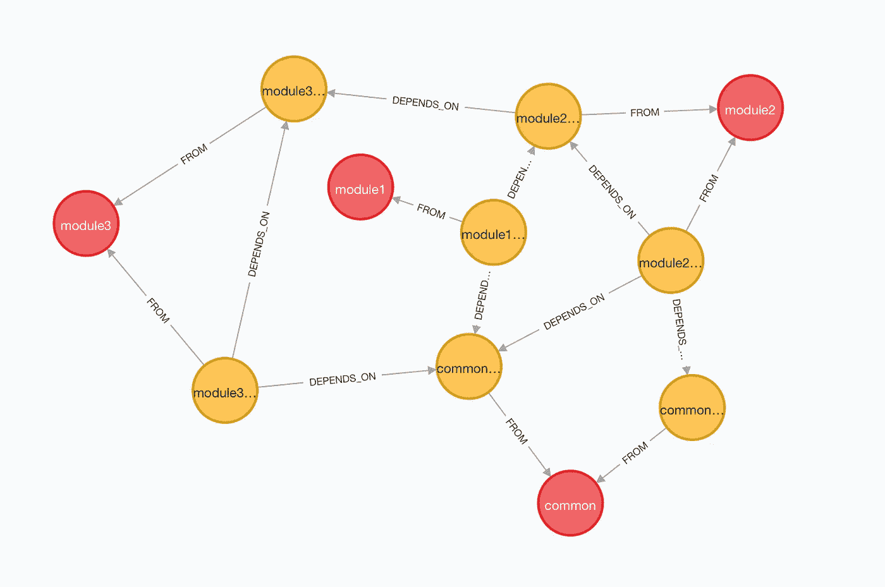
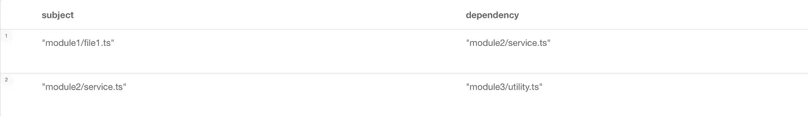
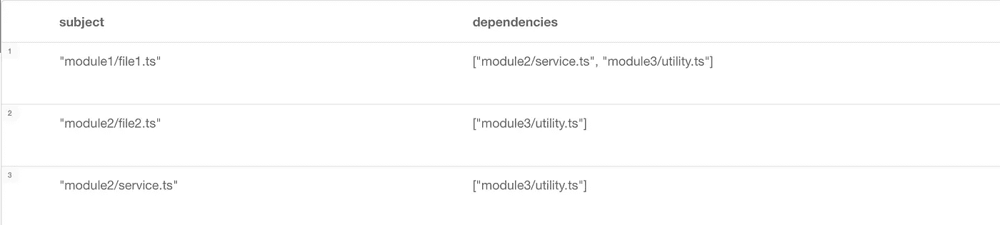
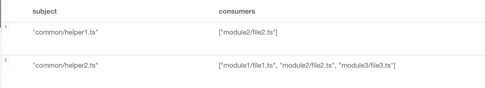
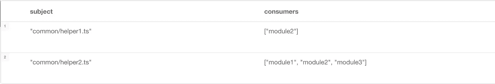

# 遇见咖啡师:作为图形的客户端代码库

> 原文：<https://javascript.plainenglish.io/meet-barista-client-side-codebase-as-a-graph-9479c99aa3a9?source=collection_archive---------15----------------------->

## 关于如何从客户端代码库生成图表的教程。

[Barista](https://github.com/vladbatushkov/barista) 是一个开源项目，旨在帮助前端开发人员更好地理解代码库。Barista 从源代码创建 Neo4j 图形数据库，包括文件夹、文件和导入依赖项。

这个项目是 [Strazh](https://github.com/vladbatushkov/strazh) 的副产品，遵循[代码库知识图](https://medium.com/neo4j/codebase-knowledge-graph-204f32b58813)的思想，在我之前的文章中已经解释过。



Graph of Barista codebase

在幕后，它使用 [Madge](https://www.npmjs.com/package/madge) 来收集关于代码库文件依赖关系的信息，然后将这个结果转换成 [Neo4j 数据库](https://neo4j.com)的图形。这样，Barista 通过使用 Cypher 查询语言、APOC 和 GDS 解锁基于图形的分析，扩展了 Madge 结果的可用性。

# 简单的例子

让我们假设，你有一个虚假项目的客户端代码库。

```
/example
  /folder1
    file1.ts
  /folder2
    file2.ts
    file3.ts
  entry.ts
```

在这个例子中运行咖啡师需要做 3 个简单的步骤。

## 第一步:克隆咖啡师

```
git clone [git@github.com](mailto:git@github.com):vladbatushkov/barista.git
```

在存储库中，您会发现 Barista 本身的源代码、运行 Neo4j 数据库的 docker-compose 文件、一个配置文件和一个当前用例示例的源代码。

```
yarn install
```

## 步骤 2:运行 Neo4j 实例

让我们为未来的图表准备存储。最简单的方法是在 docker 容器中运行 Neo4j 数据库。

您可以使用提供的`docker-compose up`来启动 Neo4j 实例。

*   包括 APOC 和图形数据科学插件
*   预定义用户/密码:`neo4j` / `barista`

或者可以使用任何 Neo4j 实例。

## 步骤 3:设置配置

在`barista.config.json`文件中有 2 项需要设置:

*   一段 Neo4j 连接`graph`
*   区段中的 Madge 设置`scan`

对于我们的示例，配置文件可能如下所示:

```
{
    "graph": {
        "host": "neo4j://localhost:7687",
        "login": "neo4j",
        "password": "barista",
        "database": "neo4j"
    },
    "scan": {
        "regex": "example/entry.ts",
        "source": [".", "src"],
        "dest": [".", "dist"]
    }
}
```

*   `regex`属性定义了扫描的条目。它也可能是许多文件
*   `source`属性定义扫描的根文件夹
*   属性定义一个文件夹来存储 madge 扫描的结果

**就是这样，现在你可以经营咖啡师了！**

```
yarn barista
```

成功日志可能如下所示:

```
Barista start brewing Client-side Dependency Graph...
Step 1: Read config...
Config is OK.
Step 2: Scan entity files...
src/example/entry.ts
Step 3: Madge process...
Madge completed with output file: **dist/example.entry.dds**
Madge-based DependencyDataSource files (.dds) are created.
Step 4: Transform DependencyDataSource files (.dds) into the GraphDataSource...
GraphDataSource created with 4 keys (RAM only).
Step 5: Clean the database 'neo4j'...
Step 6: Create a Graph...
Graph created using 11 triples.
Enjoy your Client-side Dependency Graph.
```

依赖项数据源(。dds)文件是一个包含依赖关系信息的结果。例如:

```
entry.ts
  folder2/file3.ts
folder1/file1.ts
folder2/file2.ts
  folder1/file1.ts
folder2/file3.ts
  folder1/file1.ts
  folder2/file2.ts
```

内容意味着，`entry.ts`文件依赖于`folder2/file3.ts`，而`folder1/file1.ts`不依赖于任何东西，以此类推。

# 咖啡师结果图

咖啡师图包含一组文件依赖关系，文件和文件夹结构。您可以使用 Neo4j 浏览器来浏览结果图的数据。

```
[http://localhost:7474/](http://localhost:7474/browser/)
```



Graph of simple example codebase

结果图的模式非常简单:



Schema of Barista result graph

节点:

*   `(:File)`具有单一属性{ name }
*   `(:Folder)`拥有单一财产{姓名}

关系:

*   `(:File)-[:DEPENDS_ON]->(:File)` —文件依赖于另一个文件
*   `(:File)-[:FROM]->(:Folder)` —文件来自文件夹
*   `(:Folder)-[:IN]->(:Folder)` —文件夹在另一个文件夹中

# 高级示例

咖啡师可以帮助解决的一个典型的代码库问题是检测各种设计和依赖性违规。

在这个例子中，代码库是一组文件夹，其中每个文件夹是一个独立的模块。模块之间互不知晓，但可以使用公共文件夹中的共享功能。

```
/src
  /common
    helper1.ts
    helper2.ts
  /module1
    file1.ts
  /module2
    file2.ts
    service.ts
  /module3
    file3.ts
    utility.ts
```



Graph of advanced example codebase

设计宣言宣布了下一个限制:

*   模块不应使用另一个模块的功能
*   所有模块都应该使用通用功能

咖啡师可以帮助发现违反规定的行为。下一个密码查询将检测每个模块的外部依赖性:



结果发现了 2 处违规。结果不错，但还可以更好。我们来找依赖，包括依赖的依赖(任何依赖级别的嵌套依赖)。从外部检测 n 层依赖关系:



如果您仔细观察结果，您会看到一个可能的重构想法:将`module3/utility`移动到一个`common`文件夹中，因为所有 3 个模块都依赖于它。感谢咖啡师。

现在让我们检查一下`common`文件夹用法的正确性。



如你所见，`common`文件夹不是`helper1`的合适位置。结果也可能不是文件列表，而是文件夹列表。



如您所见，Barista 为我们提供了基于图表的分析和有意义的代码库洞察。您可以在重构和重新设计阶段使用图形分析。你可以用它来估计任何重大的变化。您可以使用它来提高 PR 质量，通过捕捉和防止坏的代码合并。


Photo by [tabitha turner](https://unsplash.com/@tabithabrooke?utm_source=unsplash&utm_medium=referral&utm_content=creditCopyText) on [Unsplash](https://unsplash.com/s/photos/barista?utm_source=unsplash&utm_medium=referral&utm_content=creditCopyText)

# 结尾部分

感谢您的阅读。下一步是在真实项目的代码库上运行 Barista，并探索代码库依赖关系。是时候酝酿一个新的图表了！干杯！

## 欢迎投稿

如果您喜欢咖啡师的想法，并希望改进该项目，请[加入项目贡献者](https://github.com/vladbatushkov/barista)。

特别感谢[乔纳](https://github.com/jbizkit)。

*更多内容看* [***说白了就是***](http://plainenglish.io/) *。报名参加我们的* [***免费周报***](http://newsletter.plainenglish.io/) *。在我们的* [***社区获得独家访问写作机会和建议***](https://discord.gg/GtDtUAvyhW) *。*