# Meet Notiger:从应用程序获取实时事件通知的开发工具

> 原文：<https://javascript.plainenglish.io/meet-notiger-the-dev-tool-to-get-real-time-notifications-on-events-from-your-application-e00b04a034a?source=collection_archive---------25----------------------->

## 什么是 Notiger？这是开发人员的一个工具，允许从他们的应用程序中触发事件。

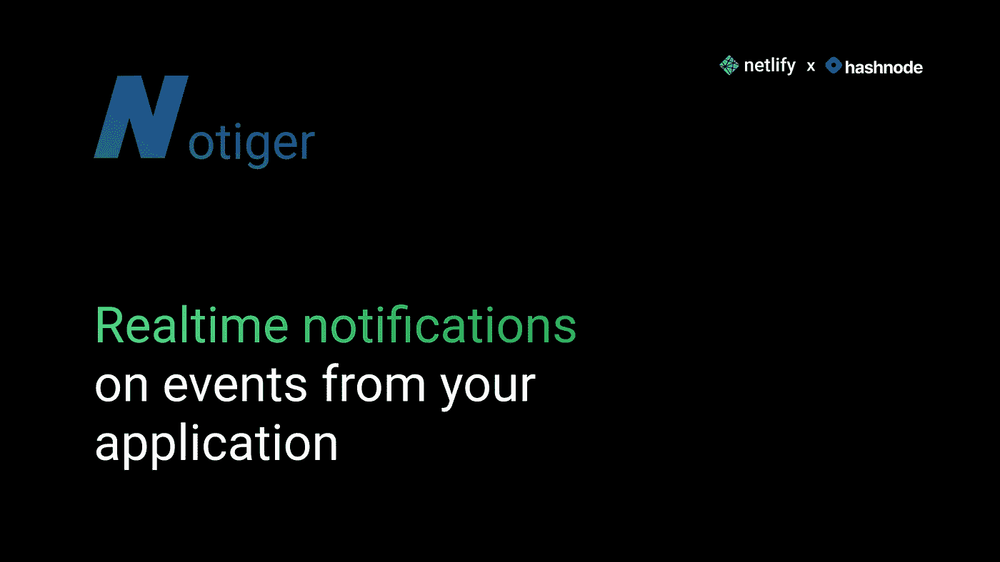

本月初， [Hashnode 宣布了另一个黑客马拉松](https://townhall.hashnode.com/netlify-hackathon)，这次是与 [Netlify](https://www.netlify.com/) 合作，这是一个托管网站和无服务器功能的惊人平台。这让我开始思考，这一次，一个想法在这个月的早些时候出现在我的脑海里。然而，有学校考试，所以我做了最后 8 天的大部分工作😕

# 🤔什么是 Notiger？

Notiger 是开发人员的一个工具，允许从他们的应用程序中触发事件。这些事件存储在数据库中，可以随时访问。此外，如果用户启用了通知，每当触发新事件时，他们都会收到通知。

[现场演示](https://www.notiger.xyz/) / [GitHub 资源库](https://github.com/AnishDe12020/notiger)

# 💡一点点关于这个想法

我的[作品集网站](https://anishde.dev/)在这个想法中发挥了巨大的作用。我有一张联系表，人们可以通过它给我发信息。现在，将消息存储在数据库中是有意义的，但如果有一种更简单的方法来查看这些消息并在它们被发送时得到通知，那就更好了。

我还认为许多人会喜欢这样的解决方案，因为不是每个人都有时间实现将表单响应和事件保存到数据库的逻辑。它还有许多其他的用例，我将在这篇博文的后面部分介绍它们。

# 📚技术堆栈

Notiger 必须做从认证到数据存储到发送推送通知的所有事情。这是它使用的技术堆栈-

*   [Next.js](https://nextjs.org/) 作为前端框架
*   [TailwindCSS](https://tailwindcss.com/) 作为 CSS 实用类库来样式化前端
*   [基数 UI](https://www.radix-ui.com/) 用于模态(对话框)和折叠等非样式组件
*   [用于动画的无头 UI](https://headlessui.dev/)
*   [NextAuth](https://next-auth.js.org/) ，一个实现认证的简单库
*   用于发送通知的
*   [MongoDB](https://www.mongodb.com/) 存储用户数据和事件

当然还有…

*   [Netlify](https://www.netlify.com/) 用于部署前端。它还支持无服务器功能，因此我能够使用 Next.js API 路由作为我的后端

# notiger 是怎么工作的？

创建 Notiger 帐户后，创建一个项目。每个项目都可以有接收事件的流。当接收到一个事件时，它被存储在一个数据库中，在本例中为 [MongoDB](https://mongodb.com/) ，并且一个通知被推送到用户拥有的所有启用了通知的设备。

一个事件示例:

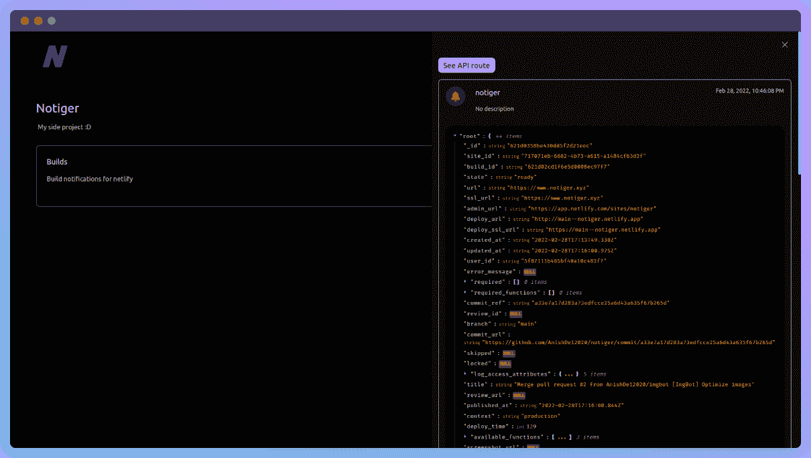

如你所见，这个事件实际上来自 Netlify。Netlify 有这个惊人的特性，允许我们为 Netlify 中的特定事件设置 webhook 通知。你可以在这里了解更多[。还有许多其他应用程序(如 GitHub)允许我们为一些事件设置 webhook 通知。Notiger 可以接收这些 webhook，将有效负载(通常包含有关事件的重要数据)存储在数据库中，并在 web hook 触发时发出通知。](https://docs.netlify.com/site-deploys/notifications/#outgoing-webhooks)

# 我是如何用 NextAuth 实现认证的？

[NextAuth](https://next-auth.js.org/) 是一个 JS SDK，它允许我们轻松地向 Next.js 应用程序添加身份验证。首先，我们需要建立一个 API 路由来处理所有的认证。幸运的是，NextAuth 通过提供一些样板代码使它变得非常简单，而且，我们只需要为此添加大约 1 个文件。这是我的代码—

`pages/api/auth/[...nextauth].ts` -

现在，在这里，我用 Google 添加了社交认证(只用了 4 行代码！)并定制了`session`和`jwt`的回调。此外，我将用户数据存储在一个数据库中，在本例中是 MongoDB。JWT 回调用用户数据对象创建一个 JWT，用于应用程序的其他部分。会话回调被定制为在检索当前会话时包含 JWT 令牌。我还实现了一个定制的身份验证页面`/auth`。

## 使用中间件保护页面

现在，我不希望我的用户在没有登录的情况下，通过访问类似于仪表板页面的东西来迎接错误。谢天谢地，NextAuth 让我们使用 [Next.js 中间件](https://nextjs.org/docs/middleware)只用一行代码就可以保护页面。例如，这是如何保护仪表板页面的-

对，就是它！

如果一个用户没有登录，他们将被重定向到`/auth`页面，一旦登录，他们将被重定向到仪表板页面(或他们被重定向到`/auth`的任何其他页面)。

现在，我也可以在我的页面上使用服务器端呈现来保护它们，但是这需要更多的代码，而且速度更慢，资源消耗更多。Netlify 也是那些不需要额外配置就能支持中间件的主机提供商之一，这使得使用中间件更有意义。

# 使用 Firebase 云消息推送通知

这是实现起来最具挑战性的事情之一。这就是为什么-

*   没有关于用 React 或 Next.js 实现它的官方文档
*   关于如何用 Next.js 实现它的指南/视频非常少，即使这样，它们也已经过时或者有时不能直接工作
*   在实现时遇到了多个问题(主要是因为我用 Brave 测试 Notiger，默认情况下，Brave 会阻止 Firebase 云消息传递)

首先，我添加了一个服务工作者，它将在后台接收消息(即当应用程序失焦或关闭时)并发出推送通知—

`firebase-messaging-sw.js`—

我还添加了一个前台通知的处理程序(当应用程序处于焦点时),它将创建一个 toast

我必须在客户端动态导入消息传递，因为它是在构建期间在服务器端导入的，并且会抛出错误。

# 事件是如何处理的？

我将 Next.js API 路由用于应用程序的后端，任何 web 挂钩都将被发布到事件 API 路由，`/api/events`

以下是处理事件的代码-

首先，所有东西都被包装在一个`try...catch`块中，以便我们在出错时返回一个错误。

在`try`模块中，我们寻找 2 个参数，即`streamId`和`apiKey`。必须将`streamId`作为查询参数传递给应用程序。通常情况下，`apiKey`应该作为`x-api-key`头传入，但是如果不可能的话，它也可以作为查询参数传入。下面是这些请求的样子:

API 键作为头传入:

使用 API 键作为查询参数:

请注意，您也可以从其他编程语言发送这个 POST 请求。例如，对于 JavaScript，你可以使用`axios`，或者对于 Python，你可以使用`requests`。

如果 API 键有效，我们将事件保存到数据库，假设事件有效负载的大小小于 16kb，并且是 JSON 对象的形式。这是为了防止垃圾邮件。对`streamId`的检查是预先完成的。

将事件保存到数据库后，我们检索与事件相关联的流，然后检索与流所有者相关联的 Firebase Cloud 消息传递注册令牌。这是向用户已启用通知的设备发送通知所必需的。接下来，我们发送通知。

# 了解事件有效负载

每当触发 webhook 时，也会传入一个有效负载。Notiger 将接受 16 千字节以下的所有有效负载，它们都是 JSON 对象的形式。这个有效负载通常包含关于一个事件的更多细节。例如，对于 Netlify 上的构建成功事件，它包含关于站点的信息、发布时间、部署的 URL、部署到 AWS Lambda 的无服务器功能等等。

Notiger 还为每个事件添加了一个`_id`、`__v`和`streamId`字段。`_id`字段是存储在 MongoDB 中的事件的 id。事实上，它的创建日期也可以从中检索出来。

检索 MongoDB 文档的创建时间戳的代码

我在这条[推特](https://twitter.com/AnishDe12020/status/1497067113969709059)中对此进行了更详细的阐述

`__v`字段是文档的版本，每当它被更新时就递增。`streamId`字段是事件所属的流的 id。

# ⚗️用例

有哪些可以使用 Notiger 的应用？

我已经看过了联系表单和 Netlify 构建通知的例子。然而，有更多的用例，有些非常先进

# 物联网设备

随着智能家居设备和其他物联网设备变得越来越流行和普遍，人们正在寻求更好地利用它们。当特定事件发生时，例如当实验室环境中的温度超过 30°C 时，可以触发一个事件，将通知发送到例如实验室所有者的手机，以便他们可以立即采取行动。

# 制造业

许多制造任务通常需要很长时间，通知在这方面也有帮助。比方说，有一个 3D 打印正在进行，一旦完成，3D 打印机就可以启动一个 webhook 通知所有者打印已经完成。它也可用于机械故障等情况。

# 研究与开发(research and development)

复杂的计算操作需要很长时间，同样，在失败、成功等情况下会触发通知。

# SaaS

SaaS 所有者通常希望获得注册人数、付费用户数量等实时信息。在他们的申请上。可以在注册、计划升级、错误报告等事件上触发通知。

# 🖱️如何使用 Notiger？

我使用 Notiger 的目标之一就是让它尽可能容易使用。让我们浏览一下如何使用它的小指南

第一步是通过点击右上角的登录按钮或访问进行注册。在这里，您将被提示使用 Google 登录。

接下来，前往[仪表板页面](https://www.notiger.xyz/dashboard)

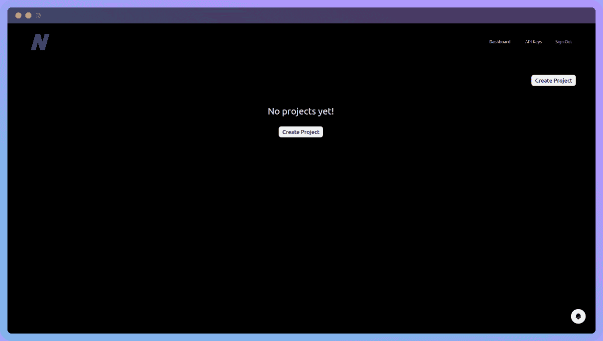

接下来，创建一个项目:

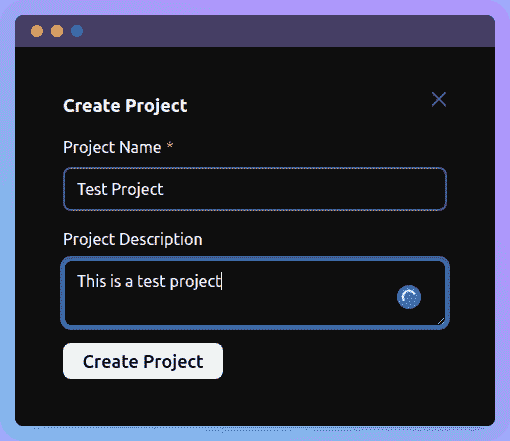

单击该项目，您应该会被带到项目页面。它应该是这样的:

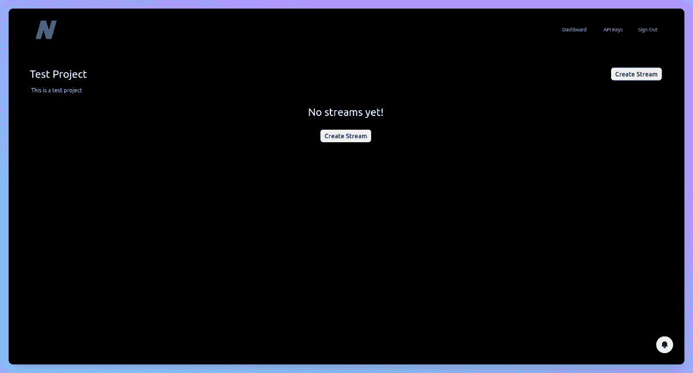

现在，让我们创建一个流:

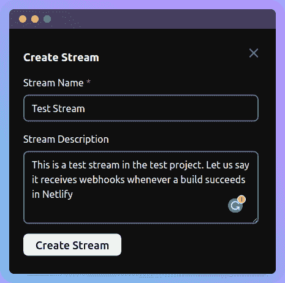

单击流，我们可以看到还没有事件:

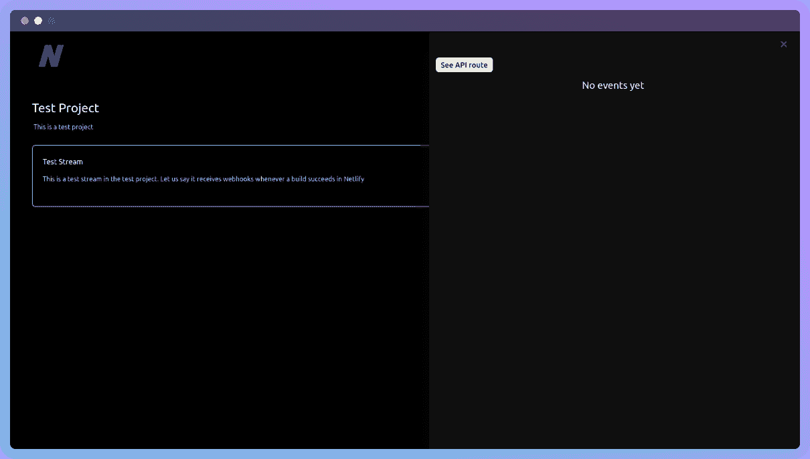

我们可以通过单击显示“查看 API 路线”的按钮来查看 API 路线:

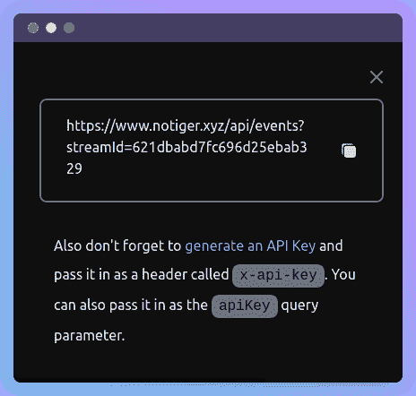

这将在发送 webhook 通知时使用。

现在我们已经复制了 URL，我们可以开始生成一个 API 键:

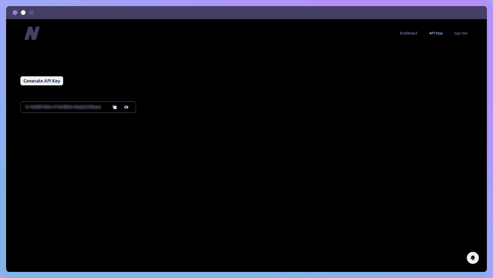

也复制这个值。

对于这个例子，我将使用 Postman 来发送一个 webhook，但是在现实世界中，它很可能是从代码或 shell 脚本中发送的。

下面是我们如何从邮递员:

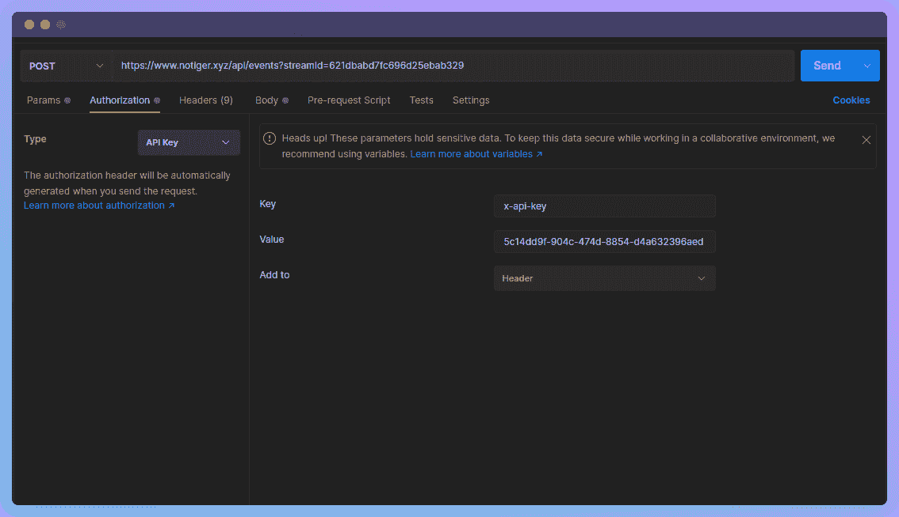

此外，不要忘记添加有效载荷。它可能看起来像这样:

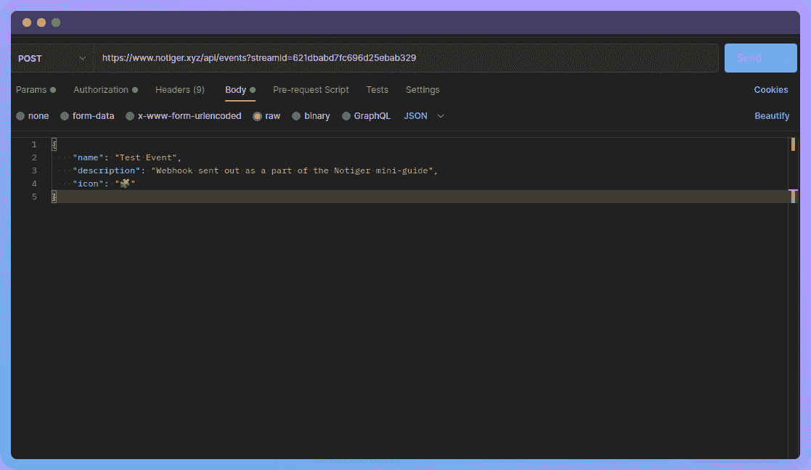

请注意，您也可以将 API 键作为名为`apiKey`的查询参数传入。现在点击“发送”。

我们将得到一个类似这样的响应:

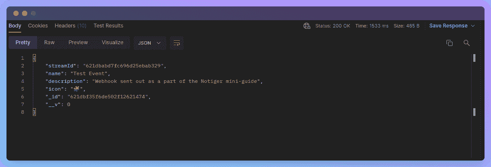

另外，现在如果我们在 Notiger 项目仪表板中检查我们的流，我们将能够看到事件:

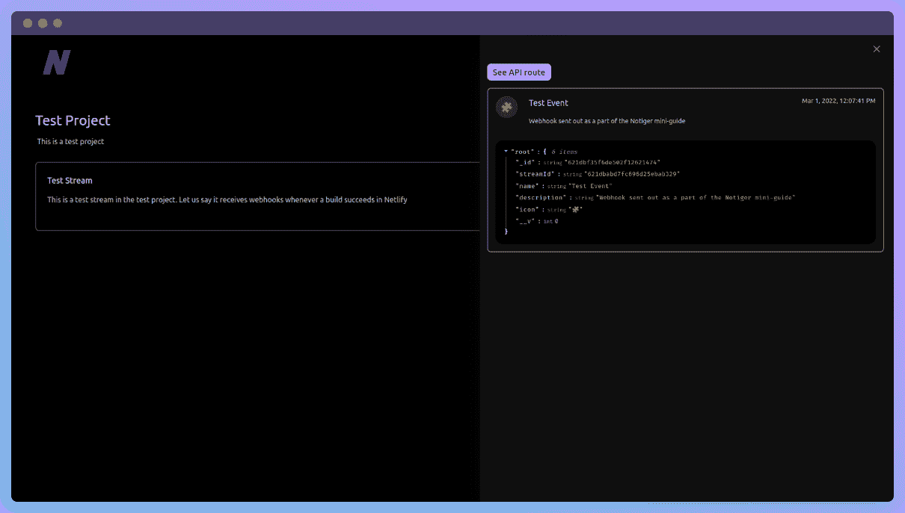

要启用通知，请点按右下角的铃:

# ✨结论

构建 Notiger、消灭 bug 和写这篇博客文章是一次奇妙的旅程！迫不及待地想看看这个副业在未来的日子里表现如何！

再见，祝你愉快😁🤞

# 🔗重要链接

*   [通知者](https://www.notiger.xyz/)
*   [Notiger GitHub 库](https://github.com/AnishDe12020/notiger)
*   [网络生活](https://www.netlify.com/)

*原发布于*[*https://blog . anishde . dev*](https://blog.anishde.dev/notiger-get-realtime-notifications-on-events-from-your-application)*。*

*更多内容请看*[***plain English . io***](https://plainenglish.io/)*。报名参加我们的* [***免费周报***](http://newsletter.plainenglish.io/) *。关注我们关于*[***Twitter***](https://twitter.com/inPlainEngHQ)*和**[***LinkedIn***](https://www.linkedin.com/company/inplainenglish/)*。加入我们的**[***社区不和谐***](https://discord.gg/GtDtUAvyhW) *。***