# 任何程序员都能联系到自己生活的迷因

> 原文：<https://javascript.plainenglish.io/memes-that-any-programmer-can-relate-to-their-life-ea3c1519bf7f?source=collection_archive---------0----------------------->

## 最佳编程迷因汇编 2022 系列

Photo by [Katarzyna Grabowska](https://unsplash.com/@kalljet?utm_source=medium&utm_medium=referral) on [Unsplash](https://unsplash.com?utm_source=medium&utm_medium=referral)

***模因和快乐有什么联系吗？*** 如果你是我这种类型的人，那么你可能也爱在下班后查看手机。猜猜我在那里看到了什么？

我主要是在互联网上看到**视频、抖音和模因**。我不知道为什么，但这有助于我提神醒脑，减轻工作压力。这就是为什么我相信*笑是人类最好的刷新按钮。*

在这篇文章中，我收集了一些我喜欢的网络迷因。

# 当一些随机的尝试让你找到问题的根本原因时…

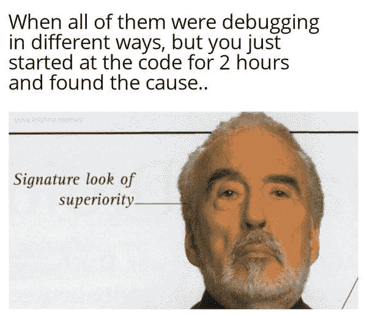

Picture Credit:[https://www.facebook.com/yuva.krishna.memes](https://www.facebook.com/yuva.krishna.memes)

# 当每个人都要求你在 Sprint 的最后一天测试构建时…

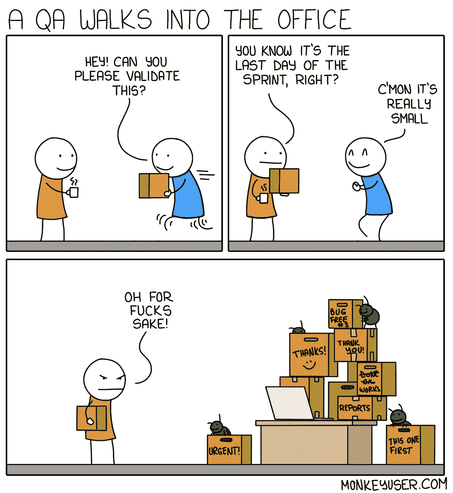

Picture credit:[https://www.monkeyuser.com/](https://www.monkeyuser.com/)

# 当您的领导要求您将工作移交给您的同事时…

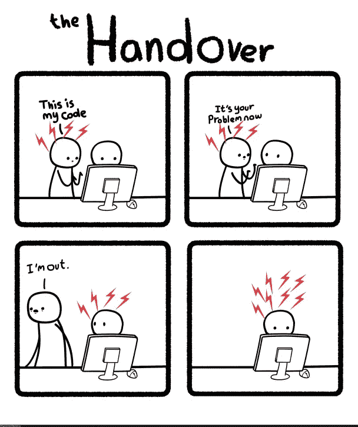

Picture Credit:[https://programmerhumor.io/](https://programmerhumor.io/)

# 是的，我们不是好的程序员，我们是最好的程序员…

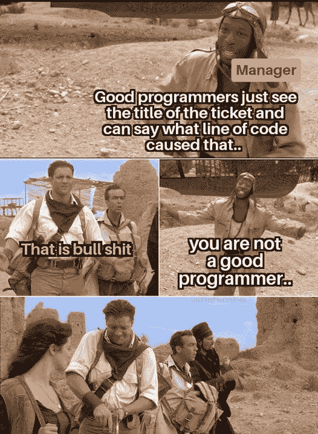

Picture Credit:[https://www.facebook.com/yuva.krishna.memes](https://www.facebook.com/yuva.krishna.memes)

# 当你陷入调试时…

Picture credit:[https://www.monkeyuser.com/](https://www.monkeyuser.com/)

# 对某些人来说，这是一个功能，而对其他人来说，这是节省成本…

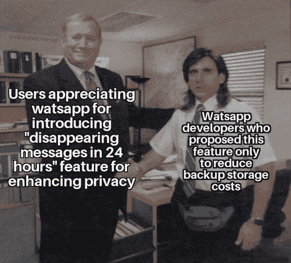

Picture Credit:[https://www.facebook.com/yuva.krishna.memes](https://www.facebook.com/yuva.krishna.memes)

# 当你有机会进行结对编程，而另一个开发者正在共享屏幕时…

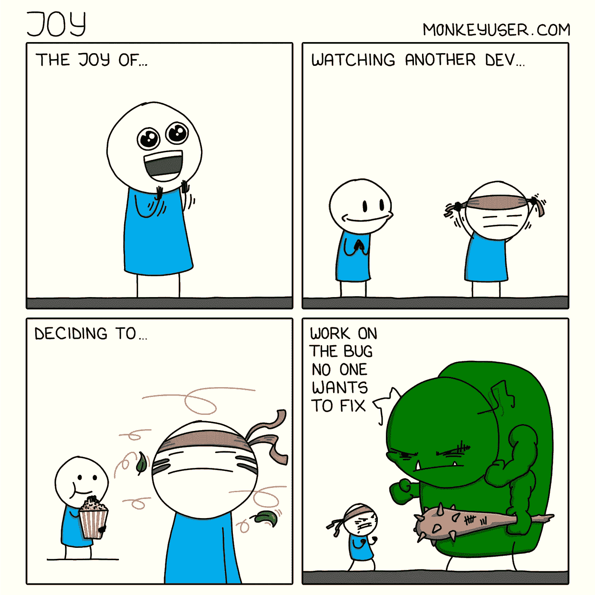

Picture credit:[https://www.monkeyuser.com/](https://www.monkeyuser.com/)

# 当你在朋友的群体中使用独特的语言时…

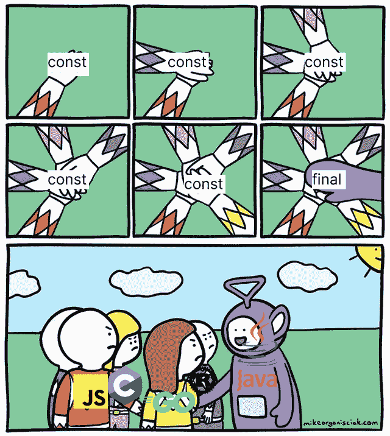

Picture Credit:[https://www.reddit.com/r/ProgrammerHumor/](https://www.reddit.com/r/ProgrammerHumor/)

# 为什么？这就是为什么我讨厌编写单元测试…

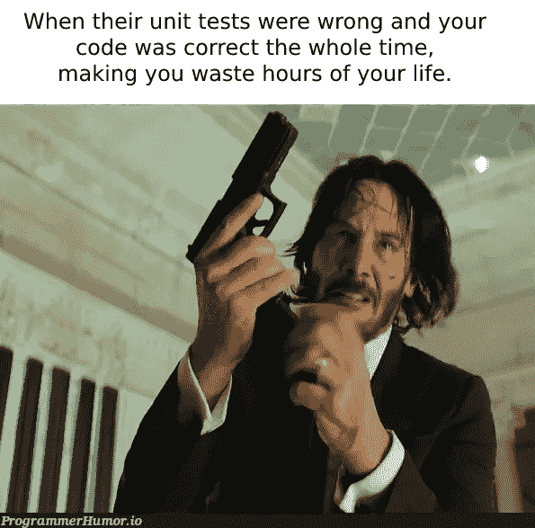

Picture Credit:[https://programmerhumor.io/](https://programmerhumor.io/)

# 真实的事实。所有的想象都不能转化为一个网站。你是哪一个？

Picture Credit:[https://programmerhumor.io/](https://programmerhumor.io/)

# 最后，两者得出相同的结果...英雄联盟

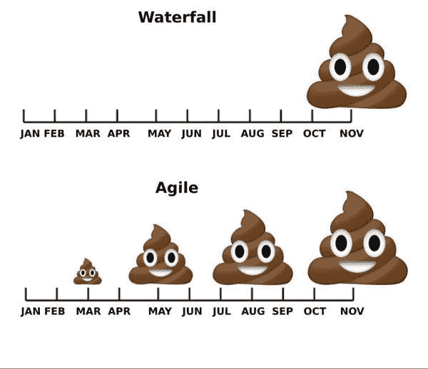

Picture Credit:[https://www.facebook.com/yuva.krishna.memes](https://www.facebook.com/yuva.krishna.memes)

# 世界上有这样隐藏的天使…

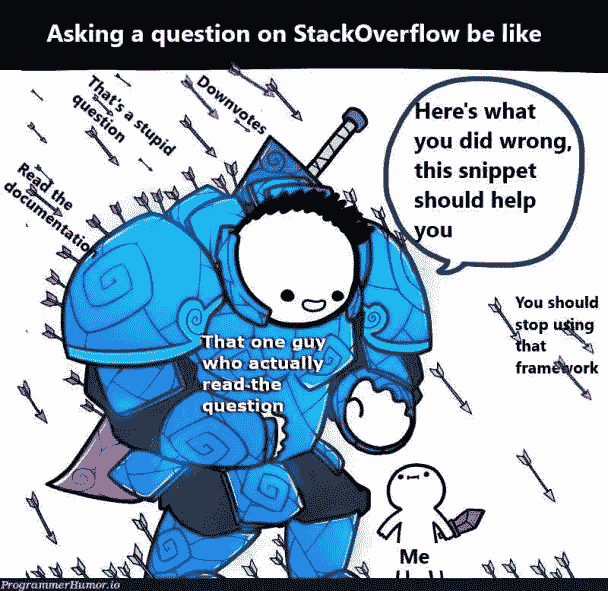

Picture Credit:[https://programmerhumor.io/page/6/](https://programmerhumor.io/page/6/)

# 奖励迷因:

# 测试您自己的应用程序…

[https://programmerhumor.io/programming-memes/testing-your-own-chatbot-like/](https://programmerhumor.io/programming-memes/testing-your-own-chatbot-like/)

**来源:**[https://programmerhumor.io/](https://programmerhumor.io/programming-memes/testing-your-own-chatbot-like/)

# 大多数冷静的人…

[https://programmerhumor.io/programming-memes/the-lag-is-real/](https://programmerhumor.io/programming-memes/the-lag-is-real/)

**来源:**[https://programmerhumor.io/](https://programmerhumor.io/programming-memes/testing-your-own-chatbot-like/)

# 你是不是按了两次才确定？

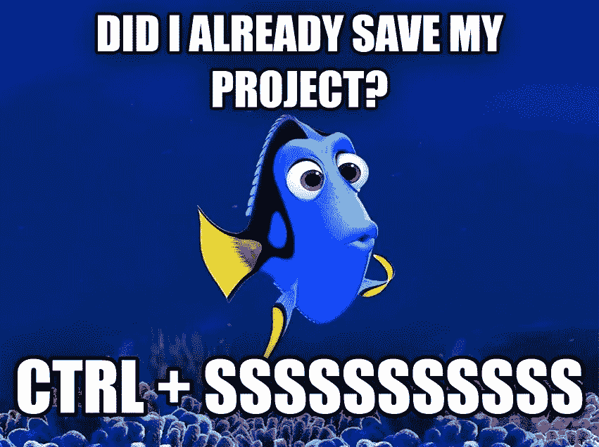

[https://www.reddit.com/r/ProgrammerHumor/comments/pf1hgl/keys_go_brrrrrr/](https://www.reddit.com/r/ProgrammerHumor/comments/pf1hgl/keys_go_brrrrrr/)

**来源:**[https://www.reddit.com/r/ProgrammerHumor/](https://www.reddit.com/r/ProgrammerHumor/comments/pf1hgl/keys_go_brrrrrr/)

# 代码重用…

[https://www.monkeyuser.com/2018/code-reuse/?sc=true&dir=random](https://www.monkeyuser.com/2018/code-reuse/?sc=true&dir=random)

**来源:**[https://www.monkeyuser.com/](https://www.monkeyuser.com/2018/code-reuse/?sc=true&dir=random)

# 有人经历过这种转变吗？

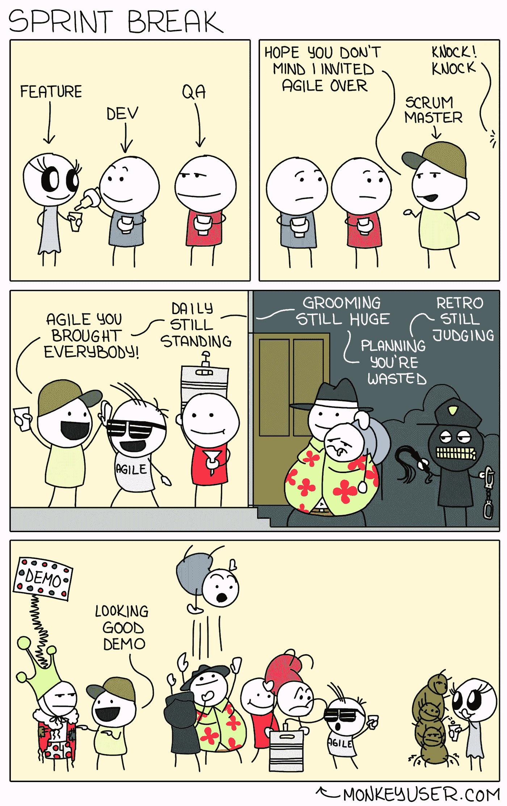

[https://www.monkeyuser.com/2018/sprint-break/?sc=true&dir=random](https://www.monkeyuser.com/2018/sprint-break/?sc=true&dir=random)

**来源:**[https://www.monkeyuser.com/](https://www.monkeyuser.com/2018/sprint-break/?sc=true&dir=random)

# 当开发人员错过时，意味着没有适当的单元测试。当 QA 错过时…

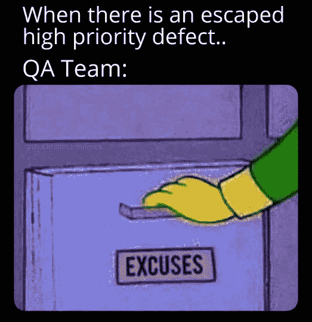

[https://www.facebook.com/yuva.krishna.memes](https://www.facebook.com/yuva.krishna.memes)

# 这种感觉…

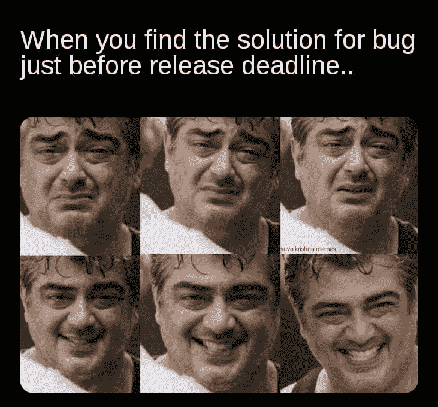

[https://www.facebook.com/yuva.krishna.memes](https://www.facebook.com/yuva.krishna.memes)

# 好建议…

[https://www.facebook.com/yuva.krishna.memes](https://www.facebook.com/yuva.krishna.memes)

# 希望这个梦想成真…

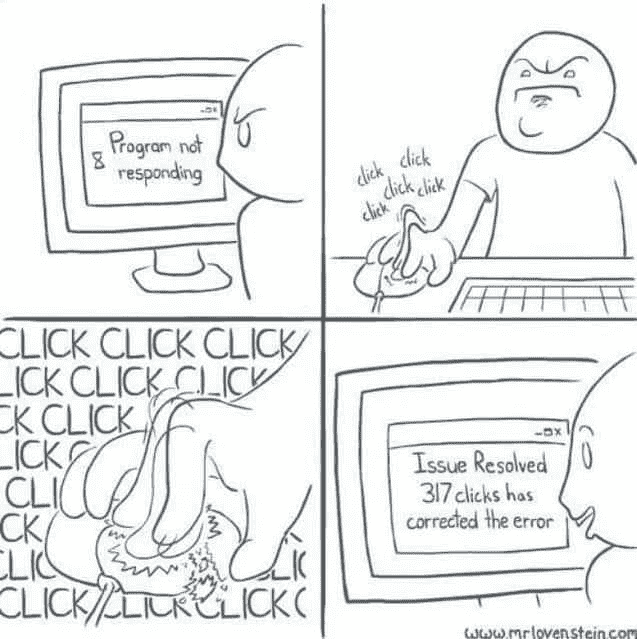

[https://www.facebook.com/yuva.krishna.memes](https://www.facebook.com/yuva.krishna.memes)

# 这是谁写的？我们来玩一个指责游戏吧… LOL

[https://www.facebook.com/yuva.krishna.memes](https://www.facebook.com/yuva.krishna.memes)

# 让我们有一个 PJ…

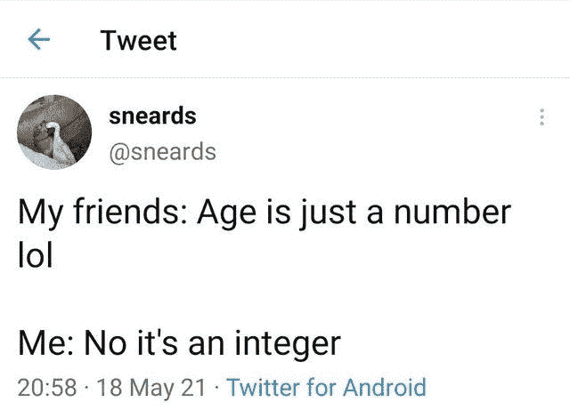

[https://www.reddit.com/r/ProgrammerHumor/](https://www.reddit.com/r/ProgrammerHumor/)

# 希望你笑得很开心，希望这一天带给你更多的微笑！

*更多内容请看*[***plain English . io***](https://plainenglish.io/)*。报名参加我们的* [***免费周报***](http://newsletter.plainenglish.io/) *。关注我们关于*[***Twitter***](https://twitter.com/inPlainEngHQ)*和*[***LinkedIn***](https://www.linkedin.com/company/inplainenglish/)*。查看我们的* [***社区不和谐***](https://discord.gg/GtDtUAvyhW) *加入我们的* [***人才集体***](https://inplainenglish.pallet.com/talent/welcome) *。*