# 与程序员生活相关的模因

> 原文：<https://javascript.plainenglish.io/memes-that-relate-to-a-programmers-life-33a891328095?source=collection_archive---------6----------------------->

## 人人喜爱的编程笑话汇编

Photo by [Edward Cisneros](https://unsplash.com/@everythingcaptured?utm_source=medium&utm_medium=referral) on [Unsplash](https://unsplash.com?utm_source=medium&utm_medium=referral)

新的一年，新的开始。作为你的微笑专家，我又想出了一篇文章，汇集了我在社交媒体上发现的流行节目笑话。

这些笑话的用意是让你发笑，纠正你的情绪。因为:

# “笑声是人机最好的刷新按钮”

让我们沉浸在笑声中…

# 永远不要承诺…

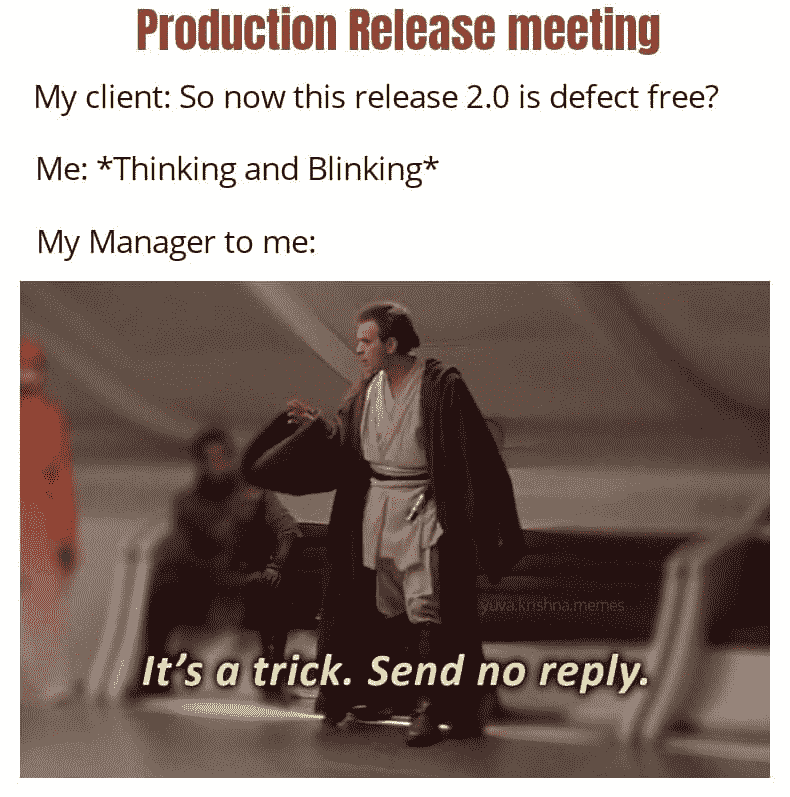

Picture Credit: [https://www.facebook.com/yuva.krishna.memes](https://www.facebook.com/yuva.krishna.memes)

# 为什么集成测试很重要？

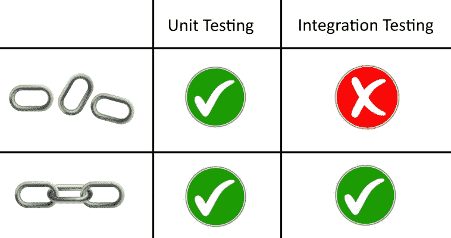

Picture Credit: [https://programmerhumor.io/programming-memes](https://programmerhumor.io/programming-memes)

# 小戴夫的反应赢得了人心…

Picture Credit: [https://www.facebook.com/yuva.krishna.memes](https://www.facebook.com/yuva.krishna.memes)

# 有意义的提交消息的定义是什么？

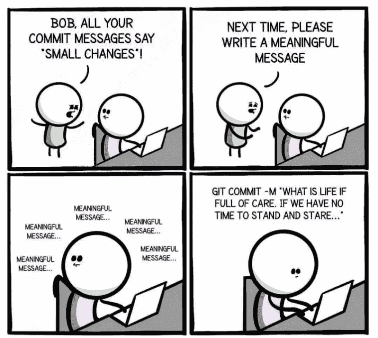

Picture Credit: [https://programmerhumor.io/programming-memes](https://programmerhumor.io/programming-memes)

# 当我有机会从头开始做项目时…

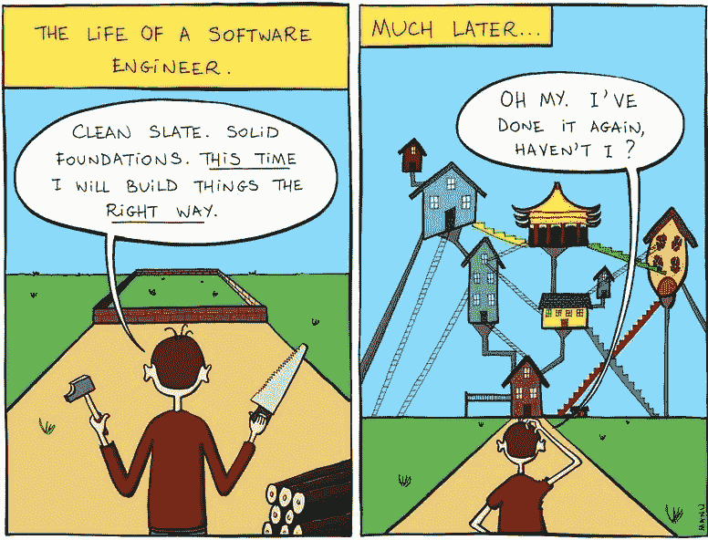

Picture Credit: [https://www.facebook.com/javascript.shitposting](https://www.facebook.com/javascript.shitposting)

# 想法与实施…

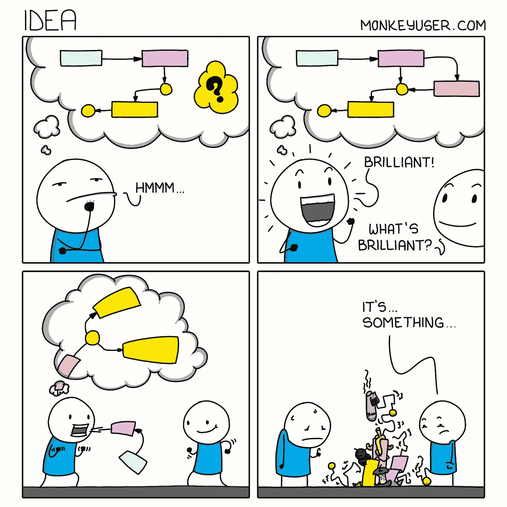

Picture Credit:[https://www.monkeyuser.com/](https://www.monkeyuser.com/)

# 当虫子试图在下午 5 点前抓住你时…

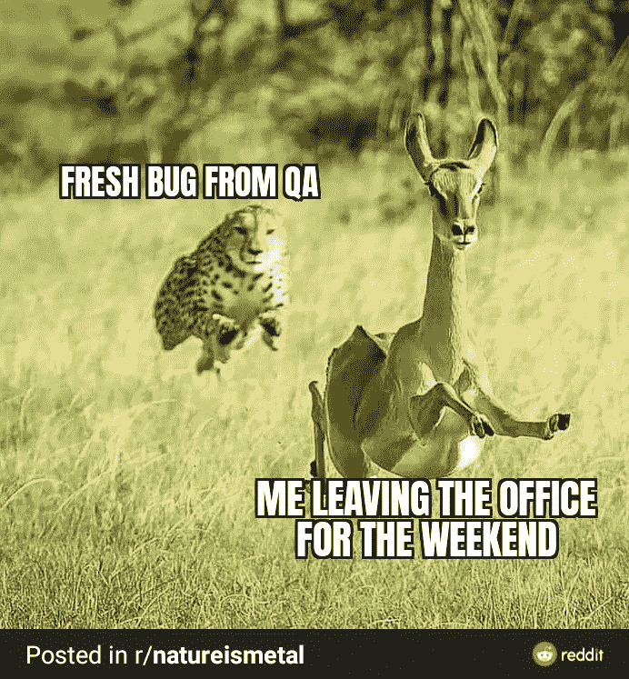

Picture credit: [https://programmerhumor.io/programming-memes](https://programmerhumor.io/programming-memes)

# 特写完成了吗…很抱歉你错过了很多还没完成的事情

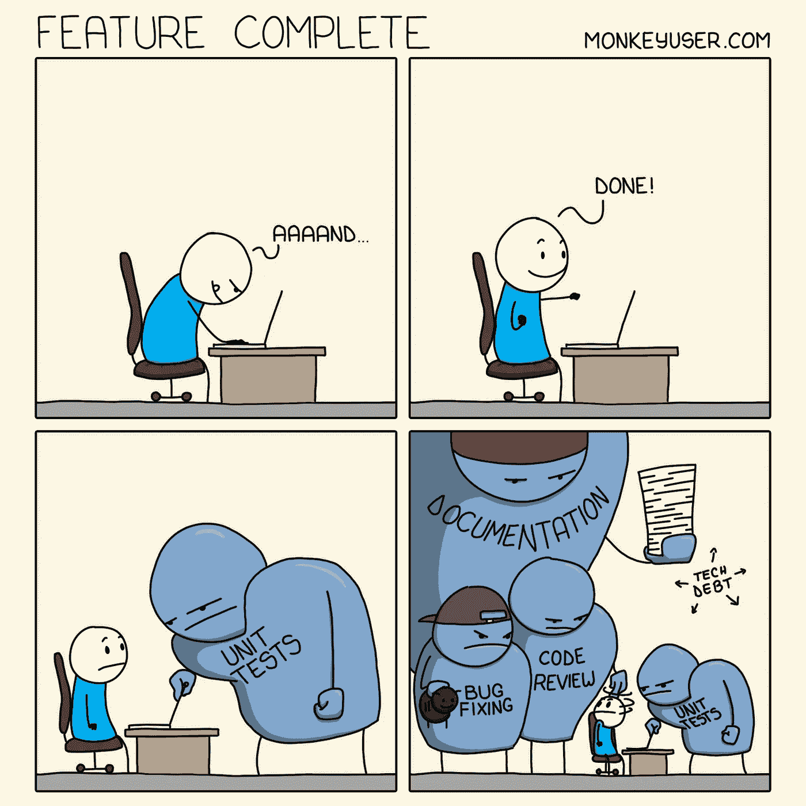

Picture Credit:[https://www.monkeyuser.com/](https://www.monkeyuser.com/)

# 当我有幸运的日子…

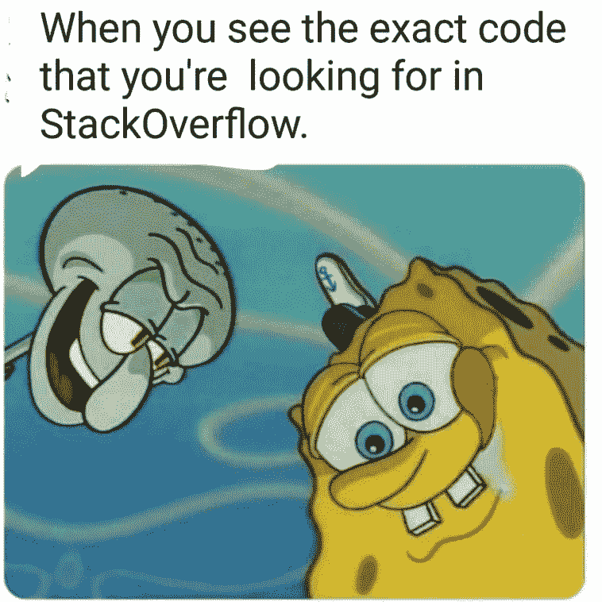

Picture Credit:[https://programmerhumor.io/programming-memes](https://programmerhumor.io/programming-memes)

# 我人生的挑战…

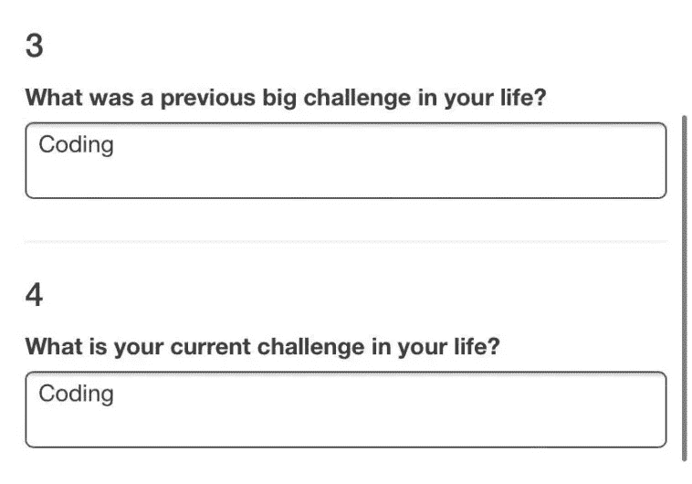

Picture Credit: [https://programmerhumor.io/programming-memes](https://programmerhumor.io/programming-memes)

# 哪个答案适合你？

Picture Credit:[https://programmerhumor.io/programming-memes](https://programmerhumor.io/programming-memes)

# 奖金

# 他们嫉妒我的幸福

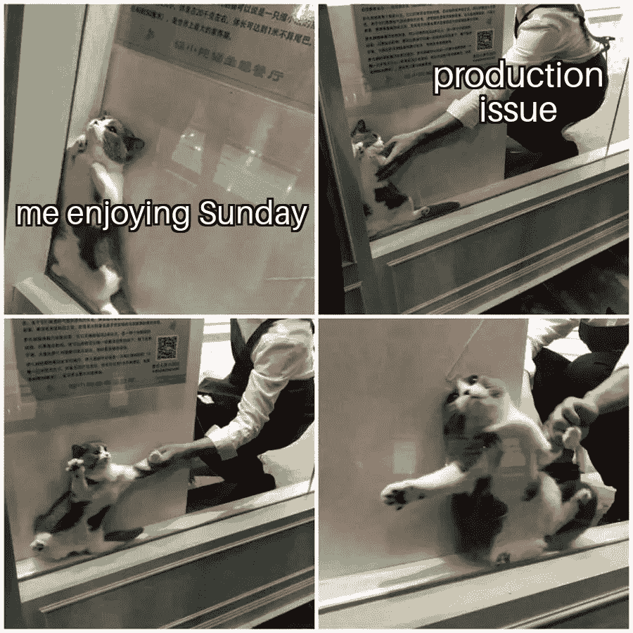

[https://www.reddit.com/r/ProgrammerHumor/comments/oiiwi3/there_goes_away_one_more_sunday/](https://www.reddit.com/r/ProgrammerHumor/comments/oiiwi3/there_goes_away_one_more_sunday/)

# 不正确，但是让我们想想…

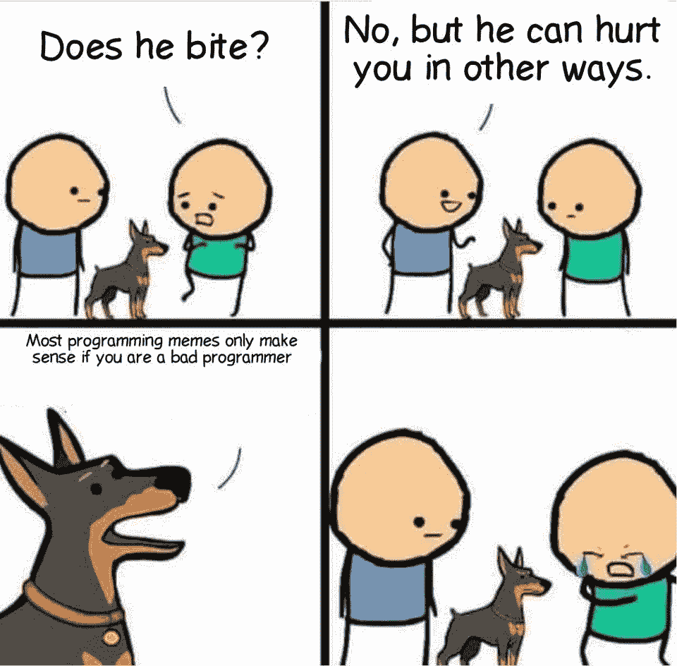

[https://www.reddit.com/r/ProgrammerHumor/comments/oinxee/the_truth_can_hurt_sometimes/](https://www.reddit.com/r/ProgrammerHumor/comments/oinxee/the_truth_can_hurt_sometimes/)

# 我到底做了什么来解决这个问题…也许什么也没做…

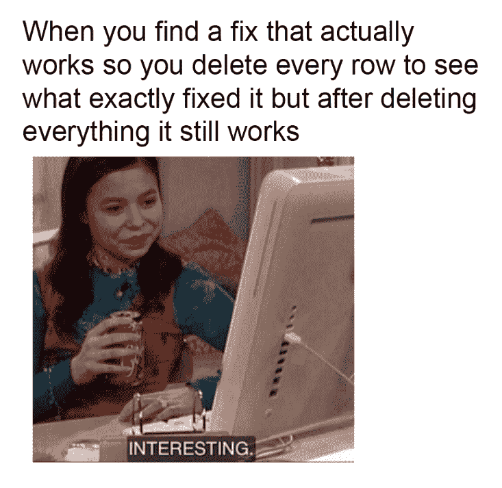

[https://www.reddit.com/r/ProgrammerHumor/comments/oimbw6/things_that_magically_work_but_you_dont_know_why/](https://www.reddit.com/r/ProgrammerHumor/comments/oimbw6/things_that_magically_work_but_you_dont_know_why/)

# 你需要学习交易…来处理 API

[https://www.reddit.com/r/ProgrammerHumor/comments/ohh9nv/200_ok/](https://www.reddit.com/r/ProgrammerHumor/comments/ohh9nv/200_ok/)

# 还有谁会因为认为警告有助于节省时间而忽视警告呢？

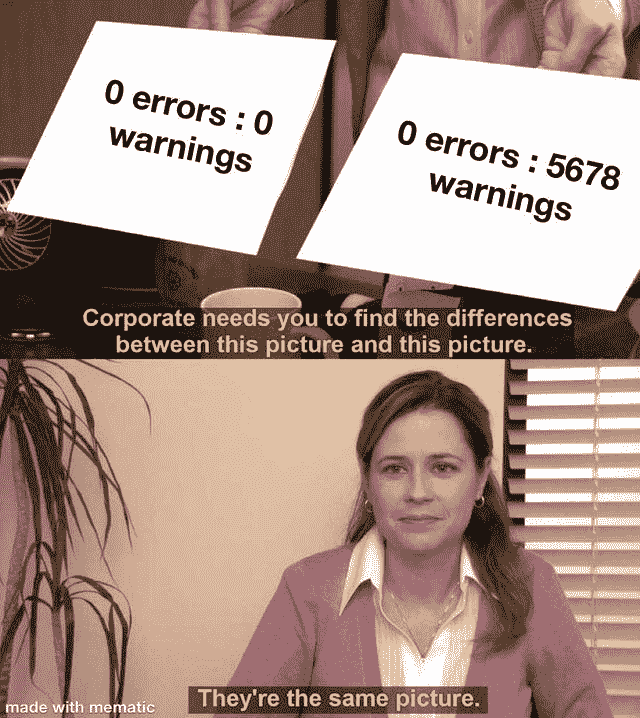

[https://www.reddit.com/r/ProgrammerHumor/comments/ofeexz/inner_peace/](https://www.reddit.com/r/ProgrammerHumor/comments/ofeexz/inner_peace/)

# 单元测试意味着增加覆盖率……(有时)

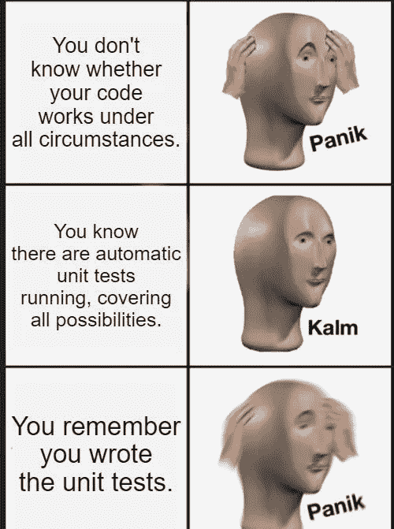

[https://www.reddit.com/r/ProgrammerHumor/](https://www.reddit.com/r/ProgrammerHumor/)

# 人工智能出错

[https://www.reddit.com/r/ProgrammerHumor/comments/ojf2eu/ai/](https://www.reddit.com/r/ProgrammerHumor/comments/ojf2eu/ai/)

# 重新编译…我怎么总是忘记？

[https://www.reddit.com/r/ProgrammerHumor/comments/ojdicf/it_happened_more_than_once/](https://www.reddit.com/r/ProgrammerHumor/comments/ojdicf/it_happened_more_than_once/)

# 一些噩梦…还是现实？

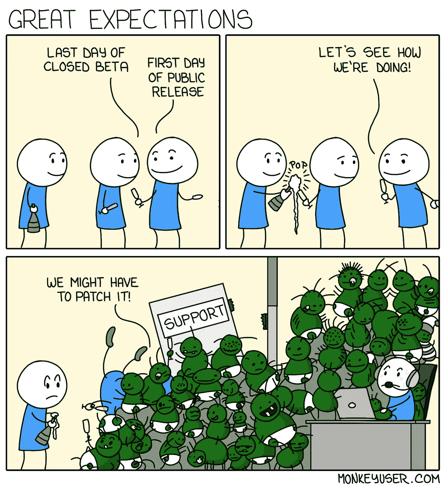

[https://www.monkeyuser.com/2019/great-expectations/?sc=true&dir=random](https://www.monkeyuser.com/2019/great-expectations/?sc=true&dir=random)

# 你最喜欢哪一个？我以前有一个新的文件夹系列…

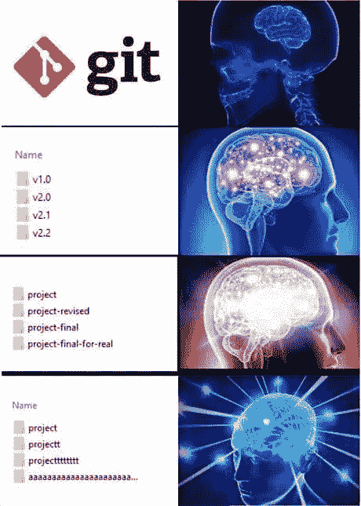

[https://www.reddit.com/r/ProgrammerHumor/comments/ojxtdg/git/](https://www.reddit.com/r/ProgrammerHumor/comments/ojxtdg/git/)

# 有史以来最好的编程回复…对面可怜的人…

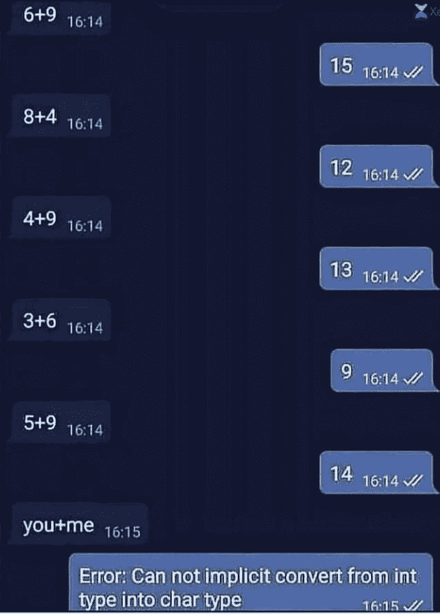

[https://www.facebook.com/photo/?fbid=1200115330452532&set=gm.2876702175930666](https://www.facebook.com/photo/?fbid=1200115330452532&set=gm.2876702175930666)

# 当我获得 Windows 更新时，我也有同样的感觉…

[https://www.facebook.com/photo?fbid=1070897396773567&set=gm.6406455706046826](https://www.facebook.com/photo?fbid=1070897396773567&set=gm.6406455706046826)

# 你是人类吗？是的，我确实注意到了一些小事…

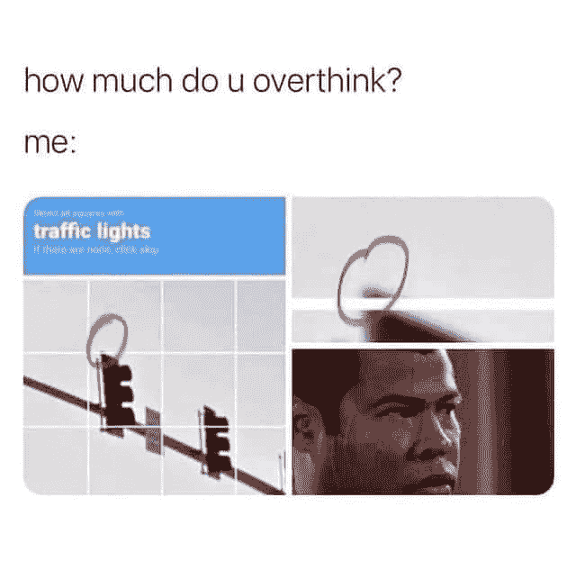

[https://www.facebook.com/BlaxkerHacker/photos/a.122991386210034/333988921776945/](https://www.facebook.com/BlaxkerHacker/photos/a.122991386210034/333988921776945/)

# 每当我被从库中看到的简单代码所吸引，一旦我开始使用它…

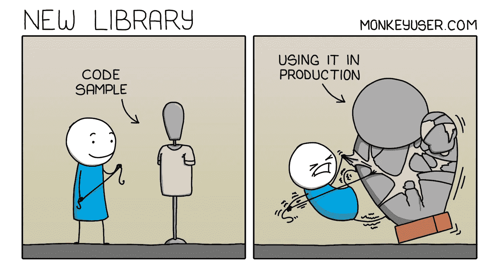

[https://www.monkeyuser.com/2021/new-library/](https://www.monkeyuser.com/2021/new-library/)

# 黑暗模式是生活…

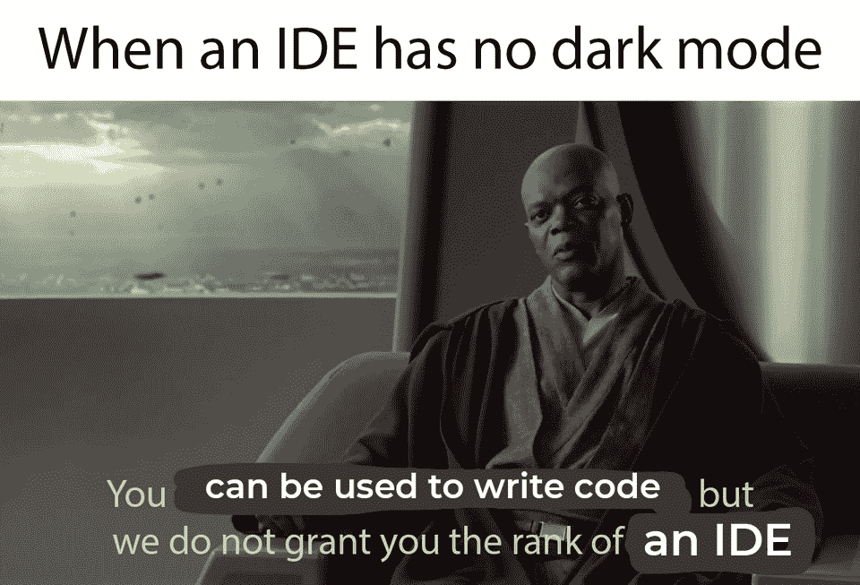

[https://www.reddit.com/r/ProgrammerHumor/comments/ojvsfq/light_attracts_bugs/](https://www.reddit.com/r/ProgrammerHumor/comments/ojvsfq/light_attracts_bugs/)

# 我绝对需要全部…

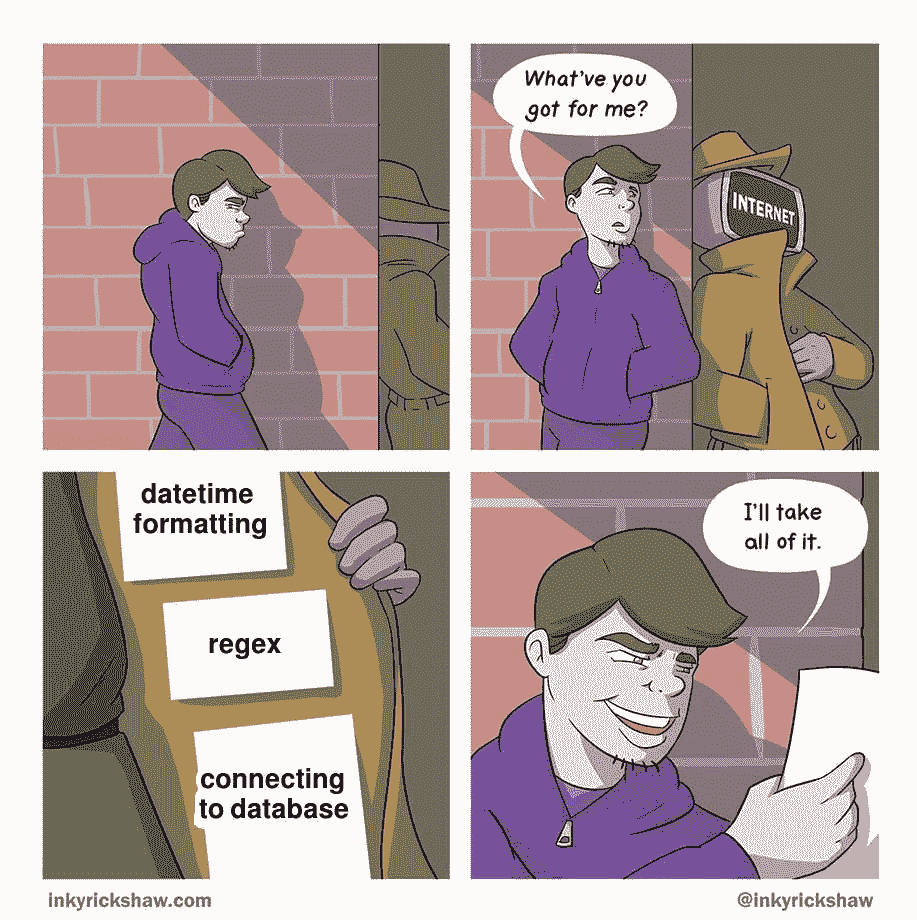

[https://twitter.com/PR0GRAMMERHUM0R/status/1415295034891591688/photo/1](https://twitter.com/PR0GRAMMERHUM0R/status/1415295034891591688/photo/1)

# JAVA 程序员就像…

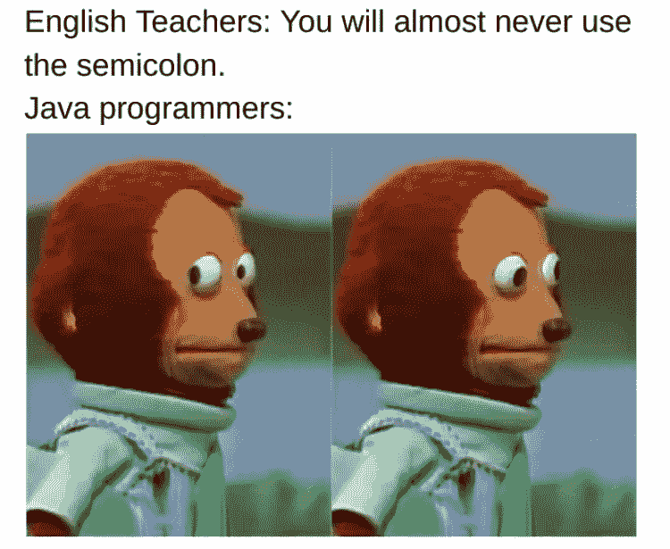

[https://programmerhumor.io/programming-memes/thats-wrong-boy/](https://programmerhumor.io/programming-memes/thats-wrong-boy/)

# 当产品负责人不理解技术依赖并提出需求时…

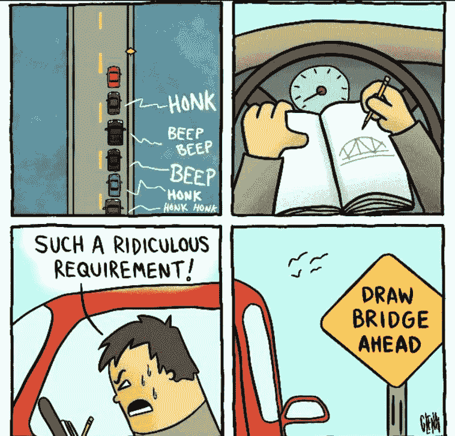

[https://programmerhumor.io/programming-memes/his-product-owner-clearly-didnt-understand-what-a-technical-dependency-was-during-spring-gooming/](https://programmerhumor.io/programming-memes/his-product-owner-clearly-didnt-understand-what-a-technical-dependency-was-during-spring-gooming/)

# 希望你喜欢它…敬请期待下一篇文章…

*更多内容请看*[***plain English . io***](http://plainenglish.io/)*。报名参加我们的* [***免费周报***](http://newsletter.plainenglish.io/) *。在我们的* [***社区***](https://discord.gg/GtDtUAvyhW) *获得独家获得写作机会和建议。*