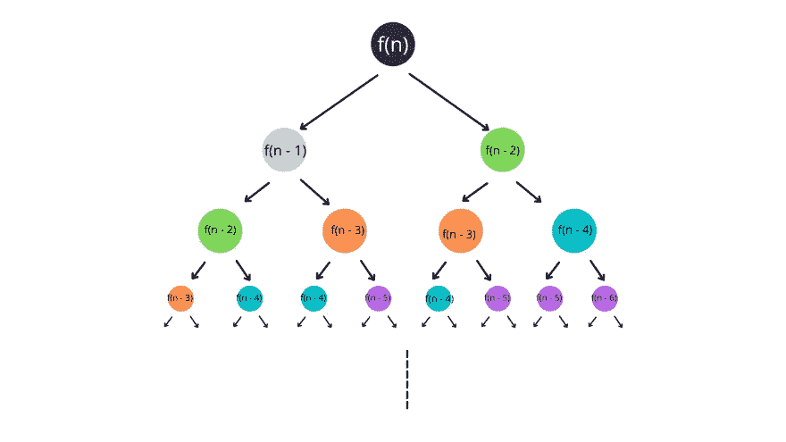
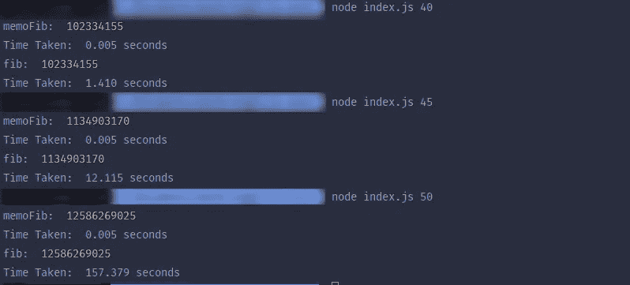

# 记忆化:是什么，为什么，如何记忆？

> 原文：<https://javascript.plainenglish.io/memoization-the-what-why-and-how-367bed44f934?source=collection_archive---------21----------------------->


# 什么是记忆化？

想象一下，我是你的数学老师，我给了你一个要解决的问题。你用了 5 分钟解决，答案是正确的。干得好！

十分钟后，我给你同样的问题。你会怎么做？

你会马上告诉我你 10 分钟前的答案，然后花 5 分钟和你喜欢的人聊天，对吗(除非你真的喜欢数学，哈哈)？

嗯，那就是给你的记忆。

> 记忆化是高速缓存昂贵的计算，所以计算机不必多次做同样的计算，因此节省了大量的时间和资源。

# 为什么我们需要记忆？

**记忆化**对于常见的子集问题最有用，在这种情况下，问题的一小部分需要计算多次才能得到最终答案。

这类问题的一个很好的例子是**斐波那契数列**，其中下一个数字是前两个数字的和。

这可以用下面的公式简化

```
fib(n) = fib(n - 1) + fib(n - 2)
```

如你所见，这个方程可以写成一个递归函数

```
// return nth number from Fibonacci series
function fib(n) {
    if (n === 0) {
        return 0
    }
    if (n === 1) {
        return 1
    }
    return fib(n - 1) + fib(n - 2)
}
```

现在让我们试试我们的代码:`node index.js <n>`


> *注意:代码运行在一个 16GB 内存的锐龙 3400G 上*

你可能会说，这看起来不错。

没那么快。让我们试试更大的数字。


我想，现在你应该明白问题出在哪里了。随着数量的增加，计算时间会成倍增长。

# 记忆有什么帮助？

在解决问题之前，我们先来看看问题是什么。



Fibonacci tree

查看上面的执行树，我们可以看到，随着我们沿着树往下走，问题越来越多地重复出现。

所以，问题是我们在多次做同样的计算。

解决方案:*缓存计算*或**记忆**

让我们把同一个`fib`变成记忆函数`memoFib`。

这样做其实很简单，我们只需要引入一个缓存。

```
const cache = {}

function memoFib(n) {
    if (cache[n]) return cache[n]
    if (n === 0) {
        return 0
    }
    if (n === 1) {
        return 1
    }
    cache[n] = memoFib(n - 1) + memoFib(n - 2)
    return cache[n]
}
```

判决时间:



我们有一个明确的赢家！所有这些计算花费了几乎不变的时间。而`fib`则发疯了。

因此，记忆的重要性是显而易见的。

# 我该怎么回忆？

好吧，如果你已经写了一段时间的代码，你一定已经以这样或那样的方式完成了。

最简单的方法是使用类似字典的结构缓存函数调用，例如 JavaScript 中的映射或对象。

如果你是一名 React 开发人员，你可能会遇到像`useMemo`或`useCallback`这样的钩子。这两个钩子都是记忆化的实现。

这些钩子会记住返回值，因此不会在 React 组件的每次渲染中计算该值。因此，让你的应用程序更快。

你可以在这里阅读更多关于他们的信息。

暂时就这样了。希望这篇文章对你有帮助！如果您有任何反馈或问题，请随时在下面的评论中提出。我很想听听他们的想法并为之努力。

更多此类内容，请在[推特](https://twitter.com/sun_anshuman)上关注我

*下次见。*


*原载于 2022 年 2 月 28 日*[*https://theanshuman . dev*](https://theanshuman.dev/articles/memoization-the-what-why-and-how-3ccn)*。*

*更多内容看* [***说白了就是***](https://plainenglish.io/) *。报名参加我们的* [***免费周报***](http://newsletter.plainenglish.io/) *。关注我们* [***推特***](https://twitter.com/inPlainEngHQ) *和*[***LinkedIn***](https://www.linkedin.com/company/inplainenglish/)*。加入我们的* [***社区不和谐***](https://discord.gg/GtDtUAvyhW) *。*