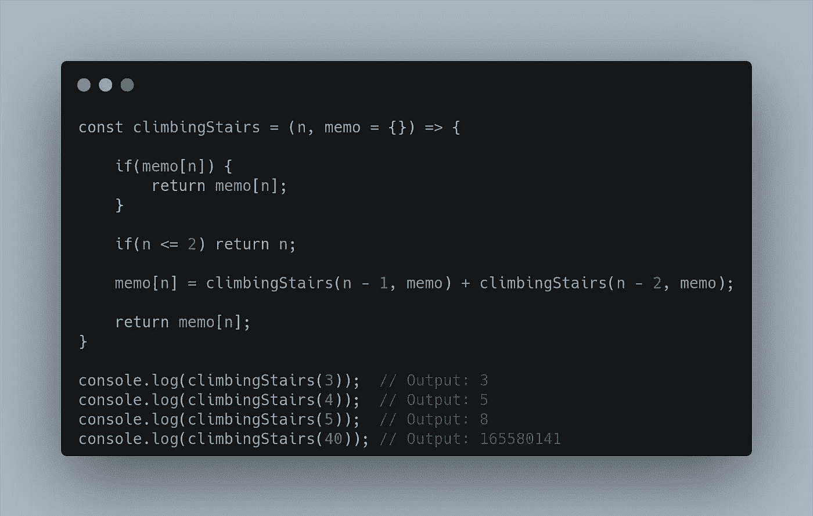
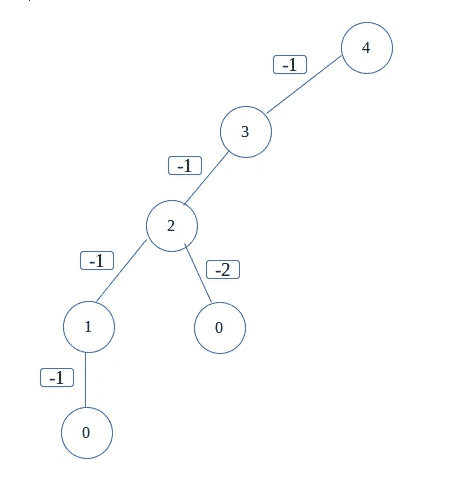

# 记忆化 vs 制表——如何用 JavaScript 实现动态编程？

> 原文：<https://javascript.plainenglish.io/memoization-vs-tabulation-how-to-implement-dynamic-programming-in-javascript-part-1-e8afce548219?source=collection_archive---------5----------------------->

## 第 1 部分:探索用 JavaScript 实现动态编程的记忆方法。

Photo by [Chris Ried](https://unsplash.com/@cdr6934?utm_source=medium&utm_medium=referral) on [Unsplash](https://unsplash.com?utm_source=medium&utm_medium=referral)

动态规划可以定义为使用优化方法解决问题的规划。

## 什么是优化方法？

一种在短时间内为我们提供产出而不浪费大量资源的方法。

## 示例:

让我先给你举一个普通的例子。假设我们必须从一个源头到达目的地。我们旅行了，花了 20 分钟从 A 点到达 B 点，这并不一定意味着我们走了最短的路或通过了最快的媒介。如果我们这样做了，我们可以在 10 分钟甚至更短的时间内到达目的地。这种在尽可能短的时间内到达目的地的更好选择可以被定义为编程方面的优化解决方案。

优秀开发人员的一个例子是，他/她总是在寻找问题的更优化的解决方案

当然，总会有比你更好的解决方案，但这并不意味着我们必须停止自己的工作。

## 记忆和制表在这一切中扮演什么角色？

这两者都是解决任何问题的不同优化方法。

不浪费任何时间，让我们进入代码。我有一个问题。让我们检查一下。

如问题所述，我们可以爬 **1** 或 **2** 级台阶到达目的地。让我们颠倒一下场景，想象我们正站在楼梯 **4** 处。从这个楼梯开始，我们可以通过 **1** 或 **2** 台阶向下，直到我们到达底部的 **0** 处，这里已经没有楼梯了。我们可以用一棵树来画这个。

我已经用树可视化了这个问题及其解决方案。从上面我们可以看到，我们可以通过 **1** 或 **2** 下降，直到我们到达基本情况，即 **0** 。我们现在可以为上述内容编写代码。

正如你在上面看到的，对于像 **40、**这样的大数字，系统输出时间太长，有时甚至会死机。为什么会这样？让我们再次检查我在上面画的树。

这里，系统将计算所有这些圈出的计算，尽管事实上它们是重复的。随着数字变得越来越大，这增加了时间。我们希望以某种方式计算出一个不重复的计算，然后将它存储在某个表中，我们可以在以后检索它的值。

我们将使用**散列表**来实现这个，这个过程将被称为**记忆化**。在 JavaScript 中，我们可以使用**对象**数据类型来存储键值数据。其他语言可以参考**哈希表**上的语言文档。

我们将把值存储在一个散列表中，然后每当我们得到一个重复的值时就从表中检索它们。

新优化代码的树将变成这样。

我们将存储 **2、3、**等的值。，，然后在我们再次需要它们的时候从**散列表**中使用它们。这导致更快的计算和优化的解决方案，因为我们不必再次计算重复的值。

我将在下一篇文章中使用**列表**来讨论相同解决方案的实现。

## 编码快乐！:)

*更多内容请看* [***说白了就是***](https://plainenglish.io/) *。报名参加我们的* [***免费每周简讯***](http://newsletter.plainenglish.io/) *。关注我们* [***推特***](https://twitter.com/inPlainEngHQ) *和*[***LinkedIn***](https://www.linkedin.com/company/inplainenglish/)*。加入我们的* [***社区不和谐***](https://discord.gg/GtDtUAvyhW) *。*