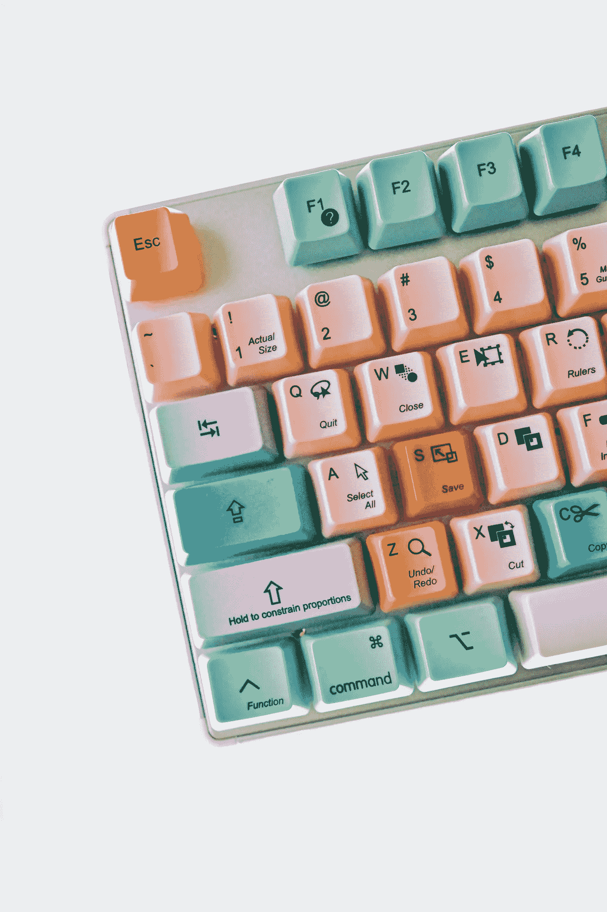
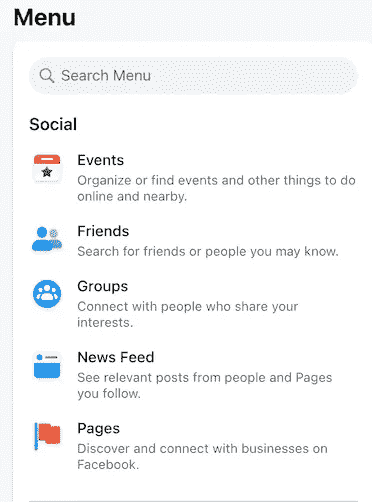
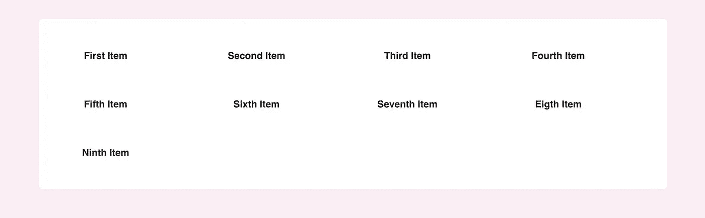
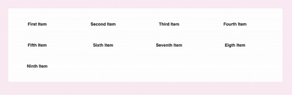
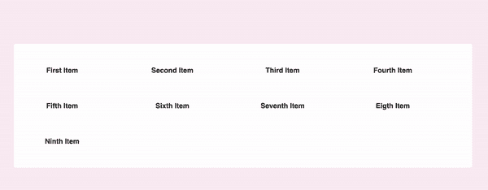
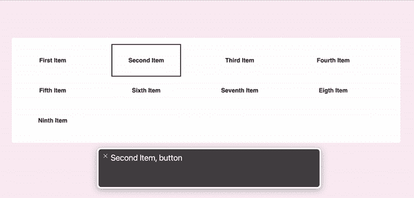

# 菜单导航可访问性

> 原文：<https://javascript.plainenglish.io/menu-navigation-accessibility-7761b114b2dd?source=collection_archive---------10----------------------->

## 创建与键盘兼容的自定义菜单

Photo by [Girl with red hat](https://unsplash.com/@girlwithredhat?utm_source=unsplash&utm_medium=referral&utm_content=creditCopyText) on [Unsplash](https://unsplash.com/s/photos/keyboard?utm_source=unsplash&utm_medium=referral&utm_content=creditCopyText)

# 什么是键盘兼容菜单？

根据 Web Accessibility Initiative(Web Accessibility Initiative)的说法，键盘兼容性意味着“所有功能都必须可以使用键盘”。在我们的例子中，一个兼容键盘的菜单应该允许通过键盘和正确的画外音帮助在项目间导航和点击它们。

例如，让我们看看脸书菜单的一部分—

这个菜单有自定义的项目，这些项目不会呈现为`button`或`link`元素。任何使用键盘的人都希望能够使用 Tab 键浏览不同的选项，并使用 Enter 键选择特定的项目。我们还希望画外音程序能够识别每个菜单项都是可点击的。

事实证明，这种行为不能想当然。那么，我们如何让它发挥作用呢？

对于以下所有示例，我们将使用这个用 React 构建的自定义菜单:

# 标签索引

每个 HTML 元素都有一个`tabIndex`属性，这允许它获得焦点。当`tabIndex`设置为 0 或正数时，可以使用 Tab 键进行导航。交互元素(按钮、链接等。)已经有了允许它们导航的内置行为，但是通常不交互的元素(`div` s)没有。因此，当菜单项呈现在`div`元素中时，它们不会自动呈现为页面跳转顺序的一部分。

因此，在我们的例子中，我们将把`tabIndex=0`添加到我们的定制项目中:

使用`:focus`选择器可以定制菜单项聚焦时的外观:

一旦项目是可聚焦的，它将获得默认的浏览器焦点行为，在大多数浏览器中是蓝色轮廓。在这里，我选择改变这一点，以粉红色的轮廓。(补充说明——使用`outline`而不是`border`,因为边框会占用空间，会让你的项目跳跃)。

所以我们目前的情况是这样的:

# 按下以点击

接下来，我们希望能够使用 Enter 键选择一个菜单项，这相当于使用鼠标单击。我们需要为`onKeyPress`添加一个回调，并检查收到的`event`以确保 Enter 键被按下。在我们的例子中，我选择了在项目被点击时显示一个祝酒词。

所以我们现在看到的是这样的—

# 画外音

最后，我们希望使用画外音助手的用户可以访问我们的菜单，以便在屏幕上导航。我们为一个`div`元素添加了导航和点击功能，但是画外音不知道这一点——它看到的是一个`div`而不是一个按钮，所以它没有告诉用户这个元素是可点击的。

为了解决这个问题，我们需要做两件事——指定这个元素的行为像一个按钮，并处理用户的点击(这不是普通的点击，而是一个特定的按钮序列)。

对于第一个问题，我们可以将`role="button"`添加到我们的元素中。
对于第二个问题，我们将为`click`事件添加一个特定的事件处理程序。所以最后，我们的`Item`组件将看起来像这样:

并将按预期方式运行:

# 包裹

网页可访问性非常重要，我们的设计或编码决策如何影响我们网站的可访问性并不总是显而易见的。希望这篇教程对你有帮助！

*更多内容看* [***说白了就是 io***](https://plainenglish.io/) *。报名参加我们的* [***免费周报***](http://newsletter.plainenglish.io/) *。关注我们关于*[***Twitter***](https://twitter.com/inPlainEngHQ)*和*[***LinkedIn***](https://www.linkedin.com/company/inplainenglish/)*。加入我们的* [***社区***](https://discord.gg/GtDtUAvyhW) *。*