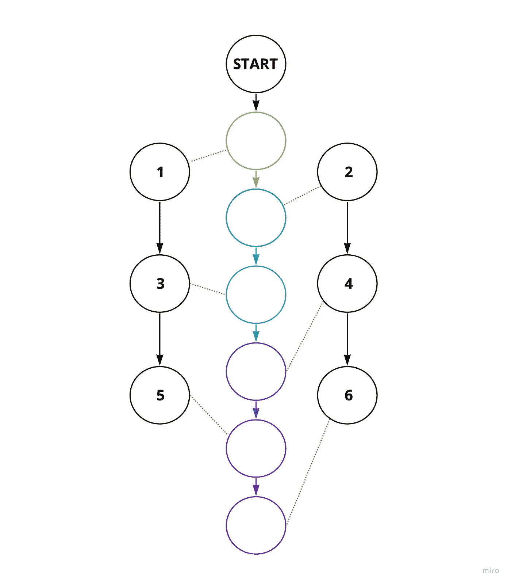
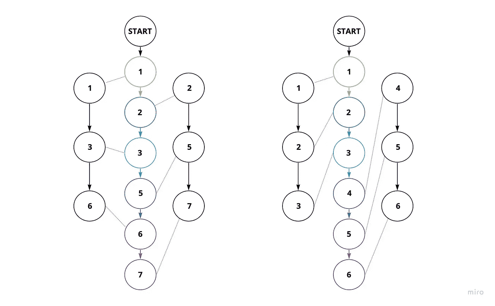
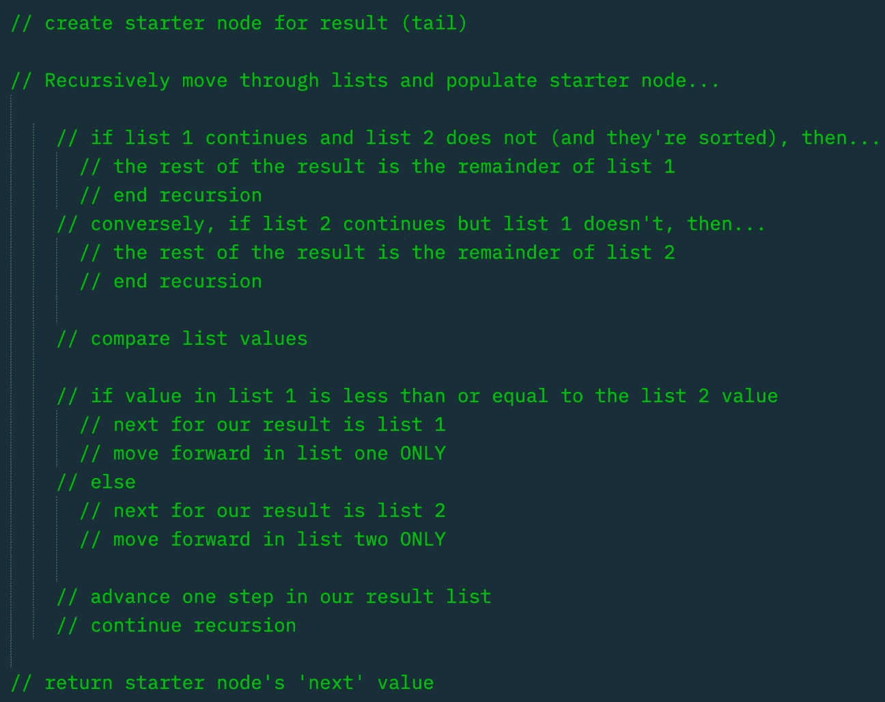

# 在 JavaScript 中合并两个排序的链表

> 原文：<https://javascript.plainenglish.io/merge-two-sorted-linked-lists-3431ab9a778f?source=collection_archive---------5----------------------->

## 如何在 JavaScript 中合并两个排序链表(LeetCode Challenge)。

这将是一个简单易懂的递归方法来合并两个排序链表。虽然 LeetCode 把这个问题归类为容易，但实际上我发现它比他们的一些中级挑战更有挑战性。

由于对数据结构比较陌生，我对链表的看法是: ***它们很奇怪。***

作为如此简单的结构，在它们被图形化地描绘和它们实际嵌套的自我之间有一种违反直觉的脱节。

## ***想通了***

一句话:

我需要在两个列表中移动，比较值，并将它们拼接成一个结果列表。

我想到的第一个挑战是，如果列表是两个不同的长度会怎么样？或者一个中的值都小于另一个中的值？基本上，我应该如何处理不均匀遍历？

下面是两种潜在情况的示意图。一个可能看起来不如另一个直观:

在左边的场景中，这似乎是以平衡/交替的方式进行的。几乎就像两个列表被“压缩”成一个列表。

在右边的场景中，一个列表完全在另一个之前。这也是对我来说最具挑战性的部分——不平坦的遍历。

首先是伪代码:

您会注意到两个主要的条件块。

最上面的程序块正在检查我们是否到达了列表的末尾。如果我们有，那么这意味着结果的余数必须是列表的余数。

底部的块比较每个列表的当前节点中的值。将较小的一个加到结果中。我只会在这个列表上更进一步。我这样做只是因为这种认识让整个过程对我来说变得更加直观。

这是代码:

*瞧！*

我们的两个列表已经按照期望的顺序编织在一起。

*更多内容请看*[***plain English . io***](https://plainenglish.io/)*。报名参加我们的* [***免费周报***](http://newsletter.plainenglish.io/) *。关注我们关于*[***Twitter***](https://twitter.com/inPlainEngHQ)*和*[***LinkedIn***](https://www.linkedin.com/company/inplainenglish/)*。加入我们的* [***社区不和谐***](https://discord.gg/GtDtUAvyhW) *。*