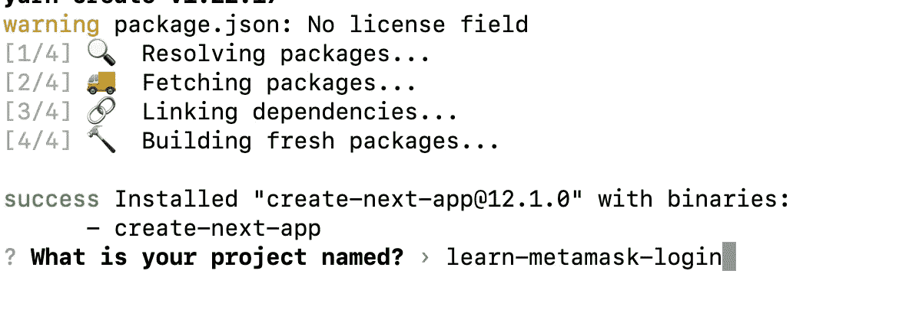
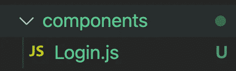
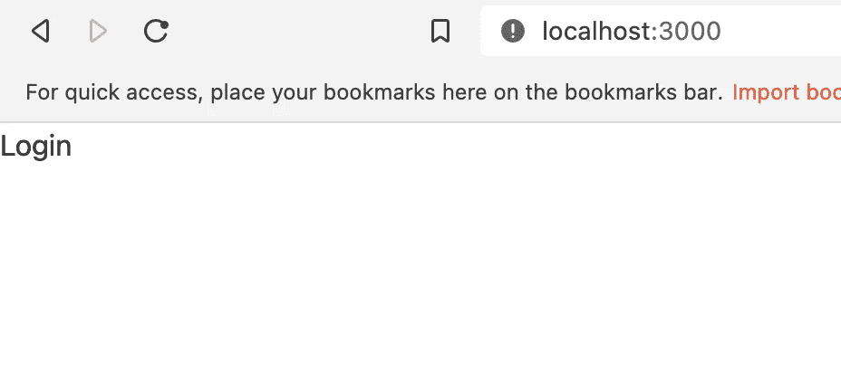
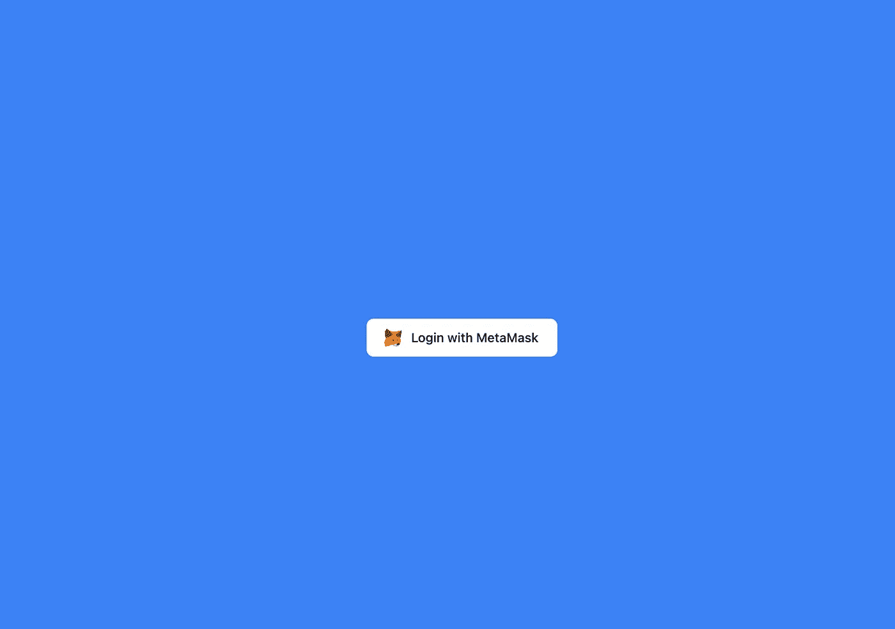

# 使用 Moralis、Next.js 和 TailwindCSS 进行元掩码身份验证

> 原文：<https://javascript.plainenglish.io/metamask-authentication-with-moralis-next-js-and-tailwindcss-part-1-create-login-component-719d3edcc463?source=collection_archive---------5----------------------->

## 第 1 部分:创建我们的 Web 3.0 应用程序的登录组件

在本文中，我们将创建一个 Next.js 应用程序，它可以使用您的元掩码钱包登录。

通过[加入 YouTube 频道](https://www.youtube.com/channel/UCu4-4FnutvSHVo9WHvq80Ww/join)，你将可以无限制地访问该频道的所有源代码，并免费学习 Udemy 课程。

首先，去终端。

```
yarn create next-app
```



键入项目名称。创建项目后，安装 TailwindCSS 包。

## 安装尾翼 CSS

要安装 TailwindCSS，我们可以遵循文档:

[](https://tailwindcss.com/docs/guides/nextjs) [## 用 Next.js - Tailwind CSS 安装 Tailwind CSS

### 顺风 CSS 框架的文档。

tailwindcss.com](https://tailwindcss.com/docs/guides/nextjs) 

键入以下命令创建配置文件:

```
npm install -D tailwindcss postcss autoprefixer
npx tailwindcss init -p
```

然后转到 tailwind.config.js 并粘贴以下内容:

```
module.exports = {
  content: [
    "./pages/**/*.{js,ts,jsx,tsx}",
    "./components/**/*.{js,ts,jsx,tsx}",
  ],
  theme: {
    extend: {},
  },
  plugins: [],
}
```

在 globals.css 中，添加以下内容:

```
[@tailwind](http://twitter.com/tailwind) base;
[@tailwind](http://twitter.com/tailwind) components;
[@tailwind](http://twitter.com/tailwind) utilities;
```

## 创建登录组件

在根文件夹中创建“组件”文件夹。在文件夹下，创建 Login.js。



```
const Login = () => {return (<div>Login</div>)}export default Login
```

然后在 index.js 中，执行以下操作:

```
import Login from '../components/Login'export default function Home() {return (<div className="grid place-items-center h-screen bg-blue-500"><Login/></div>)}
```



如果我们运行这个:

```
yarn dev
```

我们可以看到“登录”二字。

## 详述登录组件

我们用的是`h-screen bg-blue-500`，所以会让蓝色占据整个屏幕。然后我们也用`grid place-items-center`把项目放在屏幕中央。

然后从这个[顺风文档](https://flowbite.com/docs/components/buttons/)中复制 Metamask 按钮元素。

[](https://flowbite.com/docs/components/buttons/) [## 顺风 CSS 按钮- Flowbite

### 按钮组件可能是任何用户界面或网站中使用最广泛的元素，因为它可以用于…

flowbite.com](https://flowbite.com/docs/components/buttons/) 

```
const Login = () => {return (<div><button type="button" class="text-gray-900 bg-white hover:bg-gray-100 border border-gray-200 focus:ring-4 focus:ring-gray-100 font-medium rounded-lg text-sm px-5 py-2.5 text-center inline-flex items-center dark:focus:ring-gray-600 dark:bg-gray-800 dark:border-gray-700 dark:text-white dark:hover:bg-gray-700 mr-2 mb-2"><svg class="mr-2 -ml-1 w-6 h-5" viewBox="0 0 2405 2501" fill="none" .....</svg>Login with MetaMask</button></div>)}export default Login
```

现在，您应该会看到位于屏幕中央的“使用元掩码登录”按钮。



如果你喜欢这个故事，你可能也喜欢中等会员。一个月才 5 美元(一杯咖啡的价格！)但是它会在支持你最喜欢的作家的同时，给你无限的接触故事的机会。如果你用[这个链接](https://ckmobile.medium.com/membership)注册，我会赚一小笔佣金。谢谢！

*关注我们:* [*YouTube*](https://www.youtube.com/channel/UCu4-4FnutvSHVo9WHvq80Ww?sub_confirmation=1) *，*[*Medium*](https://ckmobile.medium.com/)*，*[*Udemy*](https://www.udemy.com/user/cyruschan2/)*，*[*Linkedin*](https://www.linkedin.com/company/ckmobi/)*，*[*Twitter*](https://twitter.com/ckmobilejavasc1)*，* [*Instagram*](https://www.instagram.com/ckmobile8050)

加入分支机构赚钱。

[](https://ckmobile.gumroad.com/affiliates) [## Gumroad

### 申请成为会员很容易。填写下表，让 Ckmobile 知道您将如何推广他们的…

ckmobile.gumroad.com](https://ckmobile.gumroad.com/affiliates) 

*更多内容请看*[***plain English . io***](https://plainenglish.io/)*。报名参加我们的* [***免费每周简讯***](http://newsletter.plainenglish.io/) *。关注我们关于*[***Twitter***](https://twitter.com/inPlainEngHQ)*和*[***LinkedIn***](https://www.linkedin.com/company/inplainenglish/)*。加入我们* [***社区不和谐***](https://discord.gg/GtDtUAvyhW) *。*