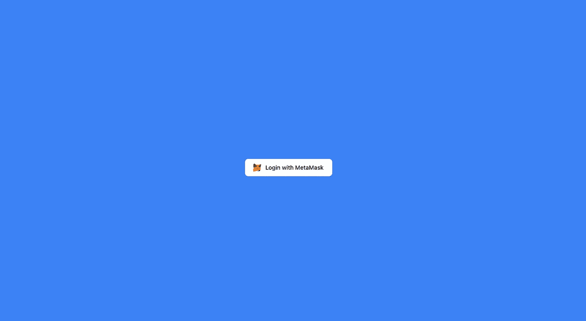

# 使用 Moralis、Next.js 和 TailwindCSS 进行元掩码身份验证

> 原文：<https://javascript.plainenglish.io/metamask-authentication-with-moralis-next-js-and-tailwindcss-part-4-protected-page-and-logout-d7bac39b5493?source=collection_archive---------7----------------------->

## 第 4 部分:如果用户已经使用 metamask 登录，如何注销并显示欢迎消息。

通过[加入频道](https://www.youtube.com/channel/UCu4-4FnutvSHVo9WHvq80Ww/join)，你将可以无限制地访问 YouTube 频道中的所有源代码，并免费学习 Udemy 课程。

在 index.js 中，导入 useMoralis

```
import { useMoralis } from 'react-moralis'
```

调用应用程序内部的钩子。

```
const { isAuthenticated, logout } = useMoralis()
```

如果“isAuthenticated”为真，我们将显示带有注销按钮的欢迎消息。

在注销按钮上添加注销功能。

如果“isAuthenticated”为假，我们将显示<login>组件。</login>

```
<div className="grid place-items-center h-screen bg-blue-500">{isAuthenticated ? (<div className='px-10 py-3 bg-white rounded-lg flex-col'><div>Welcome 😃</div><buttonclassName="bg-transparent hover:bg-blue-500 text-blue-700 font-semibold hover:text-white py-2 px-4 border border-blue-500 hover:border-transparent rounded"onClick={logout}>Logout</button></div>) : <Login />}</div>
```


Welcome message



Login component

如果你喜欢这个故事，你可能也喜欢中等会员。一个月才 5 美元(一杯咖啡的价格！)但是它会在支持你最喜欢的作家的同时，给你无限的接触故事的机会。如果你用[这个链接](https://ckmobile.medium.com/membership)注册，我会赚一小笔佣金。谢谢！

关注我们: [YouTube](https://www.youtube.com/channel/UCu4-4FnutvSHVo9WHvq80Ww?sub_confirmation=1) ， [Medium](https://ckmobile.medium.com/) ， [Udemy](https://www.udemy.com/user/cyruschan2/) ， [Linkedin](https://www.linkedin.com/company/ckmobi/) ， [Twitter](https://twitter.com/ckmobilejavasc1) ， [Instagram](https://www.instagram.com/ckmobile8050) ， [Gumroad](https://app.gumroad.com/ckmobile) ， [Quora](https://ckmobile.quora.com/) ， [Telegram](https://t.me/ckmobi) 。

加入分支机构赚钱:

[](https://ckmobile.gumroad.com/affiliates) [## Gumroad

### 申请成为会员很容易。填写下表，让 Ckmobile 知道您将如何推广他们的…

ckmobile.gumroad.com](https://ckmobile.gumroad.com/affiliates) 

*更多内容请看*[***plain English . io***](https://plainenglish.io/)*。报名参加我们的* [***免费周报***](http://newsletter.plainenglish.io/) *。关注我们关于*[***Twitter***](https://twitter.com/inPlainEngHQ)*和**[***LinkedIn***](https://www.linkedin.com/company/inplainenglish/)*。加入我们的* [***社区***](https://discord.gg/GtDtUAvyhW) *。**