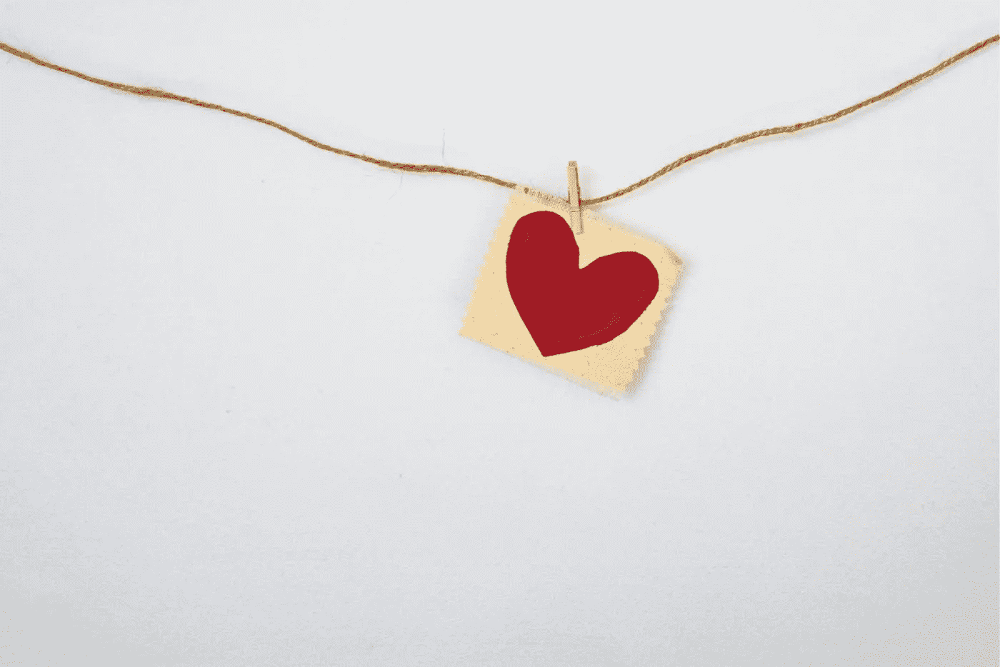
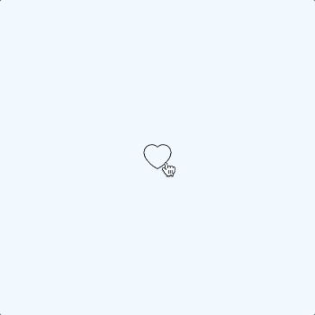
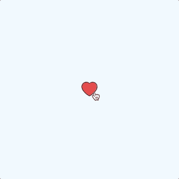

# GSAP 微缩动画:像❤️/Dislike💔

> 原文：<https://javascript.plainenglish.io/microanimations-with-gsap-like-%EF%B8%8F-dislike-a3ccb32d46ce?source=collection_archive---------11----------------------->

## 一个快速教程，帮助你使一个喜欢的图标更吸引和有趣的用户与绿袜子(又名 GSAP)。



Photo by [Debby Hudson](https://unsplash.com/@hudsoncrafted?utm_source=unsplash&utm_medium=referral&utm_content=creditCopyText) on [Unsplash](https://unsplash.com/s/photos/love?utm_source=unsplash&utm_medium=referral&utm_content=creditCopyText)

这篇文章将指导你制作一个简单而有趣的 **like 按钮**，处理第一次点击(又名***like***)和第二次点击*移除 like* (又名 **dislike)💔**)。



Like / Dislike

但是，在开始教程之前，让我快速解释一下**什么是**。

```
**Table of Contents:**1\. [Microinteractions 101](#d899)
2\. [Like / Dislike Icon with GSAP](#383a)
      2.1 [HTML](#6b78)
      2.2 [CSS](#90d1)
      2.3 [JavaScript](#e262)
3\. [Conclusion](#601b)
```

# 微互动 101

Dan Saffer，在他的书中，将微交互定义为*一个包含的产品时刻，围绕着一个* ***单一用例或任务*** ，就像*喜欢一个帖子*或*发送一封电子邮件*。

我想知道一些关于微操作的好例子来分享，然后我意识到你有一个**优秀的微操作例子** **就在这里**在 Medium 上！你有没有注意到当你为一个故事鼓掌时会发生什么？没有吗？看一看:

作为一名用户，当我在像这样的应用程序或网站上采取行动时，我喜欢收到微妙的反馈。不是吗？

哦，我感觉 2022 年微互动会成为一种趋势。随便说说。😉

# 喜欢/不喜欢带有 GSAP 的图标

现在是时候动手做一些代码了。

首先你需要一个**心脏 SVG 图标**，不过不用担心！我在 [Flaticon](https://www.flaticon.com/) 用这个来自[童话](https://www.flaticon.com/packs/fairy-tales-icons)图标包的令人惊叹的心形图标给你盖上了:

你需要:

*   一些简单的 HTML，
*   一个*CSS 的几行*，
*   …并借助[绿袜子](https://greensock.com/)(又名 ***GSAP*** )编写 JavaScript。

## 超文本标记语言

这是本教程需要的所有 HTML。

## 半铸钢ˌ钢性铸铁(Cast Semi-Steel)

而这是 **CSS** 。

只是*关于这几行代码的一些注释*:

*   **第 1–4 行**:重置浏览器默认样式，灵感来自[埃拉德谢赫特尔](https://elad.medium.com/)。建议你看看他写的关于 [CSS 重置](https://elad.medium.com/the-new-css-reset-53f41f13282e)的文章，
*   **第 6-13 行**:将`body`设置为`display: flex`以垂直和水平居中页面上的图标，
*   **第 15 行**:鼠标悬停在按钮上时将光标设置为`pointer`，
*   **第 17-20 行**:将图标调整到 32px 宽，
*   **第 22-27 行**:由于对 SVG 路径应用了 ids，所以将其中一些路径的不透明度设置为 0。
    🙋🏼‍♀️ **NB:** 这一步也可以直接在 JavaScript 文件中完成，这要感谢`gsap.set()`。

## Java Script 语言

最后，好玩的部分: **JavaScript** 和 **GSAP** ！

当用户**点击**图标时，微交互开始。

**喜欢。** 首次点击时，图标由`animations.like()`功能返回的 GSAP 时间线填充，按钮标签增加类别`.js-liked`表示点击事件发生。


Like

**不喜欢。** 用户第二次点击按钮时，由于`animations.dislike()`的作用，图标回到初始状态，类别`.js-liked`从按钮中移除。


Dislike

# 结论

很简单，对吧？🤩

我希望你喜欢这个*快速教程*并让你对微操作足够好奇，去谷歌它**并探索更多关于这个话题**。🤓

*多内容见于* [***中。注册我们的***](http://plainenglish.io/) **[***免费周报***](http://newsletter.plainenglish.io/) *。在我们的* [***社区纠纷***](https://discord.gg/GtDtUAvyhW) *中获得独家写作机会和建议。***