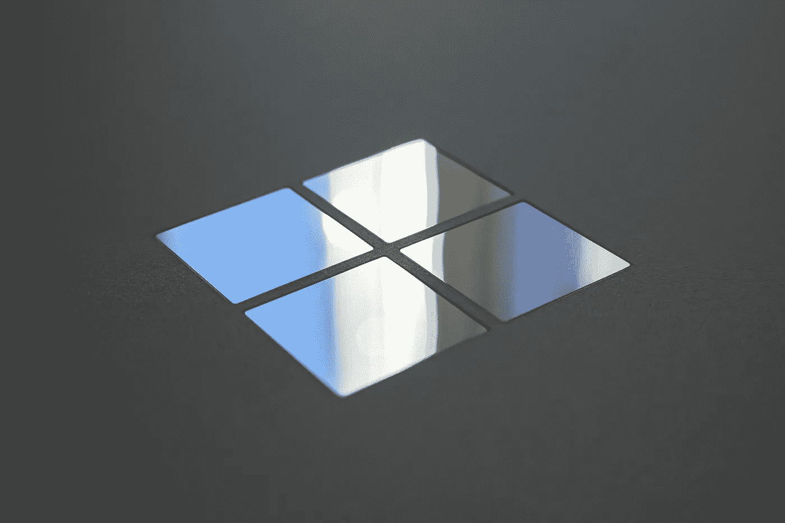

# 微软如何差点杀死 JavaScript

> 原文：<https://javascript.plainenglish.io/microsoft-almost-killed-javascript-562f4dfe1507?source=collection_archive---------2----------------------->

## 在寻求统治网络的过程中，微软曾经试图消灭 JavaScript。

Photo by [Jeremy Bezanger](https://unsplash.com/@unarchive?utm_source=unsplash&utm_medium=referral&utm_content=creditCopyText) on [Unsplash](https://unsplash.com/s/photos/microsoft?utm_source=unsplash&utm_medium=referral&utm_content=creditCopyText)

在 21 世纪初，微软的 Internet Explorer 是世界上使用最多的浏览器。它的竞争对手网景导航公司落后了好几个百分点。这两种浏览器使用类似的客户端脚本语言来增强交互性，JavaScript 和 JScript 正在为未来几十年的网络发展而斗争。

微软占据了大约 96%的市场份额，它觉得没有必要继续推进一项倡议，通过一个标准来促进 JavaScript 在各种浏览器间的普遍使用。在 1998 年导致反垄断指控并导致比尔盖茨辞职的一系列事件中，微软几乎导致了 JavaScript 的死亡。

## 这场比赛

Photo by [Jeff Griffith](https://unsplash.com/@grifjef?utm_source=unsplash&utm_medium=referral&utm_content=creditCopyText) on [Unsplash](https://unsplash.com/s/photos/horse-race?utm_source=unsplash&utm_medium=referral&utm_content=creditCopyText)

第一款带有图形用户界面的网络浏览器 Mosaic 于 1993 年发布。非技术人员也能访问，它在新生的万维网——维基百科的快速发展中发挥了突出的作用。

当 Mosaic 项目终止时，微软许可了该软件，并在其上构建了 Internet Explorer。一些从事马赛克浏览器工作的工程师成立了一家名为网景的新公司。这两家公司在争夺市场主导权的斗争中发现了对方。其后果将长期存在。

在计算机相当复杂和互动的时代，1995 年的网站是静态的，没有吸引力。从事浏览器工作的人面临的挑战是开发工具，让网页设计者更灵活地创建动态网站。

1995 年，Netscape 开始考虑静态网络问题的解决方案。他们的方法是双重的:一方面，他们与 Sun 微系统公司协商在他们的 navigator 上使用 Java 作为脚本语言。另一方面，他们雇用布伦丹·艾希为同样的目的设计一种新的语言。上层管理人员决定采用第二条路线，并在当年成功开发出了原型。

同年，微软推出了 Internet Explorer。一年后，他们发布了一个逆向工程版本的 JavaScript，名为 JScript。两种浏览器的发展差距如此之大，以至于在某种程度上，创建在不同浏览器上看起来相同的网站变得极其困难。诸如“在 Netscape 中最佳浏览”和“在 Internet Explorer 中最佳浏览”的标签在网站上变得频繁。

## 无情的围攻

到 21 世纪初，微软是明显的赢家。10 个人中有 9 个人在使用 Internet Explorer。尽管 Netscape 在 90 年代中期开始时占有相当大的份额，但在 21 世纪初，是微软占据了 96%的市场份额。微软是如何取得如此非凡的成就的？

取得这样的成就有许多原因，其中一些后来在法庭上引起了争议。首先，当网景公司在 1995 年上市时，微软已经是一家拥有大量资金的上市公司。1996 年的某个时候，微软的市值是网景公司的 10 倍。

代表微软的两个重要举措极大地改变了棋盘的位置。一个是当微软决定将 Windows 的每一个版本与 Internet Explorer 的安装捆绑在一起。第二，不仅允许 Windows 用户免费使用浏览器，也允许苹果麦金塔电脑用户免费使用。

当时网景公司的首席执行官吉姆·巴克斯代尔说“在战争中，小股力量压倒大股力量的情况很少发生……”。事实证明，他们为生存而斗争是常态，而不是例外。打不下去，2002 年网景被 AOL 收购。

## 致命的一击

Photo by [Johann Walter Bantz](https://unsplash.com/@1walter2?utm_source=unsplash&utm_medium=referral&utm_content=creditCopyText) on [Unsplash](https://unsplash.com/s/photos/boxing?utm_source=unsplash&utm_medium=referral&utm_content=creditCopyText)

1996 年，JavaScript 发布一年后，Netscape 向 ECMA International 提交了一份标准化该语言的提案。微软在早期就加入了这项工作。在 90 年代末和 21 世纪初，微软的处境与 1996 年完全不同。

*说 JavaScript 在 21 世纪初是微软公司的专有技术并不准确*

在某种程度上，微软放弃了标准化 JavaScript 的所有努力，转而专注于扩大 Internet Explorer 的覆盖范围。决定停止任何标准化进程背后的基本原理在经济上是完全合理的。由于微软已经完全控制了市场，任何跨浏览器统一 JavaScript 的尝试对 Internet Explorer 的伤害都将超过对其他浏览器的伤害。

说 JavaScript 在 21 世纪初是微软公司的专有技术并不准确。微软对它有绝对的控制权。开源在公司审查下并不繁荣，很少有人用这种语言开发工具，因此这种增长是不够的。

2004 年，当网景的继承人 Mozilla 发布 Firefox 浏览器时，JavaScript 的轨迹开始改变。Mozilla 的战略以 JavaScript 标准化为中心。他们在 2005 年重启了失败的 ECMA 实验。火狐很快流行起来。可能是因为它的自由方法，或者是因为创意设计师对开放环境比对当时微软的“老大哥式”技术更感兴趣。

## 复兴

Photo by [Markus Spiske](https://unsplash.com/@markusspiske?utm_source=unsplash&utm_medium=referral&utm_content=creditCopyText) on [Unsplash](https://unsplash.com/?utm_source=unsplash&utm_medium=referral&utm_content=creditCopyText)

随着 Internet Explorer 进入休眠状态，新的玩家开始进入市场争夺战利品。谷歌 Chrome 就是这样一款产品，它于 2008 年首次亮相。大多数进入现场的人都赞成标准化。2009 年，当主要参与者在奥斯陆会面并达成妥协时，达成了共识，该妥协被称为 ECMAScript 5 或 ES5。

## 最后的想法

这个故事代表了我对 JavaScript 历史的理解，并没有恶意中伤微软的意思。事件的发展，尤其是那些涉及经济实体的事件，往往会走经济利益更大的路线。在 1995 年至 2001 年的浏览器大战中，微软和其他公司一样，都是为了自己的最大利益而战。请留下你的想法，加入对话。感谢阅读！

*更多内容请看*[***plain English . io***](https://plainenglish.io/)*。报名参加我们的* [***免费周报***](http://newsletter.plainenglish.io/) *。关注我们关于*[***Twitter***](https://twitter.com/inPlainEngHQ)[***LinkedIn***](https://www.linkedin.com/company/inplainenglish/)*[***YouTube***](https://www.youtube.com/channel/UCtipWUghju290NWcn8jhyAw)*[***不和***](https://discord.gg/GtDtUAvyhW) *。对增长黑客感兴趣？检查* [***电路***](https://circuit.ooo/) *。***