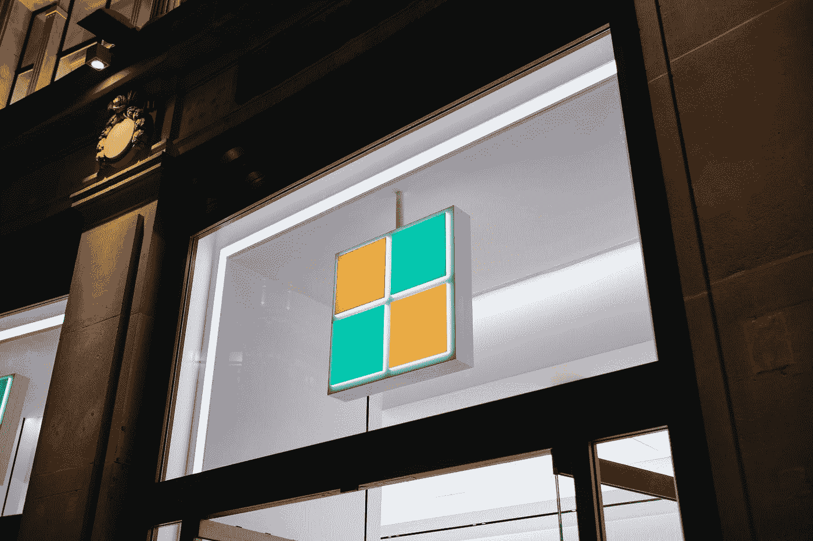
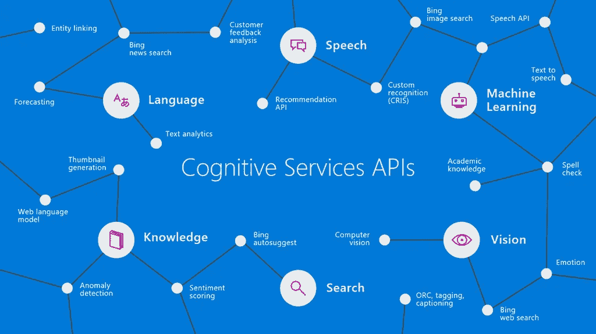
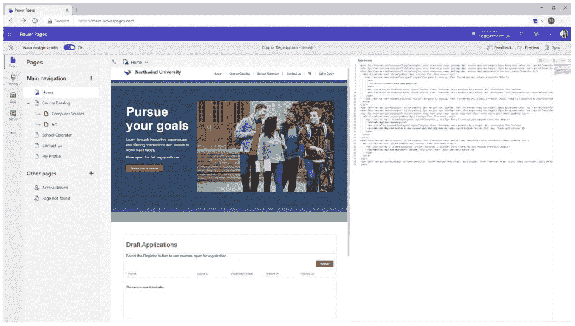
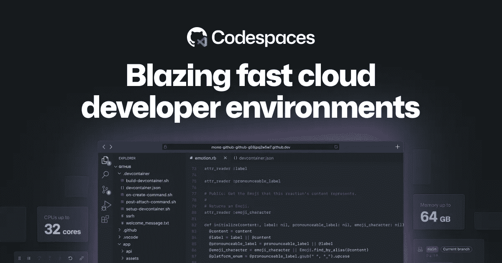
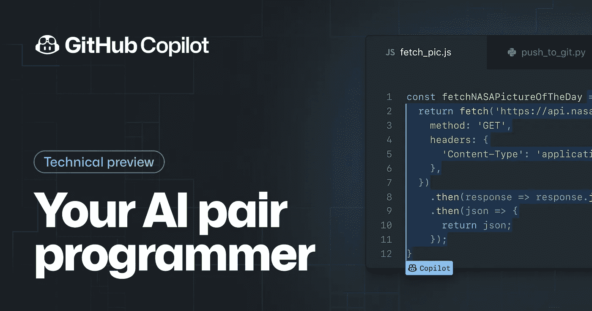
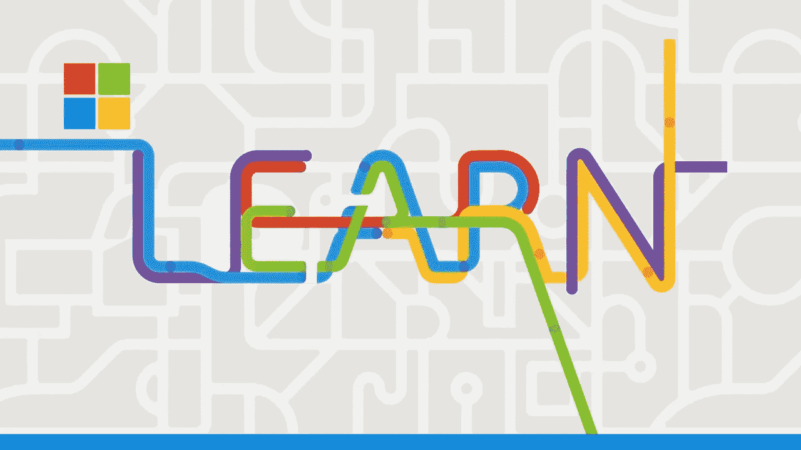

# 面向 Web 开发人员的 Microsoft Build 2022 亮点

> 原文：<https://javascript.plainenglish.io/microsoft-build-2022-highlights-for-web-developers-4d4b557bb7de?source=collection_archive---------11----------------------->

微软的年度构建活动再次挤满了大量的新产品、功能和公告。在这篇短文中，你会发现所有与你这个 web 开发人员相关的亮点。

Photo by [Turag Photography](https://unsplash.com/@turagphotos?utm_source=medium&utm_medium=referral) on [Unsplash](https://unsplash.com?utm_source=medium&utm_medium=referral)

# Azure 上面向开发者的人工智能

微软 Azure 已经在 Azure 认知服务中提供了各种人工智能服务。微软正在通过添加 OpenAI 服务来扩展这一功能。

[OpenAI](https://openai.com/) 当然是 [GPT-3 语言模型](https://openai.com/blog/openai-api/)背后著名的人工智能公司。启用实时文本完成和增强功能。

由于有许多 SDK，你可以轻松地将 Azure 认知服务集成到你正在使用的任何语言中，允许你将人工智能的力量添加到你的所有应用程序中。

# 低代码网站构建器

对已经很大的[动力平台](https://powerplatform.microsoft.com/)的一个扩展是[动力页面](https://docs.microsoft.com/en-us/power-pages/)。一个低代码的网站生成器，任何人都可以用它来创建自己的网站。由于与 Visual Studio Code、Github 和 Azure DevOps 的集成，这肯定会是一个大事件。

这是对 Power 平台中其他低代码服务的一个很好的补充。使业务用户更加独立于工程团队。

# 微软开发盒

设置开发环境是一项艰巨的任务，尤其是在大型企业工作区中。 [Microsoft Dev Box](https://techcommunity.microsoft.com/t5/azure-developer-community-blog/introducing-microsoft-dev-box/ba-p/3412063) 将允许您配置可按需启动的环境。当一个新成员加入团队时，节省了大量的时间。

Microsoft Dev Box 将与 GitHub Codespaces 紧密结合，GitHub Code spaces 是云中的 Visual Studio 代码环境。

# GitHub Copilot 上市

由微软和 OpenAI 制作的代码完成工具 GitHub Copilot 将于今年晚些时候全面上市，这意味着如果你想试用它，你将不再需要等待邀请。

虽然没有提到这项服务的具体价格，但微软确实让我们知道这项服务将永远对学生免费。它很可能会成为 GitHub 教育包的一部分。

# 新的 Microsoft Learn 课程

从开发运维到原生桌面开发，微软学习已经有了很多课程。微软现在也将增加云游戏(实时流媒体)、机器人流程自动化和网络安全的课程。

想亲自查看所有主题演讲吗？你可以在[微软 Build 2022 网站](https://news.microsoft.com/build2022/)上这样做。

*更多内容看* [***说白了就是***](https://plainenglish.io/) *。报名参加我们的* [***免费周报***](http://newsletter.plainenglish.io/) *。关注我们关于*[***Twitter***](https://twitter.com/inPlainEngHQ)*和*[***LinkedIn***](https://www.linkedin.com/company/inplainenglish/)*。查看我们的* [***社区不和谐***](https://discord.gg/GtDtUAvyhW) *加入我们的* [***人才集体***](https://inplainenglish.pallet.com/talent/welcome) *。*