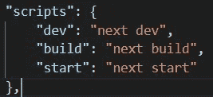

# 从 create-react-app 迁移到 Next.js

> 原文：<https://javascript.plainenglish.io/migrate-from-create-react-app-to-next-js-bff5fd7a1b6?source=collection_archive---------2----------------------->


Photo by [Ferenc Almasi](https://unsplash.com/@flowforfrank?utm_source=medium&utm_medium=referral) on [Unsplash](https://unsplash.com?utm_source=medium&utm_medium=referral)

Next.js 提供了开箱即用的强大功能，让构建全栈 React 应用变得轻而易举。Next.js 提供的一些最重要的特性包括:

*   API 路线
*   文件系统路由
*   静态渲染
*   服务器端渲染
*   根据每条路线选择数据提取策略和增量构建
*   SEO 优化
*   图像优化
*   自动代码拆分和预取
*   中间件
*   通过外部 URL 支持 ES 模块(实验性)
*   HTTP 流
*   Next.js Live —在实时编辑器上与远程团队一起编写代码

对这些功能感到兴奋吗？在本教程中，我将向您展示如何在几分钟内将现有的 React 应用程序迁移到 Next.js。我们将从由 create-react-app 工具搭建的默认应用程序开始。如果您想创建一个，只需在终端中键入`npx create-react-app my-app`并按回车键。这里有错误吗？确保您已经安装了 Node.js、npm 和 npx。如果您安装最新的 Node.js，npm 和 npx 会预先安装。

# 起始代码

对于本教程，我们将使用用 create-react-app 创建的 React 应用程序。您可以在现有的 react 项目上实现这种转换，或者创建一个新的 react 应用程序。要创建 React 应用程序，您需要在您的计算机上安装 Node，您可以通过在终端中键入以下命令来检查它:

```
npx -v
```

如果您看到任何错误，那么您没有安装 npx。请安装最新版本的。现在打开您的终端并执行以下命令来创建 React 应用程序。

```
npx crate-react-app my-app
```

您的 React 应用程序结构应该类似于下图所示


您的 React 应用程序现在已全部设置完毕。

# 迁移到 Next.js

为了迁移到 Next.js，我们将首先更新`package.json`中的脚本和依赖项，并重新构建代码以利用 Next.js 的特性，比如基于文件系统的路由。

# 第一步。更新“package.json”文件中的依赖项和脚本

您现有的项目应该具有“react”、“react-dom”和“react-scripts”以及其他依赖项。

1.  通过在依赖项部分删除“react-scripts ”(在更新 package.json 后需要运行 npm install)或运行“npm uninstall react-scripts ”,删除“react-scripts”。如果您使用 react-router，也可以删除“react-router-dom”。
2.  运行`npm i next`安装 Next.js
3.  如果要使用 typescript，还可以添加以下 devDependencies: `@types/node`、`@types/react`、`@types/react-dom`和` TypeScript`。
4.  js:我们不再需要“react-scripts”脚本，所以删除它们并添加以下脚本



# 第二步。创建登录页面

Next.js 内置了基于文件系统的路由。因此，您不需要手动管理路线。首先，让我们创建我们的主页。在“pages”目录中创建“index.js”文件。该组件将在“your-domain.com/”上提供

```
// pages/index.js export default function Home () {
    return <h1>Hello World</h1>;
} 
```

恭喜你！您现在可以使用`npm run dev`运行您的应用程序。目前，它只会渲染“Hello World”。现在让我们尝试导入并呈现我们的应用程序组件，如下所示。如果您愿意，可以将“src”改为“components ”,以符合下一个. js 约定。

```
import App from "../src/App";export default function Home () {
    return <App />;
}
```

您的浏览器现在将开始抛出错误。不要慌！我们将很快解决这些问题。


所以，正如错误所说的，我们只能将全局 CSS 导入到一个特殊的组件中，这个组件可以用于任何全局布局。我们来设置一下。我们在“public/index.html”中也有一些元标签，我们需要将它们应用到 Next.js 应用程序中。

# 第三步。设置全局布局和元标签

Next.js 不使用任何 HTML 文件作为入口点。相反，我们有特殊的文件“/pages/_app.js”和“/pages/_document.js”来处理全局样式、全局标签和布局。

1.  “pages”目录中的 Create _app.js 文件(如果使用 TypeScript，文件扩展名也可以是 jsx 或 tsx)。

```
// _app.js/**
* if you have any global layout in index.html file, change that to a react component
* and use it to wrap all your pages
*/// impoet global styles and layout (you can move global styles to /styles/ directory if you like)
import '../src/App.css'; 
import YourLayout from "src/YourLayout";export default function MyApp ( { Component, pageProps } ) {
    return (
        <YourLayout>
            <Component { ...pageProps } />
        <YourLayout/>
    );
}// In case you are not using any global layout, your return statement will simply be
// return <Component { ...pageProps } />
```

1.  现在将你所有的头标签从和 index.html 移动到“pages/_document.js”。我们将使用特殊的 Next.js 组件来管理元数据

```
// _document.js/**
* It is important to note here that we will add Head component to every page 
* for fields such as title and description. Only the global tags go here.
*/import { Html, Head, Main, NextScript } from 'next/document'export default function Document() {
  return (
    <Html lang="en">
      <Head>
      	{/* All your global head tags such as meta, link, etc. will go here*/}
      </Head>
      <body>
        <Main />
        <NextScript />
      </body>
    </Html>
  )
}
```

保存这些文件，你应该看到你的应用程序运行。但是我们还没有完成！您是否注意到图像没有渲染？

# 第四步。图像组件和静态资产

在 Next.js 中，公共目录用于静态资产。现在，您可以从公共目录中删除 index.html，并将所有应该可用的静态资产移动到公共目录中。但在此之前，让我们看看特殊的 Next.js 图像组件，它将帮助我们优化图像并提高现成的 SEO。导入并使用 Next.js 图像组件，如下所示:

```
// src/App.jsimport logo from './logo.svg';
import Image from 'next/image';function App() {
  return (
    <div className="App">
      <header className="App-header">
        { /* change img to Image (imported above)*/}
        <Image src={ logo } className="App-logo" alt="logo" />
        <p>
          Edit <code>src/App.js</code> and save to reload.
        </p>
        <a
          className="App-link"
          href="https://reactjs.org"
          target="_blank"
          rel="noopener noreferrer"
        >
          Learn React
        </a>
      </header>
    </div>
  );
}export default App;
```

现在你的应用程序应该可以很好地渲染图像了。它不仅可以渲染图像，还可以优化图像并提供设置图像大小的选项等。您可以从官方文档中了解有关“下一个/图像”组件的更多信息。如果您在使用 Image component 渲染图像时遇到任何困难，并且不关心优化，您可以将所有图像放在 public 目录下，而不是导入图像，您可以使用`'

你的应用现在运行正常，没有错误。但是使用 Next.js 还可以做更多的事情。让我们来看看在 Next.js 中使用路线

# 第五步。创建路线和链接(客户端导航)

在 Next.js 中创建路线非常容易。假设我想创建一个应该在`/about '提供的页面。为此，只需在 pages 目录中创建一个名为“about.js”的文件，并导出应该在该路径上呈现的 React 函数。

```
// pages/about.jsexport default function About () {
    return <h1>About Us</h1>;
}
```

尝试导航到“http://localhost:3000/about ”,您应该会看到“About Us”。为了创建客户端导航的链接，我们使用 Next.js 中的“link”组件。但是，让我们在 _app.js 中这样做。

```
// pages/_app.jsimport '../src/App.css';
import Link from 'next/link';export default function MyApp ( { Component, pageProps } ) {
    return ( <>
        <header>
            <ul>
                <li>
                    <Link href="/"><a>Home</a></Link>
                </li>
                <li>
                    <Link href="/about"><a>About Us</a></Link>
                </li>
            </ul>
        </header>
        <Component { ...pageProps } />;
    </> );
} 
```

现在，您应该会在两个页面的顶部看到两个链接。您可以在 devtools 中打开 Network 选项卡的情况下单击链接，或者关闭互联网来验证导航是在客户端进行的。

如果你需要创建动态页面，你可以使用 slugs。在 Next.js 中，您可以使用` pages/[slug].js `文件来创建动态路线。对于嵌套路由，您可以简单地在“页面”目录中创建文件夹结构。

您的代码结构和应用程序应该类似于下图所示:


# 要记住的重要概念

# 造型:

Next.js 支持 CSS、Sass 和 CSS-in-JS，并且您可以使用模块文件在组件级别封装样式。例如，您的 header 组件样式可以驻留在“Header.module.css”文件中，您可以将它们导入到组件中。Next.js 将自动生成并使用唯一的类名，这样就不会有冲突。

# 访问 Web APIs

由于 Next.js 会在默认情况下预渲染你的应用，所以在渲染过程中我们可能无法访问窗口对象和其他浏览器 API。使用 window 的推荐方法是在 useEffect 或类似的钩子中使用它。我们还可以访问事件侦听器中的窗口对象。

```
import { useEffect } from 'react'useEffect(() => {
  // You now have access to `window`
}, [])
```

# 环境变量

Next.js 支持使用。类似于 create-react-app 的现成 env 文件。你所有的变量都存储在里面。env 在 process.env 对象中可用。要向客户端公开变量，请将 REACT_APP_ prefix 更改为 NEXT_PUBLIC_。

# 元标签和搜索引擎优化

为了给页面添加 meta 标签，我们使用了“next/head”组件。这与我们之前从“next/document”导入的 Head 组件不同。

```
// about.jsimport Head from 'next/head';export default function About () {
    return (
        <>
            <Head>
                <title>About</title>
                <meta name="description" content="This is about page" />
            </Head>
            <h1>About Us</h1>
        </> );
}
```


[React+Next.js with TypeScript](https://www.udemy.com/course/react-and-next-js-with-typescript/?referralCode=7202184A1E57C3DCA8B2)

激动地宣布我的新课程在 [React+Next.js 上发布，带打字稿](https://www.udemy.com/course/react-and-next-js-with-typescript/?referralCode=7202184A1E57C3DCA8B2)。随便看看。

*更多内容看* [***说白了。报名参加我们的***](http://plainenglish.io/) **[***免费周报***](http://newsletter.plainenglish.io/) *。在我们的* [***社区获得独家访问写作机会和建议***](https://discord.gg/GtDtUAvyhW) *。***