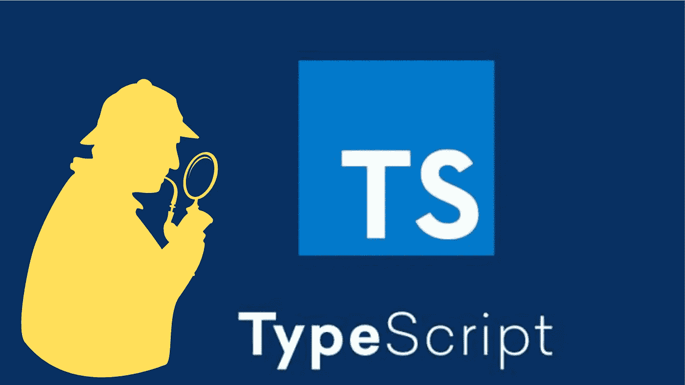

# 从 TSLint 迁移到 ESLint:没有 Snark 的简要指南

> 原文：<https://javascript.plainenglish.io/migrating-from-tslint-to-eslint-a-brief-guide-with-no-snark-6480dbbc6f66?source=collection_archive---------6----------------------->

## 林挺是任何代码库中的重要功能。本文主要讨论使用 ESLint 的林挺类型脚本代码

# 什么是林挺？

林挺是检查代码库中潜在错误的过程，这些错误会影响代码的整体正确性。这些案例从常见的语法错误到与安全相关的缺陷。



TypeScript code inspector

# 对林挺的需求

它用于消除任何可能引入代码库的错误，作为任何新更改的一部分。林挺有助于问题的早期检测，否则可能会导致生产环境中的代码破坏。

对于大型代码库来说，林挺变得尤其重要，因为大量的开发人员并行地为代码库做出贡献。一些使用案例包括:

1.  当新开发人员开始接触代码库，但并不完全了解所遵循的某些代码实践时，实施样式实践是很方便的。
2.  *实施安全实践，*一些编程结构可能会在代码库中引入安全问题，在代码交付到生产环境之前发现并消除这些问题非常重要。
3.  *确保代码的可维护性，*代码的可维护性对于不断增长的代码库来说是一个至关重要的因素，随着 repo 规模的增加，手动跟踪代码质量成为一个难以解决的问题。林挺派上了用场，你可以在几分钟内检查这个。

# 可用工具

由于本文的重点是类型脚本代码的林挺，我将提到两个流行的工具用于林挺这样的代码库。

1.  TSLint
    TSLint 是林挺类型脚本代码库的默认工具，这是一个专门为 Lint 类型脚本代码设计的工具，具有一组广泛的本机规则和支持库，可以处理大多数与类型脚本相关的林挺问题。
2.  ESLint
    ESLint 是林挺 JavaScript 代码最流行的工具，它已经存在很长时间了，像 TSLint 一样，它有一套广泛的本地规则和支持库，提供了一个健壮的林挺设置。

既然我们已经看到了可供我们使用的工具，我们可以使用它们来 lint 代码。但是等等，有一个条件。任何新的代码库都应该是使用 ESLint 的 lint，任何可能是使用 TSLint 的林挺的现有代码库都应该考虑迁移到 ESLint。*但是为什么会这样呢？*


migration to eslint

# 为什么要迁移？

上述两个工具的问题是，TSLint 现在已经被否决了，它早在 2019 年就被否决了，从那以后，ESLint 一直是林挺 JavaScript 和 TypeScript 代码库的首选工具。

Plantir 的这个[博客](https://blog.palantir.com/tslint-in-2019-1a144c2317a9)讨论了向 ESLint 的迁移，以及为 JavaScript 和 TypeScript 提供通用工具的努力。

# 迁移流程和工具

在本节中，我们将了解如何从现有的 TSLint 配置迁移到 ESLint，以及有哪些工具可供我们使用。

迁移过程可遵循以下步骤:-

1.  第一步是将现有的 TSLint 配置转换为其对应的 ESLint 配置，为此可以使用该工具`tslint-to-eslint-config`，此处[提供了该工具](https://github.com/typescript-eslint/tslint-to-eslint-config)。最简单的用法是
    `npx tslint-to-eslint-config`
2.  上述步骤将生成一个. eslintrc 文件，它是包含所需规则的 ESLint 的配置文件
3.  尽管该工具覆盖面很广，但它可能不会将所有的 TSLint 规则直接转换为它们的 ESLint 对应规则，原因是并非所有的 TSLint 规则都会直接映射到 ESLint 规则，这在中的`@typescript-eslint/tslint/config`下是可见的。eslintc 文件，但是这将创建对 TSLint 的依赖来运行这些规则，并且完整的迁移将受到阻碍。
4.  下一步是找到规则的替代物，它不是由工具直接转换的。[这里的](https://github.com/typescript-eslint/typescript-eslint/blob/main/packages/eslint-plugin/TSLINT_RULE_ALTERNATIVES.md)是 TSLint 规则和它们的 ESLint 对应物的详细列表，其中一些已经被工具处理了，另一些可能发现它们的实现是独立的库，还有一些仍然没有相应的 ESLint 规则。
5.  可能还会有一些规则被转换成 ESLint 规则，如果这些是一些自定义编写的规则，那么它们的 ESLint 自定义对应物也可以被实现，甚至需要类型检查的规则也可以有基于 ESLint 的实现，[本](https://typescript-eslint.io/docs/development/custom-rules)部分将详细讨论这一点。非定制规则可能已经作为`eslint-plugin`的一部分或某个第三方库实现了。

# 挑战

## 性能考虑因素

从 TSLint 迁移到 ESLint 时，最常见的挑战是需要类型检查的规则的性能。这是因为类型检查需要在运行 ESLint 之前编译包。这样做的成本取决于包的大小，包越大，过程越慢。

为了避免这种情况，在`parserOptions`中正确设置`tsconfig.json`并且不要使用太宽的球体是很重要的。这种用法的示例如下

```
parserOptions: {
  project: ["./tsconfig.json"]
}
```

这基本上是告诉解析器利用包级别`tsconfig`。

## 包级别规则

这个问题可能不会困扰较小的项目，但对于较大的回购，可能会有许多包在包级别禁用或启用一些规则。现在还没有工具可以直接满足这种需求，所以使用它的一个好主意是拥有一个定制的脚本来处理映射，或者使用一个现有的工具包装在一个定制的脚本之下，在包级别执行并满足包级别的规则结构。

不仅仅是规则，包级文件也可能通过`comments`在*行或*节级禁用和启用规则，这在 ESLint 规则开始选择应该禁用的代码行或代码节时会产生另一个问题。这可以在自动迁移时解决，例如

```
npx tslint-to-eslint-config --comments
```

虽然这在 mono repo 的情况下可能不是很方便，从一个点驱动规则，其余的包扩展那些公共的规则集，在这种情况下，这将试图扩展和转换单独的`.eslintrc`，然后这将需要手动处理。

下面是一些 ESLint 注释符号，与 TSLint 符号一样，它们也用于禁用规则

```
// eslint-disable-next-line
// eslint-disable-line/* eslint-disable */
/* eslint-enable */// eslint-disable-next-line <rule name>
// eslint-disable-line <rule name>/* eslint-disable <rule name> */
/* eslint-enable <rule name> */
```

## 行为不同的规则

我们可能会遇到一些与 TSLint 规则相对应的 ESLint 规则，但是它们的行为仍然与 TSLint 规则不同。

这方面的一个例子是`jsx-no-lambda`规则详细说明[这里是](https://github.com/palantir/tslint-react)，它不允许匿名方法，虽然可以通过将匿名方法声明移动到这样的变量来绕过匿名方法

```
const someMethod = (): void => {
   // some code
};return (
  <div onClick={someMethod}>
  </div>
);
```

与此相对应的 ESLint 是`react/jsx-no-bind`，这里详细的[将捕捉这种情况，这些可能会在迁移过程中提示修复。](https://github.com/jsx-eslint/eslint-plugin-react/blob/master/docs/rules/jsx-no-bind.md)

# 尾注

如果有人正在尝试这种迁移，那么除了这篇博客，他们会发现[这些](https://typescript-eslint.io/docs/)文档特别有用。此外，由于 TSLint 长期以来一直被否决，现在可能是将现有代码库迁移到 ESLint 的时候了，因为这将允许代码库自由地升级到新的工具版本，这在 TSLint 下将不受支持，并且可以从正在开发的新工具中进一步受益。这也为更广泛的 JavaScript 社区打开了大门，这将在某种程度上间接有利于任何不断增长的代码库。
希望这篇博客有助于回答一些与林挺和移民相关的问题。

# 资源

*   [Plantir 关于 TSLint 弃用的博客](https://blog.palantir.com/tslint-in-2019-1a144c2317a9)
*   [TSLint 到 ESLint cli](https://github.com/typescript-eslint/tslint-to-eslint-config)
*   [ESLint 替代规则](https://github.com/typescript-eslint/typescript-eslint/blob/main/packages/eslint-plugin/TSLINT_RULE_ALTERNATIVES.md)
*   [ESLint 自定义规则](https://typescript-eslint.io/docs/development/custom-rules/)
*   [打字稿 ESLint 入门](https://typescript-eslint.io/docs/)

喜欢您阅读的内容，并希望与我联系？
在[*Twitter*](https://twitter.com/vidit_m100)*或*[*LinkedIn*](https://www.linkedin.com/in/mathurvidit/)*上关注我，听听我的想法，或订阅我在 Medium 上的博客。*

*更多内容请看*[***plain English . io***](https://plainenglish.io/)*。报名参加我们的* [***免费每周简讯***](http://newsletter.plainenglish.io/) *。关注我们关于* [***推特***](https://twitter.com/inPlainEngHQ) ，[***LinkedIn***](https://www.linkedin.com/company/inplainenglish/)*，*[***YouTube***](https://www.youtube.com/channel/UCtipWUghju290NWcn8jhyAw)*，* [***不和***](https://discord.gg/GtDtUAvyhW) *。对增长黑客感兴趣？检查出* [***电路***](https://circuit.ooo/) *。*