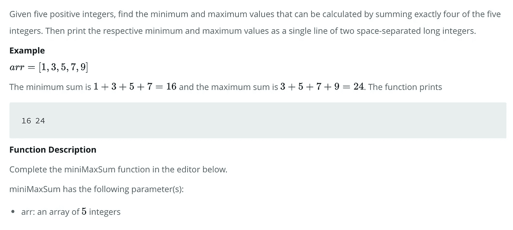

# 使用 JavaScript 找到“最小-最大和”

> 原文：<https://javascript.plainenglish.io/mini-max-sum-javascript-f3a58abae7d0?source=collection_archive---------17----------------------->

## 解决寻找给定整数的“最小最大和”的 HackerRank 编码挑战的指南。

正如我在上一篇博客中所说的，我最近一直在研究数据结构和算法，并一直在利用 HackerRank.coms 的编码挑战。这篇博客的重点是介绍他们的“最小最大总和”挑战，这是他们为期一周的面试准备工具包中第一天的一部分。问题如下:



所以本质上，这里的挑战是打印出两个由空格分隔的不同整数，第一个是给定数组中最小整数的和，第二个是最大整数的和。在每种情况下，给定的数组将有 5 个整数，并且总和应该使用 5 中的 4 进行计算。第一步是对数组进行排序:

```
**function** miniMaxSum(arr) {**let** sortedArray = arr.sort((a, b) => a-b);}
```

现在，该数组从最低整数到最高整数排序。继续，下一步是编写逻辑来求和最小值:

```
**function** miniMaxSum(arr) {**let** sortedArray = arr.sort((a, b) => a-b);**let** minimum = sortedArray.slice(0, sortedArray.length -1).reduce((a, b) => a+b)}
```

通过使用提供的参数调用 sortedArray 上的 slice 函数，传递给 reduce 函数的整数是数组中除最后一个整数之外的所有整数。注意这也可以通过硬编码 sorted array[0]+sorted array[1]…等等来完成。因为数组中总是有 5 个整数，但是使用 slice 并减少代码会更加动态，对于更大的数组来说会正确运行。现在最重要的是:

```
**function** miniMaxSum(arr) {**let** sortedArray = arr.sort((a, b) => a-b);**let** minimum = sortedArray.slice(0, sortedArray.length -1).reduce((a, b) => a+b);**let** maximum = sortedArray.slice(1).reduce((a, b) => a+b);}
```

既然已经实现了所需的功能，最后一步是以所要求的格式打印最小值和最大值的输出，即最小值后跟最大值，中间用空格隔开。

```
**function** miniMaxSum(arr) {**let** sortedArray = arr.sort((a, b) => a-b);**let** minimum = sortedArray.slice(0, sortedArray.length -1).reduce((a, b) => a+b);**let** maximum = sortedArray.slice(1).reduce((a, b) => a+b);console.log(minimum, maximum)}
```

成功！代码通过了所有给定的测试用例。幸运的是，JavaScript 使得这种功能很容易实现。我希望这是有帮助的，和往常一样，如果你的代码和我的不一样，请在评论中回复。

*更多内容请看*[***plain English . io***](http://plainenglish.io/)*。报名参加我们的**[***免费周报***](http://newsletter.plainenglish.io/) *。在我们的* [***社区获得独家访问写作机会和建议***](https://discord.gg/GtDtUAvyhW) *。**