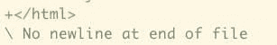
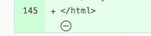

# 喊着“初学者代码”的小瑕疵

> 原文：<https://javascript.plainenglish.io/minor-imperfections-that-shout-beginner-code-7f8297cafdc9?source=collection_archive---------11----------------------->

## 一些你可以在代码中避免的缺陷！


Illustration by the author

大约一年来，我一直在指导几个刚刚开始编程的人。在审查他们的代码时，我注意到一些重复出现的问题。其中许多问题是:

*   次要的足以让初学者看起来没问题
*   恼人到足以立即被更有经验的开发人员注意到

让我们快速浏览一下这些缺陷，这样你就可以在你的代码中避免它们了！

# 文件末尾没有新行

UNIX 惯例是在每个文件的末尾添加新的行字符。它开始是因为像`cat`这样的命令行工具显示了许多文件，而没有在它们之间放置任何分隔符。Git 通过文件内容的散列来识别文件——对于 Git 来说，即使一个字符的差异也会使文件不同。这两个因素结合在一起，使得 Git 和 GitHub 在文件末尾缺少新行时会指出来。

Git 命令行:



GitHub:



我见过的许多项目都有一个要求每个文本文件包含一个新行字符的策略——遵循 UNIX 惯例。

# 解决办法

您的代码编辑器中应该有一个为您添加这些新行字符的选项。或者，您可以在您的编辑器中检查对 [EditorConfig](https://editorconfig.org/) 的支持，并在项目级别设置它。

# 不一致的代码样式

请看看这段代码:

```
if (a == 1){
  b = 2;
} 
else {
  b =3;
}
```

我刚开始编程的时候也是这样写的，但是现在感觉这里的代码风格几乎冒犯了我。我并不孤单:其他[程序员](https://how-to.dev/what-tech-newbies-need-according-to-industry-insiders)也指出一致性是编码的一个重要部分。

# 解决办法

您不必:

*   察觉所有的造型问题，也没有
*   手动修复它们，甚至
*   想想代码风格的细节。

相反，只需获得一些流行的和固执己见的代码风格自动化工具，并使用该工具外包您所有的风格需求。对于前端，你更漂亮，我在另一篇文章的[中提到过。](https://how-to.dev/how-to-make-your-code-prettier)

# 提交消息

我经常把[提交消息指南](https://www.freecodecamp.org/news/how-to-write-better-git-commit-messages/#5-steps-to-write-better-commit-messages)发给我开始共事的任何人。许多项目执行这些规则——或者更复杂的规则。为什么我和其他人这么在意？

*   一些项目从提交中自动生成变更日志。例如，angular 使用[常规-changelog](https://github.com/conventional-changelog/conventional-changelog) 。
*   Git 历史应该提供项目中发生的事情的快速概览——混乱的消息使它更难消化。
*   指向上次修改给定行的提交——一个好的提交消息可以加速理解当时发生了什么以及为什么会发生。

对于一个从事个人项目的初学者，我会坚持:

*   用现在时第一人称祈使句中的动词:`add index.html`代替`added index.html`或`adding index.html`。
*   保持大小写一致——要么总是以小写字母开头，要么以大写字母开头。
*   不要在消息末尾使用句号。
*   提交消息不超过 50 个字符。多一点没问题，但尽量避免超过 70。大多数 Git 工具不包装消息，所以长消息会被截断或超出屏幕。

# `!important` CSS

当你在你的样式中使用`!important`的时候，你强制一个给定的 CSS 规则凌驾于任何其他规则之上。这是一种[代码味道](https://en.wikipedia.org/wiki/Code_smell)，或者是当项目中的事情已经开始变糟时实现目标的一种方式。当您使用`!important`时，您删除了一个简单的选项，用更具体的选择器覆盖值 CSS 的一个关键特性。您无法避免`!important`的唯一情况是当您覆盖另一个已经使用它的规则，并且它来自您无法控制的代码——例如，来自第三方库。

你应该用什么来代替？任何使选择器更具体并因此更强的方法。在最坏的情况下，您可以复制类名，使其中一个选择器更强大:

```
.side-bar.side-bar {
  color: green;
}

.content {
  color: blue;
}
```

会让`<div class="content side-bar">test</div>`变绿。

# 文件夹结构和文件名

我对代码库结构的期望是:

*   应该很清楚我会在任何文件夹或文件中找到什么，
*   我要写的新代码应该放在哪里是显而易见的，
*   它应该是一致的，而且
*   这应该很简单。

不符合这些期望的例子:

```
controllers/
  some-controller.ts
  anotherController.ts
```

上面混合了 kebab-case 和 camelCase 的文件名:不清楚新文件应该如何命名。

```
admin/
  some-class.ts
classes/
  another-class.ts
views/
  index.html
```

上面的代码片段混合了匹配用例的文件夹(`admin/`)和匹配文件类型的文件夹(`classes/`)。不清楚 admin 相关的类属于哪里。

```
very/
  nested/
    folder/
      file.ts
```

最后，上面的内容是多余的。

# 摘要

对于刚开始编程的人来说，这几件事看起来微不足道，但是对于有经验的程序员来说，注意到它们是很平常的事情。尽早弄清楚这一点是一个好主意:这将使你的代码看起来更专业，这样做将有助于评审人员关注更重要的事情。

*最初发布于*[*https://how-to . dev*](https://how-to.dev/minor-imperfections-that-shout-beginner-code)*。*

*更多内容看* [***说白了。报名参加我们的***](https://plainenglish.io/) **[***免费周报***](http://newsletter.plainenglish.io/) *。关注我们关于* [***推特***](https://twitter.com/inPlainEngHQ) ，[***LinkedIn***](https://www.linkedin.com/company/inplainenglish/)*，*[***YouTube***](https://www.youtube.com/channel/UCtipWUghju290NWcn8jhyAw)*，以及* [***不和***](https://discord.gg/GtDtUAvyhW) *。对增长黑客感兴趣？检查* [***电路***](https://circuit.ooo/) *。***