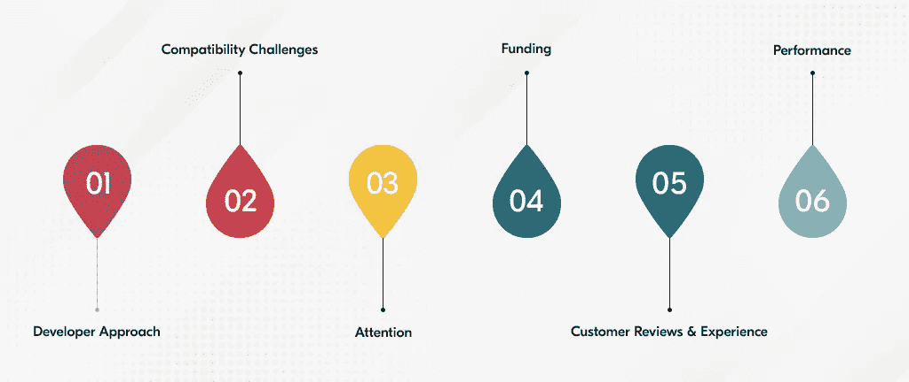

# 开发者在移动应用开发过程中面临的 10 大挑战

> 原文：<https://javascript.plainenglish.io/mobile-app-development-challenges-385e0686a547?source=collection_archive---------7----------------------->

## 以下是开发者在移动应用开发过程中需要克服的 10 个主要障碍。

企业独欲一物；成功。其次是利润。这就是为什么他们包括可以帮助他们更快实现这一领域成功的解决方案。今天，如果我们仔细观察，就收入和客户而言，帮助创业企业推动自身发展的最大媒介之一是移动应用程序。

然而，人们经常观察到，在开发过程中，开发人员通常会受到这种或那种形式的障碍的困扰。这可能是为了确保数据隐私，其次是架构不够健壮，或者最重要的是选择的平台不合适，等等。

因此，为了确保开发人员不会成为这些挑战的牺牲品，我们为您带来了这篇文章。它将让你了解开发人员在进行**移动应用开发时通常面临的主要障碍。这也将有助于你思考一些有用的技巧，这样就不会出现这样的问题，应用程序可以同时提供最大的价值和最大的投资回报率。**

**虽然专业人士通常会面临许多挑战，但这里我们列出了他们应该最大限度避免的十大挑战。**

**让我们开始吧。**

## *****开发者在手机 App 开发过程中面临的 10 大拦路虎*****

**请看下图，了解开发过程中面临的一些挑战。**

****

**从上面可以看到，在移动应用开发过程中会出现各种各样的问题，比如资金、兼容性等。在下面一行中，我们详细解释了同样的内容。**

## **1.不了解用户需求**

**首先，开发者没有询问用户的需求。这对移动应用程序来说是一个障碍。毕竟，让我们面对现实吧，如果你的应用程序不被某人所需要，他们首先就没有理由对使用它感兴趣。**

**因此，在企业着手开发移动应用程序之前，首先进行用户研究变得至关重要。其次是确保所进行的研究能够产生最大程度的准确性。**

**这样做将有助于您构建与客户需求同步的解决方案，最终将有助于推动您的业务取得成功。**

## **2.缺乏强有力的价值主张**

**没有多少企业记得进行竞争研究。这对他们来说是一种挑战，因为他们不知道他们的竞争对手和他们的优势和劣势。它首先影响产品质量，并阻止它获得竞争优势。**

**同时，缺乏产品愿景陈述也会影响产品，随之而来的是独特的价值主张。**

**因此，执行移动应用程序原型就变得很重要。这将有助于您从最终产品中获得最大收益和成功。**

## **3.没有做出正确的平台选择**

**除了理解用户需求，以及对应用程序的独特价值定位了解较少，开发者面临的另一个主要障碍是为平台做出正确的选择。这对他们来说是一个障碍。毕竟，如果一个应用程序不能跨平台高效运行，用户甚至不会花一分钟来卸载这个应用程序。因此，确保首先知道你的应用程序想要达到的目标和目的。一旦你对这个领域有了深入的了解，你就可以确定你能够通过你的最终解决方案接触到最大数量的用户。**

** [## 为什么 Flutter 是构建完美应用的理想框架的主要原因

### 技术的快速发展，除此之外，疫情时期导致了许多…

medium.com](https://medium.com/nerd-for-tech/top-reasons-why-flutter-is-ideal-to-build-app-e648b5f97881) 

## 4.提供糟糕的用户体验

如果你的应用程序缺乏视觉吸引力或者缺乏交互性，接着又给用户执行不同的功能带来了挑战，那么至少可以说，用户体验会很差。

因此，重要的是要记住，你的应用程序应该有更少的加载时间，然后是一个短的注册过程，等等。所有这些都将有助于您通过最终解决方案向用户提供独特的体验。

 [## 7 UI/UX 设计趋势打造黑仔移动应用

### 这种对最新 UI/UX 设计趋势的深刻分析将减少跳出率，增加转化率…

javascript.plainenglish.io](/ui-ux-design-trends-to-build-mobile-app-bba6562b6f04) 

## 5.资金很少

对新企业来说，融资至关重要。因此，首先了解最新的技术创新，并尽可能地获得真知灼见变得至关重要。这样做将有助于你的企业节省大量资金，尤其是在招聘过程中。它还将帮助您成功地满足用户需求。

## 6.选择模糊技术

如果你选择了一项不再受欢迎的技术，最终的解决方案将会使你不得不承受巨大的成本。因此，理想的做法是使用那些能够提高最终解决方案整体效率并有效运行的技术堆栈。最后，它将为用户提供 365 天的高性能。

 [## 采用这些策略来选择正确的技术组合

### 如何为你的下一个应用开发项目选择合适的技术堆栈？

javascript.plainenglish.io](/how-to-choose-tech-stack-wisely-9be1ac110271) 

## 7.缺乏如何营销应用程序的知识

你知道如何构建一个应用程序，你甚至知道有助于你的应用程序脱颖而出的功能，但你知道如何营销它吗？是不是？万一是后一种情况，app 用不了多长时间就会湮没无闻。因此，了解不同的营销策略是很重要的。这将有助于你在应用程序推广过程中整合它们，并确保它最大限度地吸引潜在客户的注意力，并最终帮助你赢得最多的客户。

## 8.您的截止日期无法满足

时间就是金钱。这是没有多少开发者理解的。因此，对企业主来说，明确最后期限变得至关重要。这将确保满足他们成为无缝。此外，它将确保在出现延迟的情况下，开发人员可以轻松地进行沟通。

## 9.规划不当

一个想法是不够的。它同样与计划相关；好好计划。这意味着，对于企业来说，回答他们预计应用程序将被构建的时间问题是至关重要的；如果他们知道他们的竞争对手是谁，其次也知道他们在做什么。最后，如果他们知道他们的目标受众，他们是谁，以及他们使用的应用程序的类型。深入了解所有这些领域将确保最终解决方案能够带来价值。

## 10.数据存储问题是最大的

最后，在数据没有得到应有重视的情况下，尤其是在移动应用开发期间，开发者最终失去的比他们预期的还要多。这包括诸如黑客攻击以及随之而来的数据丢失等事件。因此，了解软件和硬件碎片以及黑客执行的活动至关重要。所有这些都将大大有助于防止任何形式的数据丢失。

除了这些挑战之外，其他对移动应用程序开发者来说是主要障碍的挑战是不理解为什么首先要开发这个应用程序。其次是应用程序中缺乏备份选项，因此用户可以无缝地将他们的信息投入使用，最重要的是电池寿命完全耗尽，尤其是在开发阶段。

因此，所有这些都需要记住一些技巧。

在下面的几行中，我们强调了一些在从头开始构建应用程序时会派上用场的步骤。

## ***如何搭建一个 App？***

当你开始创建一个新的应用程序时，知道如何从头开始开发一个应用程序是很重要的。因此，您应该遵循以下步骤。

*   起草产品需求文件。这将有助于你获得一款既符合用户价值又不会影响财务的应用。
*   避免同时使用太多工具。建议在构建应用程序时一次使用一个工具。这将帮助您创建一个具有极高质量和标准的解决方案。
*   采用与您的业务和未来计划相一致的开发方法。这将有助于你的应用程序把你的事业带向正确的方向，让它取得最大的成功。
*   让导航变得简单。所以，重在简单。您可以在 iOS 应用商店或谷歌 Play 商店中添加视频、图片等。它将帮助您的用户了解如何操作该应用程序，最终将推动其向前发展，并推动您的业务成功。

 [## 为您的企业构建应用程序的原因和方法

### 如何为我的企业搭建一个 app？这个问题困扰你了吗？别担心。这本指南将解决你所有的疑惑…

www.xongolab.com](https://www.xongolab.com/blog/top-5-reasons-to-build-an-app-for-business/) 

## 总结词

在移动应用开发过程中，开发者无疑会遇到许多陷阱和挑战。这可能包括选择不适当的架构，为应用程序选择不适当的平台，甚至在为用户开发应用程序之前不了解用户需求。因此，它需要广泛的研究，并确保您从最终研究中获得正确的见解和发现。这样做有助于您的企业获得一个能够实现最大价值的解决方案，同时获得最大的投资回报和最多的客户。

因此，请确保尽可能多的测试，并了解如何避免您的应用程序出现错误或崩溃等事件。所有这些将保证你有一个愉快的应用程序开发之旅，帮助你最终得到一个吸引大量用户的应用程序。

*更多内容请看*[***plain English . io***](https://plainenglish.io/)*。报名参加我们的* [***免费周报***](http://newsletter.plainenglish.io/) *。关注我们关于*[***Twitter***](https://twitter.com/inPlainEngHQ)*和*[***LinkedIn***](https://www.linkedin.com/company/inplainenglish/)*。查看我们的* [***社区不和谐***](https://discord.gg/GtDtUAvyhW) *加入我们的* [***人才集体***](https://inplainenglish.pallet.com/talent/welcome) *。***