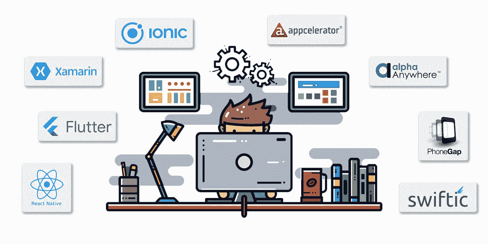

# 移动应用程序开发流程概述

> 原文：<https://javascript.plainenglish.io/mobile-app-development-process-ac109426bda4?source=collection_archive---------5----------------------->

## 如何开发移动应用程序的分步指南。

如何为我的企业搭建一个 app？从哪里开始？需要多长时间？我们确信这些问题已经出现在你的脑海中。这篇文章将消除你对移动应用程序开发过程的所有疑虑和疑问，你应该遵循这个过程，以及你为什么应该这样做。

为你的企业提供一个移动应用有几个好处，包括改善消费者互动、提高品牌认知度、增加曝光率等等。它给你一个直接的营销渠道，增加了市场的可及性，这对企业是有益的。如果公司计划瞄准大量受众，那么开发商业移动应用可能是它们的优势。

[根据 Statista](https://www.statista.com/statistics/870642/global-mobile-app-spend-consumer/) 的数据，消费者在移动应用上的支出在 2019 年至 2021 年间稳步增长，2021 年达到 1700 亿美元。2022 年，应用市场预计将产生 4656.55 亿美元的收入，如果我们谈论收入，预计未来几年大多数行业的收入将会增加，到 2025 年将达到 6130 亿美元。

# 最好的手机 App 开发平台有哪些？

你必须计划并决定在[移动应用开发平台](https://www.dorjblog.com/flutter-vs-react-native-which-one-to-choose-for-app-development/)上发布你的应用。这是一个至关重要的决定，因为它将对您的战略、您将使用的工具以及业务目标产生直接影响。我们确信您正在考虑在构建应用程序的过程中选择哪个平台？以下是你可以考虑应用的著名平台:

*   反应自然
*   摆动
*   Xamarin
*   离子的
*   加速器
*   阿尔法在任何地方
*   Adobe PhoneGap
*   Swiftic (iOS 应用程序开发)

# 移动应用程序开发流程:分步指南

现在，从哪里开始呢？开发应用程序的流程由您决定，但我们建议您在应用程序平台上发布应用程序之前，遵循所有应用程序开发阶段。

## **1。构建应用开发战略**

任何移动应用程序开发流程的第一步都是设计一个策略，将你的概念转化为商业上可行的应用程序。在继续下一步之前，你必须讨论这些特殊的问题:

*   你申请的目标是什么？
*   你的移动应用能帮助解决什么行业问题？
*   你将遵循哪些营销策略来推广你的应用？
*   你会选择哪个 app 开发平台发布 app？
*   你有什么样的商业模式？
*   你将如何分析竞争对手的策略？
*   你愿意在这个应用上投资多少钱？
*   你创收的商业模式是什么？

一旦你有了所有的答案，然后采取应用程序开发过程的下一步。

## **2。市场调查**

是时候开始你的应用程序开发过程中最关键的阶段了。市场研究揭示了市场的真正需求或兴趣。因此，你可以调整你的概念，这项研究可以为你提供一个清晰的需求列表，帮助你优先考虑主要的需求。

*让我们来看看进行市场调查的一些好处:*

*   它能让你更深入地了解你的客户。
*   帮助您选择正确的语言、框架和技术。
*   通过市场调查，你可以很好地了解你的竞争对手。
*   帮助您在发布产品前对其进行全面评估？帮助你决定如何接触你的目标受众？

## **3。规划与分析**

规划的一个重要方面是确定应用程序开发项目所需的技能。在您的规划和分析阶段，您必须做出与移动应用程序开发相关的各种决策。

不同的操作系统需要不同的技术栈。您的 IT 堆栈应该基于您的需求。无论你是在创建一个本地移动应用、混合应用，还是[跨平台移动应用](https://www.xongolab.com/blog/why-should-you-go-for-cross-platform-to-develop-mobile-app/)，你都需要编制一份所需技术的清单。然后，你必须开始雇佣熟悉你想集成到应用中的技术的开发人员。

如果你想创建一个在 Google play 商店和苹果应用商店都能运行的移动应用，那么你的开发团队应该由 iOS 和 Android 开发者组成。

## **4。用户界面/UX 设计**

你听说过第一印象就是最后印象的说法吗？

这同样适用于您的应用程序。用户高度重视手机应用的外观和感觉。正是在这一点上，应用程序的用户界面/UX 的设计变得至关重要。紧凑设计的无缝用户体验是应用程序设计的目标。客户采用您的软件并从其所有特性中获益的难易程度决定了它的成功。我们来讨论一下 app 设计的流程:

*   信息架构和工作流
*   线框
*   选择设计模式的风格指南
*   准备模型
*   创建原型

## **5。线框**

设计一个应用程序的过程通常始于纸上的草图。线框是想法，不是完整的设计。线框是应用程序功能的概念性布局。它也被称为低保真度模型，因为它为你的应用程序提供了一个视觉结构。它还将帮助您分析应用程序的外观和性能。

在创建线框时，密切关注用户将如何与你的线框互动。避免使用色彩方案和设计元素，因为它们的趋势已经过去，看起来也不好看。

设计应该是直观和用户友好的，以便用户会注意。

## **6。风格指南**

用户界面可能令人困惑。线框经常会误解。

风格指南是为应用程序指定设计协议的持续文档。它包含了一些方面，比如你的品牌指南，导航符号，以及其他需要详细说明的功能。

以下是移动应用程序设计指南需要考虑的一些因素:

*   吸引人的字体
*   迷人的颜色
*   非凡的布局
*   对话式图表
*   成分
*   酒吧和菜单等。

## **7。实体模型**

高保真设计可以称为模型，它们是应用程序视觉效果的最终渲染。这里模型结合了风格指南和线框来构建应用程序的最终版本。您可以根据您的业务需求进行某些修改。市场上有各种工具可以帮助创建最好的高保真实体模型。

## **8。原型**

原型制作是将低保真度的线框图转化为即用型设计的过程。在完成应用程序设计的所有过程后，你可以与你的团队、朋友和任何其他你认为可以给你相关反馈的人分享原型。原型在整个应用程序开发过程中起着至关重要的作用，尤其是在说服投资者的时候。

## **9。开始应用程序开发**

如何搭建一个 app？完成应用程序设计流程后，应用程序开发流程开始。在这个阶段，你必须注意几件事情，比如，你将在应用程序开发中使用哪种技术堆栈，以及应用程序的技术架构是什么。除此之外[移动应用开发](https://www.xongolab.com/mobile-app-development/)分为三个不可或缺的部分:

*   移动后端服务器技术
*   应用编程接口(API)
*   应用前端开发

***后端技术*** —需要数据库和服务器端对象来支持移动应用功能，这就是为什么它是决定开发阶段时应该考虑的最重要因素。为了适应必要的移动应用功能，您可能需要调整您正在使用的后端平台。如果需要，您可以对其进行必要的更改。

***App 前端开发*** —前端是你的用户会交互的地方。这决定了你的应用程序的第一印象，它应该有足够的吸引力和洞察力来吸引新用户。一般来说，移动应用程序具有交互式用户体验(UX ),使用 API 和后端数据库来管理数据。

## 10.测试

*了解更多:* [*如何明智地降低 App 开发成本？*](https://xongolab.medium.com/how-to-reduce-app-development-cost-wisely-1057408763a0)

接下来是测试阶段，测试你的应用程序，检查所有的功能是否正常工作。质量保证测试在移动应用程序开发过程中起着至关重要的作用，它确保了应用程序的高性能、安全性和功能性。你必须准备适当的测试用例，覆盖应用程序的所有基本测试阶段。这些测试分为五个部分:

*   用户体验测试
*   功能测试
*   性能试验
*   安全测试
*   设备和平台测试

所有这些测试都应该在市场上推出应用程序之前完成。

## 11.应用程序启动

到了最后一步，你必须将你的应用发布到应用商店。要完成此过程，您必须在这两个平台上创建一个开发者帐户，然后只有您可以在这两个平台上提交应用程序。最终取决于你选择在哪个平台上发布应用，是 iOS 还是 Android。

元数据必须在提交应用程序时准备好，这样人们就不会在找到你的应用程序时遇到任何问题。元数据包括:

*   应用标题
*   应用程序的描述
*   应用类别
*   关键词
*   启动图标
*   App 截图

提交后，iOS 应用程序的审核流程开始，这需要数天或数周时间。这完全取决于你的应用程序的质量，如果苹果发现你的应用程序适合商店，他们会很快批准它，他们还会检查你是否遵循了苹果 iOS 开发指南。

Android 应用程序在几个小时内就可以在 app store 上获得，因为这里没有上传应用程序的审查过程。

# ***为什么商家需要开发手机 app？***

除了提供宝贵的营销机会，[开发一款面向企业的移动应用](https://www.xongolab.com/blog/top-5-reasons-to-build-an-app-for-business/)还能帮助你接触到目标受众，并超越竞争对手。以下是企业可以通过移动应用获得的好处:

*   它改善了与顾客和客户的沟通。
*   它有助于通过提高品牌知名度来吸引新的受众。
*   这大大提高了客户参与度。
*   它帮助企业在竞争中脱颖而出。
*   通过移动应用程序，公司可以建立一个有效的忠诚度计划。

# ***结论***

移动应用程序开发过程可能会令人生畏且耗时。但是，如果操作正确，可以给用户带来前所未有的无缝体验。我们希望这篇详细的文章能帮助你理解所有的方面。

*更多内容看* [***说白了就是***](http://plainenglish.io/) *。报名参加我们的**[***免费周报***](http://newsletter.plainenglish.io/) *。在我们的* [***社区不和谐***](https://discord.gg/GtDtUAvyhW) *获得独家获取写作机会和建议。**