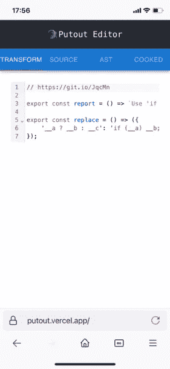
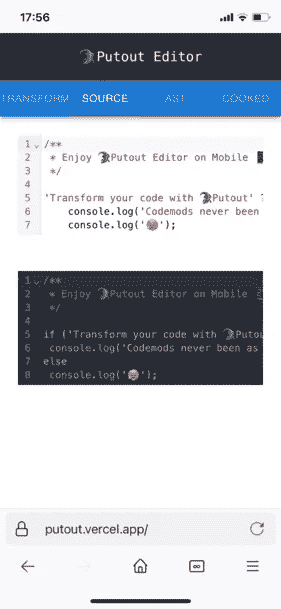
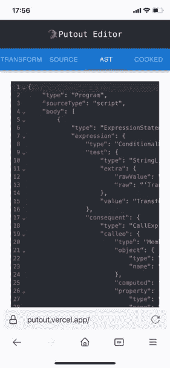

# 介绍用于输出的移动编辑器

> 原文：<https://javascript.plainenglish.io/mobile-editor-for-putout-a3c584037b?source=collection_archive---------3----------------------->

## 使用新的移动输出编辑器，你可以在移动电话上编写你的代码。



A brand new editor for 🐊Putout

嗨伙计们！

刚刚出版了一个全新的🦎[手机输出编辑](http://putout.vercel.app)。这是第一个可以在移动设备上轻松使用的 AST 编辑器。它基于 [React](https://reactjs.org/) 、 [Codemirror](https://codemirror.net/) 和神奇的 [Vercel](https://vercel.com/) ，并有几个选项卡。我真的很感激你现在的任何反馈。

# 改变

在 Transform 选项卡中，你编写一个插件代码，例如，如果你想用 **if** **语句**替换**terminaries**，只需使用 **:**

```
export const report = () => `Use 'if condition' instead of 'ternary expression'`;

export const replace = () => ({
    '__a ? __b : __c': 'if (__a) __b; else __c;'
})
```

# **来源**



Source tab has two editors

**源**选项卡有两个编辑器:

*   源代码(可写)；
*   转换后的代码(只读)；

所以当你在第一个编辑器中输入代码时，它会被写在**转换**标签中的插件转换，所以你可以在你手机的小屏幕上看到快速的结果！

# 大西洋时间



Readonly editor with AST

当您需要检查 AST 的外观时，只需使用 **AST** 选项卡。

# 源代码

在[https://github.com/putoutjs/mobile-putout-editor](https://github.com/putoutjs/mobile-putout-editor)查看源代码，一如既往欢迎 PRs。

# 结论

当然，您仍然可以使用常规🐊输出编辑器来编写你的代码，但是当你唯一的设备是一部手机时，移动版本可以大大简化事情。

☝️follow me on medium/@[code raiser](https://medium.com/u/47c05fa2893e?source=post_page-----1782c6625d77--------------------------------)，了解如何提高您的编码技能😏。

☝️在 GitHub 上增加了明星⭐️，这很激励人！

如果你喜欢我正在做的事情，☝️支持我。

☝️And:记住，我会一直在这里解决你对我提出的代码的任何问题😋。

就这些了，祝你有美好的一天！

*更多内容请看*[***plain English . io***](https://plainenglish.io/)*。报名参加我们的* [***免费周报***](http://newsletter.plainenglish.io/) *。关注我们关于*[***Twitter***](https://twitter.com/inPlainEngHQ)*和*[***LinkedIn***](https://www.linkedin.com/company/inplainenglish/)*。查看我们的* [***社区不和谐***](https://discord.gg/GtDtUAvyhW) *加入我们的* [***人才集体***](https://inplainenglish.pallet.com/talent/welcome) *。*