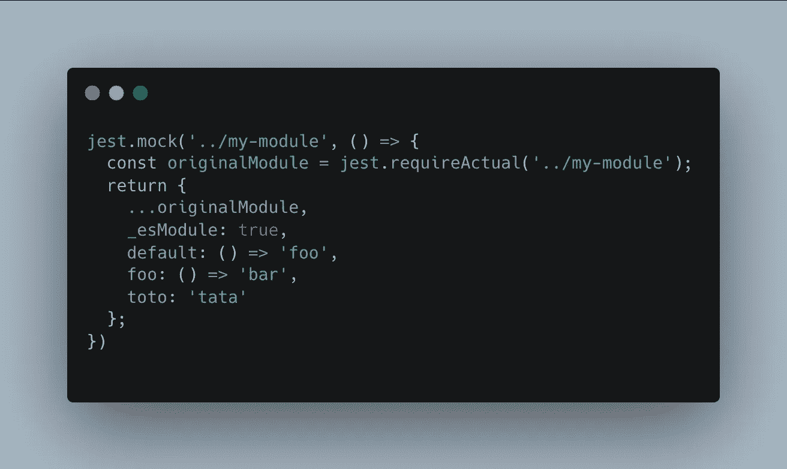

# 用 Jest 模仿模块中的一些项目

> 原文：<https://javascript.plainenglish.io/mock-only-some-items-from-a-module-with-jest-8f33a3d87e5c?source=collection_archive---------12----------------------->

## 如何使用 Jest mocking 针对模块中的特定函数或值？

很长一段时间以来，Jest 对我来说一直是个谜。嘲笑是困难的，找到正确的文档本身就是一个挑战。

经过大量的练习(以及对想法的记录)，我终于可以解决几乎所有的问题，并能流利地讲笑话。

在本文中，我们将关注如何模拟来自模块的特定函数或变量。

这样做的方法基本上是通过用`jest.requiredActual`导入整个模块，并用之前模拟的值在一个新对象中传播。

Our final result

让我们深入了解一下:

*   `const originalModule = jest.requireActual(‘../my-module’);`

在这一行，我们导入实际的模块，没有模仿。它允许我们重新注入您想要保留的值，就像原始值一样。

*   `…originalModule`

这里，我们将原始值和函数注入到新对象中。

*   `_esModule: true`

这是告诉 JS，对方其实是一个模块。

*   `default: () => ‘foo’`

在本例中，我们模仿了模块的默认导出(`export default`)。只有在导出默认值时才这样，否则不要使用它。

*   `foo: () => ‘bar’,`

我们模仿函数`foo`返回`bar`。

*   `toto: 'tata`

最后，我们将导出值`toto`的值改为`tata`

> 改变一个值也适用于`const`变量，因为它不是改变它的值，而是创建一个新值

当找到并理解正确的文档/教程时，用 Jest 嘲弄是相当容易的。正如您所看到的，没有用很多行就得到我们想要的结果！

我希望你喜欢这篇文章，不要犹豫，继续关注更多！

*更多内容请看*[***plain English . io***](https://plainenglish.io/)*。报名参加我们的* [***免费周报***](http://newsletter.plainenglish.io/) *。关注我们关于*[***Twitter***](https://twitter.com/inPlainEngHQ)*和*[***LinkedIn***](https://www.linkedin.com/company/inplainenglish/)*。加入我们的* [***社区不和谐***](https://discord.gg/GtDtUAvyhW) *。*