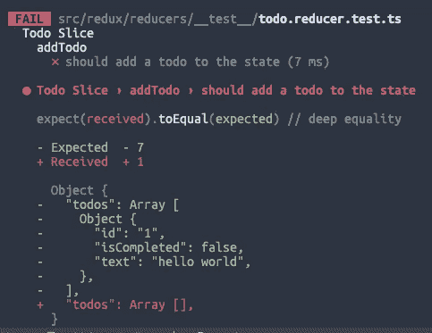
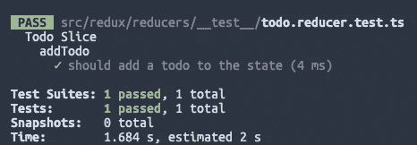
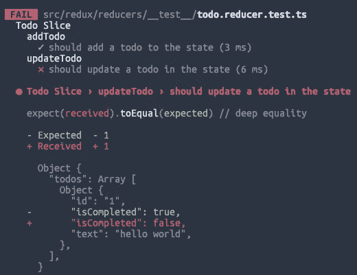
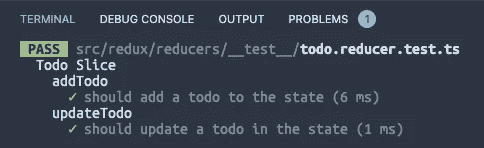
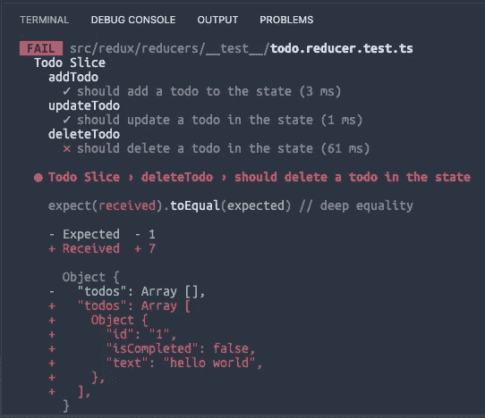
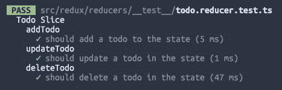

# 使用 TypeScript 和 Redux 切片的现代测试驱动开发

> 原文：<https://javascript.plainenglish.io/modern-test-driven-development-with-typescript-and-redux-slices-32c249fdc8fe?source=collection_archive---------8----------------------->

## 测试你的 React 应用，让它防弹。


Photo by [Arnold Francisca](https://unsplash.com/@clark_fransa?utm_source=unsplash&utm_medium=referral&utm_content=creditCopyText) on [Unsplash](https://unsplash.com/s/photos/code?utm_source=unsplash&utm_medium=referral&utm_content=creditCopyText)

敏捷软件开发中最重要但最容易被忽视的实践之一是单元测试。在我的职业生涯中，我使用过很多工具和语言，但还没有发现任何一种工具和语言能像在 TypeScript/JavaScript 中那样容易地测试您的代码。作为前端工程师，我们有责任确保尽可能多的代码被某种单元测试覆盖。除了检查错误的明显好处之外，单元测试还可以作为一种文档形式，以及使我们的功能和组件更小、更可重用的一种练习。

在过去的几年里，我们有幸在 React 世界中拥有了处理 TypeScript 和 Redux 切片的能力。TypeScript 为我们提供了类型(显然🙂)而 Redux 片使我们的状态管理代码比传统的 Redux 更简洁。它们一起作为 React 应用程序的强大工具。本文将使用一个 todo 列表示例向这些工具的用户展示如何有效地对他们的代码进行单元测试并构建防弹应用程序。

## **入门**

为了构建我们的待办事项列表，我们将使用单元测试的红/绿重构模型。这意味着对于每个功能，我们将经历以下步骤:

1.  用足够的代码写一个函数来编译(还没有逻辑)🙅)
2.  编写一个包含该功能预期结果的单元测试
3.  运行测试，看着它失败
4.  写一个我们认为会通过单元测试的函数
5.  运行函数并观察测试通过

首先，我们将创建一个样板文件缩减器和单元测试来确保一切正常。我们不写任何逻辑，只写足够的代码来编译应用程序。Redux 切片应该如下所示:

```
import { createSlice } from "@reduxjs/toolkit";const todoSlice = createSlice({
  name: "todo",
  reducers: {}, 
  initialState: {}, 
});export default todoSlice.reducer;
```

您的单元测试文件应该如下所示:

```
import todoSlice from "../todo.reducer";describe("Todo Slice", () => {
  describe("My First function", () => {
    it("should compile", () => {
      expect(1).toEqual(1);
    });
  });
});
```

如果此时运行`yarn test`，测试应该会编译并通过。

## **添加待办事宜**

我们将在本文中构建的第一个函数是向我们的状态添加一个 todo。因为我们使用单元测试的红/绿方法，我们从编写足够编译的代码开始，但是不足以通过我们的测试。一旦我们的测试失败，我们可以逆向创建我们的函数。让我们首先为我们的 todos 创建一个模型。我们的 todo 模型将有`isCompleted`、`text`和`id`属性。然后我们可以用这个模型来创建我们的初始状态。它看起来会像这样:

```
type Todo = {
  id: String;
  text: String;
  isCompleted: boolean;
};export type TodoState = {
  todos: Todo[];
};export const INITIAL_STATE: TodoState = {
  todos: [],
};const todoSlice = createSlice({
  name: "todo",
  reducers: {},
  initialState: INITIAL_STATE,
});
```

我们还将编写一个函数，它的主体什么也不做，并将它添加到 reducers 中:

```
const todoSlice = createSlice({
  name: "todo",
  reducers: {
    addTodo: (state, action) => {
      return state;
    },
  },
  initialState: INITIAL_STATE,
});export const { addTodo } = todoSlice.actions;
```

最后，我们可以编写第一个失败的测试😄！我们的测试将创建一个 todo 模型，创建 todo 操作并尝试修改状态。我们可以将之前的测试重构为以下形式:

```
import todoSlice, {
  addTodo,
  INITIAL_STATE,
  Todo,
  TodoState,
} from "../todo.reducer";describe("Todo Slice", () => {
  describe("addTodo", () => {
    it("should add a todo to the state", () => {
      const todo: Todo = {
        id: "1",
        isCompleted: false,
        text: "hello world",
      };
      const action = addTodo(todo);
      const expectedResult: TodoState = {
        todos: [todo],
      };
      const actualResult = todoSlice(INITIAL_STATE, action);
      expect(actualResult).toEqual(expectedResult);
    });
  });
});
```

如果我们在这一点上运行我们的测试，我们应该看到图标红色的测试失败文本。



酷！现在我们已经设置了 todo 模型，这样我们就知道了模型的样子，我们也设置了 todo 状态，这样我们就知道了它应该是什么样子。让我们来构建一个可以向状态添加数据的函数。更改 reducer 函数，使其具有添加新 todo 的逻辑。

```
reducers: {
  addTodo: (
    state: TodoState, action: PayloadAction<Todo>
  ) => {
    const newTodo = action.payload;
    state.todos = [...state.todos, newTodo];
  },
},
```

此时，您应该通过了测试！我们已经完成了第一次红绿重构🎉。



## **修改一个待办事宜**

让我们再做几个函数，这样您可以更好地感受 TS/Redux 片单元测试的体验。这一次，我们将通过将现有的 todo 更新为 completed 状态来解决状态中已经有数据的情况。像上次一样，我们添加一个空存根并导出它。

```
updateTodo: (state, action) => {
  return state;
},...export const { addTodo, updateTodo } = todoSlice.actions;
```

然后我们编写失败的测试，显示标记为完成后的状态。

```
describe("updateTodo", () => {
  it("should update a todo in the state", () => {
    const todo: Todo = {
      id: "1",
      isCompleted: false,
      text: "hello world",
    };
    const state: TodoState = {
      todos: [todo],
    }; const updatedTodo: Todo = {
      id: "1",
      isCompleted: true,
      text: "hello world",
    }; const action = updateTodo(updatedTodo); const expectedResult: TodoState = {
      todos: [updatedTodo],
    }; const actualResult = todoSlice(state, action);
    expect(actualResult).toEqual(expectedResult);
  });
});
```

注意我是如何使用 todo 创建一个“状态”来模拟`todoSlice` reducer 函数中的应用程序状态的？这种“嘲笑”状态的方式对于初学者来说通常很难掌握。我想强调一下，作为对这一领域初学者的一点专业提示。不过，通过这次测试，我们又回到了赤字状态。



让我们通过真正实现我们的更新函数来解决这个问题。

```
updateTodo: (
  state: TodoState, action: PayloadAction<Todo>
) => {
  const updatedTodo = action.payload;
  const newTodoArray = [...state.todos];
  const index = newTodoArray.findIndex((todo) => {
    return updatedTodo.id === todo.id;
  });
  newTodoArray[index] = updatedTodo;
  state.todos = newTodoArray;
},
```

至此，红绿循环二完成🔥。我们现在可以在应用程序中添加和更新 todos。



## **删除待办事宜**

让我们通过实现 delete 来结束本文。这将非常类似于 update，但是为了完整起见，我想用最后一个 CRUD 操作来结束。实现您的`deleteTodo`存根并如下导出:

```
deleteTodo: (state, action) => {
  return state
}
...
export const { addTodo, updateTodo, deleteTodo } = todoSlice.actions;
```

然后进行如下的`deleteTodo`测试:

```
describe("deleteTodo", () => {
  it("should delete a todo in the state", () => {
    const todo: Todo = {
      id: "1",
      isCompleted: false,
      text: "hello world",
    };
    const state: TodoState = {
      todos: [todo],
    };
    const action = deleteTodo("1");
    const expectedResult: TodoState = {
      todos: [],
    };
    const actualResult = todoSlice(state, action);
    expect(actualResult).toEqual(expectedResult);
  });
});
```

让我们看着它失败



然后通过实现函数来结束:

```
deleteTodo: (
  state: TodoState, action: PayloadAction<string>
) => {
  const id = action.payload;
  state.todos = [...state.todos].filter((todo) => id !== todo.id);
},
```

这样，所有的测试都通过了，我们有了一个工作的 todo reducer:



## **最终想法**

感谢您阅读我关于 TDD 和 TypeScript 和 Redux Slices 的文章。因为这段代码太短了，所以我不会把它全部放在 GitHub 上。如果你想要一个用 TS 和 TDD 进行单元测试的项目的例子，你可以检查[这个 repo](https://github.com/friyiajr/ReduxSliceCodeAlong) 并导航到`final-solution`分支。这是一个小项目，从互联网上获取一个口袋妖怪使用其 Pokédex 号码。我希望您喜欢这篇文章，并期待在您的下一个项目中使用 TS 和 Redux 尝试红/绿重构技术！

*更多内容请看*[***plain English . io***](http://plainenglish.io/)*。报名参加我们的* [***免费周报***](http://newsletter.plainenglish.io/) *。在我们的* [***社区***](https://discord.gg/GtDtUAvyhW) *获得独家获得写作机会和建议。*