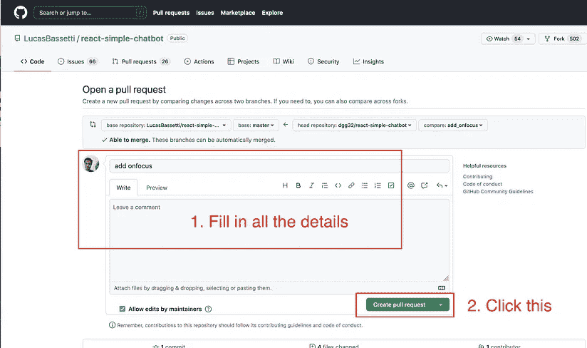

# 修改和发布 npm 包

> 原文：<https://javascript.plainenglish.io/modify-and-publish-an-npm-package-e8c87dc4723f?source=collection_archive---------4----------------------->

## React 简单聊天机器人的完整演练

Photo by [Paul Esch-Laurent](https://unsplash.com/@pinjasaur?utm_source=unsplash&utm_medium=referral&utm_content=creditCopyText) on [Unsplash](https://unsplash.com/s/photos/npm?utm_source=unsplash&utm_medium=referral&utm_content=creditCopyText)

作为一名 JavaScript 开发人员，您一定已经使用了许多 npm 包。你有没有在每次输入`npm install`或者`npm start`的时候问自己，这些包是怎么制作和发布的？外部开发人员如何对项目做出贡献？这个简短的教程向您展示了如何修改一个开源包，向原始存储库发出一个 pull 请求，并以您的用户名将其发布到 npm registry。我将使用 Lucas Bassetti 的优秀的 React Simple 聊天机器人和 VS 代码作为这个项目的编辑器。对于本教程，您需要使用 [npm CLI](https://docs.npmjs.com/downloading-and-installing-node-js-and-npm) 。

# 1.派生存储库并进行更改

首先，进入 GitHub 并登录。然后叉卢卡斯的[反应简单的聊天机器人](https://lucasbassetti.com.br/react-simple-chatbot/)。

Figure 1\. Fork the source repository. Image by the author.

然后克隆您的新存储库并进行更改。例如在`lib/ChatBox.js`中，我在第 698 行和第 699 行之间添加了一个名为`onFocus`的新道具，并在第 209 行之后实现了它。通过这些更改，聊天机器人中的输入字段将在获得焦点时更新其值。

Figure 2\. Modify the code. Image by the author.

然后在控制台中运行以下命令。

他们初始化项目，然后用你在`dist`文件夹中的更改构建新的`react-simple-chatbot.js`和`react-simple-chatbot.js.map`。

# 2.把它推到你叉子上的一个新分支

现在转到 VS 代码中的`Source Control`选项卡，您应该会看到四个文件。如下创建一个名为`add_onfocus`的新分支。

Figure 3\. Create a new branch for your changes. Image by author.

用消息提交更改，并将提交推送到 GitHub fork。现在，您的更改已经为拉请求做好了准备。

# 3.打开一个新问题和一个拉式请求

在您创建一个拉取请求之前，您最好先与项目所有者讨论一下变更。你可以通过在 GitHub 页面上打开一个新的问题来实现。

Figure 4\. Open a new issue in the repository. Image by author.

在新的一期中，你可以向业主解释提议的功能。告诉他们这些变化是关于什么的，为什么它们有用，以及用户可能如何使用它们。之后，您可以发起一个拉请求。

Figure 5\. Make a pull request. Image by author.

您应该会在原始存储库的`Pull requests`选项卡中看到您的新 pull 请求。

# 4.发布 npm 包

您也可以选择将其发布为您自己的 npm 包。如果你还没有 npm 账户，在这里注册一个。请注意，您的帐户需要一个 MFA。之后，打开您的控制台，导航到您的项目文件夹并运行以下命令。

第一个命令将您的系统连接到您的 npm 帐户。

Figure 6\. npm adduser. Image by the author.

第二个命令启动项目元数据。填写您的信息。请注意，您需要增加一点您的版本号。

Figure 7\. npm init. Image by the author.

最后一个命令将软件包推送到 npm 注册表。

Figure 8\. npm publish. Image by the author.

您现在可以登记入住`npmjs.com`。你应该能找到你名下的新包裹。

Figure 9\. Your own npm package in npmjs.com. Image by the author.

# 5.测试您的包

现在，您应该能够使用这个命令在您的项目中使用自己的 React 简单聊天机器人。

此命令下载您的包并将依赖项添加到您的项目中。如果它没有错误地完成，那么恭喜你！您刚刚制作了自己的 npm 包。

# 结论

npm 是一个庞大的生态系统。它的兴旺是因为无数开发者的无数贡献。所以对我们来说，做出贡献也很重要。这篇文章教你这一基本技能。所以请继续写你自己的库或者贡献给你最喜欢的 npm 模块。

*更多内容尽在* [***说白了. io***](https://plainenglish.io/) *。报名参加我们的* [***免费周报***](http://newsletter.plainenglish.io/) *。关注我们关于* [***推特***](https://twitter.com/inPlainEngHQ) *和*[***LinkedIn***](https://www.linkedin.com/company/inplainenglish/)*。加入我们的* [***社区***](https://discord.gg/GtDtUAvyhW) *。*