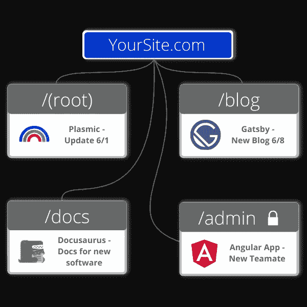
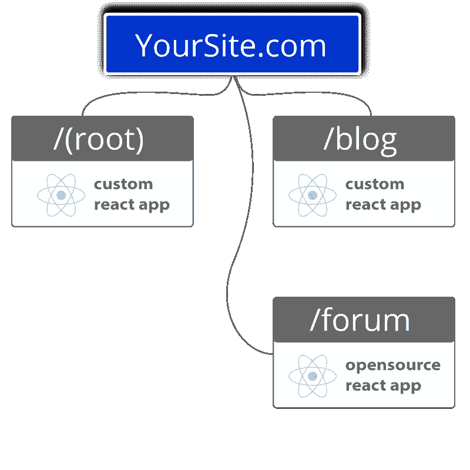

# 当在整个站点中使用相同的框架时，模块化前端如何工作

> 原文：<https://javascript.plainenglish.io/modular-frontends-are-fantastically-functional-45bc3017bc6d?source=collection_archive---------8----------------------->

## 看看当你的站点上的每个路由、应用和页面都使用相同的框架时，模块化前端是如何工作的。

模块化前端的功能非常强大，无论你想如何使用它们，无论是与多个框架、无代码工具和单页面应用程序创建者一起使用，还是如果你想始终使用同一个框架。

让我们深入了解模块化前端的概念，然后看看当你的网站上的每个路由、应用和页面都使用相同的框架时，模块化前端是如何工作的。

# 模块化前端定义

关于微前端的一个误解是架构的工作方式。至少，和我们在一起。这是我们将名称改为“模块化”前端的部分原因。

微前端的一种常见方法是将一个页面分解成多个*组件*。这不完全是我们做模块化前端的方式。

相反，在模块化方法中，我们使用“路线”,允许你在每条路线下运行尽可能多的应用或页面。把路由想象成一个网站的子路径。由于它是完全模块化的，每个应用程序/页面都可以由一个开发人员或一个独立的团队创建。

例如，对于/blog 路径，您可以将多个不同的博客页面放在其内部/下面。比如:博客主页、blog1、blog2、blog3、另一个页面上的内容链接列表，甚至另一个页面上的照片库——都在/blog 路径下！

“一条路线下的每个应用/页面都是它自己的 NPM 包或 GitHub repo，”工程总监杰里米·汤姆林森解释道。“这意味着你可以使用不同的团队。也意味着不再堵！”

我们在您的域上独立托管每条路线和应用程序/页面。这意味着没有更多的子域名，使您的网站更容易被客户找到。

对终端用户来说，所有的途径(博客、定价、文档等。)看起来好像所有东西都是用同一个整体代码库编写的。然而，它不是，这意味着代码库更小，因此更容易更新，替换，改变，缩放和修复错误！

# 使用模块化前端的优势

我们只是分享了使用模块化方法的一些好处，但这里有一个完整的列表:

*   个体的、独立的、较小的前端。
*   更小、更有凝聚力的代码库。这也使得它们更容易维护和更改。
*   多个团队同时从事他们自己的项目。
*   这意味着更小的增量部署。一个团队不会等待另一个团队发布他们的更新。
*   允许根据需要扩展团队。
*   给予能力重写，改变或更新部分前端递增。这意味着修复漏洞或改变网站的部分功能不会迫使整个网站停机维护。

# 模块化前端可视化

如果你读到这里，你可能会想，“好吧，这听起来很棒，但是这样建立一个网站实际上会是什么样子呢？”

嗯，我的朋友，它看起来就像这样:

正如你所看到的，我们所说的每个不同的“路线”可以由不同的团队运行，在这种情况下，不同的框架和/或无代码构建者。

假设您需要添加一些新的技术文档。你可以通过 Docusaurus 来完成——就像我们在我们的站点上做的一样——通过在 markdown 中编写那个文档，使用代码编辑器(比如 Visual Studio 代码)将它添加到站点，然后通过 GitHub 创建一个 pull 请求。

然后你的 QA 人员只需要批准 PR，将分支合并到集成中，并使用 Fathym 进行部署。

这个新文档没有中断博客部分的工作，也没有减缓对“根”主页或管理区的更新。文档的修改只是简单地被制作和批准，网站的所有其他区域继续嗡嗡作响，就像什么都没发生一样。

那样真的挺奇妙的！

那个更新的例子也可以通过许多不同的迭代继续。

# 模块化前端工作流程

另一个例子是您的营销人员添加了一个新的博客——在本例中是 Gatsby——并创建了一个 pull 请求，以便在部署该博客之前获得批准。

同样，也许你想更新主页，用一个漂亮的，新的特色产品公告。根据上图，负责主页工作的团队成员只需进入 Plasmic 进行更改，然后再次创建拉取请求。

在 Fathym 的模块化前端中，工作流就是这样。我们允许多个团队和个人全天执行任务，每个人都做一些小而独立的事情，但要完成团队的目标。每当团队成员对他们正在做的工作进行更新时，他们只需创建一个 pull 请求，由 QA 人员批准或拒绝，然后用 Fathym 进行部署。

想象一群蜜蜂。

在某些情况下，这些工蜂外出寻找它们能找到的最好的花粉，在近处和远处都有搜寻。每只工蜂都在完成自己的任务，然后它们带回来帮助整个蜂巢。

那些蜜蜂以模块化的方式工作，发现了“分而治之”的工作流程，我们也一样。

它允许更小的团队，像我们的(和你的！)，在短时间内完成大的任务和目标。

简单地说，模块化前端为 web 开发提供了一种更有效的方法。

# 具有相同框架的模块化前端

到目前为止，我们一直在谈论在你的路线下为你的不同应用/页面使用不同框架和无代码工具的[力量。但是请记住，如果对你的团队或公司最有利的话，你可以在任何事情上使用相同的框架。](https://www.fathym.com/blog/articles/2022/june/2022-06-06-go-fully-modular-frontend)

由于您可以使用不同的库和 NPM 包的组合，它仍然提供了巨大的灵活性。参考上面的图片，使用 Fathym，你可以模块化并为站点的每个部分使用不同的 React repos，而不是为整个站点使用一个巨大的 React repos 库。

我们之前列出的好处仍然适用:个人，独立，更小的前端。更小、更有凝聚力的代码库。多个团队同时从事他们自己的项目。较小的增量部署。根据需要扩展团队。此外，这意味着处理依赖性管理和不同团队需要不同版本的库的时间更少，并且避免了所有相关的麻烦。

# 结论和签约

在 Fathym，我们的平台允许开发人员和非开发人员通过使用 JAMstack 架构来构建具有模块化前端的网站。这意味着使用无代码工具、静态站点生成器或 JavaScript 框架来完成这一壮举。或者用户可以使用三者的组合，同时托管在一个域中。

Fathym 在一个域下部署不同技术栈和 repos 的灵活性，使其成为一种令人印象深刻的灵活和无缝的方式，为网站的不同部分提供最好的工具来构建您的前端。

[立即注册，免费使用 Fathym](https://www.fathym.com/dashboard) 托管您的网站。

*最初发表于*[T5【https://www.fathym.com】](https://www.fathym.com/blog/articles/2022/august/2022-08-16-modular-frontends-fantastically-functional)*。*

*更多内容看* [***说白了。报名参加我们的***](https://plainenglish.io/) **[***免费周报***](http://newsletter.plainenglish.io/) *。关注我们关于* [***推特***](https://twitter.com/inPlainEngHQ) ，[***LinkedIn***](https://www.linkedin.com/company/inplainenglish/)*，*[***YouTube***](https://www.youtube.com/channel/UCtipWUghju290NWcn8jhyAw)*，以及* [***不和***](https://discord.gg/GtDtUAvyhW) *。***