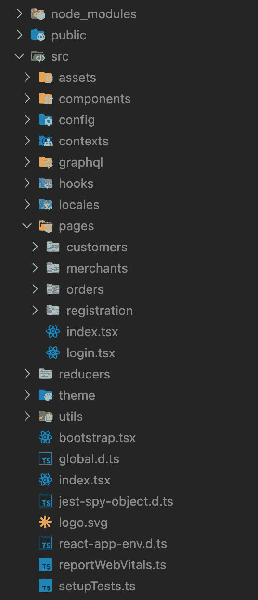
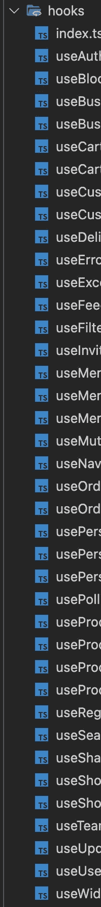
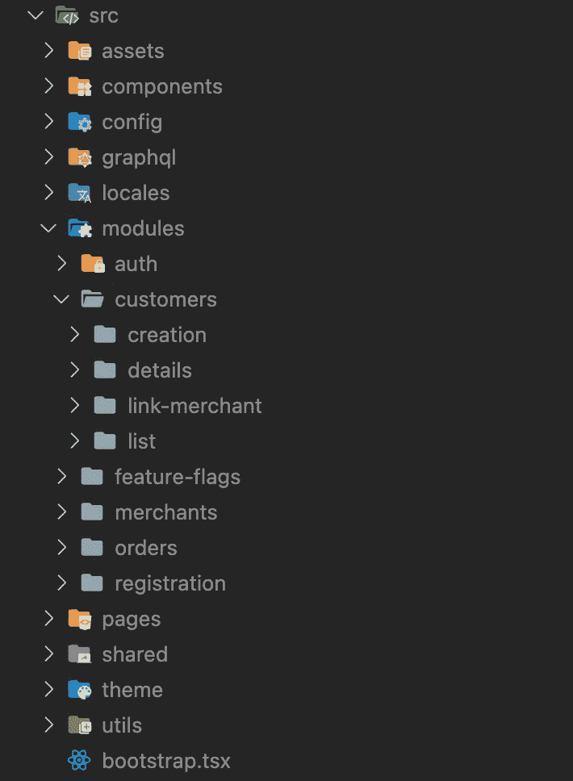
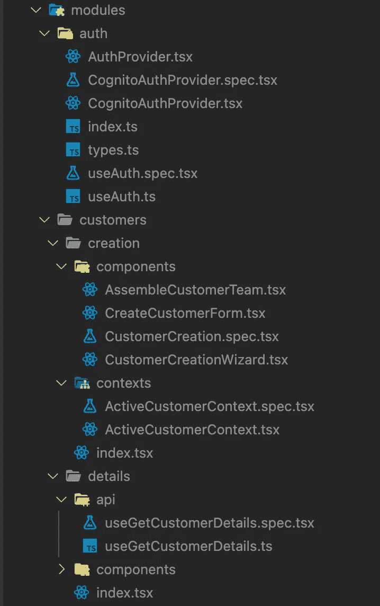
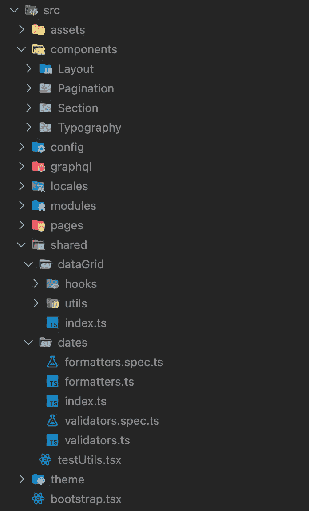
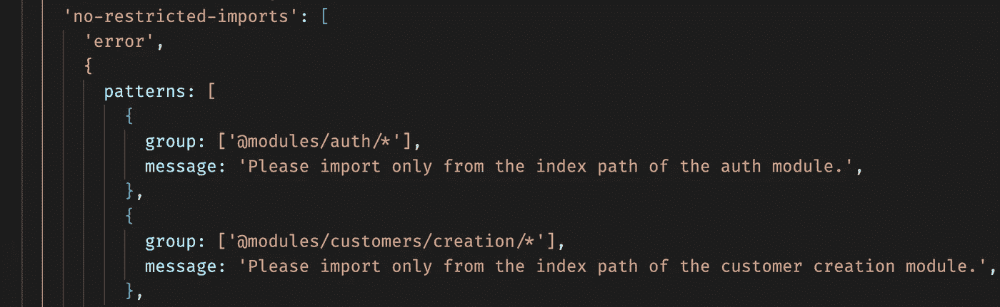

# 模块化反应应用

> 原文：<https://javascript.plainenglish.io/modular-react-applications-c316783df0aa?source=collection_archive---------6----------------------->

构建应用程序是每个项目开始时的一个大讨论话题。关于如何在 React 应用程序中安排目录，有许多常见的做法。

我看到的最常见的方法是根据框架单元类型在顶层构建文件。一个框架单元可以是一个钩子、上下文、反应组件或者缩减器(对于`useReducer`钩子是需要的)。

然后我们有不一定属于 React 的文件，比如实用方法，所以我们把它们移到一个 utils 目录。

`pages`目录创建了与 NextJS 的兼容性，并且是基于每个页面的 URL 构建的。

`theme`要么包含 UI 框架的配置(material UI，tailwind 等等)，要么包含应用程序的样式表。

通常，还有一个`types`目录，包含在多个地方使用的类型和接口。

这种方法可能在大多数教程中使用，并且非常适合小型应用程序，在这些应用程序中没有多少人工作，并且很容易跟踪应用程序的职责。

随着应用程序的增长，人们添加越来越多的文件，这种结构变得难以忽视。也很难跟踪应用程序中的子域有多大，并且变化总是跨越整个目录树。

这种结构还鼓励人们将几乎每个功能放在不同的文件中以匹配该结构，这导致了不必要的导出和软件组件内聚性的不可见性。例子可能是将 reducer 函数从一个定制的`useReducer`钩子中分离出来，或者实现定制的钩子从一个上下文中获取值，并将它们放在`hooks`目录中的某个地方。

# 根据文件的域上下文对齐文件

Clean Architecture 提出了一个架构方案，叫做“[尖叫架构](http://blog.cleancoder.com/uncle-bob/2011/09/30/Screaming-Architecture.html)”。这个方案建议以这样一种方式组织架构，其中文件组织的主要优先级是突出应用程序的目的(或上下文)。

应该通过遍历目录树并在每一层获得更具体的信息，将使用应用程序的人员引导到他们需要更改的文件。

这意味着应用程序可以根据需要增长并承担尽可能多的子域，但是需要在应用程序内的特定子域环境中工作的人(或团队)应该拥有在子域级别上可见的环境中完成任务所需的一切。

## 介绍模块

前面提到的构建方法并不是构建应用程序的坏方法。它不应该被过度使用，也不应该在最高层使用。

子域的结构大部分时间已经由`pages`的结构给出。但是仍然有可能重新排列 URL，并且在不同的子路径上可以访问一个上下文的页面。

为了创建一个有意义的软件内聚部分的分组，我们可以引入模块目录。有些在子文件夹中创建结构，比如`modules`。其他人直接在应用程序的顶层创建模块化结构。

我们还会有跨领域的关注，如认证，这需要在登录页面以及注册过程中使用。我们可能会在多个其他页面中使用它的其他功能(如注销)。

将横切关注点从业务领域模块中分离出来是一个偏好问题。示例应用程序的开发人员选择将横切关注点也视为模块。

`customers`目录被扩展以显示我们可以有一种情况，我们想把一个子域分成更小的块。当子域名变得越来越大，需要拆分时(甚至可能由单独的团队管理)，这样的情况就会出现。

## 在模块内部

一个模块本身可以被视为一个小的应用程序。一个模块可能依赖于其他模块。在这种模块化方法中，这些依赖性将变得更加明显，因此可以更加小心地管理。

该模块应该包含一个索引文件，该文件公开了所需的组件。维护索引文件允许开发人员跟踪每个模块公开的内容。

模块内部的结构可能会随着模块的发展而变化。如果一个模块被重新构造，依赖模块中的变化应该是不必要的，因为其他模块应该只依赖于索引文件。

auth 模块很小，因此没有人认为在这个阶段需要引入子文件夹。当模块所需的导出在索引文件中定义时，我们可以很容易地引入子文件夹。

其他模块被分成组件、实用程序、上下文和其他目录，以便根据文件在本模块中的用途对其进行分组。同样，目录结构与其他依赖模块无关，但随着模块的增长，它将有利于模块的可维护性。

## 最高级别

在顶层，我们仍然有常见的目录，如`components`、`pages`和`utils`(在我们的例子中已经移到了`shared`，但也可以命名为`utils`)。

根级别的`components`目录只包含通用和抽象的组件，它们不绑定到任何上下文，可以作为基础在任何地方使用。

我们的`components`目录相对较小，因为这个应用程序使用了组织的一个组件库包，其中包含公司的企业设计中的设计系统和 UI 组件。您通常会在这样的`components`目录中找到更多的组件，例如文本输入、按钮、卡片、图标、其他表单元素等等。

`pages`目录仍然包含与路由对齐的应用程序页面，因为这是众所周知的 NextJS 标准，我们不想破坏它。

这些页面是微小的组件，很少包含应用程序逻辑和代码分支，只是从各自的模块导入组件。

`shared`目录也可以被命名为`utils`、`helpers`或类似的名称。它包含可以在整个应用程序中使用的实用方法，但不包含可以分配给某个已识别模块的业务逻辑。

内聚代码也可以被分组到这个目录中(就像使用`dataGrid`助手一样)。

# 实施导入规则

如上所述，来自其他模块的代码应该只从索引文件中导入。这可以由 ESLint 用`no-restricted-imports`规则来执行。

也可能出现导入周期。这些可以用`eslint-plugin-import`的`no-cycle`法则检测出来。模块之间的循环依赖不应该发生，因为它们可能会导致意想不到的问题，如“内存溢出”问题和 TypeScript 中较慢的类型检查。

依赖循环通常是错误抽象的标志，可以通过为循环的原因找到一个更好的抽象并抽象成一个可以放入根级别的通用组件，或者通过应用[依赖倒置](https://deviq.com/principles/dependency-inversion-principle)并将具体组件移动到一个模块中来解决。

# 包裹

管理内聚和耦合是软件工程中的一个重要课题。这是一种跟踪软件系统偶然和本质复杂性的方法。

大多数框架都不可避免地规定了一个深入的目录结构。我们总是可以选择一种方式来突出我们正在构建的应用程序的目的。

本文描述的方法是众多方法中的一种，没有明确的指南。构建软件应用程序没有“唯一正确的方法”。总是由开发人员来决定是遵循特定的指导方针还是尝试其他方法来提高应用程序的可维护性。主要目标应该是创建高内聚、低耦合的应用程序。

*更多内容尽在* [***说白了. io***](https://plainenglish.io/) *。报名参加我们的* [***免费周报***](http://newsletter.plainenglish.io/) *。关注我们关于* [***推特***](https://twitter.com/inPlainEngHQ) ，[***LinkedIn***](https://www.linkedin.com/company/inplainenglish/)*，*[***YouTube***](https://www.youtube.com/channel/UCtipWUghju290NWcn8jhyAw)*，* [***不和***](https://discord.gg/GtDtUAvyhW) ***。***

***对缩放您的软件启动感兴趣*** *？检查* [***电路***](https://circuit.ooo/?utm=publication-post-cta) *。*