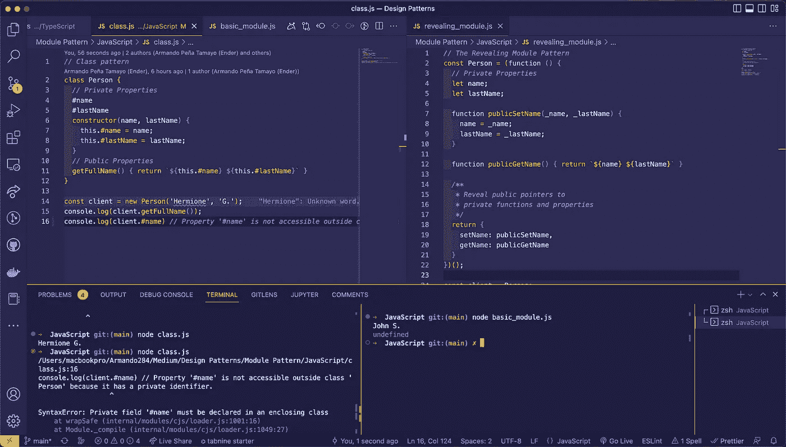

# 模块设计模式与 JavaScript 中的类

> 原文：<https://javascript.plainenglish.io/module-design-pattern-vs-classes-in-javascript-45568e74ad2a?source=collection_archive---------5----------------------->

## 几个关于 JavaScript 中模块模式和类的用法和区别的例子。



JavaScript class and Module Pattern examples side by side.

## 现代 JavaScript 的最佳实践是什么，模块模式还是类？

因此，我想说的第一件事是，我没有这个问题的答案，对我来说，一切都取决于你试图解决的问题，以及其他一些事情，比如，如果你的老板喜欢函数式编程，讨厌面向对象编程，这只是一个例子！但是有一点我很清楚，为了能够使用你需要的那个，你需要知道它们的区别，当然你需要理解它们并且能够自己实现它们，而不是仅仅从 StackOverflow 复制它…

## 首先让我们了解一些课程的背景:

类是面向对象编程的主要特征之一，也是语言的重要组成部分，它强烈支持这种方法。

正如我们在 Mozilla 开发者网站上看到的那样。

> 类是创建对象的模板。他们用代码封装数据来处理这些数据。

然而在 JavaScript 中，直到最近我们才拥有类。

> JS 中的类是建立在原型之上的，但是也有一些语法和语义是 ES5 类语义所没有的。

有了这个新特性，我们就有可能使用封装了属性和方法的类作为模板来编写 OOP，从而创建共享公共逻辑的新对象，这样可以节省大量的时间和资源。

```
// JavaScript Class
class Person {
  // Private Properties
  #name
  #lastName
  constructor(name, lastName) {
    this.#name = name;
    this.#lastName = lastName;
  }
  // Public Properties
  getFullName() { return `${this.#name} ${this.#lastName}` }
}

const client = new Person('Hermione', 'G.');
console.log(client.getFullName()); // Hermione G.
console.log(client.#name) 
// Property '#name' is not accessible outside class 'Person'
// because it has a private identifier.
```

因此，正如我们在这个例子中看到的，一个类作为一个模板工作，稍后将用于创建对象，然后将信息添加到创建的模板中。

然而，我们在这里看到的私有属性只是在今年年初才被添加到 ES2022 的 JavaScript 中(本文正是在这一年撰写的)！正如我们在[我能使用](https://caniuse.com/?search=javascript%20private)中看到的，仍在使用的旧浏览器仍然存在兼容性问题。

保护类中属性的范围是本身支持类的语言的一个主要特性，但是 JavaScript 类并不是真正的类！

> 类实际上是“特殊函数”

所以这就提出了一个问题！正如我们在这段代码中看到的。

```
// TypeScript Class
class Person {
  private name: string;
  private lastName: string;
  constructor(name: string, lastName: string) {
    this.name = name;
    this.lastName = lastName;
  }
  public fullName(): string { return `${this.name} ${this.lastName}`; }
}

const dev = new Person('Andrew', 'W.');
console.log(dev.fullName()); // Andrew W.
console.log(dev.name) 
// Property 'name' is private and only accessible
// within class 'Person'.
```

在这里，我们可以编写更常规的私有和公共属性或方法，当我们在处理我们的 TypeScript 文件时，如果我们试图访问私有属性，我们会得到一个错误，这是 TypeScript 的奇迹之一。

但是当我们把这段代码编译成 JavaScript 时会发生什么呢？

```
"use strict";
// TypeScript Class compiled into JavaScript
class Person {
  constructor(name, lastName) {
    this.name = name;
    this.lastName = lastName;
  }
  fullName() { return `${this.name} ${this.lastName}`; }
}
const dev = new Person('Armando', 'Peña');
console.log(dev.fullName()); // Armando Peña
// Supposedly the 'name' property should be private
// according to the TypeScript file but, we can still access it.
console.log(dev.name); // Armando
```

这里我们立刻失去了我们私有财产的隐私范围。这可能成为一个问题！

## 现在模块设计模式:

最基础的模块是任何健壮应用程序的基础部分，因为它有助于保持代码的整洁、分离和组织。提高可伸缩性和维护性。

现在在 JavaScript 中，我们有几种方法来管理模块。模块模式就是其中之一，它被用来模拟类的概念，但包括公共/私有属性和方法，通过使用闭包来保护某些部分不受全局范围的影响。使用这种模式，我们获得了一个清晰的问题解决方案，并且只返回一个公共 Api，其他的都被隐藏和保护起来。

```
// JavaScript Module Pattern
const Person = (function () {
  /**
   * Private Properties
   * Even if we declare this variables as var instead of let,
   * they still are not accessible.
   */
  let name;
  let lastName;
  return {
    /**
     * Public Properties
     * Everything inside the returned object will be accessible.
     */
    setName: function (_name, _lastName) {
      name = _name;
      lastName = _lastName;
    },
    fullName: function () { return `${name} ${lastName}` }
  }
})();

const client = Person;

client.setName('John', 'S.');
console.log(client.fullName()); // John S.
// The name property is not accessible.
console.log(client.name); // undefined
```

正如我们在这里看到的，一切都与一个立即调用的函数表达式(IIFE)一起工作，记住 JavaScript 类只是函数，它声明了一组私有属性(在这个例子中是*中的*名*和*姓*)*，现在不要混淆，即使这些属性是用*变量*而不是 *let* 声明的，它们仍然是私有的！在那之后，函数返回一个带有影响私有属性的方法的对象，但是没有办法直接影响或获取私有属性，至少你可以有意地尝试破解它，但是这不是重点！在那之后，你可以像导出模块一样导出对象，或者按照你想要的方式使用它，你将能够安全地使用实际上没有兼容性问题的私有属性。

审视这种模式的另一种方式叫做揭示模块模式。

```
// JavaScript Revealing Module Pattern
const Person = (function () {
  // Private Properties
  let name;
  let lastName;

  function publicSetName(_name, _lastName) {
    name = _name;
    lastName = _lastName;
  }

  function publicGetName() { return `${name} ${lastName}` }

  /**
   * Reveal public pointers to 
   * private functions and properties
   */
  return {
    setName: publicSetName,
    getName: publicGetName
  }
})();

const client = Person;

client.setName('Harry', 'P.');
console.log(client.getName()); // Harry P.
// The name property is not accessible.
console.log(client.name); // undefined
```

这两者之间最大的区别是，在这种模式中，我们在生命中声明的所有东西都是私有的，我们只返回一个指向我们想要向全局范围公开的属性或方法的指针。

支持私有数据是一个非常好的优势，也有助于来自面向对象编程背景的开发人员有一个更干净的开始。

## 抓住了！

尝试这种模式时，需要考虑一些事情。

例如:

私有属性的单元测试有额外的困难。

找到并纠正私有部分的错误是一项挑战。

如果使用显示模块模式，一个私有函数引用一个公共函数，那么公共函数不能被修补，因为私有函数将继续引用函数的私有版本，不会受到修补的影响！

既然我们已经了解了每种方法的工作原理，我们就可以自己决定在什么条件下实施这种或那种方法更好。

我不认为自己是设计模式方面的专家，事实上，这篇文章是我目前正在做的调查的一部分，目的是提高我对这个主题的理解，成为一名更好的软件工程师。因此，如果你看到任何你不同意的地方，我们非常欢迎你留下评论，这样我们就可以讨论它了。

如果你想更多地了解这个主题，我推荐你。

看看这个 Youtube 频道。

[](https://www.youtube.com/@DevSage) [## 发展

### 学习不应该是一场斗争！DevSage 提供在线 Web 开发和编程教程…

www.youtube.com](https://www.youtube.com/@DevSage) 

读这本书。

[](https://www.patterns.dev/posts/classic-design-patterns/) [## 学习 JavaScript 设计模式

### 设计模式是软件设计中常见问题的可重用解决方案。它们既令人兴奋又是一个…

www.patterns.dev](https://www.patterns.dev/posts/classic-design-patterns/) 

他们都没有给我任何报酬，我只是觉得他们在这件事上很有一套。

我也有一个 Github 库，我会在上面上传我做的所有关于设计模式的代码样本。我将主要使用 JavaScript、TypeScript 并去那里，所以如果你感兴趣的话可以去看看。

[](https://github.com/Armando284/design_patterns) [## GitHub-Armando 284/design _ patterns:不同语言的设计模式研究

### 此时您不能执行该操作。您已使用另一个标签页或窗口登录。您已在另一个选项卡中注销，或者…

github.com](https://github.com/Armando284/design_patterns) 

我希望这篇文章对你有帮助，如果你对这个主题感兴趣，我计划每周继续写其他不同的模式。

*更多内容请看*[***plain English . io***](https://plainenglish.io/)*。报名参加我们的* [***免费周报***](http://newsletter.plainenglish.io/) *。关注我们上*[***Twitter***](https://twitter.com/inPlainEngHQ)[***LinkedIn***](https://www.linkedin.com/company/inplainenglish/)*[***YouTube***](https://www.youtube.com/channel/UCtipWUghju290NWcn8jhyAw)**和* [***不和***](https://discord.gg/GtDtUAvyhW) *对成长黑客感兴趣？检查* [***电路***](https://circuit.ooo/) ***。*****