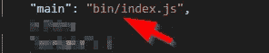
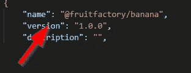

# 使用 NPM 和类型脚本的 Monorepo 设置

> 原文：<https://javascript.plainenglish.io/monorepo-setup-with-npm-and-typescript-90b329ba7275?source=collection_archive---------0----------------------->


Photo by [Safar Safarov](https://unsplash.com/@codestorm?utm_source=medium&utm_medium=referral) on [Unsplash](https://unsplash.com?utm_source=medium&utm_medium=referral)

您是否曾经想要创建一个项目，但是使用本地包？能够从其他本地包中导入本地包？最好的部分是，有一个单一的 node_modules 目录？有一个*单个* `tsc`来重建改变后的包(但保持其他的不变)？作为一个不错的奖励，减少 transpile 和启动程序的时间？

> 解决办法就是用一个`monorepo`！本指南展示了使用 NPM + TypeScript 手动设置 monorepo 的步骤。

# 目标

*   只有一个`node_modules`文件夹(在 monorepo 的根目录下)。
*   产品的每个部分(阅读:本地包)将有自己的文件夹，有自己的`package.json`、`tsconfig.json`，但使用 monorepo 的`node_modules`。
*   在 monorepo 根传输中运行`tsc`,按顺序传输所有包。
*   使用`import .. from`可以正确引用本地包。

**本指南未涉及:**构建生产构建—本指南侧重于开发人员体验:)

# TL；DR；—演示回购？

有，有 demo [回购](https://github.com/tomnil/monorepoplate)。

# Monorepo 基础

monorepo 由两部分组成。

*   monorepo 本身(包含配置文件的根文件夹，如`package.json`、`node_modules`、`tsconfig.json`等)
*   每个本地包一个文件夹，位于包文件夹中。每个本地包都有自己的配置，如`package.json`、`tsconfig.json`、`src`-文件夹等(但**没有**、`**node_modules**`)。
*   我建议在 monorepo 的根目录下设置一个`tsconfig.package.json`，参考一下。

..当然还有工具，`npm`和`tsc`🙂

## 包裹？本地套餐？

这是一个旁注，但是开发者使用的“包”通常是指通过`npm`或`yarn`从互联网下载的包。本指南既指远程包(位于互联网上，可能是由你之外的其他人开发的)也指本地包。

# 核心 monorepo 设置

让我们创建最基本的文件夹。这个演示项目将被命名为“SuzieQ”。

```
# Create new empty foldermkdir monorepodemo
cd monorepodemo# Create subdirectories
mkdir src
```

## 。/package.json

接下来，创建一个包含以下内容的`./package.json`:

```
{
  "name": "suzieq",
  "private": true,
  "scripts": {
    "compile": "tsc -b -w -i",
    "eslint": "eslint src/**/**.{ts,tsx}",
    "eslint:fix": "eslint src/**/**.{ts,tsx} --fix"
  },
  "devDependencies": {},
 **"workspaces": [
    "packages/*"
  ]**
}
```

⚠️Make 确信“工作区”一节是存在的，`npm`就依赖于此。

## 添加核心依赖项

这里是添加核心依赖项的好地方。这也创建了整个 monorepo 所需的单个`node_modules`目录。

```
npm install [@types/node](http://twitter.com/types/node) --save-dev
npm install typescript
npm install ts-node --save-dev
```

## 。/tsconfig.json

接下来，用下面的内容创建一个`./tsconfig.json`。

⚠️️ `composite`必须设置为`true`并且`files`必须设置为数组(参见[https://www . typescriptlang . org/docs/handbook/project-references . html # overall-structure](https://www.typescriptlang.org/docs/handbook/project-references.html#overall-structure))

```
{
  "compilerOptions": {
    "incremental": true,
    "target": "es2019",
    "module": "commonjs",
 **   "declaration": true,**
    "sourceMap": true,
    "strict": true,
    "moduleResolution": "node",
    "esModuleInterop": true,
    "skipLibCheck": true,
    "forceConsistentCasingInFileNames": true,
   ** "rootDir": "./src",
    "outDir": "./superbin"**
  },
 **"files": [
    "./src/index.ts"
  ]**
}
```

## 。/src/索引. ts

创建`./src/index.ts`文件:

```
console.log("This is index.ts"); 
```

…并测试其工作情况:

```
# Build, this will create the "superbin" folder
tsc -b # Run index.ts
node -r ts-node/register/transpile-only src/index.ts
```

## 准备包文件夹

下一步是创建 packages 文件夹，所有本地包都将放在该文件夹中:

```
mkdir packages  # This folder should be found directly under "./"
cd packages 
```

简单提醒一下:

*   每个包将被放置在文件夹`/packages`的子文件夹中。
*   monorepo 配置将存储在根目录下(即`"./"`)

# 添加本地包

本指南展示了如何手动创建软件包所需的所有文件。也可以使用 npm，见下文。这一部分可以根据需要重复多次。

我们将创建的包被命名为`ValidatorHelper`(只是为了挑选任何东西)。

```
*# create package folder inside of "packages"* mkdir ValidatorHelper
cd ValidatorHelper
```

## 。/packages/ `ValidatorHelper` /package.json

在新创建的文件夹中，创建一个`package.json` as(这意味着您现在将有两个 package.json，一个在 monorepo 根目录，另一个在这里):

```
{
  "name": "@suzieq/validatorhelper",
  "version": "1.0.0",
  "description": "",
  "main": "bin/index.js",
  "scripts": {
    "compile": "tsc -b",
    "test": "echo \"Error: no test specified\" && exit 1"
  },
  "author": "",
  "license": "ISC"
}
```

⚠️更改名称并**确保** **名称是唯一的**(并且它不能干扰 npm 可下载的包)。建议选择一个作用域名，比如“@suzieq”(它会让你的 monorepos `node_modules`目录更干净，阅读下面的更多内容)。

⚠️不使用*相同的*“范围名称”和“项目目录名称”。`npm`将 node_modules 中的“优化”从目录名中移除作用域名称🙄

如果你喜欢减少控制，基本上同样的结果可以通过:

```
cd /   # Go to root of monorepo
npm init --scope=@suzieq -w ./packages/ValidatorHelper
```

## 节点模块的“破解”

这非常重要。`npm`将自动处理在“packages”下找到的任何`package.json`，并在`node_modules`与该文件夹之间创建一个链接。


inside node_modules


link to the packages\validatorhelper folder

因此，每次在**之后，**一个本地包已经被创建(或者说，一个`package.json` 已经被创建/修改)，然后转到 monorepo 根并运行`npm install`(并可选地检查`node_modules`以获得更新的链接)。

⚠️在包目录中做*而不是*运行`npm install`。`node_modules`从此被单一回购“拥有”，应该存在于单一回购的根本。以下是关于这个话题的更多信息。

## 。/packages/ `ValidatorHelper/` tsconfig.json

现在有很多例子说明这个文件扩展了一个已经存在的`tsconfig.json`。这很好，但是为了简单起见，这里没有使用这个特性。

必须指定`rootDir`、`outDir`和`composite`设置。

该配置将使包使用包含的 TypeScript 定义将其结果构建到`./bin`。

```
{
    "compilerOptions": {
        "incremental": true,
        "target": "es2019",
        "module": "commonjs",
        "declaration": true,
        "sourceMap": true,
        "strict": true,
        "moduleResolution": "node",
        "esModuleInterop": true,
        "skipLibCheck": true,
        "forceConsistentCasingInFileNames": true,
 **"rootDir": "./src",
        "outDir": "./bin",
        "composite": true**
    },
}
```

## 。/packages/ `ValidatorHelper/src/` index.ts

最后，创建文件夹`src`和`index.ts`文件。

```
console.log("Debug: Loading ValidateHelper/index");export function ValidateUserName(name: string): boolean {
    return (name !== undefined && name.length > 10);
}
```

## 验证包装是否正常

在这一点上，可以检查一切看起来都正常。

```
# Change working directory
cd /packages/ValidatorHelper# Examine the combined tsconfig-file (this and the root one)
tsc --showconfig# Testrun the module (as-is)
node -r ts-node/register src/index.ts
```

在这里运行`tsc`应该是 transpile 没有错误，产生一个`bin`文件夹，包含两个文件:`index.js`和`types.d.ts`。

如果在 monorepo 根目录下运行`tsc`，将会生成相同的文件。

```
# Just check tsc succeeds without creating "bin" folder:
tsc --noEmit# Build (choose the one you prefer)
tsc -b --listEmittedFiles --diagnostics
tsc -b -v # Test run
node bin\index.js
```

# 重复:)

在进入下一节之前，再添加一些任何类型的本地包。

# 使用 tsc 传输所有修改过的包(以特定的顺序)

现在，这就是有趣的地方😁通过在顶层发出`tsc`，可以贯穿*所有*修改过的包并进行编译。这在手表模式下运行`tsc`时特别有效。但是为了做到这一点，需要修改`tsconfig.json`来列出包。

打开 monorepo 根`./tsconfig.json`并添加如下图所示的`references`部分。

⚠️将按照列出的顺序构建，所以这意味着你必须对包之间的依赖有所了解。

️️⚠️If 的`files`配置丢失(或者设置错误)，那么您的类型脚本文件可以构建两次**😟导致你的软件包 src 文件夹中出现“垃圾”文件。解决这一问题的良好开端是将`files`设置为`[]`。**

```
{
  "compilerOptions": {
      // leave as-is
  },
  **"references": [
    {
      "path": "./packages/ValidatorHelper"
    }
  ],
  "files": [
    "./src/index.ts"
  ]** }
```

试试看:

```
# Transpiles packages in the order listed *and*
# then build the files referenced by "paths"cd /  # Go to root of monorepo
tsc -b -v
```

## 在这点上…

此时，每个本地包将具有:

*   制作一个`./packages/<packagename>/bin`文件夹
*   作为从`node_modules/@scopename/<packagename>`到`./packages/<packagename>`的链接而存在

# NPM 包:在本地包之间添加引用

我们可以利用 TypeScript/JavaScript 作品中模块解析的一个漏洞。😁如果你喜欢用“真实的方式”来做这件事，请阅读下一节。

现在，我们所有的本地包都可以立即使用，不需要对任何文件做任何更改(想了解更多吗？阅读此[链接](https://www.typescriptlang.org/docs/handbook/module-resolution.html)。只需打开`./src/index.ts`并添加这个，你就可以开始了。

```
import ValidatorHelper from '@suzieq/validatorhelper'
```

## 添加更好的参考

打开一个`package.json`，用下面的代码添加一个对本地(已经存在)包的引用。

```
"dependencies": {
    "[@suzieq/products](http://twitter.com/suzieq/products)": "*"
}
```

`*`意味着我们允许任何版本。

## 避免文件引用？

因此`npm`建议使用文件引用:

```
npm install .\packages\<packagename> -w packages\<packagename>
```

这个命令将在`package.json`中给出类似这样的结果，但它并没有带来任何好处。

```
"dependencies": {
        "[@suzieq/products](http://twitter.com/suzieq/products)": "file:packages/Products"
}
```

# npm 软件包:将外部 NPM 软件包添加到本地软件包

这很重要，因为这和通常的做法不同。要将外部 npm 软件包添加到本地 npm 软件包，必须遵循以下步骤:

转到 monorepo 的根目录，运行`npm`通过传递`-w`参数在工作区安装一个包**。该参数接受包的名称(在本例中为`@suzieq/validatorhelper)`)或路径(`./packages/ValidatorHelper`)**

```
# Go to the root of the monorepo
cd /# Add axios to ValidatorHelper
npm install axios -w @suzieq/validatorhelper# Or use the path
npm install axios -w .\packages\ValidatorHelper
```

这将在 monorepos `node_modules`中安装`axios`，并修改`./packages/ValidatorHelper/packages.json`。通过检查 monorepo 根目录下是否只存在一个`node_modules`文件夹来验证成功。

⚠️:非常明确地说，**不要这样做**(如果你设法做到了，请参见下面的故障排除解决方法):

```
cd packages\ValidatorHelper
npm install axios
```

## 在正确的地方引用？

下载包的引用存储在 monorepo `package.json`中与拥有它`packages\packagename\package.json`真的有关系吗？不，反正有用。

# 开始测试一个特定的或所有的包

要为所有包启动一个`npm`命令，只需添加`-ws`:

```
# Run tests for a specific package from root
npm test -w @suzieq/validatorhelper# Run tests for all local packages
npm test -ws
```

# 为一个特定或所有程序包启动 tsc

```
# Build a specific package from root
cd /
tsc -b packages\ValidatorHelper# Build all
cd /
tsc -b -v -w -i
```

# 解决纷争

## 正在修复…

如果你已经陷入了一个似乎没有任何帮助的境地，通过以下步骤来修复你的设置:

*   删除`node_modules\@scopename\`中的链接(不需要删除整个`node_modules`)。运行`npm install`重新创建它们。
*   删除在整个系统中找到的任何`bin`或`out`文件夹
*   验证所有包装`package.json` :s 是否正常
*   停止所有正在运行的`tsc` :s，删除*所有* `tsconfig.tsbuildinfo`文件，重新启动`tsc` *，不增加标志*

## VSCode 和/或 TypeScript 没有检测到/看到本地包？

重启`vscode`:)同时，确保`outDir`设置`tsconfig.json`与`package.json`中的`main`设置相匹配


tsconfig.json



package.json

## 节点 _ 模块

问:我已经在一个本地包中运行了`npm install packagename`，并且(错误地)创建了`packages\packagename\node_modules`。

答:只需删除`node_modules`文件夹，然后重试从 monorepo 根目录安装软件包。

## 找不到工作区

问:我不能跑`npm install axios --workspace=@xyz/abc`

**解决方案 1:** 该部分在 monorepo `package.json`中缺失:

```
 "workspaces": [
    "packages/*"
  ]
```

**解决方案二:**
你实际上拼对名字了吗？:)

a)如果您选择使用包的路径，请确保它存在。Eg 测试`dir ./thepath`

b)如果你选择使用包的*名*(如包`package.json`中所述)，确保你完全复制它(包括斜线)。



c)`outDir`设置`tsconfig.json`是否与`package.json`中的`main`设置相匹配？

## EDUPLICATEWORKSPACE

问:试图和 NPM 一起工作，我得到了重复的工作空间

答:`name`字段的值在`packages`的一个子目录中的一个`package.json`中被多次使用。NPM 将列出冲突的文件，只要确保所有本地包有唯一的名字。

## npm 警告工作区 abc/xyz 筛选器集，但不存在工作区文件夹

问:我不能跑`npm install axios --workspace=@suzieq/apple`

答:所以工作区设置看起来没问题，但是没有找到提交的工作区名称。确保`--workspace`的名称参数可以在`package.json`s`name`字段中找到；

```
"name": "@suzieq/xyz"
```

## 无法设置 null 的属性(设置“dev”)

这个错误可能是由几个原因造成的。

**解决方案一:** 从删除`node_modules\@suzieq`中的所有文件开始。要重新创建内容，只需运行`npm install`。

验证文件夹`node_modules\@suzieq`创建无误。

**解决方案二:** 答:在 apple-package:s 文件夹内，打开`package.json`。`devDependencies`或`dependencies`损坏。

**解决方案三:** 确保 package.json 文件中的所有“name”属性都有唯一的名称。

## 使用 tsc 时，它会产生。我的 src 文件夹中的 js 文件

`tsconfig.json`中缺少文件部分。见上文。

```
"files": [
    "./src/index.ts"
]
```

# 演示存储库？

是的，有一个。参见[https://github.com/tomnil/monorepoplate](https://github.com/tomnil/monorepoplate)

# 享受:)

## 进一步阅读

[](https://bit.cloud/blog/painless-monorepo-dependency-management-with-bit-l4f9fzyw) [## 使用 Bit 进行无痛 monorepo 依赖管理

### 简化 monorepo 中的依赖关系管理，以避免虚拟依赖关系和版本问题。了解…

比特云](https://bit.cloud/blog/painless-monorepo-dependency-management-with-bit-l4f9fzyw) 

*更多内容请看*[***plain English . io***](https://plainenglish.io/)*。报名参加我们的* [***免费周报***](http://newsletter.plainenglish.io/) *。关注我们关于*[***Twitter***](https://twitter.com/inPlainEngHQ)[***LinkedIn***](https://www.linkedin.com/company/inplainenglish/)*[***YouTube***](https://www.youtube.com/channel/UCtipWUghju290NWcn8jhyAw)***，以及****[***不和***](https://discord.gg/GtDtUAvyhW) *对成长黑客感兴趣？检查* [***电路***](https://circuit.ooo/) ***。*****