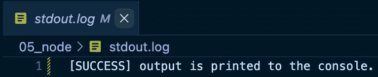

# 不仅仅是 console.log()

> 原文：<https://javascript.plainenglish.io/more-than-just-console-log-d7065d449089?source=collection_archive---------6----------------------->

基本的`console.log()`命令可能是 JavaScript 中最常用的命令，用于将消息打印到控制台输出。然而，在`**console**`模块中有更多值得了解的方法。

Image by [Colleen ODell](https://pixabay.com/users/starglade-768093/?utm_source=link-attribution&utm_medium=referral&utm_campaign=image&utm_content=4109213) from [Pixabay](https://pixabay.com//?utm_source=link-attribution&utm_medium=referral&utm_campaign=image&utm_content=4109213)

# 1.语义日志

我们可以使用`info`、`warn`和`error`等方法为控制台日志提供语义。

下面是窗口中的控制台输出。我们可以通过肉眼区分不同种类的原木。

> 请注意，这些用户界面更改在`node`控制台/ REPL 中不可用。

# 2.将日志保存到文件中

我们可以使用`**fs**`和`**console**`模块将日志保存到文件中。

通过设置位置来分别保存标准输出和错误日志，我们可以更有效地记录日志。这可以在运行后端代码时使用，其中可以回溯错误日志以进行调试。

这里`**logger**`的作用与`**console**`相同。下面我们可以看到两个文件，它们分别对应于`logger.log`和`logger.error`的预期输出。

# 3.将对象记录为表格

在构建 CRUD 应用程序时，我们经常使用一组具有相同键长的 JSON 类型的对象。

使用`console.table`，我们可以将数组输出到一个表中，因此能够以结构化的形式可视化数据。

# 4.日志嵌套对象

对于大量嵌套的对象，我们可以使用`console.dir`而不是`console.log`，因为我们可以更好地控制输出的深度。

Data: [https://opensource.adobe.com/Spry/samples/data_region/JSONDataSetSample.html](https://opensource.adobe.com/Spry/samples/data_region/JSONDataSetSample.html)

`console.log`以混合格式输出嵌套对象，很难一目了然地理解数组的整体结构。

通过使用`console.dir`并指定`**depth**`等于 1，我们可以**立即看到数组**中每个对象的键。

# 5.经过的日志时间

我们经常想知道我们的总代码运行了多长时间，以控制云资源，比较算法，BigO，只是为了好玩，等等。

使用`console.time`有一个简单的方法。

`console.time`启动定时器，`console.timeEnd`结束定时器。`**timeHere**`是代表计时器的*字符串*，可以任意命名。

> 注意我们必须使用相同的字符串`**timeHere**`来结束计时器。

# 好了

通常情况下，使用像`console`这样的现有模块比任何替代方案都好，因为它具有低内存使用量和低复杂性的绝对优势。

看看其他资源:

*   [https://developer.mozilla.org/en-US/docs/Web/API/console](https://developer.mozilla.org/en-US/docs/Web/API/console)
*   [https://www.youtube.com/watch?v=76uAswpaXP0](https://www.youtube.com/watch?v=76uAswpaXP0)

现在我们有了。我希望你已经发现这是有用的。感谢您的阅读！

## 更多内容请访问 [PlainEnglish.io](https://plainenglish.io/) 。

*报名参加我们的* [***免费每周简讯***](http://newsletter.plainenglish.io/) *。关注我们关于*[***Twitter***](https://twitter.com/inPlainEngHQ)，[***LinkedIn***](https://www.linkedin.com/company/inplainenglish/)***，***[***YouTube***](https://www.youtube.com/channel/UCtipWUghju290NWcn8jhyAw)***，以及****[***不和***](https://discord.gg/GtDtUAvyhW)*

## *希望扩大你的科技创业公司的知名度和采用率吗？检查[电路](https://circuit.ooo/?utm=publication-post-cta)。*