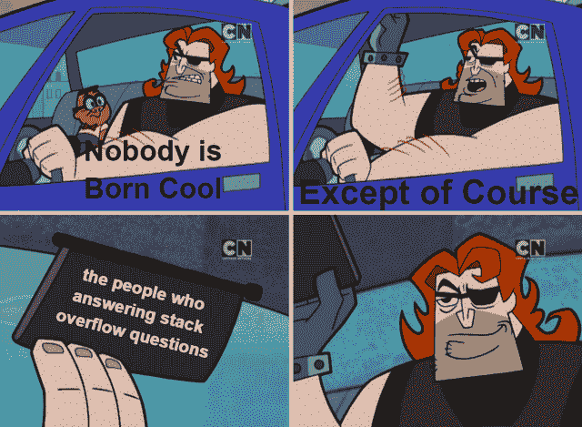

# 互联网上最搞笑的编程迷因趋势

> 原文：<https://javascript.plainenglish.io/most-hilarious-programming-memes-trending-on-the-internet-1325b9711198?source=collection_archive---------1----------------------->

## 每日一剂的编程迷因

Photo by [Priscilla Du Preez](https://unsplash.com/@priscilladupreez?utm_source=medium&utm_medium=referral) on [Unsplash](https://unsplash.com?utm_source=medium&utm_medium=referral)

你是程序员吗？如果是的话，你是否需要打破常规，找点乐子？在这篇文章中，我收集了一些最好的编程笑话，它们肯定会像“**刷新**按钮一样为你工作。

# 有人在床上参加他们的单口相声吗？

Picture Credit:[https://www.reddit.com/r/ProgrammerHumor/](https://www.reddit.com/r/ProgrammerHumor/)

# 当他们想雇佣一个 Java 开发人员来维护 COBOL 时…

Picture Credit: [https://programmerhumor.io/](https://programmerhumor.io/)

# 真正的开发者表情符号…

Picture Credit:[https://www.reddit.com/r/ProgrammerHumor/](https://www.reddit.com/r/ProgrammerHumor/)

# 它运行良好，但不是我想要的方式。

Picture Credit: [https://programmerhumor.io/](https://programmerhumor.io/)

# 我经常遇到这种情况，找不到答案，但当我提问时，会得到大量的建议...

Picture Credit:[https://www.reddit.com/r/ProgrammerHumor/](https://www.reddit.com/r/ProgrammerHumor/)

# 我保证它会有所回报…

Picture Credit:[https://www.reddit.com/r/ProgrammerHumor/](https://www.reddit.com/r/ProgrammerHumor/)

# 为什么担心？让我们使用简单的方法...英雄联盟

Picture Credit:[https://programmerhumor.io/](https://programmerhumor.io/)

# 当一个经理问这个愚蠢的问题时…

Picture Credit:[https://www.reddit.com/r/ProgrammerHumor/](https://www.reddit.com/r/ProgrammerHumor/)

# 当你没有得到任何新的变量名…

Picture Credit:[https://www.reddit.com/r/ProgrammerHumor/](https://www.reddit.com/r/ProgrammerHumor/)

# 不要修改旧的代码并在其上实现新的代码…

Picture Credit:[https://programmerhumor.io/](https://programmerhumor.io/page/3/)

# 当你认真对待指示时…

Picture Credit: [https://programmerhumor.io/](https://programmerhumor.io/)

# 把 IT 团队想象成一个乌贼游戏…

Picture Credit: [https://programmerhumor.io/](https://programmerhumor.io/)

# 普遍真理…

Picture Credit:[https://www.reddit.com/r/ProgrammerHumor/](https://www.reddit.com/r/ProgrammerHumor/)

# 当每个人都在看着你解决生产问题时…

Picture Credit:[https://www.reddit.com/r/ProgrammerHumor/](https://www.reddit.com/r/ProgrammerHumor/)

# 购买会员资格以了解…

Picture Credit: [https://programmerhumor.io/](https://programmerhumor.io/)

# 是的，直到他们将我的问题标记为重复或否决…

Picture Credit:[https://www.reddit.com/r/ProgrammerHumor/](https://www.reddit.com/r/ProgrammerHumor/)

# 这到底怎么可能？

Picture Credit: [https://programmerhumor.io/](https://programmerhumor.io/)

# 额外剂量

# 展示自己的作品总是更好… LOL

[https://www.facebook.com/DZoneInc/photos/a.336758034711/10159513354989712](https://www.facebook.com/DZoneInc/photos/a.336758034711/10159513354989712)

# 发生了很多次…我总是去不同的页面…

[https://www.facebook.com/DZoneInc/photos/a.336758034711/10159513354989712](https://www.facebook.com/DZoneInc/photos/a.336758034711/10159513354989712)

# 为什么编译器不够智能，无法自动修复所有问题？

[https://www.facebook.com/DZoneInc/photos/a.336758034711/10159505422369712/](https://www.facebook.com/DZoneInc/photos/a.336758034711/10159505422369712/)

# 看起来很管用…那应该够了…哈哈…

[https://www.facebook.com/DZoneInc/photos/a.336758034711/10159501229644712/](https://www.facebook.com/DZoneInc/photos/a.336758034711/10159501229644712/)

# 我们周一继续吧…

[https://www.facebook.com/photo?fbid=2965577677092733&set=gm.2875612219372995](https://www.facebook.com/photo?fbid=2965577677092733&set=gm.2875612219372995)

# 时间是可以定义的——程序员

[https://www.facebook.com/photo?fbid=352070916544458&set=gm.2875632262704324](https://www.facebook.com/photo?fbid=352070916544458&set=gm.2875632262704324)

# 你身后藏着可怕的东西…

[https://www.facebook.com/DZoneInc/photos/10159479172079712](https://www.facebook.com/DZoneInc/photos/10159479172079712)

# 那种和平是无法想象的…

[https://www.facebook.com/javascriptJS/photos/a.1387402908063976/2251831714954420/](https://www.facebook.com/javascriptJS/photos/a.1387402908063976/2251831714954420/)

# 在家工作…饼图…老实说，不是真的…

[https://www.facebook.com/yuva.krishna.memes](https://www.facebook.com/yuva.krishna.memes)

# 开发与质量保证版本…

[https://www.monkeyuser.com/2018/happy-flow/?sc=true&dir=random](https://www.monkeyuser.com/2018/happy-flow/?sc=true&dir=random)

# 当任务管理器有责任关闭没有响应的东西时…

[https://www.facebook.com/photo?fbid=10159630257979673&set=gm.2870233513227290](https://www.facebook.com/photo?fbid=10159630257979673&set=gm.2870233513227290)

# 希望你笑得很开心！

*更多内容看* [***说白了。报名参加我们的***](https://plainenglish.io/) **[***免费周报***](http://newsletter.plainenglish.io/) *。关注我们关于*[***Twitter***](https://twitter.com/inPlainEngHQ)*和*[***LinkedIn***](https://www.linkedin.com/company/inplainenglish/)*。查看我们的* [***社区不和谐***](https://discord.gg/GtDtUAvyhW) *，加入我们的* [***人才集体***](https://inplainenglish.pallet.com/talent/welcome) *。***