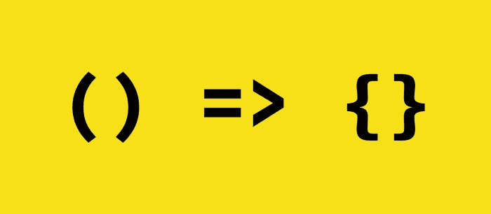

# 解释了最流行的 JavaScript 箭头函数

> 原文：<https://javascript.plainenglish.io/most-popular-javascript-arrow-functions-explained-39dee313c8d6?source=collection_archive---------5----------------------->

## 数组 map()，reduce()，filter()，forEach()，some()和 every()函数讲解。



# 介绍

JavaScript 引入了箭头函数表达式，它是可选的，语法比标准函数更紧凑。

这些箭头函数因其简洁的风格和易用性而变得非常流行。

让我们直接跳到一些例子。

# 箭头功能

箭头函数的基本语法是，括号`()` 内有`parameters`，后跟指向函数体的箭头`=>`。如果不需要`param`，我们可以省略它，不要用括号`()`:

```
// No param required. body is one line return statement
() => bodyExample:() => 'foo' // This function once called returns 'foo' string. 
```

我们刚刚创建了第一个*匿名*箭头函数！然而，为了调用它，我们要么需要传递它，要么指定一个名称:

```
const bar = () => 'foo'
```

现在我们可以这样称呼它:

```
bar(); // Returns 'foo'
```

这相当于遵循传统语法:

```
function bar() {
    return 'foo';
}
```

或者如果我们想保持匿名功能:

```
function () {
    return 'foo';
}
```

# 将函数转换为箭头函数

我们可以看到，有一种简单的方法可以将现有函数转换为箭头函数:

*   删除`function`关键字
*   在`()`和开口支架`{`之间增加箭头`=>`
*   如果给定的函数可以简化为一行，我们可以另外删除函数的开括号和闭括号`{ }`并删除`return`关键字，因为 return 是隐含的。

# Array.map

最常用和最流行的函数之一是`Array.map`，它接受一个数组并根据给定的函数返回转换(映射)的值:

```
const result = array.map(function)
```

这里我们可以提供传统功能举例:

```
const array = [1, 2, 3, 4, 5];function double (value) {
    return value * 2;
};const result = array.map(double); // Returns: [2, 4, 6, 8, 10]
console.log(array); // Array hasn't changed: [1, 2, 3, 4, 5]
```

正如我们所看到的，我们在这里没有使用箭头函数。然而，我们必须声明一个命名的函数，然后将该函数作为参数传递给`map`函数，该函数遍历数组中的所有项，将每个项作为输入参数传递并返回新数组。

显然，我们可以使用匿名函数，并将其直接传递给`map`:

```
const array = [1, 2, 3, 4, 5];const result = array.map(function (value) {
    return value * 2;
}); // Returns: [2, 4, 6, 8, 10]
```

这很好。我们甚至可以通过使用箭头函数语法来进一步简化这一过程:

```
const array = [1, 2, 3, 4, 5];const result = array.map(value => value * 2);
```

这非常简洁，也非常容易理解:我们有一个 arrow 函数，它将`value`作为输入参数(arrow 函数的左侧)，并返回`value`乘以`2`(arrow 函数的右侧)。

# Array.reduce

另一个流行的函数是`reduce`，它接受一个数组并将*简化的*结果返回为单个值。例如，我们可以将数组中的所有元素相加。

为了将数组缩减为单个值，reduce 需要至少两个输入参数:`previousValue`和`currentValue`(称为*聚合器*)。

```
const array = [1, 2, 3, 4, 5]; // Sum: 1 + 2 + 3 + 4 + 5 = 15const total = array.reduce((val, curr) => curr += val); // 15
```

为了更好地理解这一点，我们可以添加`console.log`输出和第三个参数`index`

```
const array = [1, 2, 3, 4, 5]; // Sum: 1 + 2 + 3 + 4 + 5 = 15const total = array.reduce((val, curr, index) => {
    console.log(`val: ${val} curr: ${curr} index: ${index}`);
    return curr += val;
}); // 15
```

我们的`console.log`会是什么样子:

```
"val: 1  curr: 2 index: 1"
"val: 3  curr: 3 index: 2"
"val: 6  curr: 4 index: 3"
"val: 10 curr: 5 index: 4"
```

我们可以看到我们实际上是从 index: `1`和`array[1] = 2`(这是当前值)开始的。先前的值是`array[0] = 1`。值 1 和 2 相加，并作为*上一个*值传递给下一次迭代(索引:2)。在`array[2]`处，我们有值`3`——我们将它们加在一起，得到`6`。接下来，在`array[3]`处，我们有值 4，其加在一起是用于下一次迭代的先前值，依此类推。最终我们得到了预期的`15`。

让我们注意，我们可以用某个值初始化`reduce`。为此，我们将初始值作为第二个参数传递。例如，如果我们使用`10`，那么我们的总和将是:`10 + 1 + 2 + 3 + 4 + 5 = 25`:

```
const array = [1, 2, 3, 4, 5];const total = array.reduce((val, curr) => curr += val, 10);
```

值得注意的是，如果我们使用初始值，那么`reduce`将从索引`0`开始，因为先前值是我们用来初始化`reduce`函数的值，而当前值在索引`array[0]`处，否则，所有工作完全相同。

# 数组.过滤器

数组`filter`应该是不言自明的，它接受一个数组并返回另一个包含通过给定条件的值的数组。

例如，让我们只返回偶数(数除以 2 得到零余数):

```
const array = [1, 2, 3, 4, 5];const even = array.filter(i => i % 2 === 0); // Returns: [2, 4]
```

# Array.forEach

数组`forEach`基本上是一个循环，它等价于`for`语法:

```
const array = [1, 2, 3, 4, 5];for (let i = 0; i < array.length; i++) {
    console.log(`value: ${array[i]} index: ${i}`);
    // some statements here
}
```

我们可以使用`forEach`语法:

```
const array = [1, 2, 3, 4, 5];array.forEach((item, index) => {
    console.log(`value: ${item} index: ${index}`);
    // some statements here
});
```

# 数组. some

Array `some`函数遍历给定的数组，并试图找到至少一个(一些)满足给定函数逻辑的元素。例如，让我们检查某个数组元素是否大于`10`:

```
const array = [1, 2, 3, 4, 5];array.some(i => i > 10); // returns false
```

我们可以改变我们的搜索标准，检查是否有低于`3`的数字—在我们的例子中是`1`和`2`:

```
const array = [1, 2, 3, 4, 5];array.some(i => i < 3); // returns true
```

这次我们得到了`true`,因为一些元素符合我们的逻辑。

# Array.every

数组`every`与前一个`some`非常相似——这次所有(每个)元素都必须匹配:

```
const array = [1, 2, 3, 4, 5];array.every(i => i > 10); // returns false
```

让我们看看是否能找到低于或等于`5`的元素:

```
const array = [1, 2, 3, 4, 5];array.every(i => i <= 5); // returns true
```

数组中的所有元素都匹配，因此我们得到了`true`。

然而，如果我们添加另一个项目或改变我们的数组:

```
const array = [1, 2, 3, 4, 5, 6];array.every(i => i <= 5); // returns false
```

不出所料，我们得到了`false`,因为数组中的元素并不都匹配。

# 结论

箭头函数是使代码更整洁、更简洁的好方法。如今，理解箭头函数语法是必须的。

在这个快速教程中，我们通过例子介绍了一些最流行的函数。

如果你有任何问题，请在下面留下评论。不然就鼓掌跟我来！

最后，你可以看看我的其他教程:

*   [用 JavaScript 计算斐波那契数列最快最有效的方法](https://medium.com/better-programming/fibonacci-algorithm-in-javascript-45743f3a0ff6)
*   [如何在无服务器的 AWS API 网关中使用自定义授权器](https://betterprogramming.pub/how-to-use-custom-authorizer-in-aws-api-gateway-with-serverless-4ddf42f32390)
*   [安全编码标准](https://levelup.gitconnected.com/secure-coding-standards-114be27e1253)
*   [JavaScript 析构](https://medium.com/geekculture/javascript-destructuring-1319c1808399)
*   [Node.js 和单例模式](https://medium.com/swlh/node-js-and-singleton-pattern-7b08d11c726a)

*更多内容请看*[***plain English . io***](https://plainenglish.io/)*。报名参加我们的* [***免费周报***](http://newsletter.plainenglish.io/) *。关注我们关于*[***Twitter***](https://twitter.com/inPlainEngHQ)*和*[***LinkedIn***](https://www.linkedin.com/company/inplainenglish/)*。查看我们的* [***社区不和谐***](https://discord.gg/GtDtUAvyhW) *加入我们的* [***人才集体***](https://inplainenglish.pallet.com/talent/welcome) *。*