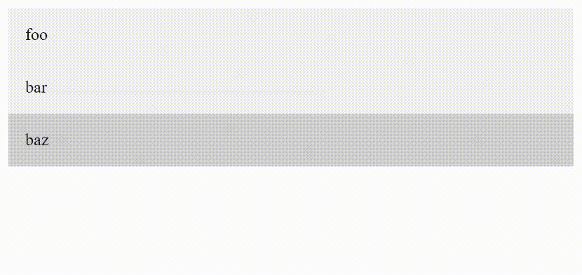

# 用 CSS 和 JavaScript 实现悬停时的移动背景效果

> 原文：<https://javascript.plainenglish.io/moving-background-effect-on-hover-with-css-and-javascript-b281739aebcd?source=collection_archive---------1----------------------->

*如何用 CSS 和 JS 创建背景翻译效果？*


Photo by [Marga Santoso](https://unsplash.com/@margabagus?utm_source=medium&utm_medium=referral) on [Unsplash](https://unsplash.com?utm_source=medium&utm_medium=referral)

本文将概述如何使用 CSS 和 JavaScript 重新创建这种效果。



The background transition effect on hover.

首先，我将总结您需要在代码中识别哪些元素。其次，我将解释实现这种效果所需的 CSS 和 JavaScript，最后，我将与您分享一个最小的代码片段。

在本文的最后，你会发现创建背景过渡效果的最小例子。

## 必需的组件

为了创造这种效果，需要三个主要组件:

1.  容器元素(项目的包装)
2.  项目(例如，导航元素)
3.  背景滑块的占位符元素

如果你希望这种效果是水平的还是垂直的过渡，这并不重要。下面的最小示例将显示这两者。

## 效果背后的主要思想

我们有一个相对定位的容器，作为背景滑块的边界。因此，滑块是绝对定位的，并沿所需的轴设置动画。同样重要的是要注意，我们必须相应地改变宽度和高度，因为不是所有的元素都有相同的尺寸。为此，我们需要几行 JavaScript 代码。
至于项目，没有特别的要求。

## 重建背景过渡效果

最简单的标记只包含容器、项目和滑块，可能如下所示:

```
<div class="container">
  <div class="slider"></div>
  <div>foo</div>
  <div>bar</div>
  <div>baz</div>
</div>
```

当`:not`选择器可用时，我们并不真的需要为我们的项目添加一个类(如果您不能使用它，那么您可能也需要为您的项目添加类)。

至于 CSS，就不多说了。根据你的喜好应用背景颜色。滑块的不透明度可以是 0，所以当元素悬停时，你可以得到一个很好的淡入动画。因为滑块是绝对定位的，所以这些项目是不可选择的。因此，您可能希望对它们进行定位并应用 z 索引。

JavaScript 代码更有趣。我们向容器中添加了两个事件侦听器(mouseout 和 mouseover)。

在 mouseout 上，我们再次移除滑块。在我的例子中，我简单地将不透明度设置为 0，这样它就淡出了。

鼠标悬停时，我们将不透明度设置为 1，并调整宽度和左侧样式或高度和顶部(取决于方向)。当然，我们也可以两者都应用，我们的效果在两种情况下都有效。

## 结果呢

正如我所承诺的，这是最终的结果供你参考:

垂直:

水平(唯一不同的是我在容器中添加了`display: flex`):

还有一点:我在这里使用了 top 和 left 属性；使用转换可能更好(也更有性能)。此外，我省略了可访问性和语义，以保持示例简单，并专注于效果。

就这些了，伙计们！

感谢您的阅读！

*更多内容请看*[***plain English . io***](https://plainenglish.io/)*。报名参加我们的* [***免费周报***](http://newsletter.plainenglish.io/) *。关注我们上*[***Twitter***](https://twitter.com/inPlainEngHQ)[***LinkedIn***](https://www.linkedin.com/company/inplainenglish/)*[***YouTube***](https://www.youtube.com/channel/UCtipWUghju290NWcn8jhyAw)**和* [***不和***](https://discord.gg/GtDtUAvyhW) *对成长黑客感兴趣？检查* [***电路***](https://circuit.ooo/) ***。*****