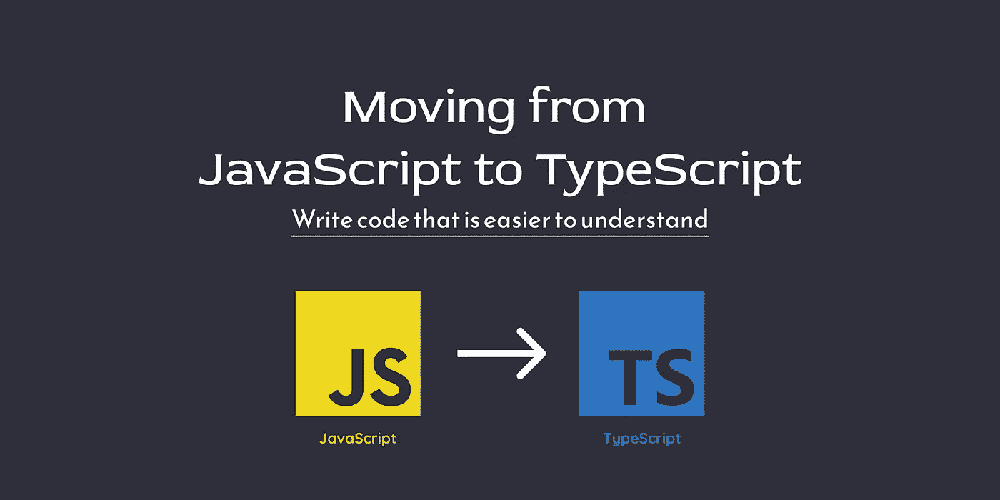

# 从 JavaScript 转移到 TypeScript

> 原文：<https://javascript.plainenglish.io/moving-from-javascript-to-typescript-262b23d35f15?source=collection_archive---------5----------------------->



# 介绍

我从事 JavaScript 开发已经很多年了，我真的没有太多意图去超越我的技术堆栈。我告诉自己，坚持自己已经知道的东西是很安全的，试图学习太多的编程语言可能会令人生畏。

学习 JavaScript 已经相当耗时，而且没有人真正掌握它，因为随着语言的发展，API 会随着文档不断更新。还有很多框架和库要学。

这是过时的想法，幸运的是，当我在找工作时，我看到了光明。公司在寻找通晓多种语言的开发人员，这实质上意味着一个人知道并能够使用几种编程语言。

# 扩展你的知识面

那时我意识到 JavaScript 是不够的，如果你真的想脱颖而出，那么你需要能够使用不同的编程语言。所以当时我决定学习 TypeScript 和 Python。具有讽刺意味的是，我实际上找到了一份工作，但公司只要求我使用 JavaScript，所以不幸的是，我忘记了我所学的大部分 TypeScript 和 Python，因为我只是没有每天使用它。

所有这一切都发生在我活跃在科技 Twitter 之前，也发生在我开始写博客之前，所以我真的不理解在公共场所建设和从事兼职项目的概念。我的理由是我已经有了一份工作，所以我不需要在周末也编程。

# 疫情期间找工作

快进到 2021 年，一切都变了。我们现在是与 Covid 一起生活的全球疫情的第二年。我花了大约 6 个月的时间才得到一份体面的工作，从那以后我一直在这家公司工作。在此期间，我参与了一些拥有 Python 和 Kotlin 后端的项目。所以我接触了不同的语言。

JavaScript 仍然是世界上最受欢迎的编程语言之一，并且会一直有很高的需求。它在 Stackoverflow 2021 调查中排名第一，而 TypeScript 排名第七。所以，如果 JavaScript 在全世界如此受欢迎和备受追捧，为什么还要学习 TypeScript 呢？

# 为什么你应该学习打字稿

尽管 JavaScript 很好，但与其他现代编程语言相比，它仍有许多缺陷。不幸的是，有很多人出于各种原因不喜欢 JavaScript。

TypeScript 基本上是一种开发 JavaScript 项目的现代方法，该语言编译成原始 JavaScript，因此浏览器和其他可能不了解 TypeScript 的开发人员仍然可以阅读您的代码库。老实说，语法是 JavaScript，所以即使你不熟悉 TypeScript，你仍然可以理解发生了什么。

TypeScript 旨在解决 JavaScript 存在的许多问题，这使得该语言更接近于其他现代编程语言。在我看来，任何讨厌 JavaScript 的人都可能爱上 TypeScript。或者至少少找点抱怨的理由。

# JavaScript 与 TypeScript

这两者之间有很多不同之处，我将在这里介绍其中的一些。

# 编译错误

TypeScript 能够在开发过程中标记编译时的错误。这是一个非常好的特性，因为这意味着当你的应用程序已经构建并运行时，你在运行时出错的可能性更小。JavaScript 只能在运行时看到这些错误，所以你很有可能会有更慢的调试，因为你现在做了更多不必要的检查。TypeScript 中可用的更好的工具在编写代码时提供了更好的体验。

# 静态类型与动态类型

JavaScript 使用动态类型，而 TypeScript 使用静态类型。使用动态类型，您可以重新分配变量，因为数据类型可以改变。这对于静态类型是不可能的，因为数据类型是定义好的，这意味着如果你试图指定一个不同的数据类型，它将显示一个编译错误。每种方法都有利弊。

```
// This is valid JavaScript code
let num = 10;
num = "10";// You will get the error Type 'string' is not assignable to type 'number'.
let num: number = 10;
num = "10";
```

# 使用接口描述数据

TypeScript 可以在代码中使用一个接口，这个接口很好地描述了应用程序中对象的结构。它定义了对象所需的整体语法，因此您可以在代码编辑器中将其用于文档和问题跟踪。

值得注意的是，TypeScript 编译器不会将接口语法转换成 JavaScript。它仅用于类型检查，也称为“鸭类型”或“结构子类型”。

```
// Describe the shape of objects in your code.
interface Series {
id: number;
seriesName: string;
releaseDate: number;
}// Use the interface for type checking in your object.
const series: Series = {
// The id needs to be a number
id: 1,
// The series name needs to be a string
seriesName: 'The Book of Boba Fett',
// The release data needs to be a number
releaseDate: 2021,
};console.log(series);
```

# CommonJS 模块与 es 模块

Node.js 默认使用 CommonJS 模块，任何熟悉它的人都会知道`require`语法。相比之下，当你使用 Node.js 和 TypeScript 时，你可以选择使用`require`或者`import`和`export`语句。当然，如果你做了研究，也有办法让它在原生 JavaScript 中工作。

**JavaScript CommonJS 模块**

```
const express = require('express');
```

**打字稿 ES 模块**

```
import express from 'express';
```

使用 TypeScript 时，您可以访问一个`tsconfig.json`文件，该文件允许您更改包括`target`在内的许多设置。这允许您为输出的 JavaScript 文件设置 JavaScript 语言版本。例如，它们可以是 ES2015、ES2016、ES2017 等...

# 打字稿的缺点

TypeScript 非常神奇，但是它也有一些你应该知道的缺点。首先，TypeScript 不能在浏览器中工作，所以在使用它之前，您必须将代码编译成 JavaScript。

幸运的是，TypeScript 有一个编译器，所以当你设置它时，它会自动将你的 TypeScript 文件编译成 JavaScript，幸运的是，这是一个快速的过程。所以你不必担心要等几分钟来编译你的代码，这个过程通常在几秒钟内完成。

另一个缺点是你将会写更多的代码，特别是如果你想要静态类型检查的话。不过我真的不认为这是一个缺点，因为你正在编写更高性能和更好的代码，这将使它更易于维护。

您还需要知道的是，除了您使用的一些普通包之外，您还需要一些类型声明包。类型声明包描述了内置对象。声明文件为您提供了一种声明类型或值的方法，因此无需为值提供任何类型的实现。

情况并不总是这样，因为有些包已经有了类型定义，但并不是所有的包都有。下面这个 Express Node.js 的例子更容易理解。

**JavaScript Express App**

```
npm i expressconst express = require('express');const app = express();app.get('/', (req, res) => {res.send('Home Route');});const port = process.env.PORT || 3000;app.listen(port, () => console.log(`Server running on port ${port}, [http://localhost:${port}`));](http://localhost:${port}`));)
```

**打字稿快递 App**

```
npm i express @types/express @types/nodeimport express, { Response, Request } from 'express';const app = express();app.get('/', (req: Request, res: Response) => {res.send('Home Route');});const port = process.env.PORT || 3000;app.listen(port, () => console.log(`Server running on port ${port}, [http://localhost:${port}`));](http://localhost:${port}`));)
```

# 类型脚本支持

TypeScript 得到了很好的支持，如果您选择的代码编辑器是 Visual Studio 代码，那么 TypeScript 将被视为一等公民，因为 Microsoft 开发了代码编辑器和语言。

几乎所有流行的 JavaScript 框架都支持 TypeScript。因此，这包括反应，角，Vue 和苗条。与其他 Node.js 框架一样，framework express.js 也与 TypeScript 兼容。因此，没有什么可以阻止您在应用程序的前端和后端使用 TypeScript。

另一个优点是，您现在可以在后端和前端本机使用 ES 模块。例如，如果您正在创建一个具有节点后端和反应前端的应用程序。现在，您可以使用`import`和`export`语句来实现这两个功能，并且不再需要使用 CommonJS 模块`require`语句。

# 如何学习打字稿

我从 Scrimba 学会了打字，也在 Udemy 上学习了另一门很好的打字课程。如果你已经知道 JavaScript，那么你不会花太多时间来掌握 TypeScript。另外，如果你是 JavaScript 新手或者还在学习基础知识，那么最好等到你有了更多的经验之后再学习 TypeScript。

[免费学习打字稿](https://scrimba.com/learn/typescript)
[了解打字稿— 2022 版](https://www.udemy.com/course/understanding-typescript/)