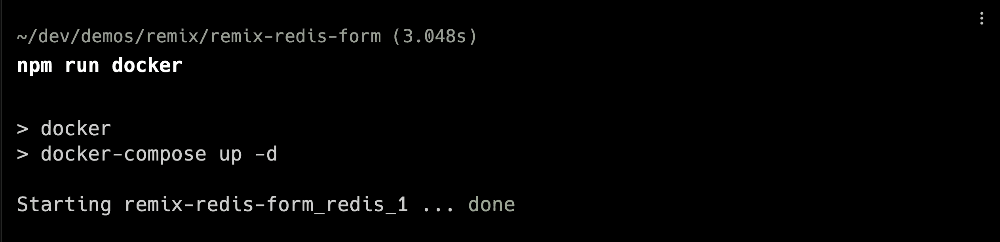

# 如何使用 Remix & Redis 创建多页表单

> 原文：<https://javascript.plainenglish.io/multi-page-forms-using-remix-and-redis-24d5817301c3?source=collection_archive---------5----------------------->

## 使用 Remix 和 Redis 创建多页表单的指南。


最近，我开始使用 Remix 创建一个多页表单。我决定使用 Redis 来存储可以在页面之间使用的表单数据的临时版本。这是一个测试项目，展示了许多相同的用例及实现。

该项目的代码可以在 GitHub 上找到:

[](https://github.com/jnoahjohnson/remix-redis-form) [## GitHub-jnoahjohnson/remix-redis-form:使用 Remix 和 Redis 的多页表单。

### 此时您不能执行该操作。您已使用另一个标签页或窗口登录。您已在另一个选项卡中注销，或者…

github.com](https://github.com/jnoahjohnson/remix-redis-form) 

发布在诺亚·约翰逊开发网站上的原始文章:

[](https://blog.noahjohnson.dev/remix-redis-form) [## 使用 Remix 和 Redis 的多页表单

### 最近，我开始使用 Remix 创建一个多页表单。我决定使用 Redis 来存储一个临时版本的…

blog.noahjohnson.dev](https://blog.noahjohnson.dev/remix-redis-form) 

# 设置

创建一个新的混音项目，或使用现有的项目。

```
npx create-remix@latest
```

这适用于任何选项。我选择了 Remix 应用服务器，因为我将在 Fly.io 上部署和运行它。

## 安装依赖项

```
npm install redis
```

对于这个基本的演示，我们只需要安装 Redis。我还打算安装顺风 stying。你可以在 [Remix 文档](https://remix.run/docs/en/v1/guides/styling#tailwind-css)中找到关于在你的项目中安装 tailwind 的说明

## 在本地设置 Redis

让 Redis 在本地运行的一个简单方法是通过 Docker。确保安装 Docker(这里的[是 Docker 上的文档)。将文件名`docker-compose.yml`添加到项目的根目录，然后将以下代码添加到该文件中:](https://docs.docker.com/get-docker/)

```
version: "3.7"
services:
  redis:
    image: redis:3.0.6
    ports:
      - "6379:6379"
    volumes:
      - ./data/redis:/data
```

*注意:如果您在本地运行 Redis，您需要更改端口，这样它就不会与您的本地 reds 实例冲突。*

最后，在 package.json 中添加一个新脚本，您可以运行该脚本来运行 Redis 实例:

```
{
	"scripts": {
		/* Rest of Scripts */
		"docker": "docker-compose up -d",
	},
}
```

然后，您可以通过运行以下命令启动 Redis 实例:

```
npm run docker
```

*注意:docker 脚本上的-d 标志意味着它将以分离模式运行。只要确保你的控制台没有错误，并且它在后台运行。*



## 设置环境变量

设置的最后一步是设置 Redis URL 环境变量。创建一个名为`.env`的文件，并添加一行如下内容:

```
REDIS_URL="redis://localhost:6379"
```

这将用于创建与本地 Redis 实例的连接。然后可以在应用程序的已部署版本中设置一个环境密码，以连接到远程 Redis 实例。

# 开始

基本设置完成后，让我们开始创建多页表单吧！

我将修改`index.tsx`路线，使其链接到我们将创建的表单嵌套路线:

```
// index.tsx

import { Link } from "@remix-run/react";

export default function Index() {
  return (
    <main className="w-full py-4 text-center">
      <Link
        to="/form"
        className="rounded bg-blue-600 px-4 py-2 text-white shadow hover:bg-blue-800"
      >
        Go to Form
      </Link>
    </main>
  );
}
```

接下来，在 routes 文件夹中创建一个名为`form.tsx`的新文件，然后，让我们为表单周围的元素创建基本结构:

```
// form.tsx

import { Outlet } from "@remix-run/react";

export default function FormRoot() {
  return (
    <main className="mx-auto h-full w-full max-w-2xl py-4">
      <header>
        <h1 className="text-3xl font-bold">Remix Redis Form</h1>
      </header>
      <Outlet />
    </main>
  );
}
```

*注意:如果您不熟悉 Remix 中的路由，Outlet 组件将在其位置呈现任何嵌套的路由。这意味着我们在文件夹* `*/routes/form/*` *中创建的下一个组件将代替插座进行渲染。*

我们将创建的下一个文件是 routes 中表单文件夹内的索引文件。所以创建一个名为`form`的新文件夹，然后在里面创建一个名为`index.tsx`的新文件。然后，我们将在该文件中创建表单的第一页:

```
// form/index.tsx

import { Form } from "@remix-run/react";

export default function FormIndex() {
  return (
    <div>
      <h2 className="text-lg text-gray-600">Basic Info</h2>
      <Form method="post">
        <label className="mb-1">
          Name
          <input
            type="text"
            name="name"
            placeholder="Name"
            className="mb-2 w-full p-2 text-lg shadow-md"
          />
        </label>
        <label className="mb-1">
          Phone
          <input
            type="tel"
            name="phone"
            placeholder="(123) 456-7890"
            className="mb-2 w-full p-2 text-lg shadow-md"
          />
        </label>
        <label className="mb-1">
          Email
          <input
            type="email"
            name="email"
            placeholder="test@example.com"
            className="mb-2 w-full p-2 text-lg shadow-md"
          />
        </label>
        <button className="mx-auto mt-2 block w-1/2 rounded bg-blue-600 py-2 text-white hover:bg-blue-700">
          Continue
        </button>
      </Form>
    </div>
  );
}
```

有了基本表单后，我们可以设置第一个 ActionFunction 来接收表单数据，将对象保存在 Redis 中，然后使用关键字作为搜索参数导航到下一个页面。让我们从 ActionFunction 开始:

```
// form/index.tsx

/* Other imports */
import type { ActionFunction } from "@remix-run/node";
import { redirect } from "@remix-run/node";
import { saveToRedis } from "~/services/redis.server";
import type { CustomFormData } from "~/types/form";
import { generateCode } from "../utils/helpers.server";

export const action: ActionFunction = async ({ request }) => {
  // Get the form data from the request.
  const formData = await request.formData();

  // Get each form element
  const name = formData.get("name");
  const phone = formData.get("phone");
  const email = formData.get("email");

  // Check if the form data is valid
  if (
    typeof name !== "string" ||
    typeof phone !== "string" ||
    typeof email !== "string"
  ) {
    throw Error("Form data is invalid"); // This error could be handled differently, but we will keep it for now
  }

  // Create an ID for the form data
  const id = generateCode(6); // Should generate a random, unique ID

  // Create a new object of type CustomFormData
  const formDataObject: CustomFormData = {
    id,
    name,
    phone,
    email,
    // There are other optional fields that will be added in later
  };

  // Save the form data to Redis with a helper in the services folder
  await saveToRedis(formDataObject);

  return redirect(`/form/more?id=${formDataObject.id}`);
};

/* FormIndex Component /*
```

为了让这个动作函数工作，我们将编写几个函数和一个自定义类型。首先，我们使用一个基本函数为 ID 生成一个代码。这可以用多种方式来完成，但这里是我正在使用的放在文件`/utils/helpers.server.ts`中的函数。

```
export const generateCode = (length: number): string => {
  var result = "";
  var characters = "ABCDEFGHIJKLMNOPQRSTUVWXYZ0123456789";
  var charactersLength = characters.length;
  for (var i = 0; i < length; i++) {
    result += characters.charAt(Math.floor(Math.random() * charactersLength));
  }
  return result;
};
```

我将该类型放在一个名为`types`的文件夹中，这样它可以被助手函数以及不同的路径使用。

```
export type CustomFormData = {
  id: string;
  name: string;
  phone: string;
  email: string;
  bio?: string;
  birthday?: Date;
  age?: number;
};
```

最后，我创建了一个函数来将数据保存到 Redis，并将其放在一个新文件中的`services`文件夹中。

```
// services/redis.server.ts

import * as redis from "redis";
import type { CustomFormData } from "~/types/form";

const client = redis.createClient({
  url: process.env.REDIS_URL,
});

client.on("error", (err) => console.log("Redis client error", err));

// If you update the data type, update the key version so you are not left with invalid states
const KEY_VERSION = "1";

export const saveToRedis = async (data: CustomFormData) => {
  await client.connect();
  await client.set(`f-${KEY_VERSION}-${data.id}`, JSON.stringify(data));
  await client.quit();
};
```

## 另一个表单页面

接下来，我们将创建另一个表单页面，该页面将检查 Redis 中是否有具有给定 ID 的数据，如果有，则呈现该页面。ID 应该被传递到页面中，以便在下一个动作函数中使用。

```
import type { LoaderFunction } from "@remix-run/node";
import { Form, useLoaderData } from "@remix-run/react";
import { requireFormData } from "~/services/redis.server";

export const loader: LoaderFunction = async ({ request }) => {
  // Function in redis.server.ts that is reusable for each page of the form
  const id = await requireFormData(request);

  return id;
};

export default function MoreForm() {
  const { id } = useLoaderData<{ id: string }>();

  return (
    <div>
      <h2 className="text-lg text-gray-600">Basic Info</h2>
      <Form method="post">
        <input type="hidden" name="id" value={id} />
        <label className="mb-1">
          Bio
          <input
            type="text"
            name="bio"
            placeholder="Bio"
            className="mb-2 w-full p-2 text-lg shadow-md"
          />
        </label>
        <label className="mb-1">
          Birthday
          <input
            type="date"
            name="birthday"
            className="mb-2 w-full p-2 text-lg shadow-md"
          />
        </label>
        <label className="mb-1">
          Age
          <input
            type="number"
            name="age"
            placeholder="0"
            className="mb-2 w-full p-2 text-lg shadow-md"
          />
        </label>
        <button className="mx-auto mt-2 block w-1/2 rounded bg-blue-600 py-2 text-white hover:bg-blue-700">
          Continue
        </button>
      </Form>
    </div>
  );
}
```

现在为了实现`requireFormData`函数，我们将在`redis.server.ts`中创建两个新函数。

```
export const getDataFromRedis = async (
  id: string
): Promise<CustomFormData | null> => {
  // Get data from redis
  await client.connect();
  const data = await client.get(`f-${KEY_VERSION}-${id}`);
  await client.quit();

  if (!data) {
    return null;
  }

  const formData = JSON.parse(data) as CustomFormData;

  return formData;
};

export const requireFormData = async (
  request: Request
): Promise<CustomFormData> => {
  // Get ID from search params
  const url = new URL(request.url);
  const id = url.searchParams.get("id");

  if (typeof id !== "string" || !id) {
    throw Error("Issue getting id");
  }

  // Get cached form data from Redis
  const formData = await getDataFromRedis(id);

  if (!formData) {
    throw Error("No Data Found");
  }

  return formData;
};
```

现在，让我们添加 ActionFunction，它将处理表单数据并再次保存到 Redis:

```
import type { ActionFunction, LoaderFunction } from "@remix-run/node";
import { redirect } from "@remix-run/node";
import { Form, useLoaderData } from "@remix-run/react";
import {
  getDataFromRedis,
  requireFormData,
  saveToRedis,
} from "~/services/redis.server";

export const action: ActionFunction = async ({ request }) => {
  const formData = await request.formData();

  const id = formData.get("id");
  const bio = formData.get("bio");
  const birthday = formData.get("birthday");
  const age = formData.get("age");

  if (
    typeof id !== "string" ||
    typeof bio !== "string" ||
    typeof birthday !== "string" ||
    typeof age !== "string"
  ) {
    throw Error("Form data is invalid");
  }

  const customFormData = await getDataFromRedis(id);

  if (!customFormData) {
    throw Error("Form data is not found");
  }

  customFormData.bio = bio;
  customFormData.birthday = new Date(birthday);
  customFormData.age = parseInt(age);

  await saveToRedis(customFormData);

  return redirect(`/form/confirm?id=${customFormData.id}`);
};
```

## 最后一页

我们在最后一页！我们将创建一个确认页面，然后可以提交数据。很多概念都是一样的。然后，我们将看看如何添加编辑功能来返回到前面的页面并修改表单数据。

```
// form/confirm.tsx

import type { ActionFunction, LoaderFunction } from "@remix-run/node";
import { redirect } from "@remix-run/node";
import { Form, Link, useLoaderData } from "@remix-run/react";
import {
  deleteFormData,
  getDataFromRedis,
  requireFormData,
} from "~/services/redis.server";
import type { CustomFormData } from "~/types/form";

export const action: ActionFunction = async ({ request }) => {
  const formData = await request.formData();

  const id = formData.get("id");

  if (typeof id !== "string") {
    throw Error("Form data is invalid");
  }

  const customFormData = await getDataFromRedis(id);

  if (!customFormData) {
    throw Error("Form data is not found");
  }

  /*
    Here you can use the custom form data however you want, 
    for example adding it to a database
  */

  console.log(customFormData);

  // Can cleanup the form data from Redis
  await deleteFormData(id);

  return redirect(`/`);
};

export const loader: LoaderFunction = async ({ request }) => {
  // Function in redis.server.ts that is reusable for each page of the form
  const formData = await requireFormData(request);
  return formData;
};

export default function MoreForm() {
  const data = useLoaderData<CustomFormData>();

  return (
    <div>
      <div className="mb-4">
        <h2 className="text-lg text-gray-600">Basic Info</h2>
        <p>Name: {data.name}</p>
        <p>Phone: {data.phone}</p>
        <p>Email: {data.email}</p>
        <Link
          to={`/form?id=${data.id}`}
          className="text-blue-700 hover:underline"
        >
          Edit
        </Link>
      </div>

      <div className="mb-4">
        <h2 className="text-lg text-gray-600">More Info</h2>
        <p>Bio: {data.bio ?? ""}</p>
        <p>Birthday: {data.birthday ?? ""}</p>
        <p>Age: {data.age ?? ""}</p>
        <Link
          to={`/form/more?id=${data.id}`}
          className="text-blue-700 hover:underline"
        >
          Edit
        </Link>
      </div>

      <Form method="post">
        <input type="hidden" name="id" value={data.id} />
        <button className="mx-auto mt-2 block w-1/2 rounded bg-blue-600 py-2 text-white hover:bg-blue-700">
          Submit
        </button>
      </Form>
    </div>
  );
}
```

让这段代码工作所需的唯一附加函数是`deleteFormData`函数，我们将把它与其他 Redis 服务器代码放在一起。

```
export const deleteFormData = async (id: string) => {
  await client.connect();
  await client.del(`f-${KEY_VERSION}-${id}`);
  await client.quit();
};
```

## 编辑功能

让我们做一点重构，为之前创建的页面添加编辑功能。从表单索引页面开始，我们在每个区域都需要做一些修改。

首先，LoaderFunction 将返回 null 或 CustomFormData。

其次，页面将通过 useLoaderData 函数接受该请求，并设置表单的默认值。它还必须在表单中设置一个 ID。

最后，action 函数需要检查是否有 ID，如果有，它将提取并更新数据，这样就不会清除其他页面中的数据。

这部分是一个有些复杂的领域，但我认为这种权衡是值得的。简化这个逻辑还可以进一步探讨。

```
// form/index.tsx

import type { ActionFunction, LoaderFunction } from "@remix-run/node";
import { redirect } from "@remix-run/node";
import { Form, useLoaderData } from "@remix-run/react";
import { getDataFromRedis, saveToRedis } from "~/services/redis.server";
import type { CustomFormData } from "~/types/form";
import { generateCode } from "../utils/helpers.server";

export const action: ActionFunction = async ({ request }) => {
  // Get the form data from the request.
  const formData = await request.formData();

  // Get each form element
  const name = formData.get("name");
  const phone = formData.get("phone");
  const email = formData.get("email");

  // Check if the form data is valid
  if (
    typeof name !== "string" ||
    typeof phone !== "string" ||
    typeof email !== "string"
  ) {
    throw Error("Form data is invalid"); // This error could be handled differently, but we will keep it for now
  }

  // Check if there is already an ID
  const formId = formData.get("id");
  let id = "";

  // No need to generate a new code if you already have one
  // Also, if you already have one a generate a new code, then you will lose the old data
  if (typeof formId === "string" && formId !== "") {
    console.log(formId);
    id = formId;

    const formDataObject = await getDataFromRedis(id);

    if (!formDataObject) {
      throw Error("Form data is not found");
    }

    formDataObject.name = name;
    formDataObject.phone = phone;
    formDataObject.email = email;

    await saveToRedis(formDataObject);
  } else {
    id = generateCode(6);

    // Create a new object of type CustomFormData
    const formDataObject: CustomFormData = {
      id,
      name,
      phone,
      email,
      // There are other optional fields that will be added in later
    };

    // Save the form data to Redis with a helper in the services folder
    await saveToRedis(formDataObject);
  }

  return redirect(`/form/more?id=${id}`);
};

export const loader: LoaderFunction = async ({ request }) => {
  // This page could possibly not have an ID and that is okay since it is the first page
  const url = new URL(request.url);
  const id = url.searchParams.get("id");

  if (typeof id !== "string" || !id) {
    return null;
  }

  // Get cached form data from Redis
  const formData = await getDataFromRedis(id);

  if (!formData) {
    return null;
  }

  return formData;
};

export default function FormIndex() {
  const data = useLoaderData<CustomFormData | null>();

  return (
    <div>
      <h2 className="text-lg text-gray-600">Basic Info</h2>
      <Form method="post">
        <input type="hidden" name="id" value={data?.id} />
        <label className="mb-1">
          Name
          <input
            type="text"
            name="name"
            placeholder="Name"
            defaultValue={data?.name}
            className="mb-2 w-full p-2 text-lg shadow-md"
          />
        </label>
        <label className="mb-1">
          Phone
          <input
            type="tel"
            name="phone"
            placeholder="(123) 456-7890"
            defaultValue={data?.phone}
            className="mb-2 w-full p-2 text-lg shadow-md"
          />
        </label>
        <label className="mb-1">
          Email
          <input
            type="email"
            name="email"
            defaultValue={data?.email}
            placeholder="test@example.com"
            className="mb-2 w-full p-2 text-lg shadow-md"
          />
        </label>
        <button className="mx-auto mt-2 block w-1/2 rounded bg-blue-600 py-2 text-white hover:bg-blue-700">
          Continue
        </button>
      </Form>
    </div>
  );
}
```

更多页面更简单，因为路由总是需要来自 Redis 的数据。只需要改变 LoaderFunction 传入整个 formData 对象，并且页面上的表单设置默认值。此外，我们将使用一个简单的函数来获取字符串化的日期并返回。

```
// form/more.tsx

export const loader: LoaderFunction = async ({ request }) => {
  // Function in redis.server.ts that is reusable for each page of the form
  const formData = await requireFormData(request);

  return formData;
};

export default function MoreForm() {
  const formData = useLoaderData<CustomFormData>();

  return (
    <div>
      <h2 className="text-lg text-gray-600">More Info</h2>
      <Form method="post">
        <input type="hidden" name="id" value={formData.id} />
        <label className="mb-1">
          Bio
          <input
            type="text"
            name="bio"
            placeholder="Bio"
            defaultValue={formData.bio}
            className="mb-2 w-full p-2 text-lg shadow-md"
          />
        </label>
        <label className="mb-1">
          Birthday
          <input
            type="date"
            name="birthday"
            defaultValue={String(formData.birthday).split("T")[0] || ""}
            className="mb-2 w-full p-2 text-lg shadow-md"
          />
        </label>
        <label className="mb-1">
          Age
          <input
            type="number"
            name="age"
            placeholder="0"
            defaultValue={formData.age?.toString()}
            className="mb-2 w-full p-2 text-lg shadow-md"
          />
        </label>
        <button className="mx-auto mt-2 block w-1/2 rounded bg-blue-600 py-2 text-white hover:bg-blue-700">
          Continue
        </button>
      </Form>
    </div>
  );
}
```

就像这样，我们在表单的每一页之间都有编辑功能！

## 包扎

虽然这看起来有点复杂，但是使用 Remix 和 Redis 的多页面表单的好处是惊人的。每条路由除了将数据保存到 Redis 之外，还可以执行其他任务。您可以进行支付处理、数据验证或更多工作。

在我正在处理的一个用例中，表单的第一页使用 Remix 的 useFetcher 来确保获得有效的预订日期，然后接下来的页面只是收集更多的信息，直到付款被接受。它有助于区分不同的功能，同时还提供了良好的用户体验。

在接下来的几天里，我将推出另一个指南，展示如何在 Fly.io 上部署这个应用程序和一个 Redis 实例，请密切关注。如果您有任何问题或建议，请告诉我！

*更多内容请看*[***plain English . io***](https://plainenglish.io/)*。报名参加我们的* [***免费周报***](http://newsletter.plainenglish.io/) *。关注我们关于*[***Twitter***](https://twitter.com/inPlainEngHQ)*和*[***LinkedIn***](https://www.linkedin.com/company/inplainenglish/)*。加入我们的* [***社区不和谐***](https://discord.gg/GtDtUAvyhW) *。*