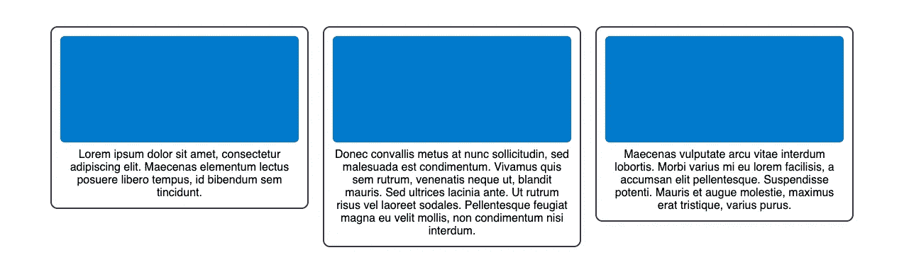
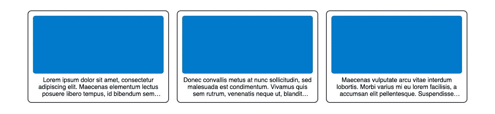

# 使用 CSS 换行符截断多行文本

> 原文：<https://javascript.plainenglish.io/multiline-text-truncation-with-css-line-clamp-7b0977a730cf?source=collection_archive---------8----------------------->

## 使用 CSS 换行符实现多行文本截断的指南。


在前端开发中，包括 React 在内，通常必须截断呈现给用户的文本。有很多理由这样做。可能是为了节省宝贵的屏幕空间，让 UI 的不同部分看起来统一，把不太重要的信息放在切换按钮后面，等等。

大多数前端开发人员都知道如何实现单行文本的文本截断。它需要一个固定的宽度，并混合使用`overflow: hidden`、`white-space: nowrap`和`text-overflow: ellipsis` CSS 规则。如果应用了最后一个 CSS 规则，所有这些将使文本在一行后截断，并在文本末尾添加一个省略号。



Common frontend issue: textual content rendered inside some UI component (card). But because their lengths are all different, the UI becomes inconsistent.

但这只适用于单行文本截断。在某些情况下，对 UI 来说，在多行而不是一行之后截断文本是有益的。与单行文本截断相比，同样的原因也适用，但形式略有不同。但是如何实现这一点呢？

# 变通方法

不幸的是，很长一段时间以来，没有简单的方法来实现多行文本截断。所有的解决方案都围绕着计算单词，计算字母，或者把内容放在一个有一定尺寸的盒子里。但是所有这些解决方案都笨重、不灵活，并且存在自身的问题。

计算单词和字母都需要使用 JavaScript，与 CSS 解决方案相比，JavaScript 对浏览器的优化程度较低。计算单词非常依赖于语言和单词的长度，这仍然会导致不均匀的截断，而计算字母会导致用户的单词损坏。这两种解决方案都要求内容完全是文本。

相反，将内容放入指定尺寸的盒子中是基于 CSS 的解决方案。单行截断解决方案的问题是，它要求文本换行在一行之后停止。这个解决方案避免了 CSS 规则，而是根据文本的间距和行高在内容周围创建一个框。然而，这种解决方案与内容的字体属性紧密相关，因此非常不灵活。

# CSS 线夹

为了解决所有这些问题，WebKit 中添加了一个 CSS 规则:`-webkit-line-clamp`。它接受一个整数值，并将使用它的元素的内容限制在指定的行数内。使用该行箝位特性的要求是行箝位元素的`display`属性应该设置为`-webkit-box`或`-webkit-inline-box`，并且`-webkit-box-orient`属性设置为`vertical`值。看起来应该是这样的。

```
.content {
  display: -webkit-box;
  -webkit-box-orient: vertical;
  -webkit-line-clamp: 3;
  overflow: hidden;
}
```

发生的情况是，CSS 将呈现所有内容，但将其限制在指定的行数(在本例中为 3)之后。在那一行的末尾，它将添加省略号来表示行的夹紧。最后，您必须添加`overflow: hidden` CSS 规则来确保所有其他行都不可见。

这就对了，现在你有了统一的元素，它们总是被截断成相同数量的行。所有这些都是通过纯 CSS 完成的。



[*(在本 CodeSandbox 中试用)*](https://codesandbox.io/s/lucid-dream-6ylwul?file=/src/App.js)

最后要提的是浏览器支持。浏览器对这些方便的 CSS 规则的支持一直是它们最大的缺点之一。虽然有很多简洁而有用的 CSS 规则，但它们通常局限于某些 web 浏览器引擎或 web 浏览器。这使得采用它们变得困难，因为它们只能覆盖部分用户群。

在换行的例子中，它是一个专门在 WebKit 中实现的 CSS 规则。然而，在撰写本文时，对`-webkit-line-clamp`的支持已经达到了[几乎所有的主流浏览器](https://caniuse.com/?search=line-clamp)。唯一不支持它的浏览器是 Internet Explorer，如果它是用户浏览器的重要组成部分，这可能会带来问题。然而，line-clamp 是 [CSS 溢出模块 Level 3](https://www.w3.org/TR/css-overflow-3/#propdef--webkit-line-clamp) 的一部分，它可以在将来提供更广泛的支持。

# 摘要

多行文本截断是一个常见的前端问题，通常用于使内容更加统一，节省屏幕空间，或者减少用户在屏幕上看到的不太重要的信息。

虽然单行等价问题可以通过几行直观的 CSS 轻松解决，但这并不适用于多行文本截断。相反，前端开发人员不得不求助于计数单词、计数字母或自己定义内容的维度框等方法。最终，所有这些方法都是次优的、不灵活的，并且存在各自的问题。

但是随着 WebKit 中的行箝位特性的实现，所有与变通办法有关的问题都解决了。它为我们提供了一组简单的 CSS 规则，可以用来通过纯 CSS 实现多行文本截断。虽然`-webkit-line-clamp`及其同伴还没有得到整个领域的支持，但它已经可以在大多数主流浏览器中使用。

如果你喜欢这篇文章，可以考虑看看[不凡反应](https://www.getrevue.co/profile/chakshunyu)时事通讯和我的[推特](https://twitter.com/keraito)中的其他条目，以便将来更新。

*更多内容看* [***说白了就是 io***](https://plainenglish.io/) *。报名参加我们的**[***免费周报***](http://newsletter.plainenglish.io/) *。关注我们关于*[***Twitter***](https://twitter.com/inPlainEngHQ)*和**[***LinkedIn***](https://www.linkedin.com/company/inplainenglish/)*。加入我们的* [***社区不和谐***](https://discord.gg/GtDtUAvyhW) *。***