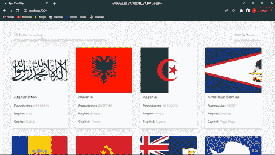

# Next.js 中的多重搜索过滤器

> 原文：<https://javascript.plainenglish.io/multiple-search-filter-in-nextjs-63dba187e384?source=collection_archive---------1----------------------->

## 在 Next.js 中实现多重搜索过滤器的指南


Cover Image

你好，我来自互联网的朋友们，在我最近的一篇文章中，我们学习了如何在 NextJs 中实现一个简单的搜索过滤器。我们今天的帖子是后者的逻辑续篇，我们将实现一个多重搜索过滤器。

# **但是简单搜索过滤器和多重搜索过滤器有什么区别呢？**

区别主要在于，在简单搜索过滤器中，搜索仅基于一个参数，而在多重搜索过滤器中，搜索基于多个参数。

我想这可能听起来像一些外国狗屎，但这很酷，在阅读了即将发生的事情后，你会被清除。不错的读物。

为了说明多重搜索过滤器，让我们来理解下面的应用程序:



App Demo

如您所见，我们可以使用多重搜索过滤器使用多个参数进行搜索。我们首先使用国家的名称进行搜索，然后是国家的首都，最后是国家的人口，不像只有可能通过国家的名称进行搜索，而不是简单的搜索过滤器。

没有一吨的来回，让我们建立上面的应用程序！

该项目来自[前端导师的高级 API 项目](https://www.frontendmentor.io/challenges/rest-countries-api-with-color-theme-switcher-5cacc469fec04111f7b848ca/hub/rest-countries-api-with-color-theme-switcher-18CWAE6VVa)。

# **1。设置我们的 NextJS 项目**

```
npx create-next-app restcountries
cd restcountries
npm run dev
```

## 2.安装用于造型的尾翼

我会推荐你去看官方的[文档](https://tailwindcss.com/docs/guides/nextjs)以获得关于其安装的详细解释。

## 3.从 API 获取数据

现在我们的项目已经设置好了，让我们使用 NextJS 的 getStaticProps()函数从 API 中预先呈现我们的内容。如果你不熟悉预渲染，我有一篇关于它的文章。

我们将从 API 中得到的结构如下:

```
{
"name": {
"common": "Guatemala",
"official": "Republic of Guatemala",
"nativeName": {
"spa": {
"official": "República de Guatemala",
"common": "Guatemala"
}
}
},
"tld": [
".gt"
],
"cca2": "GT",
"ccn3": "320",
"cca3": "GTM",
"cioc": "GUA",
"independent": true,
"status": "officially-assigned",
"unMember": true,
"currencies": {
"GTQ": {
"name": "Guatemalan quetzal",
"symbol": "Q"
}
},
"idd": {
"root": "+5",
"suffixes": [
"02"
]
},
"capital": [
"Guatemala City"
],
"altSpellings": [
"GT"
],
"region": "Americas",
"subregion": "Central America",
"languages": {
"spa": "Spanish"
},
"translations": {
"ara": {
"official": "جمهورية غواتيمالا",
"common": "غواتيمالا"
},
"bre": {
"official": "Republik Guatemala",
"common": "Guatemala"
},
"ces": {
"official": "Republika Guatemala",
"common": "Guatemala"
},
"cym": {
"official": "Republic of Guatemala",
"common": "Guatemala"
},
"deu": {
"official": "Republik Guatemala",
"common": "Guatemala"
},
"est": {
"official": "Guatemala Vabariik",
"common": "Guatemala"
},
"fin": {
"official": "Guatemalan tasavalta",
"common": "Guatemala"
},
"fra": {
"official": "République du Guatemala",
"common": "Guatemala"
},
"hrv": {
"official": "Republika Gvatemala",
"common": "Gvatemala"
},
"hun": {
"official": "Guatemalai Köztársaság",
"common": "Guatemala"
},
"ita": {
"official": "Repubblica del Guatemala",
"common": "Guatemala"
},
"jpn": {
"official": "グアテマラ共和国",
"common": "グアテマラ"
},
"kor": {
"official": "과테말라 공화국",
"common": "과테말라"
},
"nld": {
"official": "Republiek Guatemala",
"common": "Guatemala"
},
"per": {
"official": "جمهوری گواتِمالا",
"common": "گواتِمالا"
},
"pol": {
"official": "Republika Gwatemali",
"common": "Gwatemala"
},
"por": {
"official": "República da Guatemala",
"common": "Guatemala"
},
"rus": {
"official": "Республика Гватемала",
"common": "Гватемала"
},
"slk": {
"official": "Guatemalská republika",
"common": "Guatemala"
},
"spa": {
"official": "República de Guatemala",
"common": "Guatemala"
},
"swe": {
"official": "Republiken Guatemala",
"common": "Guatemala"
},
"tur": {
"official": "Guatemala Cumhuriyeti",
"common": "Guatemala"
},
"urd": {
"official": "جمہوریہ گواتیمالا",
"common": "گواتیمالا"
},
"zho": {"official": "危地马拉共和国",
"common": "危地马拉"
}
},
"latlng": [
15.5,
-90.25
],
"landlocked": false,
"borders": ["BLZ",
"SLV",
"HND",
"MEX"
],
"area": 108889.0,
"demonyms": {
"eng": {
"f": "Guatemalan",
"m": "Guatemalan"
},
"fra": {
"f": "Guatémaltèque",
"m": "Guatémaltèque"
}
},
"flag": "🇬🇹",
"maps": {
"googleMaps": "https://goo.gl/maps/JoRAbem4Hxb9FYbVA",
"openStreetMaps": "https://www.openstreetmap.org/relation/1521463"
},
"population": 16858333,
"gini": {
"2014": 48.3
},
"fifa": "GUA",
"car": {
"signs": [
"GCA"
],
"side": "right"
},
"timezones": [
"UTC-06:00"
],
"continents": [
"North America"
],
"flags": {
"png": "https://flagcdn.com/w320/gt.png",
"svg": "https://flagcdn.com/gt.svg"
},
"coatOfArms": {
"png": "https://mainfacts.com/media/images/coats_of_arms/gt.png",
"svg": "https://mainfacts.com/media/images/coats_of_arms/gt.svg"
},
"startOfWeek": "monday",
"capitalInfo": {
"latlng": [
14.62,
-90.52
]
},
"postalCode": {
"format": "#####",
"regex": "^(\\d{5})$"
}
},
```

我们不要忘记安装 axios，它将使我们能够从 API 获取数据:

```
npm install axios
```

当你完成 axios 的安装后，将以下代码复制并粘贴到 pages 文件夹中的*index.html*页面中。

```
 import Head from 'next/head'
import axios from 'axios'
import { useState } from 'react'

export async function getStaticProps(){
const data = await axios.get('https://restcountries.com/v3.1/all')
return {
props: {
countries: data.data
}
}
}

export default function Home({countries}) {
const [query, setQuery] = useState('');

// set the value of our useState query anytime the user types on our input
const handleChange = (e) => {
setQuery(e.target.value)
}

return (
<div className={`font-nunito bg-gray-100`}>
<Head>
<title>Rest Countries</title>
<meta name="description" content="Generated by create next app" />
<link rel="icon" href="/favicon.ico" />
</Head>
<div className='w-11/12 m-auto mt-40 flex flex-col md:flex-row justify-between items-start md:items-center gap-5 md:gap-0'>
<input onchange={handleChange} type='text'/>
</div>

<div className='w-11/12 m-auto md:grid mt-10 gap-10 md:grid-cols-4 flex flex-col'>
 /* here we map over the element and display each item as a card  */
{countries.map((country) => (
<div className='bg-white shadow-lg rounded-md overflow-hidden h-[25rem] cursor-pointer'>

<span className='px-3 py-2 block font-bold text-xl'>{country.name.common}</span>
<span className='px-3 py-2 block'><span className='font-bold'>Popoulation:</span> <span className='font-light'>{country.population}</span></span>
<span className='px-3 py-2 block'><span className='font-bold'>Region:</span> <span className='font-light'>{country.region}</span></span>
<span className='px-3 py-2 block'><span className='font-bold'>Capital:</span> <span className='font-light'>{country.capital}</span></span>
</div>
))}
</div>
</div>
)
}
```

在我们获取并显示数据之后，让我们开始实现多重搜索过滤器，但是在我们开始之前，您看到的类名是 TailwindCSS 中的默认类。😄

## 4.实现我们的多重搜索过滤器

我们的多重搜索过滤功能是:

```
const multipleSearch = (array) => {
    return array.filter(
    (el) => 
    Object.keys(el).some((parameter) => 
    el[parameter].toString().toLowerCase().includes(query)
    )
    )
    }
```

在这里，我们可以看到我们的函数将一个数组作为参数，在我们的例子中，它是从 API 获得的国家数组。这个数组使用 JavaScipt 的 *filter* 函数进行过滤，在这里我们将调用 *Object.keys()* 来显示与我们要进行的搜索相对应的参数列表，然后最后检查这些参数是否满足我们在搜索栏中输入的查询。

**简单地说:**

*   **Object.keys** 方法返回给定对象自己的可枚举字符串关键字属性名的数组。[关于此方法的更多信息](https://developer.mozilla.org/en-US/docs/Web/JavaScript/Reference/Global_Objects/Object/keys)
*   **filter()** 方法创建一个新的数组，其中填充了通过函数测试的元素。[关于此方法的更多信息](https://www.w3schools.com/jsref/jsref_filter.asp)
*   **some()** 方法检查是否有任何数组元素通过测试(作为回调函数提供)。[关于此方法的更多信息](https://www.w3schools.com/jsref/jsref_some.asp)
*   **toLowerCase()** 是为了确保从 API 访问数据的值与我们的搜索栏中的值格式相同(因为我们输入的是小写)
*   **查询**是我们在搜索栏中输入的值。这是由 handleChange()函数处理的。
*   **includes()** 是一个 JavaScript 函数，如果字符串包含特定字符串，则返回 true，否则返回 false。

将上面的代码添加到我们的*index.html*中，现在看起来如下:

```
import Head from 'next/head'
import axios from 'axios'
import { useState } from 'react'

export async function getStaticProps(){
const data = await axios.get('https://restcountries.com/v3.1/all')
return {
props: {
countries: data.data
}
}
}

export default function Home({countries}) {
const [query, setQuery] = useState('');

//Function for multiple search filter
  const multipleSearch = (array) => {
    return array.filter(
    (el) => 
    el.region.includes(continentToSort) &&
    Object.keys(el).some((parameter) => 
    el[parameter].toString().toLowerCase().includes(query)
    )
    )
    }

//Applying our search filter function to our array of countries recieved from the API
 const filtered = multipleSearch(countries)

//Handling the input on our search bar
const handleChange = (e) => {
setQuery(e.target.value)
}

return (
<div className={`bg-gray-100`}>
<Head>
<title>Rest Countries</title>
<meta name="description" content="Generated by create next app" />
<link rel="icon" href="/favicon.ico" />
</Head>
<div className='w-11/12 m-auto mt-40 flex flex-col md:flex-row justify-between items-start md:items-center gap-5 md:gap-0'>
<input onchange={handleChange} type='text' placeholder='Search...'/>
</div>

<div className='w-11/12 m-auto md:grid mt-10 gap-10 md:grid-cols-4 flex flex-col'>

 /* here we map over the filtered elements and display each item as a card  */
{filtered.map((country) => (
<div className='bg-white shadow-lg rounded-md overflow-hidden h-[25rem] cursor-pointer'>

<span className='px-3 py-2 block font-bold text-xl'>{country.name.common}</span>
<span className='px-3 py-2 block'><span className='font-bold'>Popoulation:</span> <span className='font-light'>{country.population}</span></span>
<span className='px-3 py-2 block'><span className='font-bold'>Region:</span> <span className='font-light'>{country.region}</span></span>
<span className='px-3 py-2 block'><span className='font-bold'>Capital:</span> <span className='font-light'>{country.capital}</span></span>
</div>
))}
</div>
</div>
)
}
```

恭喜你！我们已经完成了多重搜索过滤器的实现。现在，您可以放心地将上述逻辑用于您的任何 web 应用程序，例如:


The notorious walk

如果你有任何问题，请随时查看我的推特，我很乐意解答任何疑问。

该项目的现场演示可以在[这里](https://restcountries-three.vercel.app/)找到🚀

如果你喜欢，你可以鼓掌。；-)

坚持住！


Full time savage mode

*更多内容请看*[***plain English . io***](https://plainenglish.io/)*。报名参加我们的* [***免费周报***](http://newsletter.plainenglish.io/) *。关注我们关于*[***Twitter***](https://twitter.com/inPlainEngHQ)[***LinkedIn***](https://www.linkedin.com/company/inplainenglish/)*[***YouTube***](https://www.youtube.com/channel/UCtipWUghju290NWcn8jhyAw)*[***不和***](https://discord.gg/GtDtUAvyhW) ***。*****

*****对缩放您的软件启动感兴趣*** *？检查* [***电路***](https://circuit.ooo/?utm=publication-post-cta) *。***