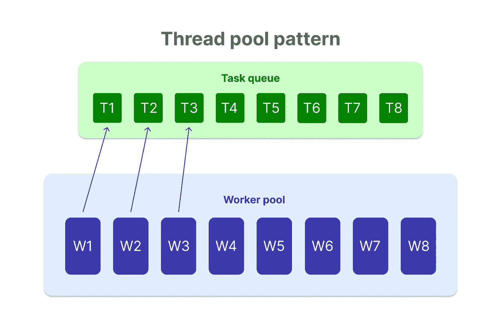
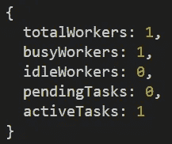

# 使用工作池在 Node.js 中进行多任务处理

> 原文：<https://javascript.plainenglish.io/multitasking-in-node-js-using-worker-pool-201ac6dfd0f4?source=collection_archive---------2----------------------->

## 以下是工作者池库如何管理工作者。


默认情况下，Node.js 是单线程的，这意味着如果您的代码中有 CPU 密集型操作，它可能会阻塞该单线程。 [**子进程**](/multitasking-in-node-js-with-child-process-d82841fd8d29) 或 [**工作线程**](/a-brief-guide-on-worker-threads-in-node-js-80bd1e7846cb) 可以帮助将这些繁重的操作卸载到单独的工作线程，以便主线程可以自由处理其他传入的请求。手动管理这些工人，虽然肯定是可能的，但总的来说效率不高。有一些图书馆在员工管理方面做得很好，在这篇博客文章中，我们将看到一个名为**员工池**的图书馆。

这个工人池背后的基本思想是立即产生一群工人。将会有一个包含所有用户请求的任务队列。这些衍生出来的工作人员将从队列中一个接一个地拾取任务，并独立解决它们。该模式被称为**线程池模式**。



Thread pool pattern

这个库最棒的地方在于它运行在 nodejs 和所有现代浏览器中。所以你可以使用一个工作池来管理**网络工作人员**或者你可以管理**工作线程/子进程**。让我们看看如何在 NodeJS 中实现它。

[***我也有这个帖子的视频可以在 Youtube 上找到，一定要查看。***](https://youtu.be/yI1PjfXhIpk)

## 基本设置

通过键入`npm init -y`创建节点应用程序。通过键入`npm i express`安装 express(不需要)。创建一个名为`app.js`的服务器文件。将下面的代码片段复制到文件中。

```
const app = require("express")()const complexCalc = () => {
    let counter = 0;
    while (counter < 900000000) {
        counter++;
    }
    return counter;
}app.get("/**light**", (req, res) => {
    res.send("Resloved light request, easy peasy!")
})app.get("/**heavy**", (req, res) => {
    complexCalc();
    res.send("Resolved heavy reques, phew!")
})app.listen(3000, () => console.log("Listening to port 3000"))
```

该脚本有两个端点，一个`light`端点和一个`heavy`端点。光端点将立即解析，而`heavy`端点将进行一些无意义的计算(以模拟阻塞行为)并阻塞该过程中的事件循环。

通过键入`node app`运行该应用程序。先转到`http://localhost:3000/heavy`，然后打开另一个标签页，路径为`[http://localhost:3000/light](http://localhost:3000/light.)` [。](http://localhost:3000/light.)很明显`heavy`请求需要时间，但结果是`light`请求也需要时间。这是因为`heavy`请求阻塞了事件循环，而事件循环又阻塞了任何后续请求。

## 实施工人池

现在，让我们将工作池添加到这个应用程序中，并尝试解决这个问题。要将其安装到您的应用程序中，请键入`npm i workerpool`。一旦安装完成，将其导入到顶部的`app.js`文件中，`const workerpool = require("workerpool")`。

第一步是建立一个工人人才库。你可以通过使用`pool`方法来做到这一点，所以`const pool = workerpool.pool()`。这个`pool`方法可以接受两个可选参数。第一个参数是文件的路径。如果你传入一个文件，这个工人将会产生，它将会执行这个文件。如果你没有传入任何东西作为第一个参数，它将会产生一个默认的 worker，你可以在将来使用这个 worker 来卸载一些任务给它。

第二个参数是 options 对象。它有几个配置，您可以用来设置您的工人池。举个例子，

*   **minWorkers** :必须初始化并保持可用的最小工作线程数。
*   **maxWorkers** :可以初始化的最大工作线程数。
*   maxQueueSize :允许排队的最大任务数。
*   **workerType** :您将与之一起工作的工作者的类型(自动、web、进程或线程)。

现在，让我们保持配置为空。我们将创建一个没有配置的简单工作池实例。

在`heavy`端点中，我们不是直接运行计算，而是将它卸载给 worker 池中的 worker。为此，我们在 pool 实例上使用了`exec`方法，该方法将复杂的计算作为字符串或函数。

第二个可选参数是我们刚刚在 exec 方法中传递的函数的参数列表。我们将忽略这个参数，因为我们复杂的计算函数没有参数。请记住，这些函数被序列化并传递给 worker，所以如果您有一个大的函数或函数参数，它可能会影响性能。

这个函数返回一个`promise`,因此您可以使用一个回调函数来检查计算是否完成或者是否有错误。最后，当这些工人完成他们的工作时，终止他们是一种好的做法，所以我们也将添加这一点。

```
app.get("/heavy", (req, res) => {
    **pool.exec(complexCalc).then(result => {
        res.send(`Resolved heavy request. ${result} iterations completed!`)**
    }).catch(err => {
        console.log(err);
    }).then(res => {
        **pool.terminate()**
    })
})
```

您的`app.js`文件现在应该看起来像这样。

现在，如果您保存它，并尝试发出一个`heavy`请求，然后发出一个`light`请求，您会看到它工作得非常好。`heavy`操作被卸载给一个工人，因此事件循环不再被阻塞。因此，这基本上是工人池的最基本的实现。

## 为员工使用单独的文件

现在回到`pool`方法，我之前提到过，您可以将一个文件的路径作为第一个参数传入。这个派生的工作进程将运行这个文件。让我们试着那样做。

我们需要首先创建工人文件，所以让我们创建它。我就叫它`worker.js`。这个文件将具有复杂的计算功能，所以我将它从服务器文件移到这个文件。

```
//worker.js
const complexCalc = () => {
    let counter = 0;
    while (counter < 900000000) {
        counter++;
    }
    return counter;
}
```

最后，我们通过使用`worker`方法创建工人。在方法内部，我们传递一个带有`complexCalc`函数的对象，所以就像我们在这个 worker 内部注册我们的函数一样。

现在在我们的`app.js`文件中，我们将首先添加 worker 文件的路径。然后在 exec 方法中，我们必须将它转换成一个字符串，因为它引用了在 worker 文件中创建的 worker 实例。您的代码现在应该看起来像这样。

```
//worker.js
**const workerpool = require("workerpool")**const complexCalc = () => {
    let counter = 0;
    while (counter < 900000000) {
        counter++;
    }
    return counter;
}**workerpool.worker({
   complexCalc: complexCalc
})**
```

应用程序文件应该是这样的。

```
//app.js
const app = require("express")()
const workerpool = require("workerpool")
const pool = workerpool.pool(**"./worker.js"**)

app.get("/light", (req, res) => {
    res.send("Resloved light request, easy peasy!")
})app.get("/heavy", (req, res) => {
    pool.exec(**"complexCalc"**).then(result => {
        res.send(`Resolved heavy request. ${result} iterations completed!`)
    }).catch(err => {
        console.log(err);
    }).then(() => {
        pool.terminate()
    })
}) app.listen(3000, () => console.log("Listening to port 3000"))
```

如果您现在运行它，它应该像预期的那样工作，也就是说，繁重的操作应该被卸载到 worker，而不会阻塞事件循环。

## 您的员工库的统计数据

这个 worker pool 实例有一个名为`stats`的方法，您可以使用它来获得对您的池实例的一些统计洞察。这是一个非常简单的对象，包含关于您的任务和工作人员的基本信息。



pool.stats()

尝试将`pool.stats()`添加到主文件的不同位置，例如，在复杂计算之前和之后，甚至在`pool.terminate`方法之后。你会看到一些有趣的结果。

## 从工作人员向池发送消息

当任务正在执行时，您还可以使用`workerEmit`函数将数据从 workers 发送回池。所以在我们的计算函数中，我将发送两条消息。一个在 while 循环之前，一个在 while 循环之后。

```
//worker.js
const complexCalc = () => {
    let counter = 0;
    **workerpool.workerEmit("Worker will now start the computation.")**
    while (counter < 9000000000) {
        counter++;
    }
    **workerpool.workerEmit("Worker is done with the computation.")**
    return counter;
}
```

为了监听这些消息，在我们的`pool.exec`方法中，我们可以用`on`事件监听器传入一个对象。(第二个参数是一个空数组，因为我们的复杂计算函数没有参数)。它将有一个回调函数，在这个函数中，你可以做任何你想做的事情，只要你收到来自工人的消息。现在，我们只需要`console.log`消息。

```
app.get("/heavy", (req, res) => {
    pool.exec("complexCalc", [], **{
        on: (message) => console.log(message)
    }**).then(result => {
        res.send(`Resolved heavy request, ${result} iterations`)
    }).catch(err => {
        console.log(err);
    }).then(res => {
        pool.terminate()
    })
})
```

现在，如果您运行这个程序并发出一个`heavy`请求，您将会在计算前后收到来自工人的消息。

## 结论

这个`workerpool`库是您管理员工的一种非常简单的方式。你可以在 npm 注册表上查看这个库。它在 nodeJS 社区中被很好地记录和大量使用。

我在 Youtube 上也有这篇文章的视频，你可以去看看。

这篇文章是我们研究 Node.js 中多任务处理的系列文章的一部分。

*   [**node . js 中多任务带子进程**](/multitasking-in-node-js-with-child-process-d82841fd8d29)
*   [**用集群模块**](/multitasking-in-node-js-with-the-cluster-module-ee8480208f86) 在 Node.js 中多任务
*   [**同**](/process-management-in-node-js-with-pm2-ca32d75c94af)node . js 中的流程管理
*   [**NodeJS**](/a-brief-guide-on-worker-threads-in-node-js-80bd1e7846cb)中工作线程的简要指南

如果你有任何疑问或建议，你可以在评论中提出，或者通过我的任何一个社交网站与我联系。干杯！

[YouTube](https://www.youtube.com/channel/UCaktnqx_IENyT5T2lJ3F09w)
[LinkedIn](https://www.linkedin.com/in/akilesh-rao-610357137/)
[Twitter](https://twitter.com/themangalorian)
[GitHub](https://github.com/AkileshRao)

*更多内容请看*[***plain English . io***](https://plainenglish.io/)*。报名参加我们的* [***免费周报***](http://newsletter.plainenglish.io/) *。关注我们关于*[***Twitter***](https://twitter.com/inPlainEngHQ)[***LinkedIn***](https://www.linkedin.com/company/inplainenglish/)*[***YouTube***](https://www.youtube.com/channel/UCtipWUghju290NWcn8jhyAw)*[***不和***](https://discord.gg/GtDtUAvyhW) *。对增长黑客感兴趣？检查* [***电路***](https://circuit.ooo/) *。***