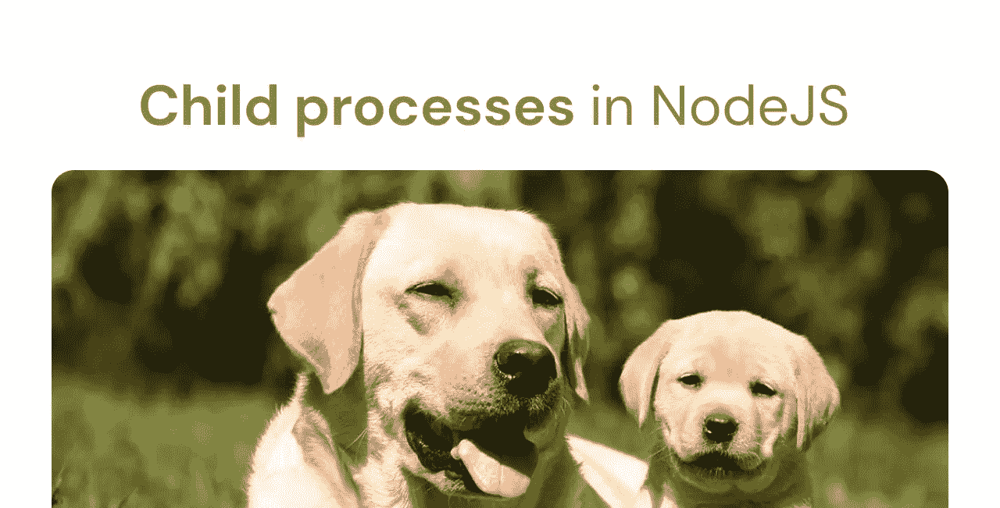

# Node.js 中子进程的多任务处理

> 原文：<https://javascript.plainenglish.io/multitasking-in-node-js-with-child-process-d82841fd8d29?source=collection_archive---------5----------------------->

## 关于 Node.js 中子进程多任务处理的教程。



Node.js 程序从上到下一次执行一行(**单线程**)。现在，如果线程中有同步块或 CPU 密集型操作，如使用 crypto 的加密/解密，它将阻止进一步的执行。像这样的任务需要被卸载以保持主线程空闲。这可以通过子进程来实现，这也是我们将在这篇博文中看到的。

[***你也可以在这里观看这个教程的视频版本。***](https://www.youtube.com/playlist?list=PL62km_yqC3ZEV0wKbLbd3CG-2zt3oDkes)

# 首先，什么是过程？

“进程”不一定是特定于节点的概念。它是你在系统上运行的程序的一个实例。打开浏览器或打开 Spotify 会调用该程序的一个进程。类似地，在 node JS 中创建的应用程序在执行时也会有一个进程。您可以通过使用`**process**`对象来访问这个进程信息。它是全球可用的，因此您不必在使用它之前手动`**require**` 。该对象包含与应用程序、操作系统、设备等相关的详细信息。

[***您可以查看流程对象中存在的所有属性。***](https://nodejs.org/api/process.html)

现在我们知道了什么是进程，让我们跳到子进程。

# 子进程

因此，当一个进程被执行，并且有一个任务需要一些时间来运行时，最好将该任务从主线程移开，以避免任何阻塞。nodeJS 中的子进程模块可以让您将这些繁重的任务卸载到子进程中，从而使您的主线程保持空闲。

在子流程模块中有 3 个函数可以帮助我们创建子流程。
-**Spawn
-Exec&Exec file
-Fork**

# 卵

spawn 函数将在一个进程中运行一个**命令**。运行该命令后，为该命令返回的数据将以**流**的形式出现。这意味着它纯粹是异步的，所以它不会阻塞事件循环。每当一条数据准备好作为响应发送回来时，它将被传递到**标准输出流**，如果在运行命令时出现错误，它将被传递到**标准错误流**。

```
const { spawn } = require('child_process');let listFiles = **spawn("dir", { shell : true })**listFiles.stderr.on("data", (error) => {
    console.log(error.toString())
})listFiles.stdout.on("data", (data) => {
    console.log(data.toString())
})listFiles.on('error', (error) => {
    console.error(`Some error occurred: ${error.message}`);
});
```

现在这里的“**dir”**命令列出了当前工作目录中的文件和文件夹。这是 Linux 中“ **ls** 的替代。对于 Windows 系统，在运行某些脚本/命令之前，您可能需要一个 shell。这就是我在命令后传递一个 shell 选项的原因。如果您使用的是 Linux 系统，您可能不需要它。

因此，一旦我们将命令存储在变量中，我们就可以通过使用相应的流来监听任何响应或错误。标准错误( **stderr** ):如果您试图执行的命令有问题，将会给出一个错误。标准输出( **stdout** ):以流的形式给你一个有效的响应。
这两个流都返回一个缓冲字符串，所以我使用`**toString()**`将其转换成可读格式。

最后，我们还寻找一个**错误事件**，当 spawn 命令本身出现问题时，就会发生这个错误事件。一个更常用的事件是**关闭事件**。此事件在进程结束并且所有标准输入输出流都已关闭后发出。在**退出事件**的情况下，流可能仍然是打开的，因为多个事件可以使用它们。

# 高级管理人员

Exec 有点类似于 spawn 函数。它也在一个进程中运行一个**命令**,但是响应不是以流的形式。它被存储在一个**缓冲器**中，然后作为一个整体被发送回去。所以在 spawn 的例子中，对响应的大小没有限制，因为它是分块发回的，所以在一段时间内您可能会得到大量的响应。在 exec 的情况下，它首先等待缓冲区被填满。一旦它被填充，它将返回整个响应。

但是如果响应的大小大于缓冲区呢？如果是这样的话，你的应用程序就会崩溃，所以如果你事先知道你的响应会很大，你应该选择 spawn 方法而不是 exec。

```
const { exec } = require('child_process')exec("copy script.js newFile.js", (error, stdout, stderr) => {
    if (error) { return console.log(error) }
    if (stderr) { return console.log(stderr) }
    console.log(stdout);
});
```

在 exec 的情况下，我们不需要 shell 选项，因为它默认运行 shell 中的每个命令。这次我们没有处理流，而是使用了回调函数。在上面的例子中，我运行了一个复制命令，将第一个文件(script.js)的内容复制到第二个文件(newFile.js)中。这个命令的 Linux 替代选项是“ **cp** ”。一旦内容被复制，响应数据将被存储在一个缓冲区中，只有当整个数据被取出时，您才能得到响应。

此外，在使用 exec 时，您可以直接在命令本身中传递参数。在产卵的情况下，你不能这样做。你必须在数组中传递参数。比如说，

```
//Entire command is passed
exec("copy script.js newFile.js", callback);//Command and arguments are passed separately in an array
spawn(“copy”, [“script.js”, “xyz.js”])
```

在本教程的视频版本中，我比较了运行相同命令时 spawn 和 exec 返回的响应。你应该去看看！

# Execfile

**“execFile”**用于在单独的进程中运行可执行文件，不像 exec 那样运行命令。

```
execFile("**node**", ["--version"], (error, stdout, stderr) => {
     if(error) { throw error }
     console.log("Output: " + stdout)
})
```

这个脚本将返回您系统上 nodeJS 的当前版本。参数也需要在数组内部传递，就像 spawn 方法一样。因为我的环境路径变量中有节点可执行文件，所以我不必传递整个文件位置。这两种情况下我会得到相同的结果。

```
//will give the same result
execFile(**"C:/Program Files/nodejs/node"**, ["--version"], (error, stdout, stderr) =>{
     if(error) { throw error }
     console.log("Output: " + stdout)
})
```

在 Linux 系统的情况下，通常 **bin** 和 **sbin** 目录会有可执行文件。Windows 系统通常将默认的可执行文件存储在程序文件中。您还可以使用 execFile 运行 shell 脚本。

与 exec 不同，execFile 不会在 shell 中运行您的命令。相反，它将可执行文件生成为一个新的子进程，使其比 exec 稍微高效一些。如果在 windows 系统上运行 execFile 有问题，可以使用 shell 选项，就像我们在 spawn 方法中所做的那样。

# 叉

我们要研究的最后一个方法是 fork 方法。这个方法，就像前面的任何方法一样，产生了一个新的节点 JS 进程，但是这次它还调用了一个在子进程和父进程之间创建 IPC 通道的模块。IPC 代表**进程间通信**。它基本上是操作系统提供的一组机制，允许进程管理共享数据。你真的不需要担心 IPC。你需要知道的是，它将在子进程和父进程之间打开一个通道，这样它们就可以在某个事件中互相发送消息。

这个方法将文件的 URL 作为它的第一个参数。因此子流程逻辑现在将驻留在这个文件中。

```
//scirpt.js - Parent
const child = fork("./child.js");
```

让我们也创建子流程文件。在这个文件中，我们将简单地添加一个 console.log 语句。

```
//child.js - Child
console.log("Hello world")
```

现在，如果我运行 script.js 文件，我应该马上得到控制台日志消息。因此，这基本上意味着，当我们在父流程中创建一个分支时，子流程文件中的代码就会被执行。

您还可以向该方法传递第二个参数，该参数是作为子进程参数的字符串数组。在子进程内部，您可以通过使用" **argv"** 属性来访问它，就像您通常在任何其他进程中所做的那样。

```
//script.js - Parent
const child = fork("./child.js", ["hello", 1, "jumanji"]); //child.js - Child
console.log(process.argv)
```

第三个参数是一组选项，可以传递给分叉的进程。对于这个例子，我们不需要担心这些选项，所以我们现在跳过它，但是你可以在以后阅读更多的内容。只有第一个参数是必需的，其余的都是可选的。

好了，现在让我们试着向这个分叉的进程发送一个消息。我们可以使用**发送**方法来实现。

```
//script.js - Parentconst child = fork("./child.js");
**child.send({ message: "Hello child" })**
```

子进程还需要知道是否有来自父进程的新消息。因为所有子进程都实现了事件发射器 API，所以它们可以监听事件。这也是我们能够从父子流程发送事件的原因。所以让我们来听一下消息事件。

```
//child.js - Childprocess.on("**message**", (msg) => {
    console.log("Message from parent", msg);
})
```

现在，当我运行它时，子进程收到了消息，但是进程还没有结束。它仍在监听任何事件，这意味着它仍在运行。您可以通过对带有退出代码的进程使用 exit 方法来手动退出。

```
//child.js - Childprocess.on("message", (msg) => {
    console.log("Message from parent", msg);
    **process.exit(0)**
})
```

现在，如果您想将消息从子节点发送到父节点，您可能已经猜到了，您需要使用相同的 send 方法，这一次，子节点不再是侦听器，而是父节点需要侦听消息。因此我们可以在父流程上使用相同的消息事件侦听器。

```
//child.js - Child**process.send({ message: "Hello parent" })**process.on("message", (msg) => {
    console.log("Message from parent", msg);
    process.exit(0)
})//script.js - Parentconst child = fork("./child.js");child.send({ message: "Hello child" })child.on("**message**", (msg) => {
    console.log("Message from child", msg);
})
```

现在您已经知道了 fork 方法的工作原理，让我们来看一个更实际的例子。

这是一个接受请求的简单 HTTP 服务器。如果请求端点是“**/heavy”**，那么它将执行大量计算，阻塞 CPU 资源。另一个请求 URL 端点是“ **/light** ”，它将立即返回一个响应。

```
const { fork } = require("child_process");
const http = require('http');
const server = http.createServer();server.on("request", (req, res) => {
    **//heavy operation**
    if (req.url == "**/heavy**") {
        let counter = 0;
        while (counter < 9000000000) {
            counter++;
        }
        res.end(`${counter} iterations completed \\n`);
        console.log("Heavy request");
    }
    **//light operation** 
    else if (req.url == "**/light**") {
        res.end("Success! Operation complete! \\n")
        console.log("Light request");
    }
})server.listen(3000, () => console.log("Listening to port 3000"))
```

当我运行 make heavy request 并试图同时运行 light request 时，您会看到只有在 heavy request 完成后，light request 才会被执行。这是因为繁重的操作阻塞了事件循环，对服务器的任何后续请求都必须等待繁重的操作完成。

为了解决这个问题，我们引入了 fork 方法。我们将简单地复制需要时间的代码块，并把它放在子进程文件中。

```
//child.js - Childprocess.on("message", msg => {
    let counter = 0;
    while (counter < 9000000000) {
        counter++;
    }
    process.send(`${counter} iterations completed \\n`)
})
```

在父文件中，我需要首先创建一个子进程。在此之后，我们可以向孩子发送一条消息，通知他需要开始繁重的操作，最后，一旦操作完成，我们会监听收到的任何消息。然后，该消息作为响应被发送回用户。

```
//script.js - Parent...
if(req.url == "/heavy"){
    const child = **fork**("./child.js");
    child.**send**("Start")
    child.on("**message**", msg => **res.end**(msg))
...
```

现在，如果您尝试向重端点发出请求，然后向轻端点发出请求，您会发现它不再阻塞了。即使繁重的请求正在后台运行，它也会发出较轻的请求。所以它基本上将繁重的操作卸载到一个单独的进程中，同时继续处理文件中的其余代码。这就是如何使用 fork 方法在 nodeJs 中执行多任务。

## 结论

我相信关于这四种方法的信息已经足够了。很明显，你可以在互联网上找到更多关于这些方法的信息，但是这篇简短的帖子应该会给你一个基本的概念，告诉你事情是如何工作的，以及你如何在你的项目中实现它们。

[***你可以在这里观看这个教程的视频版本。***](https://www.youtube.com/playlist?list=PL62km_yqC3ZEV0wKbLbd3CG-2zt3oDkes)

如果你有任何疑问或建议，你可以在评论中提出，或者通过我的任何一个社交网站与我联系。干杯！

[YouTube](https://www.youtube.com/channel/UCaktnqx_IENyT5T2lJ3F09w)
[LinkedIn](https://www.linkedin.com/in/akilesh-rao-610357137/)
[Twitter](https://twitter.com/themangalorian)
[GitHub](https://github.com/AkileshRao)

*更多内容看* [***说白了就是***](https://plainenglish.io/) *。报名参加我们的* [***免费每周简讯***](http://newsletter.plainenglish.io/) *。关注我们* [***推特***](https://twitter.com/inPlainEngHQ)**和*[***LinkedIn***](https://www.linkedin.com/company/inplainenglish/)*。查看我们的* [***社区不和谐***](https://discord.gg/GtDtUAvyhW) *加入我们的* [***人才集体***](https://inplainenglish.pallet.com/talent/welcome) *。**