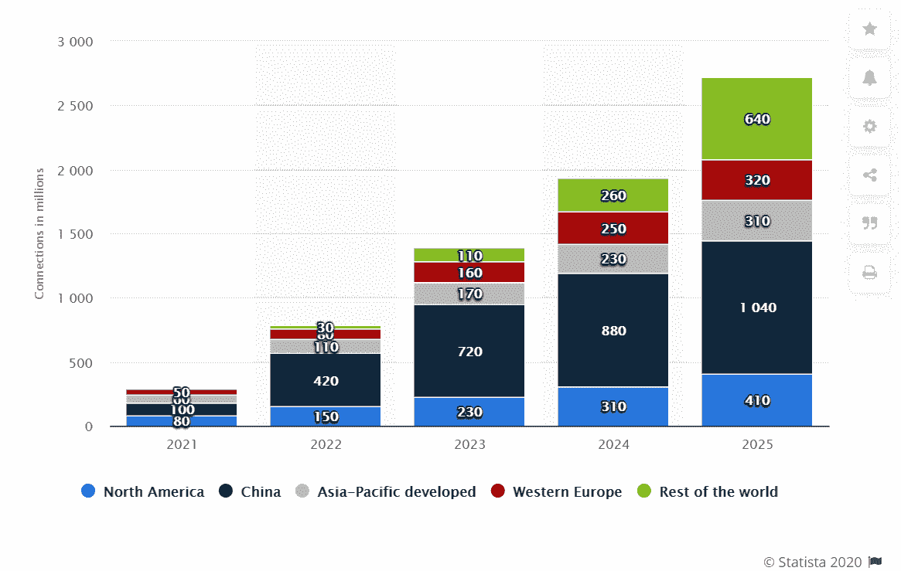
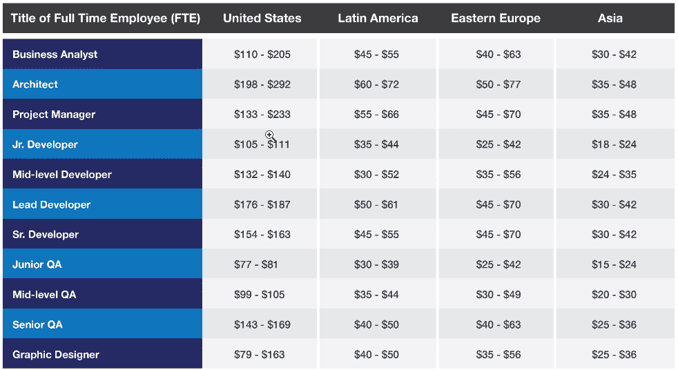
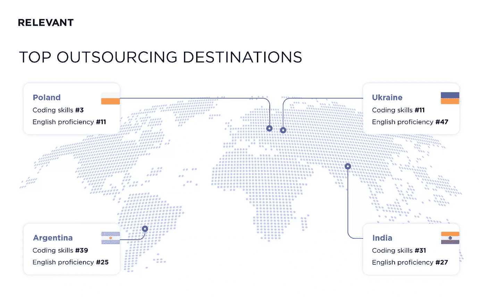
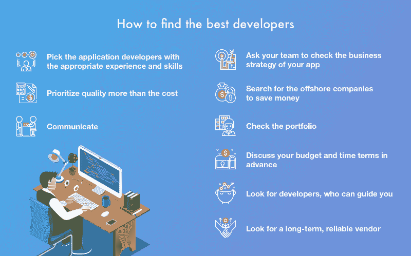
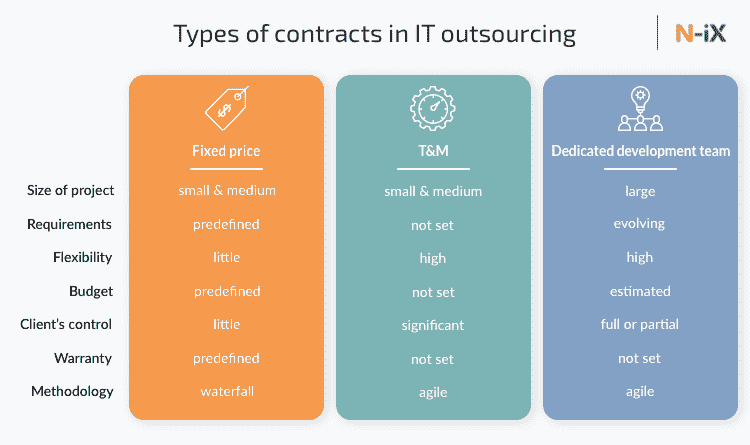

# 外包 iOS 应用程序开发时的必做事项

> 原文：<https://javascript.plainenglish.io/must-dos-don-ts-while-outsourcing-ios-app-development-4868b0e2093c?source=collection_archive---------18----------------------->

他们说你可以在网上找到任何东西，这在今天和过去都是正确的。无论你是想获得一个想法的反馈，还是需要雇人开发一个应用程序，你都不必担心要跟上最新的技术趋势——只需询问你当地的网络开发人员！

下面的描述表明，IT 外包正在不断增长。它还表明，外包公司的质量可能因地点而异。

[Image source](https://www.daxx.com/blog/development-trends/it-outsourcing-trends)

然而，你如何去寻找一个有信誉的网站开发者来处理你的项目呢？以下是外包 iOS 应用程序开发的一些注意事项。

## **对 iOS 应用程序开发外包是一项至关重要的业务**

全世界的开发者都可以帮助你在应用商店上实现你的想法，而不需要花费你太多的时间和金钱。乍一看，外包似乎是梦想成真，但也有许多不利因素来抵消其有利因素。

**如果你时间或金钱短缺，考虑外包应用程序开发。如果你缺少这些资源，那么外包可能是一个很好的选择。它可以帮助您快速启动和运行应用程序，以及帮助应用程序随着公司的发展而扩展。**

如果你有一个想法，但没有很多技术经验或专业知识，这尤其有用。如果你不想每一步都亲力亲为(或者你不知道怎么做)，外包也是有意义的。

**不要认为外包应用程序开发一定比雇佣内部人员便宜。许多人认为，与雇佣本地人相比，雇佣自由职业者会为他们省钱，但事实并非总是如此。**

## **找到最佳质量的合适交易**

为你公司的特定需求设计一个 app 可能要花很多钱；这也是为什么这么多创业公司依赖自由职业的应用开发者的原因之一。当你选择雇佣自由职业者时，你会面临质量控制问题的风险，尤其是如果他们以前没有开发过应用程序。

作为替代，考虑将你的应用程序开发外包给专门创建原生 IOS 应用程序的企业。

此外，这些企业不仅会就其发展过程中的每一步向你提供全面的沟通——确保一路上没有任何误解——而且它们还会在你的预算内工作。毕竟，谁不想这样呢？

**Do:** 在选择外包公司之前，先问问他们:他们有什么样的开发 IOS 应用的经验？他们使用当前的技术吗？我的项目的每个部分从构思到完成需要多长时间？

这些只是你在审查你的选择时应该问的一些问题。如果可能的话，和曾经在像你们这样的公司工作过的人谈谈。

如果他们不知道哪种类型的应用程序开发最适合你的特定项目，那就找其他人来帮你做出明智的决定。

**不要:**尽管外包 IOS 应用程序比在您的组织内雇用全职员工更实惠，但不要忽视构建一个成功的 iOS 产品需要多少时间和精力。

Global Outsourcing Image Source: [CodersDaddy](https://www.codersdaddy.com/)

## **放眼全球寻找最佳服务**

当你外包 iOS 应用程序开发时，首先做好你的功课是很重要的。你要确保你外包给一个拥有受过良好教育和经验丰富的劳动力的国家。尤其是对于应用开发者来说，你只需要看看东欧就行了。

***像印度、中国等东方国家，由于生活成本低、商业环境友好、教育质量高，已经成为 IT 人才的温床。***

另外:如果你想外包 Android 和 iOS 应用程序开发工作，保加利亚、克罗地亚、波兰和罗马尼亚等国家是不错的选择。他们的程序员通常可以有效地用英语交流，没有主要的语言障碍。

随着印度和中国等国家经济的持续增长，它们将为寻求外包移动应用开发或软件编程的公司提供更多机会。

如果你想让你的东欧开发人员多样化，西欧也是寻找外包人才的好地方(值得注意的是，保加利亚在地理上位于东欧，但与西欧有着共同的语言联系)。

然而，西欧的自由职业者可能比东欧和其他东欧国家更贵，但可以说他们同样合格。

西欧可能比东欧更贵，但可以说同样合格。不管你决定从哪里外包，在寻找程序员时有三个主要的考虑因素:沟通、工作质量和成本。

无论是在东欧还是西欧(或者其他任何地方)，在决定雇佣哪家公司之前，确保你要求推荐人并联系至少两个以前的客户。

不要:选择自由职业者时，工作质量应该永远高于成本；如果价格好得令人难以置信，质量可能会有所不同。

所以，不要单纯以价格来选择公司。廉价的开发服务往往会导致问题，所以请确保您选择的[**iOS 应用程序开发公司**](https://www.valuecoders.com/ios-application-development-company-india) 拥有相关经验并经过认证。

[Image source](https://relevant.software/blog/4-best-countries-to-outsource-software-development-to/)

## **依靠可信来源寻找最佳外包服务**

外包应用程序开发就是其中一个你花钱就能得到回报的领域。在离合器上找到外包合作伙伴就像输入几个关键词一样简单(在这种情况下，是一个 iOS 应用程序开发人员)。

从那里，您可以根据候选人的投资组合和成本对其进行评分。如果你准备好进一步，使用 Skype 进行 10 分钟的面试可以让你知道你的候选人是谁。

**Do:** 与任何类型的商业关系一样，要相信自己的直觉。他们有反应吗？专业吗？总体上易于使用？选择雇用谁时，所有这些因素都很重要。

**不要:**看起来，IOS 应用程序开发的成本可能比雇佣全职员工要低——但从长远来看，如果你找到一个不需要太多监督的有声望的人，成本总会更低。在大多数情况下，外包可以帮您省钱并节省时间；如果是别的事，就别做了。

但是要知道外包不是每个人都能接受的；一些企业家觉得有一个队友会更舒服(尽管要小心与那些只能通过合同获得的人建立关系)。

## **确保开发人员完成最好的工作**

当您第一次接触外包时，很容易得意忘形，尤其是在您没有太多经验的情况下。在你匆忙与一个低成本的开发团队合作之前，确保你对你的项目的成功有清晰的指导方针。

忽略关键步骤可能意味着您花在调试代码上的时间比构建产品上的时间要多。确保从第一天开始仔细规划项目。下面是开发人员经常犯的一些错误:

保留反馈，直到为时已晚——沟通是成功外包应用项目的关键——尤其是在开发人员和客户之间。

开发人员需要了解您希望应用程序做什么，这样他们才能有效地为其编写代码，所以确保您在整个开发过程中向他们提供清晰、详细的说明。

[Image source](https://richestsoft.com/blog/is-it-easy-to-hire-a-mobile-app-developer/)

您甚至可以考虑对您的应用程序进行线框建模，以便开发人员在开始编码之前能够准确地看到您的想法。不要害怕尽快提问；请记住，从长远来看，正确使用应用程序将节省时间和金钱。

3D 渲染只能传达设计——虽然 3D 渲染看起来令人印象深刻，但它们通常无法从最终用户的角度展示应用程序将如何工作。

## **将尽可能好的信息提供给外包服务**

为应用程序开发向外包商提供所需信息非常复杂，而且会因项目而异。选择外包供应商的一般经验法则是，寻找一家在你所在行业做了大量 iOS 开发工作的公司。

例如，如果你计划开发一个连接到医疗设备的应用程序，寻找一个已经和你所在行业的其他开发者做过类似工作的外包提供商。

**Do:** 在选择外包合作伙伴时，重要的是找到一个能够从头到尾处理产品设计和开发所有方面的合作伙伴。

这不仅包括对你的应用程序进行编码，还包括创建它的界面设计和在生产的所有阶段管理质量保证。如果你的供应商不愿意或不能自己做这些事情，他们不应该是你的第一选择。

**不要急着做任何事情！记住，**的 iOS 应用开发者**应该既精通本地应用(在苹果自己的软件生态系统中运行的应用)又精通基于网络的应用(使用网络浏览器)。**

他们应该有开发这两种应用程序的经验，并且了解它们的差异、优点和缺点。

## **你需要确保有一个透明的契约**

一份包含项目所有方面的书面合同是一个很好的起点。它应该包括关于谁、什么、何时、如何和多少的信息。

此外，如果你的项目的任何方面没有明确定义或书面描述，那么你可能会发现自己与你的外包商意见不一致(纠正这一点可能会非常昂贵)。

做:在开始任何项目之前，一定要有一份包含所有细节的书面协议。你应该问你的外包商以前的工作样本；如果他们不给你提供一些或给你看过去工作的例子，那么就认为他们是不可信的。

当你在会议上遇到外包开发人员时，即使是很小的工作，也要小心不要把你的业务信息交给他们或让他们接触敏感数据(密码、银行信息)。

[Image source](https://www.n-ix.com/software-development-outsourcing-how-avoid-contract-loopholes/)

虽然大多数开发人员可能是值得信任的，但是也有许多不道德的开发人员会利用任何过于信任他们的人。

在雇佣外包商之前，有几种方法可以获得他们的反馈。您可以使用 Skype/Zoom 或雇佣 Upwork 上的人员作为质量保证人员。

如果外包商非常害怕你可能不喜欢他们不愿意和你谈的东西，那么他们可能还没有准备好和客户一起工作(或者他们只是想要更多的钱)。

**提问不要**犹豫。在继续下一步之前，确保你所有的问题都得到了回答；事先获得反馈可以在今后省去大量的问题。

## **包装**

如果你想外包你的 IOS 应用程序开发，知道该做什么和不该做什么很重要。通过遵循这些提示，你可以确保找到一个高质量的开发人员，帮助你实现你的愿景。

iOS 应用开发是一项至关重要的业务。这不仅仅是在外包你的 IOS 应用程序开发时找到最便宜的选项。正确的决策对于确保企业成功至关重要。

此外，在外包 IOS 应用程序开发方面，并非所有交易都是平等的。确保你找到一笔交易，并雇佣优秀的 iOS 开发者。

*更多内容看* [***说白了。报名参加我们的***](https://plainenglish.io/) **[***免费周报***](http://newsletter.plainenglish.io/) *。关注我们关于*[***Twitter***](https://twitter.com/inPlainEngHQ)*和*[***LinkedIn***](https://www.linkedin.com/company/inplainenglish/)*。加入我们的* [***社区***](https://discord.gg/GtDtUAvyhW) *。***