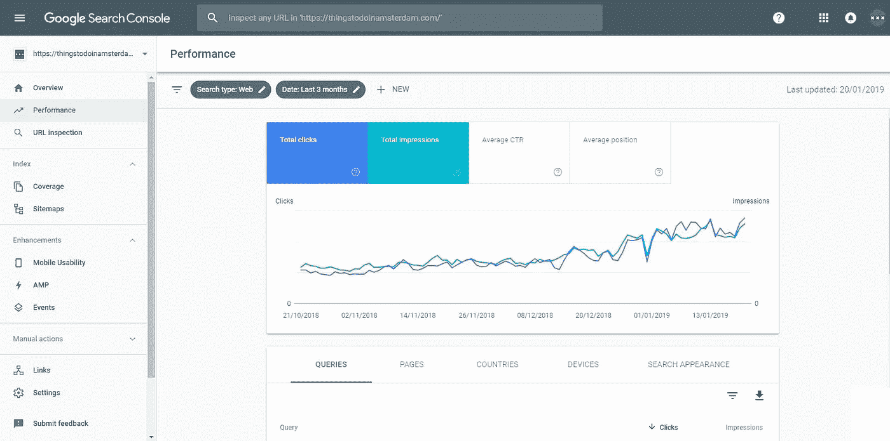
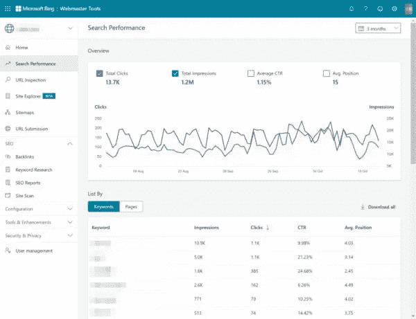
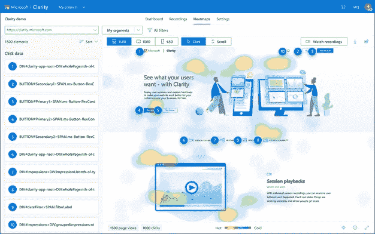
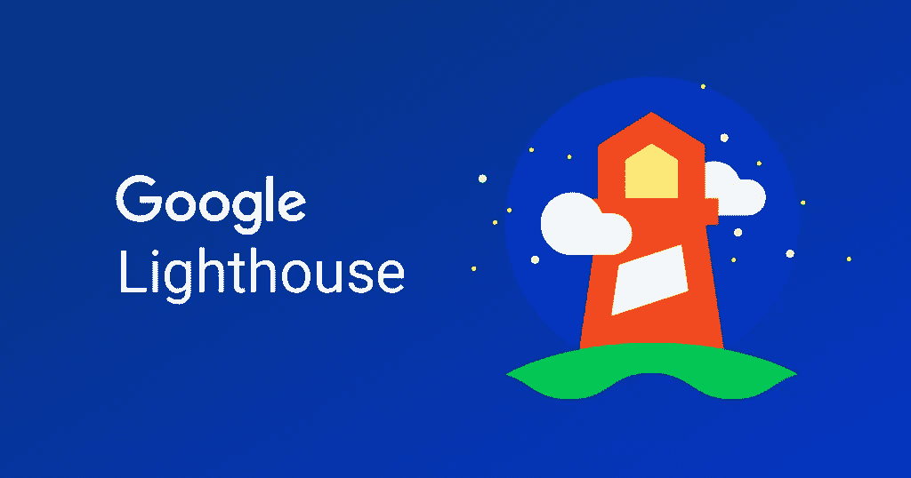
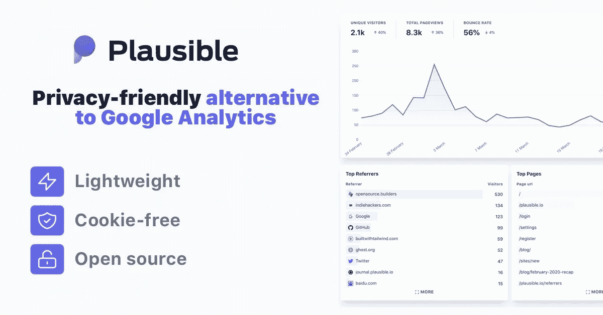
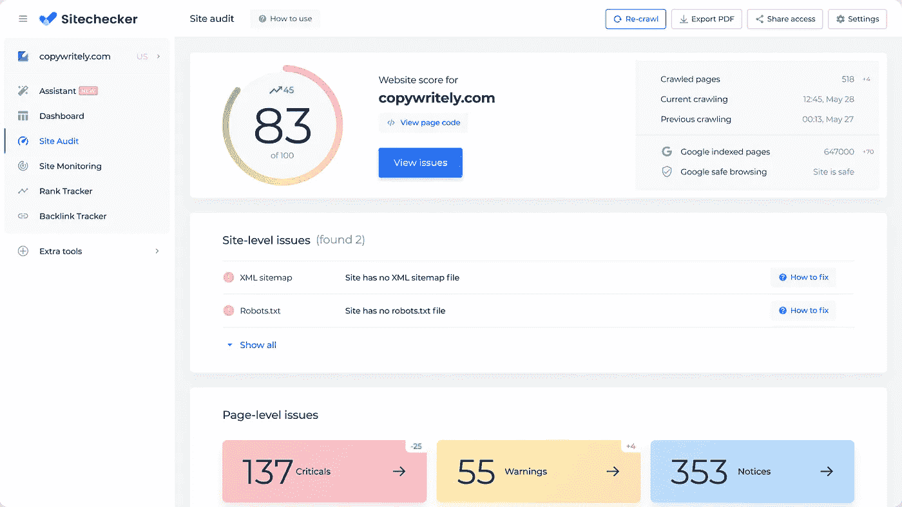

# 优化网站的必备工具

> 原文：<https://javascript.plainenglish.io/must-have-tools-to-optimize-your-websites-d5afa1d85ae0?source=collection_archive---------12----------------------->

建设一个伟大的网站不仅仅是一个花哨的设计。这也很大程度上是关于理解你的用户以及他们如何与你的作品互动，了解人们如何发现你的网站，

在这个列表中，你可以找到一些我用来优化室内工作室最受欢迎的网站的工具！

Photo by [Igor Miske](https://unsplash.com/@igormiske?utm_source=medium&utm_medium=referral) on [Unsplash](https://unsplash.com?utm_source=medium&utm_medium=referral)

# 谷歌搜索控制台

这是优化你的搜索引擎优化的一个非常重要的工具。它向你展示了你所需要的关于你的网站如何出现在谷歌上的所有见解，如果人们点击它和他们使用的查询来达到它！

# Bing 网站管理员工具

别忘了这个世界上不止一个搜索引擎。在 Bing 网站管理员工具上验证你的网站可能是个好主意。它有许多与谷歌搜索控制台相同的功能和见解，但专门针对必应。

根据你的目标受众，你可能会发现把更多的注意力放在必应上比放在谷歌上更重要。举个例子，许多非技术人员在他们的设备上使用默认的浏览器和搜索引擎，对于 Windows 用户来说就是 Bing！

# 微软清晰度

好吧，我们已经解决了搜索引擎问题，我们的潜在用户正在访问我们的网站，但是我们如何调查他们是如何使用它的呢？为此，你可以看看微软的 Clarity，这个免费工具是 Hotjar 的替代工具，为你的网站提供单独的会话记录和热图。将此添加到您的站点可以让您看到站点的确切痛点和热点！

# 谷歌灯塔

如果你还不知道这个，我会很惊讶，但是我们开始了！Google Lighthouse 被集成到 Google Chrome 的开发者设置中，可以用来快速生成网站审计，检查响应性、可访问性和 SEO 等重要因素。要打开它，您只需右键单击您的站点并选择 inspect。这将打开你的开发者标签，从那里你可以选择灯塔，并在你的网站上运行审计。

# 一个很好的分析工具

在这一部分，我不会推荐一个好的分析工具，因为几乎有无限的可能性。不过，我会留下几个名字。我个人比较喜欢的是[**split bee**](https://splitbee.io/)**[**Google Analytics**](https://analytics.google.com/)**和[**似是而非**](https://plausible.io/) 。最后一个非常特别，看似合理是完全开源的，所以如果你准备接受挑战，你可以自己主持它！****

****像我提到的那些分析工具是非常重要的，它可以让你跟踪你的网站的各个方面，从而带来巨大的改进。大多数分析工具都为你提供了添加事件的功能，这样你就可以跟踪某人是否点击了你的行动号召按钮。让你更深入地了解潜在客户是如何使用你的网站的。****

********

# ****更先进的搜索引擎优化检查****

****我暗示谷歌灯塔也可以审计你的网站的搜索引擎优化，但它真的不会太深入。SEO 有如此多的方面，你需要寻找一个工具来突出它们。这些工具大部分都是基于网络的，只需简单搜索“SEO checker”就能找到。他们抓取你的网站，并突出他们遇到的任何问题，让你快速解决这些问题，甚至在排名中上升！****

****我个人最喜欢的是 [SEOSiteCheckup](https://seositecheckup.com/) 但是还有更多！****

********

****想了解更多关于网站优化的知识？联系我，我看看我能为你做些什么！💜****

*****更多内容看* [***说白了。报名参加我们的***](https://plainenglish.io/) **[***免费周报***](http://newsletter.plainenglish.io/) *。关注我们关于*[***Twitter***](https://twitter.com/inPlainEngHQ)*和*[***LinkedIn***](https://www.linkedin.com/company/inplainenglish/)*。查看我们的* [***社区不和谐***](https://discord.gg/GtDtUAvyhW) *，加入我们的* [***人才集体***](https://inplainenglish.pallet.com/talent/welcome) *。*******