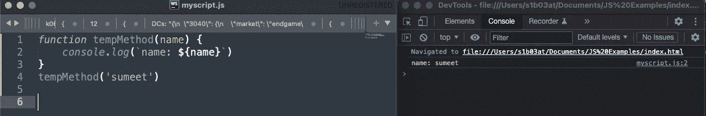
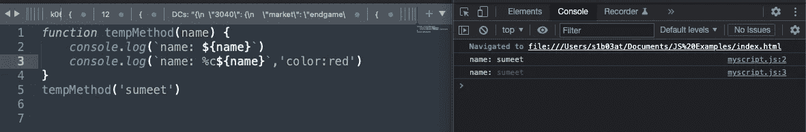
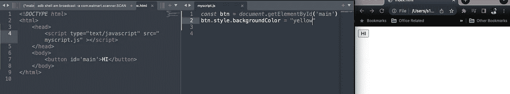
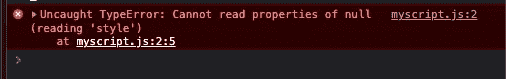
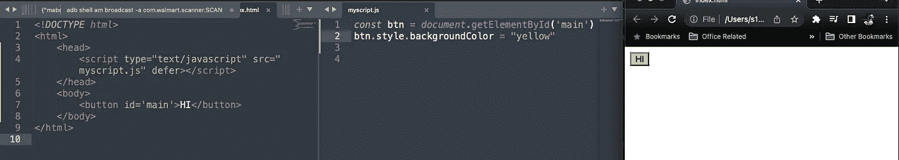

# 2022 年必知的 JavaScript 特性

> 原文：<https://javascript.plainenglish.io/must-know-javascript-features-in-2022-80c0655a6e98?source=collection_archive---------10----------------------->


Photo by [Kevin Ku](https://unsplash.com/@ikukevk?utm_source=medium&utm_medium=referral) on [Unsplash](https://unsplash.com?utm_source=medium&utm_medium=referral)

我总是喜欢学习 JavaScript 中引入的新特性，但很多时候，它们是更广泛的受众不会使用的东西，并且非常特定于一个用例。但是我下面要说的是可以在各种场景中使用的东西，我个人几乎每天都在使用它们。


## **零融合(？？)**

我们大多数人都见过 JS 中的||操作符，它可以与任何字段一起使用，在 nullish 中的字段的情况下，在该操作符之后取值。

```
function test(rate) {
  let val = name || 10
  console.log(val)
}test(100) //100
test(undefined) //10
test('') //10
test(null) //10
test(0) //10
```

在上面的例子中，你可以看到，如果第一个值是看涨的，它将采用第二个值。但是如果你看到上面的最后一种情况，在上面的情况中，0 也将被视为负值，它将采用默认值。在 0 是有效值的情况下，这可能不是您想要的。在这些情况下，您可以使用 nullish 合并运算符`??`:

```
function test(rate) {
  let val = name ?? 10
  console.log(val)
}test(100) //100
test(undefined) //10
test('') //10
test(null) //10
test(0) //0
```

## **可选链接(？。)**

在访问内部属性时，如果不知道父值是否存在，通常会使用 if 或&&进行检查，如下所示:

```
function printZip(user) {
  console.log(user.address.zip)
}printZip({address:{zip:'12345',street:'dobson'}} //12345
printZip({address:{street:'dobson'}} //undefined
printZip({}} // ERROR //INSTEAD you would add checks
function printZip(user) {
  console.log(user && user.address && user.address.zip)
  //OR
  if(user && user.address) {
    console.log(user.address.zip)
  }
}
```

您可以使用可选的链接来减少相当多的代码，而不是上面带有所有检查和条件的冗长代码。

```
function printZip(user) {
  console.log(user?.address?.zip)
}printZip({address:{zip:'12345',street:'dobson'}} //12345
printZip({address:{street:'dobson'}} //undefined
printZip({}} // undefined
```

这也可以在调用方法或访问数组中的索引时使用:

```
myMethod?.()  
// this will first check if method exists and then only call ittempArr?.[3] 
// this will first check if index 3 exists and then only access it
```

## **物体速记**

通常，如果您要创建一个值对象，您可以按如下所示的方式创建它:

```
function user(name, age) {
  val obj = {
    name:name,
    age:age
  }
  console.log(obj)
}
```

现在，如果字段名相同，您只需用下面的代码替换上面的代码，它就会表现相同。

```
function user(name, age) {
  val obj = {
    name,
    age
  }
  console.log(obj)
}
```

## **造型控制台日志**

通常，您只需创建一个 console.log，它就会以默认模式打印出来:



但是您可以向控制台日志添加样式，使一些日志与众不同。您可以添加一个%c 运算符，并将样式作为第二个参数添加。



## **使用 defer 加载 HTML 头部的脚本**

所以通常情况下，当你想在 HTML 文件中加载一个脚本时，你不会想在 head 标签中包含它，因为这会在 DOM 加载元素之前先加载 JS。因此，如果您对元素进行了任何样式更改，它们将不会显示出来。



在上面的例子中，我在 head 中加载脚本。该脚本正在改变按钮的背景颜色，但由于脚本是在 DOM 元素之前加载的，所以它会显示一个错误，而不会加载样式。



因此，为了避免这种情况，您最好将脚本加载到 HTML 文件的主体中，最好是在文件的末尾。但是这将导致在你的 DOM 被加载之后，脚本将被加载的很长时间的延迟。这不会是一个好的用户体验。

相反，您可以在头部的 script 标记中使用单词 **defer** ，JS 会在 DOM 中加载元素后负责加载脚本。



## **结论**


通常，你可能会检查我上面展示的所有内容，但是使用上面的功能，你可以减少你的代码，并且使它更可读。试一试吧，你一定会很高兴读到这些运营商。

如果你喜欢这篇文章，也可以试试我的其他文章。

[](/all-about-importing-methods-in-javascript-d8d84fbd30d3) [## 关于在 JavaScript 中导入方法的所有内容

### 知道在什么情况下使用什么语法。

javascript.plainenglish.io](/all-about-importing-methods-in-javascript-d8d84fbd30d3) [](/what-are-polyfills-and-transpilers-271e4b940e53) [## 什么是聚合填充和传输填充？

### 如果您将 JavaScript 代码部署在 web 浏览器上，您可能会在代码中遇到这些单词。

javascript.plainenglish.io](/what-are-polyfills-and-transpilers-271e4b940e53) [](/lodash-methods-to-make-your-life-a-breeze-3f5aae11f7) [## 使用 Lodash 方法来减少您编写的代码量

### 使用 Lodash 库使您的 JavaScript 代码更具可读性。

javascript.plainenglish.io](/lodash-methods-to-make-your-life-a-breeze-3f5aae11f7) [](https://medium.com/geekculture/jss-or-css-what-to-use-and-why-829dc117a5ba) [## JSS 或 CSS…用什么，为什么？

### 如果你们没有听说过 JSS，它的 CSS 是 JS 风格的。它真的很受欢迎，并且在几个月内非常方便…

medium.com](https://medium.com/geekculture/jss-or-css-what-to-use-and-why-829dc117a5ba)