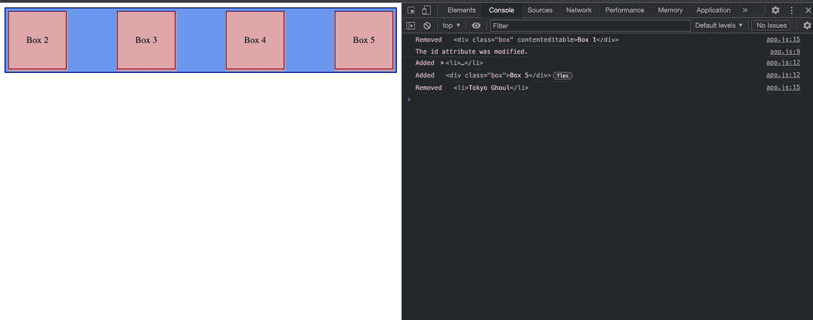
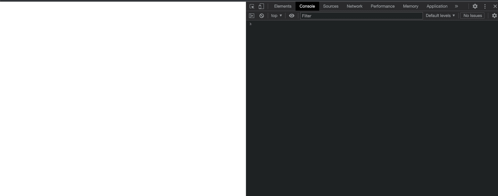

# JavaScript 中的 MutationObserver 解释

> 原文：<https://javascript.plainenglish.io/mutation-observer-in-javascript-21a85a4ceb24?source=collection_archive---------7----------------------->

# 什么是变异观察者？

MutationObserver 是现代浏览器提供的一个 Web API，用于检测 DOM 中的变化。使用 MutationObserver，当 DOM 中的某些内容发生变化时，我们可以调用回调函数来对这些变化做出反应。



我们为什么要这么做？

在相当多的情况下，MutationObserver API 可以派上用场。例如，我们想通知用户他当前所在的网页发生了一些变化。另一个用例可能是我们正在使用一个我们无法控制的库。

# 投票

然而，变异观测者并不总是存在。那么在 MutationObserver 之前开发者用的是什么呢？最简单和最常见的方式是投票。轮询是一种技术，在这种技术中，我们在给定的时间间隔内一次又一次地寻找新数据。

使用 browser setInterval WebAPI 的轮询，我们可以设置一个任务来定期检查 DOM 中是否发生了任何变化。下面是一个非常简单的 JS 轮询的例子。

```
const poller = setInterval(function () {
  const node = document.querySelector('.any-dom-element')
  if (node) {
    console.log(node)
    clearInterval(poller)
  }
}, 1000)
```

在上面的代码中，setInterval 函数将保持每秒运行一次，直到节点在 DOM 中可用。


这种方法的问题是它大大降低了 web 应用程序/网站的性能。

# 如何使用 MutationObserver

将 MutationObserver 实现到您的应用程序中非常容易。首先，我们需要创建一个 MutationObserver 实例，方法是向它传递一个函数，每次发生突变时都会调用这个函数。该函数的第一个自变量(即“突变”)是在单个批次中发生的所有突变的集合。每个突变都提供了关于其类型和已经发生的变化的信息。

```
var mutationObserver = new MutationObserver(function(mutations) {
    mutations.forEach(function(mutation) {
        console.log(mutation);
    });
});
```

我们需要做的第二件事是使用 observe()方法开始观察 DOM 的变化。targetNode 是要监视更改的节点子树的根。observerOptions 参数包含我们想要观察的属性，例如子列表、属性..等等。

```
mutationObserver.observe(targetNode, observerOptions);
```

我们可以随时使用 disconnect()方法来停止观察指定的 DOM 变化。

```
mutationObserver.disconnect();
```

# 示例:

假设我们正在使用一个库，它将随机地在 dom 中插入或删除一个动画名字。我们现在想知道它到底添加/删除了什么动漫名称。

现在，如果我们正常尝试访问这个添加的动画名称，我们将得到 null 作为输出。

```
import './animes.js'
console.log(document.querySelector('ul.animes li')); //output-> null
```

这是因为我们的库可能需要 2 秒钟才能将这个动漫名称添加到 DOM 中。在这里，我们可以创建一个 MutationObserver，每当在 DOM 中添加或删除动画名称时，它都会通知我们。

这里，我们提供{ childList: true}作为观察选项，仅用于监视子节点的变化。输出将如下面的 GIF 所示。



## 视频解释:

*更多内容请看*[***plain English . io***](http://plainenglish.io/)*。报名参加我们的* [***免费周报***](http://newsletter.plainenglish.io/) *。在我们的* [***社区***](https://discord.gg/GtDtUAvyhW) *获得独家获得写作机会和建议。*