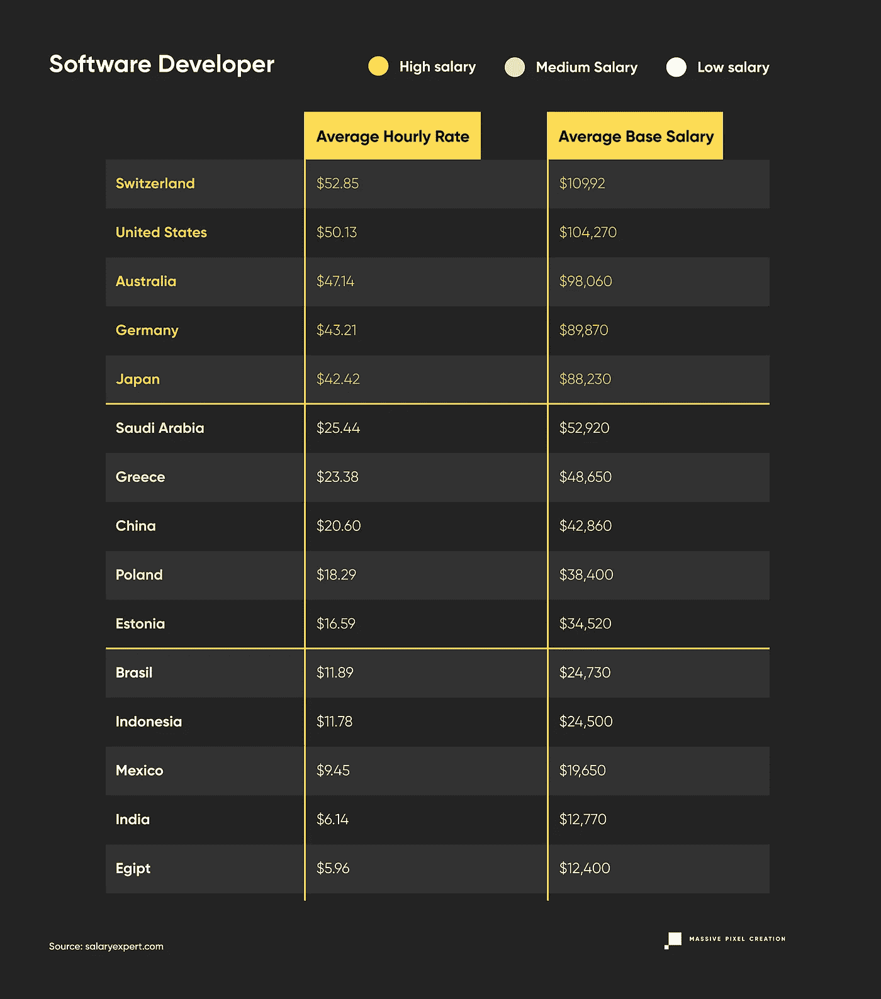
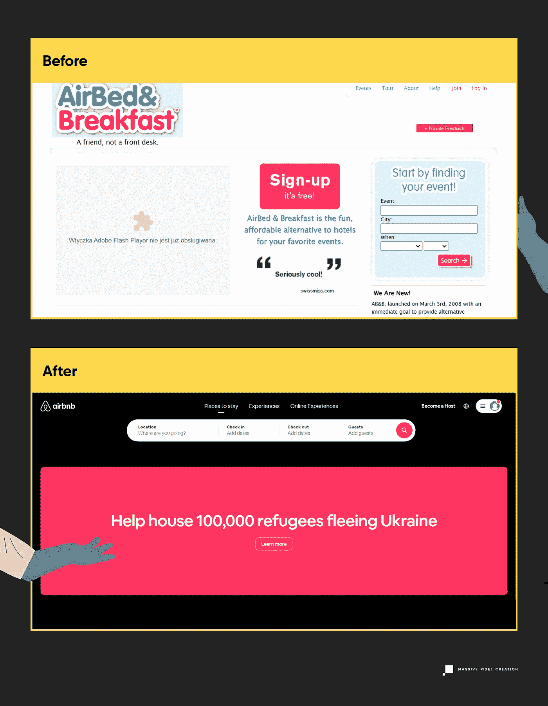
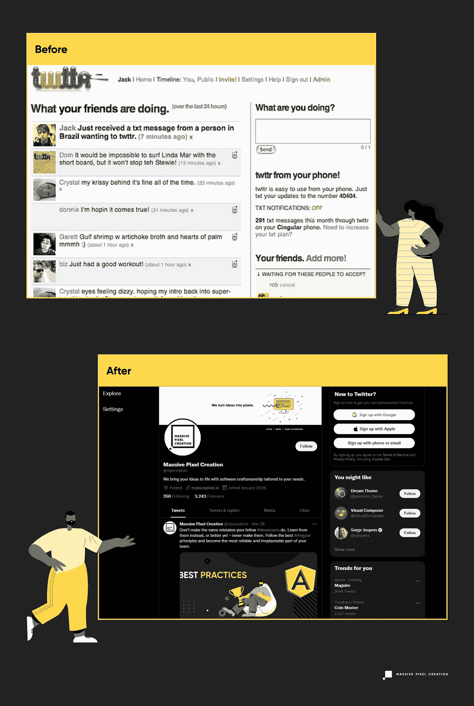
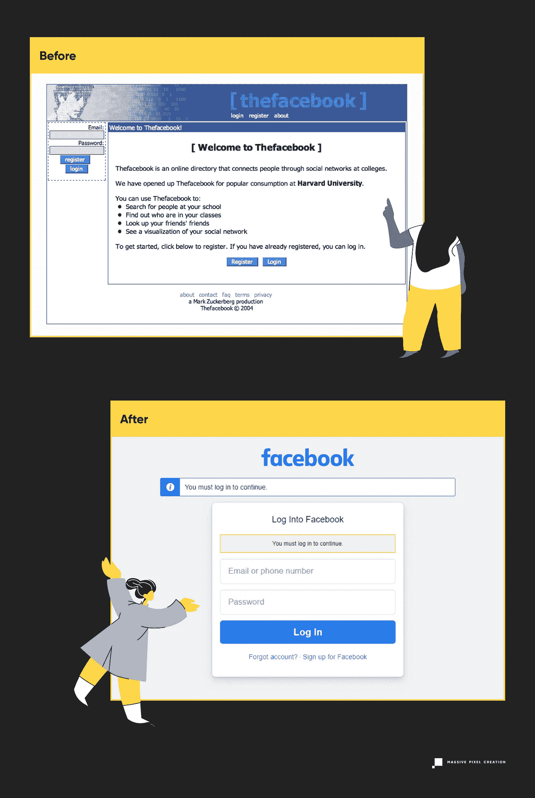
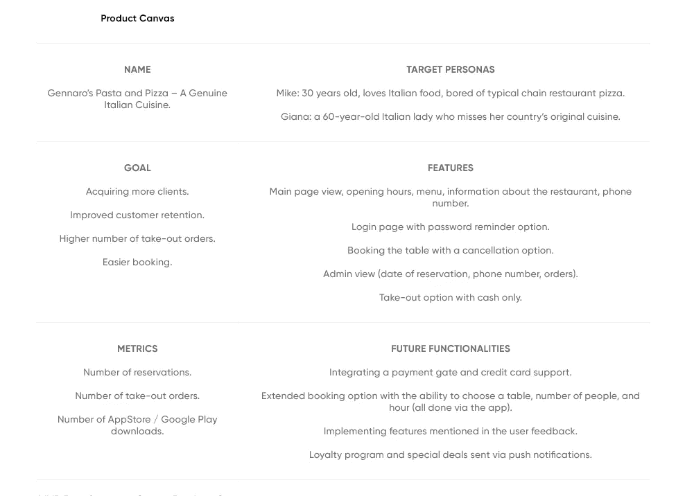
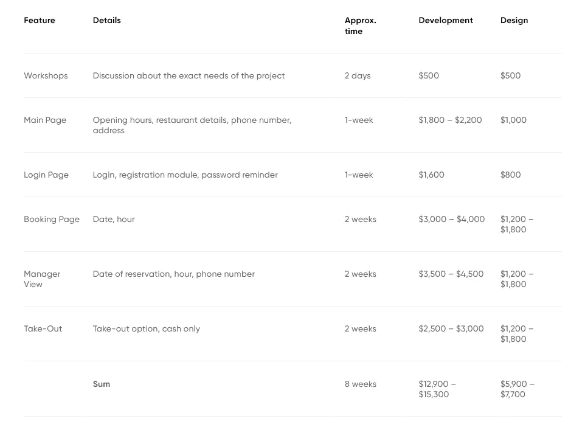

# 2022 年用 React Native 开发 MVP 的成本

> 原文：<https://javascript.plainenglish.io/mvp-development-cost-in-2022-5f6f9dd7f38a?source=collection_archive---------15----------------------->

## 关于使用 React Native 开发 MVP 您需要知道的一切。

你是否正在努力实现你的想法，但却不知道从哪里或如何开始？MVP 开发费用是否因为不知道需要多少钱而困扰你？幸运的是，我们已经得到了所有的答案！

在本文中，我们将经历不同的阶段，如什么是 MVP，什么是 MVP 开发成本，不同的开发方式，最佳 MVP 的示例，以及一个定制的真实 MVP 场景，其中我们估计并分解了一个假设的 MVP 的成本。事不宜迟，我们开始吧。

# **什么是 MVP？**

*“最小可行产品是一个新产品的版本，它允许一个团队以最少的努力收集关于客户的最大数量的有效知识。”—埃里克·里斯*

但这意味着什么呢？

**MVP 或** **最小可行产品** **是满足最小需求**的应用程序的工作版本，即允许产品满足其预定义期望的特性功能。简单来说 MVP 是最简单的工作应用。通过开发 MVP，团队可以收集必要的反馈，并在需要时实施变更。如果你计划将 MVP 开发外包给波兰，成本很可能在 18，800 美元到 23，000 美元之间波动，包括开发和设计。

现在，回到 MVP 本身。

2001 年，Frank Robinson(sync dev 的联合创始人)首次引入了 MVP 这个术语，随后 Eric Ries 和 Steve Blank 使它变得更加流行。说到 SyncDev，他们对 MVP 的定义可以分为两种:问题和解决方案。

*   一个问题——太多的特性不一定会使产品更好，但会影响开发时间，在某些情况下会降低效率。
*   一个解决方案——一个大小合适的产品，有足够的基本功能让客户感到满意。他们甚至曾经说过:“*技术上来说，就是 ROI 最大除以风险*的产品”。

另一方面，现在让我们来看看 Ries 先生自己对于建立 MVP 是怎么说的:

值得一提的是 **MVP 是一个核心的精益启动组件**，它本质上使开发周期更短、更有效(如果正确执行的话)。

但是什么是精益创业呢？简而言之，这是一种创业管理的**方法，允许公司以快速有效的方式交付产品**。更重要的是，它最初适用于日本的公司，目的是了解什么能给公司带来价值，什么会被浪费。

# MVP 备选方案

## 最小可爱产品

MLP，也被称为最小可爱产品，是这篇文章主题的一个著名替代者 MVP。

**2013 年，Brian Haaff 首次提出最小可爱产品。**它本质上服务于 MVP 对位的目的，在 MVP 对位中，开发人员不关注最小的工作功能，而是关注能让用户立刻爱上产品的特性！

那么 MLP 和 MVP 的区别是什么呢？其实挺简单的！关键的区别是**想到你的潜在客户**并回答某些问题。他们最喜欢的功能是什么？哪些功能会让他们开心，让他们的工作更轻松？

一旦你这样做了，你就能开发出一个你的客户最有可能爱上的应用程序！

## 最低超赞产品

既然我们之前提到了精益创业方法，我们就不应该忽略 MAP(最小的令人敬畏的产品),因为它是它的概念之一。地图的定义很简单— **它是一个 MVP，其功能可以让你的客户感到惊讶**。

这看起来像是一个最小可行的产品，但实际上，它有一些稍微超出你的标准定义的调整。那么如何让 MVP 惊艳呢？嗯，你可以让它更快更流畅，包括一个一流的，朗朗上口的设计。毕竟一个清爽的用户界面对人的影响是很大的。如果你设法为你的顾客创造一个“惊喜”的体验，你可以肯定他们会不断回来。

其实我们来看看 MVP vs MLP vs 地图的对比:

既然我们已经快速地解释了什么是 MVP，让我们把注意力转移到为什么开发最小可行产品是重要的不同原因上。

# 建立 MVP 的 5 个原因

开发最小可行的产品并不是不合理的，因为它背后有合理的理由。让我们来看看它们。

# 反馈

反馈是开发 MVP 的最重要因素之一。有了它，**开发者可以收集关于产品感受和想法的有价值的信息**。收集到的用户反馈可以帮助开发人员了解产品的哪些部分是最受欢迎的，哪些部分需要改进。

# 省钱

建立一个 MVP 可以为你节省大量的金钱和时间。为什么？答案很简单。您可以构建 MVP 并测试您的愿景，而不是开发一个成熟的应用程序并投入大量资源。人们会喜欢他们所看到的吗？他们会使用这款应用吗？他们会发现哪些功能最有用？这些问题将会得到解答，你将会看到你的产品开发是否朝着正确的方向发展，或者是否需要改变。

# 吸引投资者

通过开发和展示完成的 MVP，你可以**吸引潜在的投资者和利益相关者**。介绍你的产品，它的特性，功能，用户反馈，以及应用程序如何运行，可能会改变财务状况。

# 进一步发展的时间到了

发布最小可行产品会极大地影响最终应用程序的开发。通过开发具有基本功能的最小版本，您将能够评估可能缺少哪些功能，或者哪些功能需要更多的工作。在收到已经提到的反馈后，您仍然有足够的时间进行更新和进一步开发。

# 缩短上市时间

**上市时间是从创造产品概念到将其发布给广大受众之间的一段时间**。

由于尽早发布工作产品，您有机会尽早向用户展示应用程序。那么为什么 MVP 这么重要呢？这是因为你越早发布产品，你就能越快吸引潜在投资者，收集反馈，如果有必要，你还有时间改进它的功能。

# 验证这个想法

验证想法是整个过程中的一个重要因素。有了它，你不仅可以看到你的愿景是否有意义，还可以检查这种服务是否有市场需求。

如果你的想法很好，那么你会有一个明确的答案，继续开发的决定将只由你来做。

# MVP 开发——选择哪种方式？

"*试着找一些你有责任移交给别人的地方。因为你已经在努力做这件事的事实意味着你知道这份工作需要什么，为什么它很难，所以你更有可能雇用一个好的人(……)*。” *—埃里克·里斯*

选择开发最小可行产品的正确方法可能相当困难，因为有各种不同的方法。外包，内部团队，甚至自由职业者，这几个你该选哪个？让我们一起来寻找答案。

# 外包

可以说，软件开发外包是最流行同时也是最有效的完成工作的方法之一。通过让外部团队处理您的应用程序的生产，您实际上可以获得一些真正的好处，并降低 MVP 开发成本。

在我们讨论外包的利与弊之前，让我们快速列出选项。如果您决定外包您的项目，您可以从不同的[软件开发外包模式](https://massivepixel.io/blog/it-outsourcing-models/)中进行选择，例如:

*   员工扩充——一种高效的 IT 外包模式，外包合作伙伴为您提供远程员工加入您的团队。开发风险和所有权在于你，即客户，因为你需要自己管理团队和项目。
*   基于团队(专门的团队模式)——你**雇佣了一整个团队**，而不是雇佣几个员工，他们已经在不同的项目和他们自己的工作中积累了经验。更重要的是，你是团队的重要组成部分，风险和所有权由你和被雇佣的团队共同承担。
*   基于项目——在这种模式中，你**将一个项目分配给外包团队。**与其他两种相比，这种模式的风险最高，因为你不参与开发。

还有两种外包定价模式:

*   时间和材料——适用于对产品有远见并希望在开发过程中做出改变的公司。这种模型的主要好处是它的灵活性，因为它的特点是更少的审计和更少的细节，这导致了更快的开发。
*   固定价格——适用于那些对产品有清晰认识，并且已经有固定产品预算的人。此外，您必须分配一个资金缓冲区，以防需要额外的调整，从而导致整个开发需要更多的资金。

好了，现在我们已经解决了外包模式的问题，我们可以关注这种解决方案的利与弊了。

## 赞成的意见

**更少的成本**

首先也是最重要的，外包软件开发可以为你节省相当多的钱，尤其是当比较离岸外包和离岸外包时。让我们来看看两个巨大的 IT 市场的定价例子。

在北美，这相当昂贵，因为软件开发人员的平均时薪大约是。50 美元，而在波兰，例如，它在 18 美元左右波动。其实我们来看看对比。

**手头的高技能专业人员**

接下来，你可以放心**外包** [**软件开发团队**](https://massivepixel.io/blog/software-development-team-structure/) **将由高技能专业人员**组成。此外，您不再需要培训、入职或招聘。

如今，大多数开发人员使用最新的技术，并且熟悉许多已经存在的软件。如果你仔细搜索市场，寻找最佳定制软件开发公司，你不仅会削减开支，还会拥有世界级的产品。这真的减轻了你的负担，让你的发展压力更小。对于那些没有招聘自己的内部团队或自由职业团队所需经验的人来说，这是最好的选择。

**不同型号可供选择**

通过选择外包，你可以**节省时间和金钱。怎么会？这很简单！通过不进行整个招聘过程，你同时节省了时间和金钱。相反，你会找到一家符合所有条件的可靠的软件公司。这样可以更快地交付产品，因为你不会在招聘上浪费时间和资源。**

**体验**

如果你决定雇佣一个外包团队，你很可能不会失望。开发人员已经是一个经验丰富的团队，从事移动应用程序开发、 [web 开发](https://massivepixel.io/services/web-development/)和大量其他项目。这种经历只会增加你的想法变成现实并在市场上获得成功的机会。

## 骗局

**沟通问题**

说到外包，有一些问题可能会影响 MVP 的开发。一个这样的例子可能是沟通问题，如果你决定离岸外包。然而，现在大多数公司都需要英语，所以这个问题基本上已经解决了。事实上，[波兰在英语能力指数](https://www.ef.com/wwen/epi/)上排名第 16。

还有一个因素需要考虑，那就是时区差异。例如，外包到欧洲，将需要你和外包团队调整你们的时间表，在适合你们双方的时间举行会议。然而，在一个我们被电器包围，我们不断连接到网络的时代，这应该不是问题。更重要的是，考虑到东欧及其时区的所有优点，它在美国、欧洲和亚洲之间做出了巨大的妥协。

只要有一点点善意，**双方都可以很容易地在他们的日程表中找到会面和讨论任何话题的时间**。事实上，**我们 MPC 已经与许多北美公司**合作过，我们已经成功地将抛光产品交付给我们的合作伙伴([谢恩](https://massivepixel.io/case-studies/soldbyshane/)、 [BoredTeachers](https://massivepixel.io/case-studies/bored-teachers/) 、 [Placester](https://massivepixel.io/case-studies/placester-codeless/) 等等)。

**文化差异**

另一个可能影响 MVP 发展的因素是文化差异。然而，这更多的是一个节日、习惯和文化问题。我们都知道世界各地不同的文化中有不同的节日。不同的休息时间及其长度，工作礼仪，以及解决问题的各种方式，在不同的文化中都有所不同。问题是——如何处理这样的问题？

首先，外交总是一个好的解决办法，所以说，说，说。**找一个了解良好沟通和效率重要性的团队，并事先讨论所有事情**。

其次，对于位于美国的公司来说，由于文化的相似性，将软件开发外包给中东欧国家可能是一个双赢的局面。

大多数现有的软件开发公司都知道，为了提供优质的服务，他们必须适应客户的需求。有趣的是，来自不同国家的开发人员可能会给项目带来一波新的想法，所以这真的是一个缺点吗？

**少控制**

许多人声称选择外包会让你失去对产品的控制。真的是这样吗？嗯，部分是。

我们理解有些人可能会有这种感觉。这就是为什么通过每周或每天的会议来消除这种感觉是很重要的。通过这样做，你不仅可以看到整个开发过程，还可以**通过提供反馈和建议**来互动和影响这个过程。毕竟，这是你的想法，外包团队会帮助你实现它。

除了已经提到的会议之外，为了客户的方便，MPC 团队在 Slack 上创建了专用频道，允许与远程外包团队的任何成员进行直接和即时的沟通。

# 内部团队

拥有自己的内部团队当然会有一些好处。但这是否意味着它只有优点呢？没门儿。也就是说，让我们关注拥有一个内部开发团队的利弊。

## 赞成的意见

**直接管理**

通过在你的办公室里有一个内部团队，你可以**直接管理团队成员**，而不需要远程会议等。而且不仅仅是一个项目。整个团队都在那里，所以你也必须考虑到这一点。对于那些能够坚持拥有一个团队的人，以及那些一旦想要的项目完成后能够分配更多工作的人，我们推荐一个内部开发团队。

然而，由于疫情，工作环境发生了变化，越来越多的公司允许员工远程工作。[也就是说，在 2021 年，全球 42%的公司允许混合模式，团队的某些部分在办公室工作，而其他部分则远程工作。现在，让我们将其与 2020 年进行比较，在 2020 年，37%的公司允许这种模式。我们可以清楚地看到，越来越多的公司让员工在家工作，这慢慢地但稳步地模糊了内部团队和外包之间的界限。](https://www.statista.com/statistics/1111377/company-policy-on-remote-work-digital-output/)

**奉献与激励**

由于团队成员已经是你公司的一部分，你们很可能彼此非常了解——至少在专业层面上。这可以消除解释公司价值观、目标等的需要。当你还没有团队的时候，问题就开始出现了，这就让我们…

## 骗局

**成本**

当你考虑成本时，拥有一个内部开发团队并不是那么好。从实施招聘流程开始，通过所有的面试、入职、调整和培训— **这一切都可以累积到巨额资金**，导致更高的 MVP 开发成本。为了方便起见，我们来分析一下费用:

*   招聘流程:根据公司的不同，成本在[**【4000 美元】到**](https://codesubmit.io/blog/cost-of-hiring-a-software-developer/)【7600 美元】之间波动
*   入职: [**约 4000 美元**](https://www.bamboohr.com/blog/cost-of-onboarding-calculator/)
*   平均年薪:[**110，206 美元左右**](https://www.glassdoor.com/Salaries/software-developer-salary-SRCH_KO0,18.htm)
*   培训:[**1500 元左右**](https://trainingmag.com/sites/default/files/2019_industry_report.pdf)
*   福利: [**雇主雇用一名雇员的平均成本的 7.6%**](https://codesubmit.io/blog/cost-of-hiring-a-software-developer/)

**耗时**

如前所述，建立一个内部开发团队实际上会占用很多时间。单是招聘过程通常就要花上几周时间，更不用说入职和了解公司了。即使你决定组建一个团队，一些潜在候选人的合同终止可能需要几个月的时间，这进一步延长了招聘时间。另一方面，当涉及到花费在整个过程上的时间时，内部团队是不够的，不管我们是否想要，这有利于外包方法。

# 自由记者

雇佣自由职业者似乎是个好主意。毕竟，这个解决方案似乎比其他两个更便宜。仅凭这一事实来判断，许多公司可能会被这样的解决方案所吸引。然而，在这一段中，我们将深入主题，并解释为什么它可能是或可能不是你的最佳解决方案。

## 赞成的意见

**成本**

当谈到雇佣一个由自由职业者组成的团队的成本时，它确实可能比内部开发团队或外包团队更便宜，但这意味着它更好吗？

当我们考虑到雇佣一名自由软件开发人员的成本(起价仅为 15 美元)时，我们可以清楚地看到，与其他两人相比，这是一笔很好的投资。

**可用性**

市场上有很多自由职业者可以获得客户的网站(如 Upwork 或 Fiverr)，找到一个满足你需求的网站真的很容易。

## 骗局

**质量**

对于自由职业者来说，可能出现的主要问题是他们的工作质量。我们的意思是，一个自由职业者很可能会参与更多的项目，而不仅仅是你的项目。此外，核实一个自由职业者的经历要困难得多。他们也可能会放弃你的项目或有时不在(因为任何原因，如生病或休假)。不幸的是，这可能会产生问题。

无论是内部团队还是外包团队，他们都致力于你的项目。如你所见，这里的情况并非如此。当然，这种事情也可能发生在自由职业者身上，但这种可能性相对较低。

**控制**

和自由职业者一起工作会导致**对他们所做事情的控制**减少。当涉及到内部团队时，随着你们的密切合作，这是不言自明的。外包？嗯，与内部团队非常相似，但你是在与一个远程外包团队合作。正如我们之前提到的，这一切都可以按照你的利益来管理。但是雇佣一个自由职业者可以，但不一定意味着一件事——麻烦。

所谓麻烦，我们指的是**对他们实际做的事情缺乏控制**。与自由职业者接触可能比与你的外包团队进行日常会议更难。而且自由职业者不受任何结构和流程的约束，这可能但不一定会导致混乱的发展。

# MVP 发展的阶段

和其他很多东西类似，MVP 也有不同的发展阶段。在这一段中，我们将把重点放在这一方面。

# 第一阶段—会议

第一步相当明显。客户和负责 MVP 的团队都应该在进行任何其他事情之前会面并彻底讨论愿景。了解想法、问题、挑战、期望，以及相互了解是一个不能简单省略的步骤。

这就是 MPC 的探索研讨会。感谢他们，我们的团队可以了解您的业务目标、初始预算、核心功能和时间框架。还有其他需要讨论的主题，如市场调查、竞争对手(及其利弊)、目标受众等等。

如果你没有足够大的预算，而且 MVP 的开发成本让你害怕，那么制定一个概念证明来吸引潜在的投资者可能是一个好的解决方案。

# 第 2 阶段—规划

在第二阶段，我们将把注意力从会议转移到计划上。这是整个 MVP 开发过程中最关键的一步，因为它会告诉你应该如何以及何时开始开发应用程序的某些组件。

此外，在规划阶段，开发人员必须为产品选择合适的技术组合。

# 第三阶段—发展

最后但并非最不重要的一步是开发本身。第二阶段的所有计划现在都需要付诸实施。根据组件的复杂程度、应用程序的性质和使用的技术堆栈，开发时间可能会有所不同。

# 最佳 MVP 范例

为了您的方便，我们决定包括三个开发 MVP 并取得成功的公司的真实例子，以及一个自定义场景，在该场景中，我们深入研究不同 MVP 组件的成本、构建它所花费的时间以及更多！

# 爱彼迎（美国短租平台）

一年一年，Airbnb 越来越受欢迎。[事实上，2021 年，公司价值达到 1130 亿美元](https://www.statista.com/statistics/339845/company-value-and-equity-funding-of-airbnb/)。这是个不小的分数。然而，情况并非总是如此。

让我们回到 2008 年，那时麦当娜只有 4 分钟，凯蒂·佩里吻了一个女孩，Airbnb 推出了。然而，这是一年前，当布赖恩切斯基和乔格比亚有这个想法，这将被证明是酒店业的痛苦。但是这个想法是怎么产生的呢？

布莱恩和乔是来自黄金之城旧金山的两个朋友，他们为支付房租而苦苦挣扎。与此同时，他们想创造一些能改变他们生活的东西。幸运的是，在那个时候，一个会议将很快在这个城市举行。考虑到旧金山高昂的住宿价格，朋友们认为租一个房间是个好主意。这就是第一个充气床垫和早餐广告的诞生。不久之后，三个人接受了合住一个阁楼房间的提议，每个人都睡在布莱恩和乔提供的充气床上。当然——包括早餐。所有这些只需每人每晚 80 美元。

嘿，你猜怎么着？是最有价值球员。他们有了这个想法，创建了一个简单的网站，测试了它，验证了市场，它成功了。不久之后，他们开始开发我们现在所知的 Airbnb。

# 推特

最受欢迎和最成功的公司之一确实是从 MVP 开始的。世界上最著名的在线鸟已经上市很长时间了。但是你知道推特不应该是今天这个样子吗？我们现在知道，这个平台原本是要成为传统短信服务的替代品。那么，这将如何打败短信呢？答案很简单——免费。

问题是如今这样一个应用程序的 MVP 开发成本是多少？在 Twitter 的例子中，与其他 MVP 相比，它不会花这么长的时间，也不会那么贵。就时间而言，可能需要 3-6 个月的开发时间。[根据 Henrik Werdelin 的说法，他负责建立各种公司，如果你现在要开发类似 Twitter 的 MVP，你将花费高达 25 万美元](https://thenextweb.com/news/much-cost-build-worlds-hottest-startups)。

# 脸谱网

哦，嗨，马克！

是的，是的。世界上最受欢迎的社交媒体平台也曾被开发为 MVP。然而，用于开发的时间和金钱明显高于 Twitter。事实上，[开发一个类似脸书的 MVP 很可能需要整整 9 个月，花费大约 50 万美元](https://thenextweb.com/news/much-cost-build-worlds-hottest-startups)！现在这弥补了巨大的代价。

让我们来看看脸书之前和之后的设计。

变化很大，不是吗？

# MVP 开发成本——现实生活中的估计

为了本文的唯一目的，我们准备了一个包含各种组件的最小可行产品的定制示例。为了您的方便和显示大概的 MVP 开发成本和时间，我们准备了一个餐馆应用程序 MVP 示例。

这家假想的餐厅提供真正的意大利美食，位于纽约市皇后区。该客户希望满足日益增长的客户对移动应用程序的需求，该应用程序包括关于接头、营业时间、地址、在线预订、注册和外卖选项的一般信息。因此，我们的团队准备了一个真实的估算，向你展示这样一个 MVP 需要多少时间和金钱。

*   技术栈:**颤振/反应原生**；或者 **EXPO/React Native**
*   后端: **Firebase**

事不宜迟，我们继续吧！

# 判断

既然我们已经在 MVP 开发的第二阶段展示了画布，我们现在应该关注本文的主题，即 MVP 开发成本和时间。

我们刚刚提到的餐厅应用程序由各种组件组成。为了创建一个有效的 MVP，它们中的每一个都必须单独开发。也就是说，让我们看看组件、它们的大概成本以及开发它们所花费的时间。

正如您在上表中看到的，我们假设的餐馆 MVP 的整个开发和发布大约需要 8 周时间，花费 18，800-23，000 美元。

此外，整个项目的团队应包括:

*   项目管理人
*   颤动/反应本地开发人员
*   火基显影剂
*   UI/UX 设计器
*   质量保证专家

如你所见，MVP 开发不是一瞬间就能完成的。它需要仔细的计划，在此之前是会议(在 MPC 的案例中是发现研讨会)，最后是开发本身。

由于对 2022 年 MVP 开发成本的真实估计，你已经对整个过程有了有价值的了解。如果您之前对最低可行产品有任何疑问，我们坚信现在您应该能够做出决定。如果您对我们在文章中提到的开发或任何其他过程有任何疑问，请随时联系我们！下次见！

*最初发布于*[*https://massie pixel . io*](https://massivepixel.io/blog/mvp-development-cost/)*。*

*更多内容请看**[***说白了. io***](https://plainenglish.io/) *。报名参加我们的* [***免费周报***](http://newsletter.plainenglish.io/) *。关注我们*[***Twitter***](https://twitter.com/inPlainEngHQ)*和*[***LinkedIn***](https://www.linkedin.com/company/inplainenglish/)*。加入我们的* [***社区***](https://discord.gg/GtDtUAvyhW) *。**