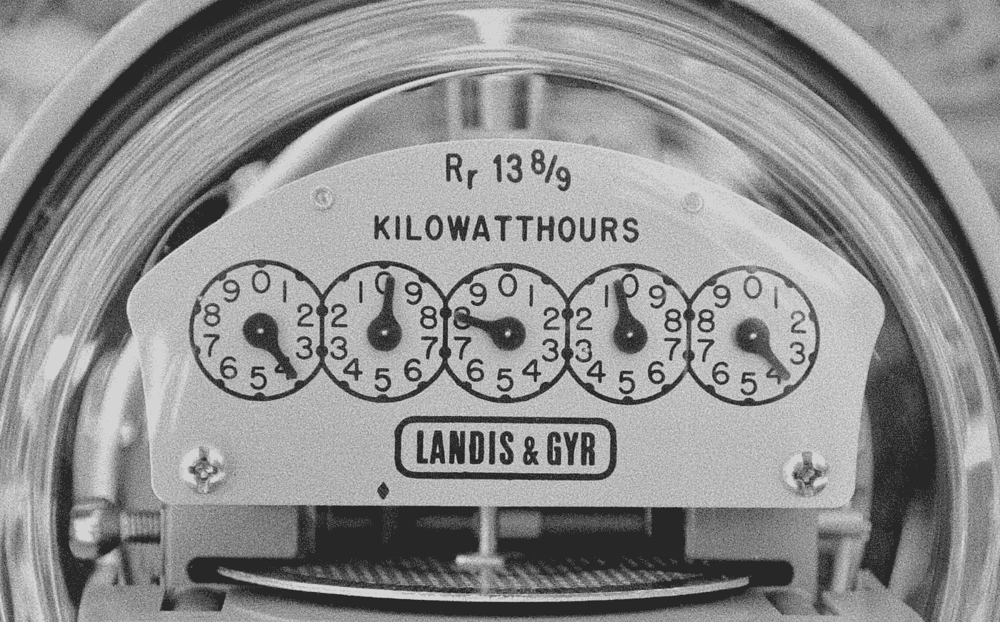

# 我最常用的 7 个 JavaScript 实用函数

> 原文：<https://javascript.plainenglish.io/my-7-most-used-javascript-utility-functions-86afd61ad76c?source=collection_archive---------2----------------------->

## 将数字转换为货币，测量函数性能，等等。

JavaScript 实用函数是有用的、可重用的片段，可以在许多不同的项目中重用。它们的目的是为常见任务提供一致而有效的答案，并帮助提高代码的一致性。

在本文中，我想强调我在许多项目中使用的 7 个实用函数，并解释它们的用途。

## 1.将数字转换成货币

在 JavaScript 中处理货币时，事情会变得复杂。尤其是当您需要处理显示不同类型的货币时。

JavaScript 提供了 [Intl。NumberFormat](https://developer.mozilla.org/en-US/docs/Web/JavaScript/Reference/Global_Objects/Intl/NumberFormat) 对象，允许你以一种语言敏感的方式格式化数字。它提供的选项之一是将数字格式化为货币。

该函数接受 3 个参数:

1.  **num** —要格式化的数字。
2.  **currency** —要格式化的货币——默认设置为' *EUR* '，因为我主要处理基于欧元的价格。
3.  **locale**—默认设置为“ *nl-NL* ”，因为我经常处理荷兰显示的价格。

您可以使用下面代码栏中的值。例如，您会看到将区域设置更改为" *en-US* "会将十进制符号从逗号更改为点。

Demo of the `convertToCurrency utility function`

## 2.将 HTML 字符串转换为 DOM 对象

在许多情况下，您可能会收到 HTML 字符串而不是 HTML 元素。例如，当从 API 接收 JSON 响应中的 HTML 时，或者当通过像 [Nunjucks](https://mozilla.github.io/nunjucks/) 这样的模板解析器呈现模板时。

您可以通过 innerHTML 属性将这个 HTML 字符串直接注入到 dom 中，但有时您希望将这个字符串转换成 HTML 对象，以便进行额外的转换、验证或更具体的 DOM 注入。

该函数接受两个参数:

1.  **内容** —要转换成对象的 HTML 字符串。
2.  **选择器**——您想要接收的内容的选择器 DOMParser 对象将创建一个完整的 HTMLObject，包括一个< html >和< body >标签。如果你只是想要一个特定的元素，你可以传入选择器，比如“section ”,你就会收到这个元素。

Demo of the parseStringAsHtml `utility function`

## 3.去抖

在 JavaScript 中，去抖函数将确保您的函数在每次用户输入时只被触发一次，或者至少在 wait 参数中指定的时间段内不超过一次。

例如，假设我们想根据搜索查询向用户显示建议，我们可以在用户键入时显示建议，并在键入每个字母后刷新，但这对用户来说可能很烦人。例如，在输入一个键之后，通常至少要等待 300 毫秒才能显示建议，以确保用户已经完成输入。

这个函数有 3 个参数:

1.  **fn** —要执行的功能。
2.  **等待** —功能执行前等待的时间。
3.  **立即** —一个布尔值，指示第一次调用函数时是否应立即调用。

Demo of the debounce `utility function`

## 4.日期验证

有时，您从代码、用户输入或 API 中的某个地方接收到一个日期字符串，您将它转换为一个日期对象，并尝试编辑或显示日期，但收到一个日期无效的错误。

使用这个简单的实用方法，您可以验证新构造的 date 对象实际上是否是有效的 date 对象。

Demo of the isDateValid `utility function`

## 5.将 FormData 转换为 JSON

当创建一个 [FormData 对象](/how-to-use-the-formdata-object-430ba5f94629)时，将它转换成类似 JSON 的对象有时会很有用。例如，当您发送数据的 API 只接受 JSON 请求时。

在大多数情况下，FormData 对象可以很容易地映射到一个对象，但当处理复选框的多选时，事情会变得混乱。因为每个复选框都有相同的名称，所以对象的键值对会互相覆盖。

这个简单的实用方法将 FormData 转换为一个对象，并确保多选值映射到一个数组，而不是每次都覆盖该值。

Demo of the convertFormdataToJsonObject `utility function`

 [## 如何使用 FormData 对象

### 了解如何在 JavaScript/Typescript 中使用 FormData 对象

javascript.plainenglish.io](/how-to-use-the-formdata-object-430ba5f94629) 

## 6.衡量功能的性能

有时你想知道你的应用程序的哪一部分降低了你的站点的速度，这对于调试函数需要多长时间来执行是很有用的。

幸运的是，浏览器提供了本地支持来帮助你计算这个。但是您不需要将这些控制台方法添加到每个函数中，而是希望每次都进行测试，您可以简单地调用这个有用的实用方法。

该函数接受两个或更多参数:

1.  **名称** —标签的名称显示在控制台中。
2.  **fn** —要测量其性能的函数。
3.  **任何附加参数** —您正在调用的函数的参数。

Demo of the measurePerformance `utility function`

## 7.从数组中删除重复项

我经常发现自己需要从数组中删除可能的重复项。该方法只是在将数组转换为集合后返回一个新数组。

集合是一个简单的对象，它存储只能出现一次的值，因此是对数组进行重复数据消除的一种简单方法。

Demo of the removeDuplicates `utility function`

## 结论

我希望这些实用的方法对你有用。请在评论中告诉我，如果他们是，或者如果你有任何伟大的分享自己！

感谢阅读。如果你对此有想法，一定要留下评论！

如果你喜欢我的内容，并想支持我的努力，考虑通过[我的会员链接](https://medium.com/@WesleySmits/membership)成为一个媒体订阅者。这不会花费你任何额外的费用，但 Medium 会把部分收益给我，让我推荐你。

如果你愿意，你可以在 [LinkedIn](https://www.linkedin.com/in/wesley-robert-smits/) 或 [Twitter](https://twitter.com/iamwesleysmits) 上联系我！

 [## 通过我的推荐链接加入 Medium-Wesley Smits

### 阅读韦斯利·斯密特(以及媒体上成千上万的其他作家)的每一个故事。您的会员费直接支持…

medium.com](https://medium.com/@WesleySmits/membership) 

*更多内容看* [***说白了就是 io***](https://plainenglish.io/) *。报名参加我们的* [***免费周报***](http://newsletter.plainenglish.io/) *。关注我们关于* [***推特***](https://twitter.com/inPlainEngHQ) ， [***领英***](https://www.linkedin.com/company/inplainenglish/) *，*[***YouTube***](https://www.youtube.com/channel/UCtipWUghju290NWcn8jhyAw)*[***不和***](https://discord.gg/GtDtUAvyhW) *。对增长黑客感兴趣？检查* [***电路***](https://circuit.ooo/) *。**